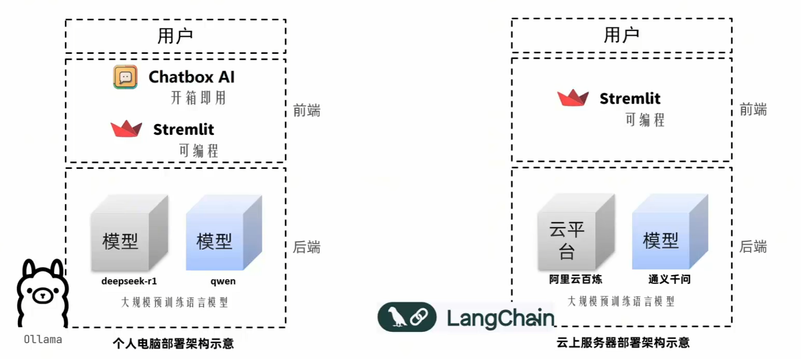
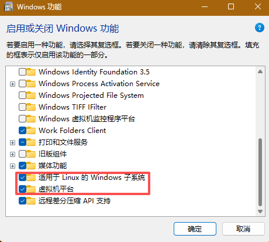
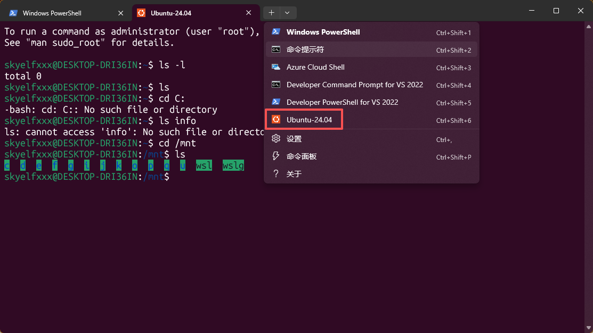
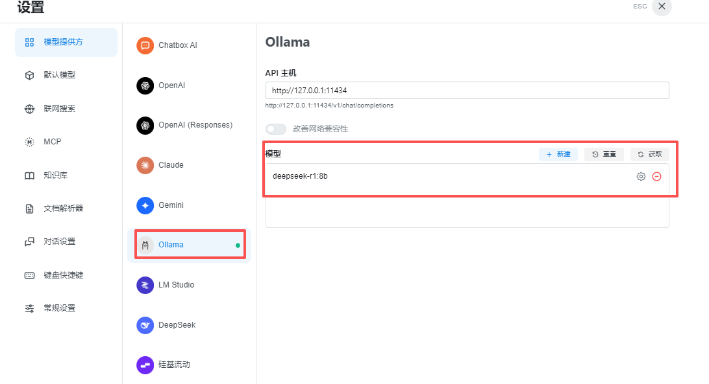
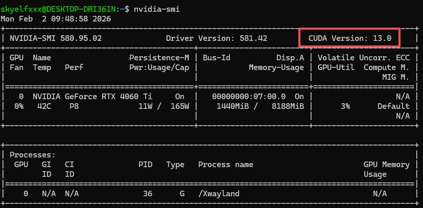
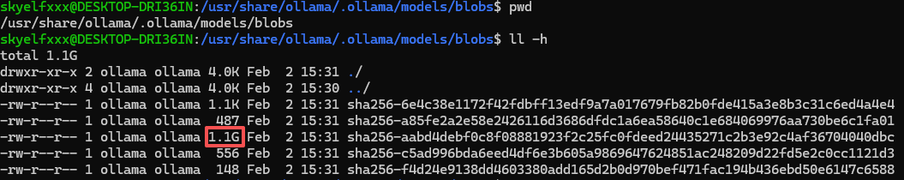
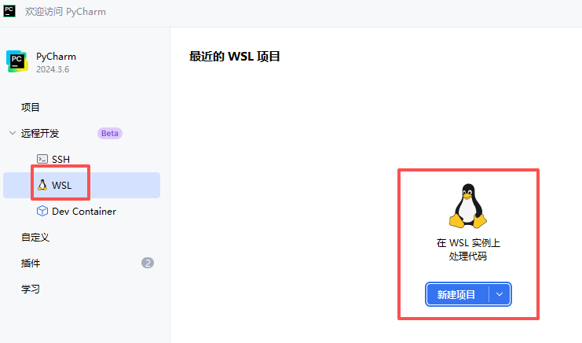
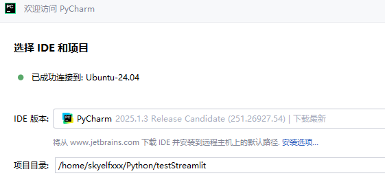
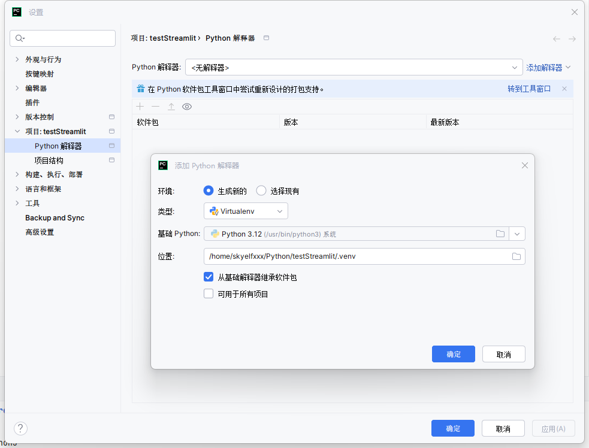
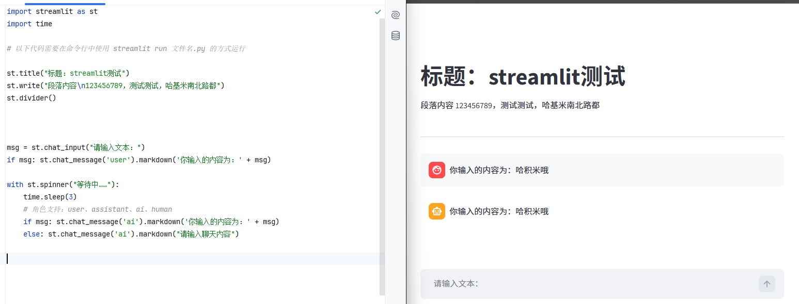

> 参考教程：
>
> [1]: https://www.bilibili.com/video/BV14aNReMEpE/?spm_id_from=333.337.search-card.all.click&amp;vd_source=459e821b7a47255ab53f9ea758996b77	"deepseek本地部署教程—deepseek+ollama+chatbox—windows电脑deepseek本地私有化运行"
> [2]: https://www.bilibili.com/video/BV1tW42197za/?spm_id_from=333.1391.0.0&amp;vd_source=459e821b7a47255ab53f9ea758996b77	"超详细的WSL教程：Windows上的Linux子系统"
> [3]: https://www.bilibili.com/video/BV1h1VbzHER2?spm_id_from=333.788.videopod.episodes&amp;vd_source=459e821b7a47255ab53f9ea758996b77&amp;p=109	"黑马程序员Python+AI大模型零基础到项目实战，涵盖Python、Linux、LangChain、Ollama等，从大模型私有化部署到搭建聊天机器人一套通关"
>
> 


# 大模型基础理论

##### 训练阶段

- 预训练：补全
- 监督微调 SFT
- 基于反馈的强化学习 RLHF

##### 大模型特点

- 规模、参数量大
- 预训练数据集广泛
- 适应性、灵活性
- 计算资源需求大

##### 大模型分类

- 大语言模型LLM

- 多模态模型：计算机视觉模型、音频处理模型……

  > 同时处理来自**不同感知通道**的数据（文本、图像、音频、视频）

##### 工作流程 

- 分词化 Tokenization 与词表映射：将文本元素转化为token id的组合

- 生成文本：根据给出的文本，**按照概率预测** 下一个token

  > 自回归：根据概率最大原则不断生成，直到输出特殊token或输出长度达到阈值

------


# AI Agent 智能体

> 基于LLM

### 基础

##### 功能构成

- 记忆：执行任务的上下文
- 规划
  - 子任务拆解：思维链CoT、思维树技术ToT（加上BFS、DFS）
  - 任务反思与改进
- 工具：为Agent配备工具API，如计算器、搜索工具、代码执行器等
- 行动

##### 工作流程

感知、规划、行动、观察


### 框架与策略分析

##### Plan-and-execute

- 特点：先规划，然后执行，适用于复杂项目管理、多步决策

##### Self-Ask

##### Thinking and Self-Refection

##### 增强框架ReAct

> https://react-lm.github.io/
>
> 推理+行动（搜索）

------


# AI开发准备

### 技术栈




### 虚拟机WSL

> 参考教程：https://www.bilibili.com/video/BV1tW42197za/?spm_id_from=333.1391.0.0&vd_source=459e821b7a47255ab53f9ea758996b77

##### 原理

> 属于I类虚拟机，直接调用硬件资源

##### 启用

- 启动Windows相关功能
  
- 下载安装Ubuntu
  - 官网下载：https://ubuntu.com/desktop/wsl
  - 微软应用商店安装Ubuntu
- 安装后，可通过terminal访问Ubuntu
  

##### 常用命令

- 更新：`wsl --update`
- 查看可用的Linux系统
  - `wsl --list --online`
  - 本地安装过的：`wsl --list -v`
- 安装指定的Linux系统：`wsl --install 系统名称`
- 启用与停用Linux系统：`wsl -d 系统名称` ，输入exit退出
- Linux下访问路径：`cd /mnt/磁盘路径`


### 接入API

##### 阿里云-通义千问

> https://bailian.console.aliyun.com/

- 获取API：模型服务-秘钥管理


### 本地化部署

##### 后端管理框架Ollama

> https://ollama.com/

- 主要功能：在本地部署、管理、运行大模型
  
- 可用命令：`ollama --help`
  
  ```shell
  Large language model runner
  
  Usage:
    ollama [flags]
    ollama [command]
  
  Available Commands:
    serve       Start ollama
    create      Create a model from a Modelfile
    show        Show information for a model
    run         Run a model
    stop        Stop a running model
    pull        Pull a model from a registry
    push        Push a model to a registry
    list        List models
    ps          List running models
    cp          Copy a model
    rm          Remove a model
    help        Help about any command
  
  Flags:
    -h, --help      help for ollama
    -v, --version   Show version information
  
  Use "ollama [command] --help" for more information about a command.
  ```
  
- 修改模型存储位置

  - 系统变量：`OLLAMA_MODELS = D:\Ollama Models\models`
  
    > 重启后生效
  - 将原先的models移动过来，默认位置：`C:\Users\xxx\.ollama\models`
  
- 加载模型：`ollama run 模型名称`

  ```
  ollama run deepseek-r1:8b
  ollama run deepseek-coder:6.7b
  ```

- 查看已安装模型：`ollama list`

- 切换模型：`ollama use 模型`

- 删除：`ollama rm 模型`

- 使用示例

  - 直接对话

  - 直接运行简单的代码
    ````shell
    ```python
    # 运行python代码
    ```
    
    ````

    


##### 前端可视化界面ChatBox


##### Linux部署开发环境

- 验证CUDA是否可用：`nvidia-smi`
  

- 部署Ollama

  - Linux命令：`curl -fsSL https://ollama.com/install.sh | sh`

  - 手动下载安装包：https://ollama.com/download/ollama-linux-amd64.tar.zst

    > 参考文档：https://docs.ollama.com/linux

    - 解压安装包：`sudo tar -xvf ollama-linux-amd64.tgz -C /usr`
    - 启动ollama进行验证：`ollama serve`

  - 创建ollama后台运行所用用户

    - `sudo useradd -r -s /bin/false -U -m -d /usr/share/ollama ollama`
    - `sudo usermod -a -G ollama $(whoami)`

  - 配置ollama为系统服务：

    - 创建系统服务：`sudo vim /etc/systemd/system/ollama.service`

      ```
      [Unit]
      Description=Ollama Service
      After=network-online.target
      
      [Service]
      ExecStart=/usr/bin/ollama serve
      User=ollama
      Group=ollama
      Restart=always
      RestartSec=3
      Environment="PATH=$PATH"
      
      [Install]
      WantedBy=multi-user.target
      ```

    - `sudo systemctl daemon-reload`

    - 相关命令
      ```shell
      sudo systemctl enable ollama		# 开机自启
      sudo systemctl disable ollama
      sudo systemctl start ollama			# 启动ollama
      sudo systemctl status ollama
      sudo systemctl stop ollama
      ```

  - Linux中ollama模型的存放位置：`/usr/share/ollama/.ollama/models/blobs`

    > 示例：下载deepseek-r1:1.5b

    

- 在WSL中安装pip：`sudo apt install python3-pip`，使用`pip -V`验证

- Python

  - 所需包：ollama、streamlit

##### 基于WSL的Pycharm工程

- 创建工程
  
  
- 选择解释器、虚拟环境
  


# AI开发常用包

### ollama

> 在使用时，请先启动ollama服务，例如：
>
> - windows：`ollama serve`
> - Linux：`sudo systemctl start ollama`

##### 基础API

- 查看可用模型：`ollama.list()`
  ```python
  # 输出Ollama管理的模型
  def ollamaPrintModels():
      response = ollama.list()
  
      print("-" * 60)
      print(f"已下载的模型列表 (共 {len(response.models)} 个)")
      print("-" * 60)
  
      for i, model in enumerate(response.models, 1):
          # 格式化时间
          modified_time = model.modified_at.strftime("%Y-%m-%d %H:%M:%S")
  
          # 转换文件大小为GB
          size_gb = model.size / (1024 ** 3)
  
          print(f"\n[{i}] 模型名称: {model.model}")
          # print(f"   • 最后修改: {modified_time}")
          print(f"   • 文件大小: {size_gb:.2f} GB")
          # print(f"   • 模型格式: {model.details.format}")
          # print(f"   • 模型系列: {model.details.family}")
          print(f"   • 参数量级: {model.details.parameter_size}")
          # print(f"   • 量化级别: {model.details.quantization_level}")
          # print(f"   • 摘要哈希: {model.digest[:16]}...")
  
      print("\n")
  ```
- 创建client对象：`client = ollama.Client(host='http://localhost:11434')`

  - 列出可用模型：`client.list()`

  - 显示指定模型的信息：`client.show('模型名')`

  - 显示正在运行的模型：`client.ps()`

  - chat对话方式
    ```python
    modelName = 'deepseek-coder:6.7b'
    # messages参数是一个列表，其中每个字典至少包含role、content两个字段
    # role：user、assistant、system
    msgList = [ {'role':'user', 'content':'请介绍下自己'} ]
    response = client.chat(model=modelName, messages=msgList)
    # 输出回复
    print(response['messaage']['content'])
    ```

    


### streamlit

##### 示例程序

> 通过 `streamlit hello` 启动，代码循环执行

##### 基础方法

- 查看版本：`streamlit.__version__`

##### 内容绘制

> 需要在终端中，通过 `streamlit run 文件名.py` 运行
>
> 绘制内容按顺序从上到下（除了chat_input）



- 标题：`st.title("标题")`

- 基本段落内容：`st.write("段落内容")`

- 分割线：`st.divider()`

- 聊天框：`msg = st.chat_input("请输入文本：")`

  > 默认渲染在最底部，输入完内容后按enter，该方法会返回输入的内容

- 聊天信息：`st.chat_message('身份').markdown('内容')`

  - 身份：user、assistant、ai、human

- 等待提示
  ```python
  with st.spinner("等待中……"): # 当以下内容时间间隔过长时，显示提示内容，否则渲染以下内容
      time.sleep(3)
      if msg: st.chat_message('ai').markdown('你输入的内容为：' + msg)
      else: st.chat_message('ai').markdown("请输入聊天内容")
  ```

  

  

  


