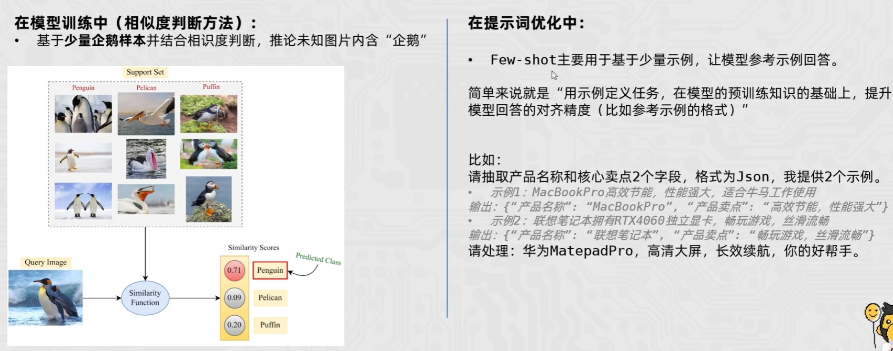
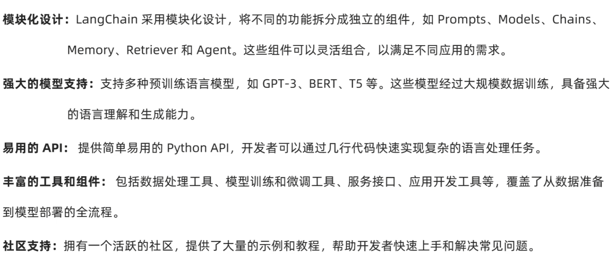
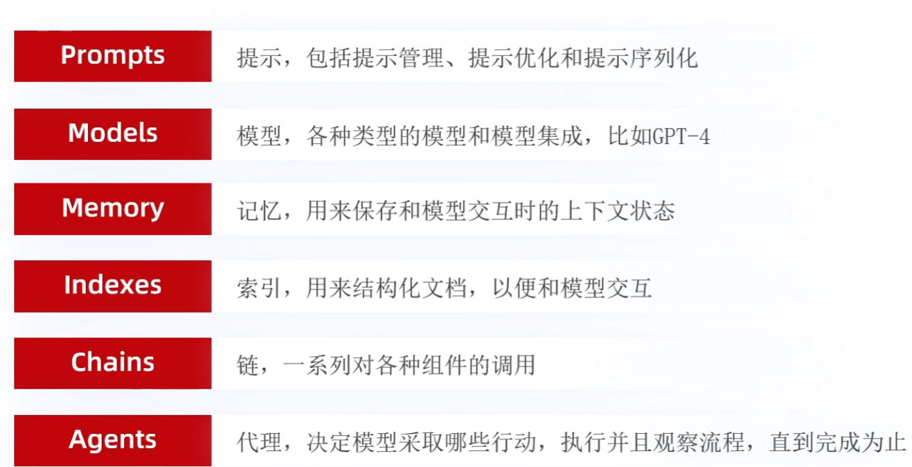
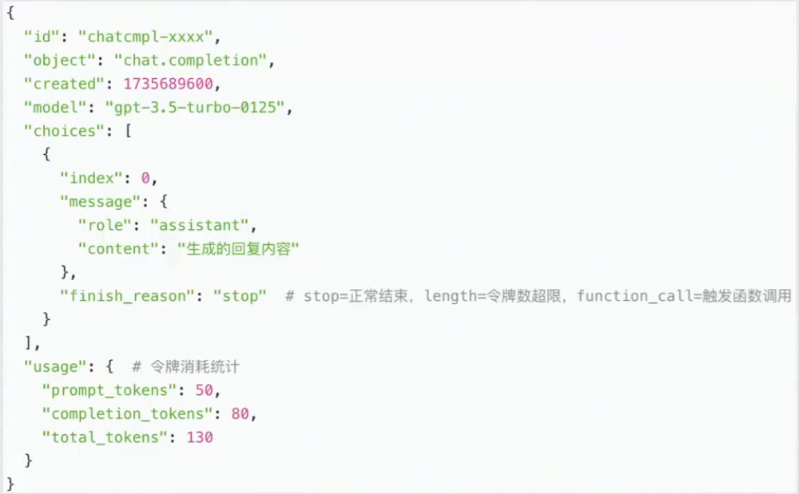

> 参考教程：
>
> [1]: https://www.bilibili.com/video/BV14aNReMEpE/?spm_id_from=333.337.search-card.all.click&amp;vd_source=459e821b7a47255ab53f9ea758996b77	"deepseek本地部署教程—deepseek+ollama+chatbox—windows电脑deepseek本地私有化运行"
> [2]: https://www.bilibili.com/video/BV1tW42197za/?spm_id_from=333.1391.0.0&amp;vd_source=459e821b7a47255ab53f9ea758996b77	"超详细的WSL教程：Windows上的Linux子系统"
> [3]: https://www.bilibili.com/video/BV1h1VbzHER2?spm_id_from=333.788.videopod.episodes&amp;vd_source=459e821b7a47255ab53f9ea758996b77&amp;p=109	"黑马程序员Python+AI大模型零基础到项目实战，涵盖Python、Linux、LangChain、Ollama等，从大模型私有化部署到搭建聊天机器人一套通关"
>
> 


# 大模型基础理论

### 大模型

##### 大模型特点

- 规模、参数量大
- 预训练数据集广泛
- 适应性、灵活性
- 计算资源需求大

##### 大模型分类

- 大语言模型LLM

- 多模态模型：计算机视觉模型、音频处理模型……

  > 同时处理来自**不同感知通道**的数据（文本、图像、音频、视频）

### 训练

##### 训练阶段

- 预训练：补全
- 监督微调 SFT
- 基于反馈的强化学习 RLHF

##### 训练思想与方法

- zero-shot思想：训练阶段不存在与测试阶段完全相同的类别，但模型可用已有知识推广到新类别上
- few-shot思想：学医一定类别的大量数据后，对于新的类别，只需少样本学习
  

### 工作

##### 工作流程 

- 分词化 Tokenization 与词表映射：将文本元素转化为token id的组合

- 生成文本：根据给出的文本，**按照概率预测** 下一个token

  > 自回归：根据概率最大原则不断生成，直到输出特殊token或输出长度达到阈值

------


# AI Agent 智能体

> 基于LLM

### 基础

##### 功能构成

- 记忆：执行任务的上下文
- 规划
  - 子任务拆解：思维链CoT、思维树技术ToT（加上BFS、DFS）
  - 任务反思与改进
- 工具：为Agent配备工具API，如计算器、搜索工具、代码执行器等
- 行动

##### 工作流程

感知、规划、行动、观察


### 框架与策略分析

##### Plan-and-execute

- 特点：先规划，然后执行，适用于复杂项目管理、多步决策

##### Self-Ask

##### Thinking and Self-Refection

##### 增强框架ReAct

> https://react-lm.github.io/
>
> 推理+行动（搜索）

------


# AI开发准备

### 技术栈


### 虚拟机WSL

> 参考教程：https://www.bilibili.com/video/BV1tW42197za/?spm_id_from=333.1391.0.0&vd_source=459e821b7a47255ab53f9ea758996b77

##### 原理

> 属于I类虚拟机，直接调用硬件资源

##### 启用

- 启动Windows相关功能
  
- 下载安装Ubuntu
  - 官网下载：https://ubuntu.com/desktop/wsl
  - 微软应用商店安装Ubuntu
- 安装后，可通过terminal访问Ubuntu
  

##### 常用命令

- 更新：`wsl --update`
- 查看可用的Linux系统
  - `wsl --list --online`
  - 本地安装过的：`wsl --list -v`
- 安装指定的Linux系统：`wsl --install 系统名称`
- 启用与停用Linux系统：`wsl -d 系统名称` ，输入exit退出
- Linux下访问路径：`cd /mnt/磁盘路径`


### 接入API

##### 阿里云-通义千问

> https://bailian.console.aliyun.com/

- 获取API：模型服务-秘钥管理


### 本地化部署

##### 后端管理框架Ollama

> https://ollama.com/

- 主要功能：在本地部署、管理、运行大模型
  
- 可用命令：`ollama --help`
  
  ```shell
  Large language model runner
  
  Usage:
    ollama [flags]
    ollama [command]
  
  Available Commands:
    serve       Start ollama
    create      Create a model from a Modelfile
    show        Show information for a model
    run         Run a model
    stop        Stop a running model
    pull        Pull a model from a registry
    push        Push a model to a registry
    list        List models
    ps          List running models
    cp          Copy a model
    rm          Remove a model
    help        Help about any command
  
  Flags:
    -h, --help      help for ollama
    -v, --version   Show version information
  
  Use "ollama [command] --help" for more information about a command.
  ```
  
- 修改模型存储位置

  - 系统变量：`OLLAMA_MODELS = D:\Ollama Models\models`
  
    > 重启后生效
  - 将原先的models移动过来，默认位置：`C:\Users\xxx\.ollama\models`
  
- 加载模型：`ollama run 模型名称`

  ```
  ollama run deepseek-r1:8b
  ollama run deepseek-coder:6.7b
  ```

- 查看已安装模型：`ollama list`

- 切换模型：`ollama use 模型`

- 删除：`ollama rm 模型`

- 使用示例

  - 直接对话

  - 直接运行简单的代码
    ````shell
    ```python
    # 运行python代码
    ```
    ````
    


##### 前端可视化界面ChatBox


##### Linux部署开发环境

- 验证CUDA是否可用：`nvidia-smi`
  

- 部署Ollama

  - Linux命令：`curl -fsSL https://ollama.com/install.sh | sh`

  - 手动下载安装包：https://ollama.com/download/ollama-linux-amd64.tar.zst

    > 参考文档：https://docs.ollama.com/linux

    - 解压安装包：`sudo tar -xvf ollama-linux-amd64.tgz -C /usr`
    - 启动ollama进行验证：`ollama serve`

  - 创建ollama后台运行所用用户

    - `sudo useradd -r -s /bin/false -U -m -d /usr/share/ollama ollama`
    - `sudo usermod -a -G ollama $(whoami)`

  - 配置ollama为系统服务：

    - 创建系统服务：`sudo vim /etc/systemd/system/ollama.service`

      ```
      [Unit]
      Description=Ollama Service
      After=network-online.target
      
      [Service]
      ExecStart=/usr/bin/ollama serve
      User=ollama
      Group=ollama
      Restart=always
      RestartSec=3
      Environment="PATH=$PATH"
      
      [Install]
      WantedBy=multi-user.target
      ```

    - `sudo systemctl daemon-reload`

    - 相关命令
      ```shell
      sudo systemctl enable ollama		# 开机自启
      sudo systemctl disable ollama
      sudo systemctl start ollama			# 启动ollama
      sudo systemctl status ollama
      sudo systemctl stop ollama
      ```

  - Linux中ollama模型的存放位置：`/usr/share/ollama/.ollama/models/blobs`

    > 示例：下载deepseek-r1:1.5b

    

- 在WSL中安装pip：`sudo apt install python3-pip`，使用`pip -V`验证

- Python

  - 所需包：ollama、streamlit

##### 基于WSL的Pycharm工程

- 创建工程
  
  
- 选择解释器、虚拟环境
  

### 云端部署

##### 基本技术架构


##### LangChain框架

> python.langchain.com/docs

- 框架特点
  

- 相关包

  - langchain：主要用于构建、管理基于语言模型的应用程序
  - langchain_community：社区办，更多扩展性工具
  - dashscope：构建、管理数据科学和机器学习应用，提供丰富的数据可视化和模型部署工具

  ```shell
  # 下载命令：使用清华镜像源
  pip install langchain -i https://pypi.tuna.tsinghua.edu.cn/simple
  pip install langchain-community -i https://pypi.tuna.tsinghua.edu.cn/simple
  pip install dashscope -i https://pypi.tuna.tsinghua.edu.cn/simple
  ```

- 主要组件
  

- 是

##### 阿里云百炼平台

- 创建API key：秘钥管理
- 创建智能体应用：应用开发 - 应用管理 - 创建应用

------


# AI开发常用包

### OpenAI

> 各种调用示例可查询：https://bailian.console.aliyun.com/cn-beijing/?spm=5176.29619931.J_SEsSjsNv72yRuRFS2VknO.2.74cd10d7jEOgb6&tab=model#/model-market
>
> 基本流程：获取Clinet，调用模型，处理结果

##### 环境变量保存API

> 配置后，使用openai库时，不必再定义api_key

- windows：在环境变量-用户变量中新建`OPENAI_API_KEY`
- mac
  - `open .zshrc`
  - `export OPENAI_API_KEY="xxxxx"`

##### 基本调用

- 获取客户端：`client = OpenAI(api_key='', base_url='https://dashscope.aliyuncs.com/compatible-mode/v1')`

  - api_key：若配置了环境变量，可省略
  - base_url：模型服务商（OpenAI、阿里云、腾讯云等）的API接入地址

    > 若要使用本地ollama管理的模型，可修改为：http://localhost:11434/v1

- 调用模型：`client.chat.completions.create -> ChatCompletion | Stream[ChatCompletionChunk]`
  ```python
  '''
  	messages:list
      	每条消息具有role、content两个字段
          role：system设定ai行为、上下文、规则，assistant代表ai回答，user为用户
          可通过messages传递历史消息
      stream控制返回值是否是流式输出
  		True：返回Stream[ChatCompletionChunk]类型
  		False：返回ChatCompletion类型
  '''
  response = client.chat.completions.create(
      model="qwen-max",
      messages=[
          {"role": "system", "content": "You are a helpful assistant."},
          {"role": "user", "content": "你是谁？"},
      ],
      stream=True
  )
  ```
  
- 处理结果

  - 对于流式输出Stream[ChatCompletionChunk]
    ```python
    '''
    	end：每一段之间用什么分隔
    	flush：是否立刻刷新缓冲区
    '''
    for chunk in response:
        print(chunk.choices[0].delta.content, end="", flush=True)
    ```
    
  - 对于普通返回ChatCompletion类型
    


### ollama

> 在使用时，请先启动ollama服务，例如：
>
> - windows：`ollama serve`
> - Linux：`sudo systemctl start ollama`

##### 基础API

- 查看可用模型：`ollama.list()`
  ```python
  # 输出Ollama管理的模型
  def ollamaPrintModels():
      response = ollama.list()
  
      print("-" * 60)
      print(f"已下载的模型列表 (共 {len(response.models)} 个)")
      print("-" * 60)
  
      for i, model in enumerate(response.models, 1):
          # 格式化时间
          modified_time = model.modified_at.strftime("%Y-%m-%d %H:%M:%S")
  
          # 转换文件大小为GB
          size_gb = model.size / (1024 ** 3)
  
          print(f"\n[{i}] 模型名称: {model.model}")
          # print(f"   • 最后修改: {modified_time}")
          print(f"   • 文件大小: {size_gb:.2f} GB")
          # print(f"   • 模型格式: {model.details.format}")
          # print(f"   • 模型系列: {model.details.family}")
          print(f"   • 参数量级: {model.details.parameter_size}")
          # print(f"   • 量化级别: {model.details.quantization_level}")
          # print(f"   • 摘要哈希: {model.digest[:16]}...")
  
      print("\n")
  ```
  
- 创建client对象：`client = ollama.Client(host='http://localhost:11434')`

  - 列出可用模型：`client.list()`

  - 显示指定模型的信息：`client.show('模型名')`

  - 显示正在运行的模型：`client.ps()`

##### AI对话

- **对话消息类Message**

  - 角色：`role: str`

  - 对话内容：`content: Optional[str] = None`

  - 思考过程：`thinking: Optional[str] = None`

    > 只有在思考可用时展示

  - 图片：`images: Optional[Sequence[Image]] = None`

    > 用于多模态模型

  - 可用的工具：`tool_name: Optional[str] = None`
    ```python
    # 和可用工具相关的对象
    class ToolCall(SubscriptableBaseModel):
    """
    Model tool calls.
    """
    
    class Function(SubscriptableBaseModel):
      """
      Tool call function.
      """
    
      name: str
      'Name of the function.'
    
      arguments: Mapping[str, Any]
      'Arguments of the function.'
    
    function: Function
    'Function to be called.'
    
    tool_calls: Optional[Sequence[ToolCall]] = None
    """
    Tools calls to be made by the model.
      """
    ```

- 对话方式：`client.chat`

  ```python
  modelName = 'deepseek-coder:6.7b'
  
  # messages参数是一个列表，其中每个字典至少包含role、content两个字段
  # role：user、assistant、system
  msgList = [ {'role':'user', 'content':'请介绍下自己'} ]
  
  # 获取AI回复
  response = client.chat(model=modelName, messages=msgList)
  
  # 输出回复
  print(response['message']['content'])
  ```

  - 必要参数：

    - ai模型名称`model:str` 
    - 消息内容列表 `[ {'role':'user', 'content':'请介绍下自己'} ]`
  - 返回值response：ChatResponse类对象
    - 消息对象：`response['message'] : Message`

      > 主要成员：角色role、回复内容content

      ```python
      class Message(SubscriptableBaseModel):
        """
        Chat message.
        """
      
        role: str
        "Assumed role of the message. Response messages has role 'assistant' or 'tool'."
      
        content: Optional[str] = None
        'Content of the message. Response messages contains message fragments when streaming.'
      
        thinking: Optional[str] = None
        'Thinking content. Only present when thinking is enabled.'
      
        images: Optional[Sequence[Image]] = None
        """
        Optional list of image data for multimodal models.
      
        Valid input types are:
      
        - `str` or path-like object: path to image file
        - `bytes` or bytes-like object: raw image data
      
        Valid image formats depend on the model. See the model card for more information.
        """
      
        tool_name: Optional[str] = None
        'Name of the executed tool.'
      
        class ToolCall(SubscriptableBaseModel):
          """
          Model tool calls.
          """
      
          class Function(SubscriptableBaseModel):
            """
            Tool call function.
            """
      
            name: str
            'Name of the function.'
      
            arguments: Mapping[str, Any]
            'Arguments of the function.'
      
          function: Function
          'Function to be called.'
      
        tool_calls: Optional[Sequence[ToolCall]] = None
        """
        Tools calls to be made by the model.
        """
      ```

- 示例
  ```python
  # 创建ollama的client对象
  if 'ollamaClient' not in st.session_state: st.session_state['aiClient'] = ollama.Client(host='http://localhost:11434')
  
  # 通过Ollama获取本地大模型回答
  def getResponseByOllama(msg: str) -> ollama.ChatResponse:
      modelName = st.session_state['modelName']   # 'deepseek-r1:1.5b'
      msgList = [{'role': 'user', 'content': msgStr}]
      print(f"发送内容：{msg}；\n\t\t等待{modelName}回复中………………………………")
      response = st.session_state['aiClient'].chat(model=modelName, messages=msgList)
      return response
  ```
  
  

 


### streamlit

##### 示例程序

> 通过 `streamlit hello` 启动，代码循环执行

##### 基础方法

- 查看版本：`streamlit.__version__`

##### 内容绘制

> 需要在终端中，通过 `streamlit run 文件名.py` 运行
>
> 绘制内容按顺序从上到下（除了chat_input）


- 标题：`st.title("标题")`

- 基本段落内容：`st.write("段落内容")`

- 分割线：`st.divider()`

- **聊天框**：`msg = st.chat_input("请输入文本：")`

  > 默认渲染在最底部
  >
  > **输入完内容后按enter，会重新执行python代码**

- **聊天信息**：`st.chat_message('身份').markdown('内容')`

  - 身份：user、assistant、ai、human

- 等待提示
  ```python
  with st.spinner("等待中……"): # 当以下内容时间间隔过长时，显示提示内容，否则渲染以下内容
      # 通过Ollama获取大模型回答
              # time.sleep(2)
              modelName = st.session_state['modelName']
              msgList = [{'role': 'user', 'content': msgStr}]
              response = st.session_state['aiClient'].chat(model=modelName, messages=msgList)
              role = response['message']['role']
              answer = "[回复{}]\t你输入的内容为：{}".format(chatCount(),response['message']['content'])
              st.chat_message(role).markdown(answer)
  ```

##### 状态保存

> streamlit会循环执行python文件，因此无法用全局变量等方式保存状态、数据

- 数据结构：`st.session_state`

  > 字典

  - 存：`st.session_state['key'] = value`
  - 取：`st.session_state['key']`
  
- 使用示例：显示历史消息
  ```python
  # 显示历史消息
  def showHistoryMessage():
      history = st.session_state['historyMessage']
      for msg in history:  # msg = {'role':role, 'message':msg}
          st.chat_message(msg['role']).markdown(msg['message'])
  ```


### langchain

##### 环境变量保存API

- 在环境变量-用户变量中新建`DASHSCOPE_API_KEY`

##### 基本对话方式

```python
from langchain_classic.chains import ConversationChain
from langchain_classic.memory import ConversationBufferMemory
from langchain_community.llms import Tongyi


api_key = "sk-xxx"
# 创建内存记忆对象，初始化模型
memory = ConversationBufferMemory(return_messages=True)
modelName = "qwen-turbo"
model = Tongyi(model=modelName, api_key=api_key)
chain = ConversationChain(llm=model, memory=memory)


def getResponseByLangchain(input: str) -> str:
    # 发送用户输入的内容
    print(f"发送内容：{input}；\n\t\t等待{modelName}回复中………………………………\n")
    # 该invoke定义在langchain_classic.chains.conversation.base
    response = chain.invoke({"input": input})
    return response["response"]
```


# AI应用开发

### 开发经验

##### 基本对话步骤


### 提示词prompt

##### 通过提示词进行简单训练

- 可通过提供给模型简单的案例和其分类，进行情景化训练

##### Json数据格式
