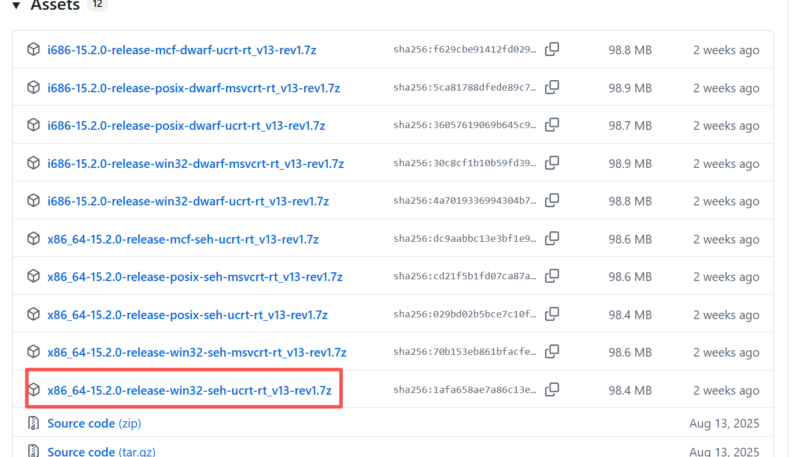

# 基础

### 环境配置

##### 编译器

- 下载地址：https://github.com/niXman/mingw-builds-binaries/releases
	
- 解压，推荐文件夹名称为`mingw64`
- 添加bin到系统变量Path，如：`C:\Program Files\mingw64\bin`
- 检查：`gcc -v`

##### vscode

- 所需插件
- 

### 程序基础

##### 程序结构

##### 导入模块

