# 问题

### 程序问题

##### 1. 创建工程

- [x] 需要使用python2.7运行创建程序

  > python2 cocos new HelloLua -p com.lua.hello -l lua -d D:/Cocos/new

- [ ] cocos文件语法错误

  > D:\Cocos\Cocos2d-x\cocos2d-x-3.10\tools\cocos2d-console\bin>python2 cocos new HelloLua -p com.lua.hello -l lua -d D:/Cocos/new
  >   File "cocos", line 3
  >     COCOS_CONSOLE_BIN_DIRECTORY=$(dirname "$0")
  >                                 ^
  > SyntaxError: invalid syntax

##### 2. 调试工程

- [ ] 子弹调用`removeFromParent()`造成崩溃

- [x] 重复创建敌人

- [x] 敌人被销毁后无法补充

- [ ] 敌人-子弹碰撞检测无效

  > 碰撞检测函数有误


### 方法使用

##### 活动调度

- Node自我调度
- scheduler统一调度

##### Sprite创建

##### 垃圾回收

- 运行完整的垃圾回收周期：`collectgarbage("collect")`

- 当前程序使用的内存总量：`local m = collectgarbage("count")`

- 重启：`collectgarbage("restart")`

- 设置收集暂停时间变量：`collectgarbage("setpause",int)`

  > **传入值/100** 赋给时间变量
  >
  > 传入100时，表示垃圾收集不会停止

- 设置步长倍增器的值：`collectgarbage("setstepmul",int)`

  > 内存分配速度的 **传入值/100** 倍

- 停止：`collectgarbage("stop")`


# 基本操作

### 创建工程

- 控制台进入引擎根目录\tools\cocos2d-console\bin
- `cocos new 项目名称 -p com.包名 -l lua -d 输出目录`


### 调试工程


# 基础概念

> 创建：`cc.XXX:create()`

### 导演 cc.Director

##### 1. 功能

- 初始化、销毁
- 场景控制
- 设置、获取系统信息

##### 2. 常用方法

```lua
-- 获取导演对象
local director = cc.Director:getInstance()

-- 获取窗口大小
local winSize = director:getWinSize()

-- 设置窗口大小
director:getOpenGLView():setDesignResolutionSize(width,height,0)

-- 设置是否显示帧率和精灵个数
director:setDisplayState(true)

-- 设置帧率
director:setAnimationInterval(1.0/60)

-- 暂停与恢复
director:pause()
director:resume()

-- 退出
director:endToLua()

-- 捕捉屏幕
director:captureScreen()
```


### 显示display

##### 1. 绘图节点

- 创建：`drawNode = display.newDrawNode()`
- 绘制
  - 矩形：`drawNode:drawRect(起点, 终点, 颜色)`
    - 起点、终点：`cc.p(x,y)`
    - 颜色：`cc.c4f(r,g,b,不透明度)`


### 节点 cc.Node

> 场景、层、精灵等都继承自Node

##### 1. 功能

- 封装基础属性与方法
- 含有子节点
- 运行动作
- 内部含有跟随节点声明周期的调度器

##### 2. 类继承

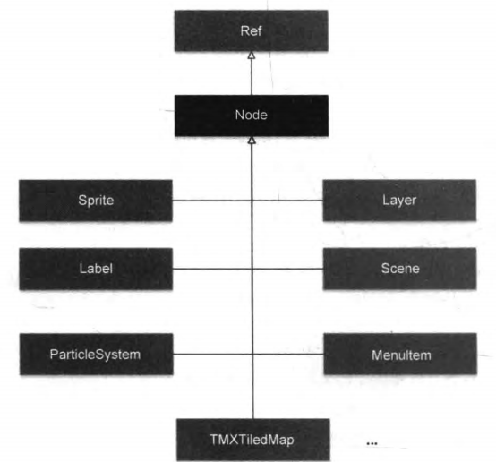

##### 3. 属性

> 父节点的属性变化会被应用到子节点

- 标识：`_tag`
- 名称：`_name`
- **位置关系

  - `position`
  
    > 锚点在父节点上的位置
  - `_positionZ`
  - 锚点位置：`anchorPoint`
  
    > 相对于图形左下角的比例位置
    >
    > 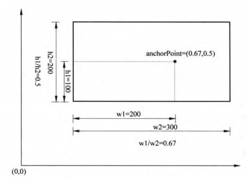
- 大小：`_contentSize`
- 旋转角度

  - `rotationX`
  - `_rotationY`
  - `_rotationZ-X`
  - `rotationZ-Y`
- 缩放系数

  - `_scaleX`
  - `_scaleY`
  - `_scaleZ`
- 是否显示：`_visible`

##### 4. 常用方法

> 创建4步：creare，position，AnchorPoint，layer:addChild

- 创建：`local node = cc.Node:create()`

  > `local node = display.newNode()`

- 父子关系操作
  - 获取父节点：`local parent = node.getParent()`
  
  - **添加子节点：`node:addChild(child, zOrder, tag)`
    - child：子节点对象，cc.node
    - zOrder：渲染顺序，数字
    - tag：子节点标签
    
  - 获取子节点
    - `local child = node.getChildren()`
    - 通过标签获取：`local child = node.getChildByTag(tag)`
    
  - 移除子节点
    - 删除单个：`node:removeChild(ChildNode,true)`
    - 通过标签删除：`node:removeChildByTag(tag,true)`
    - 删除全部：`node:removeAllChildrenWithCleanup(true)`
    - 断开与父节点的连接：`node:removeFromParent(true)`
    
  - 运行控制
  
    ```lua
    -- 恢复当前层的所有节点，继续调度
    layer_Main:resume()
    schedulerId = scheduler:scheduleScriptFunc(shootBullet,0.2,false)
    -- 恢复子节点
    local children = layer_Main:getChildren()
    for i=1,#children,1 do
    	local child = children[i]
        child:resume()
    end
    ```
  
    - 暂停：`node:pause()`
    - 继续：`node:resume()`
  
- **属性操作
  
  > 所有子类通用
  
  - 设置大小：`node:setContentSize(cc.size(width,length))`
  
  - 获取大小：`local size = node:getContentSize()`
  
  - 设置不透明度：`node:setOpacity(int x)`
  
    > 越大，不透明度越高
  
  - **设置位置：`node:setPosition(cc.p(x,y))`
  
  - **设置锚点：`node:setAnchorPoint(cc.p(x,y))`
  
  - 获取位置：`local x,y = node:getPosition()`
  
  - 设置标签：`node:setTag(int tag)`

##### 5. **游戏循环与调度

> 游戏循环由导演管理，若需要场景中的精灵运动，则可使用Scheduler进行调度

- 精灵调度

  - 启用调度函数：`Node:scheduleUpdateWithPriorityLua(update,priority)`
  
    > 使用后，Node对象会定时调用update，priority为优先级
  
    ```lua
    -- 该Layer的调度函数：每个周期将label移动
    local function update(delta)
    	local x,y = label:getPosition()
     label:setPosition(cc.p(x+2,y-2))
    end
    -- 启用调度
    layer:scheduleUpdateWithPriorityLua(update,0)
    ```
  
  - 停止调度：`Node:unscheduleUpdate()`
  
- Scheduler

  - 获取实例：`local scheduler = cc.Director:getInstance():getScheduler()`
  - 进行调度：`local id = scheduler:scheduleScriptFunc(func,delta,bool)`
  - 停止调度：`scheduler:unscheduleScriptEntry(id)`


### **场景 cc.Scene

##### 1. 功能：容纳其他元素

- 展示类场景

  > 播放视频、简单文字，作为游戏介绍、失败提示、帮助

- 选项类场景

  > 主菜单、参数设置

- 游戏场景

##### 2. Scene类继承

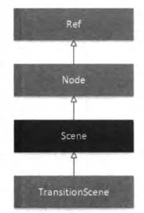

##### 3. 常用方法

> - 创建普通场景：`display.newScene(name)`
> - 创建带物理引擎的场景：：`display.newPhysicsScene(name)`

- 创建场景：`cc.Scene:create()`

  > 一般将场景创建单独作为一个程序文件，并封装此方法，以便于进行场景的初始化

##### 4. 导演的场景控制

> -- 获取导演对象
> local director = cc.Director:getInstance()

- **启动主场景：`director:runWithScene(newScene)`

  > 如果已有运行中的场景则不能调用此函数，故只用于启动初始场景

- **场景切换：`director:replaceScene(newScene)`

  > **释放并销毁**当前场景，运行传入的场景.

- 场景栈

  - `director:pushScene(scene)`

    > **当前场景暂停入栈**，运行传入的scene

  - `director:popScene()`

    > 弹出栈顶场景并释放，运行新的栈顶场景，即**返回上一个场景**
    
  - `director:popToRootScene()`
  
    > 与pushScene配合使用，可**返回根场景**

##### 5. 场景过渡动画类cc.TransitionScene

- 类继承
  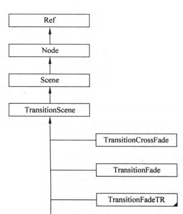

- 使用

  - 创建过渡对象：`local ts = cc.TansitionXXXX:create(time, nextScene)`

    - XXXX为具体的切换方式

      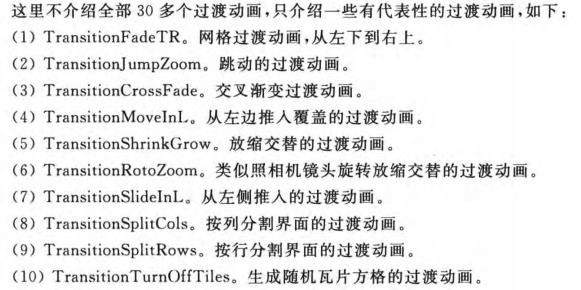

  - 使用过渡动画进行切换

    > 在切换场景时，**传入过渡对象 **即可

##### 6. 生命周期

> 实际上所有Node子类都有这些周期事件

- 事件分类

  - 进入场景：enter
  - 进入场景且过渡动画结束：enterTransitionFinish
  - 退出场景且过渡动画开始：exitTransitionStart
  - 退出场景：exit
  - 场景对象被清除：cleanup

- 事件处理函数定义

  > 场景构造函数 **ctor** 会 **触发init事件** ，同时进行处理函数的 **定义与引用**
  >
  > 处理函数本质上是根据传入的 **event** 参数，执行不同命令

  ```lua
  -- 类声明
  local GameScene = class("GameScene", function()
      return cc.Scene:create()
  end)
  
  function GameScene.create()
      local scene = GameScene.new()
      scene:addChild(scene:createLayer())
      return scene
  end
  
  -- 构造函数
  function GameScene:ctor()
      cclog("GameScene init")
      -- 生命周期事件处理函数引用
      local function onNodeEvent(event)
          if event == "enter" then
              self:onEnter()
          elseif event == "enterTransitionFinish" then
              self:onEnterTransitionFinish()
          elseif event == "exit" then
              self:onExit()
          elseif event == "exitTransitionStart" then
              self:onExitTransitionStart()
          elseif event == "cleanup" then
              self:cleanup()
          end
      end
      -- 注册生命周期处理函数
      self:registerScriptHandler(onNodeEvent)
  end
  
  -- 事件函数具体定义
  function GameScene:onEnter()
      cclog("GameScene onEnter")
  end
  
  function GameScene:onEnterTransitionFinish()
      cclog("GameScene onEnterTransitionFinish")
  end
  
  function GameScene:onExit()
      cclog("GameScene onExit")
  end
  
  function GameScene:onExitTransitionStart()
      cclog("GameScene onExitTransitionStart")
  end
  
  function GameScene:cleanup()
      cclog("GameScene cleanup")
  end
  ```

- 注册：`self:registerScriptHandler(事件处理函数)`

- 场景切换时的生命周期

  - pushScene
    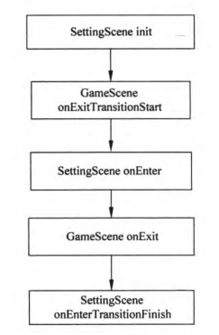
  - replaceScene
    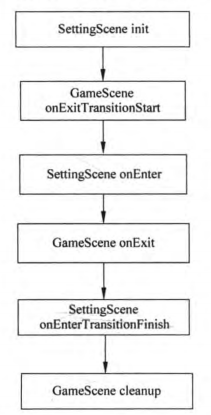
  - popScene
    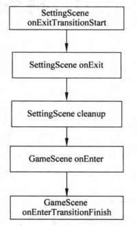


### **层 cc.Layer

##### 1. 功能：对场景布局的细分

> 一个Scene至少有一个Layer，类似于PS的图层
>
> 层的顺序同样用于事件相应机制

##### 2. Layer类继承

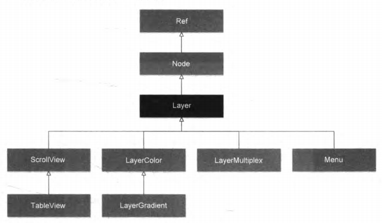

##### 3. 常用方法

- 创建普通层：`local layer = cc.Layer:create()`
- 创建填充色层：`local layer = display.newColorLayer(cc.c4b(255,0,0,255))`


### Cocos2d-x坐标系

##### 1. UI坐标

> Android和IOS应用开发时使用**原点在左上角的坐标系**（右下为正方向）
>
> Cocosd-x Lua的API默认情况下不使用UI坐标，但在**触摸事件**发生时会获得**触摸对象Touch**，可获取UI坐标

- 通过Touch获取UI坐标：`cc.p touchLocation = touch:getLocationInView()`

- UI坐标转换成OpenGL坐标：`cc.p OpenGLLocation = cc.Director:getInstance():convertToGL(touchLocation)`

  > 借助Director带有的转换方法

##### 2. OpenGL坐标

> 默认坐标系就是OpenGL坐标系
>
> 当考虑3维时，OpenGL使用右手坐标系（z向外），而Direct3D使用左手坐标系

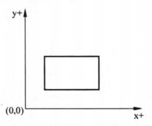

##### 3. **世界坐标和模型坐标的转换

> 坐标值转换成Cocos坐标：`local pos = cc.p(x,y)`
>
> 世界坐标-->模型坐标时，会将目标node的**左下角作为新坐标的原点**
>
> 模型坐标-->世界坐标时，将**子node**的**锚点位置**转换成世界坐标

- 世界坐标-->模型坐标

  - `node:convertToNodeSpace(wolrdPoint)`
  - 相对锚点：`node:convertToNodeSpaceAR(wolrdPoint)`

- 触摸点世界坐标-->模型坐标

  - `node:convertTouchToNodeSpace(touch)`
  - 相对锚点：`node:convertTouchToNodeSpaceAR(touch)`

- 模型坐标-->世界坐标

  - `parentNode:convertToWorldSpace(nodePoint)`

  - 相对锚点：`parentNode:convertToWorldSpaceAR(nodePoint)`

    > ????


### **标签cc.Label

> 默认资源路径：`res/`

##### 1. 创建方法

- 系统字体：`local label = cc.Label:createWithSystemFont(text,字体,int size)`

  ```lua
  local label = cc.Label:createWithSystemFont("起名难的HelloWorld","Arial",36)
  ```

  - 显示的文字：`string text`

  - 系统字体名称：`string font`

    > "Arial"

  - 大小：`int size`

- TTF字体

  > 资源置于**res/fonts**
  
  - `local label = cc.Label:createWithTTF(众多参数)`
    
    ```lua
    local label = cc.Label:createWithSystemFont("hello","fonts/STLITI.ttf",36)
    ```
    
    - `const std::string & text`
    - 字体文件：`fontFile`
    - `fontSize`
    - `dimensions = size(0,0)`
    - `hAlignment = TEXT_ALIGNMENT_LEFT`
    - `vAlignment = VERTICAL_TEXT_ALIGNMENT_TOP`
    
  - `local label = cc.Label:createWithTTF(众多参数)`
    
    ```lua
    -- 声明ttfConfig
    local ttfConfig  = {}
    ttfConfig.fontFilePath="fonts/Marker Felt.ttf"
    ttfConfig.fontSize = 32
    -- 使用ttfConfig创建
    local label = cc.Label:createWithTTF(ttfConfig, "Hello World")
    ```
    
    - 字体配置信息：`ttfConfig`
      - 字体文件路径：`fontFilePath`
      - 字体大小：`fontSize`
      - 字体库类型：`glyphs = GLYPHCOLLECTION_DYNAMIC`
      - 自定义字体：`customGlyphs`
      - 描边：`outlineSize`
      - 距离字段字体开关：`distanceFieldEnable`
    - `text`
    - `hAlignment = TEXT_ALIGNMENT_LEFT`
    - 最大宽度（可省略）：`int maxLinewidth = 0`
  
- 位图字体：`ocal label = cc.Label:createWithBMFont(参数)`

  > 需要加载 **纹理图集.png** 和 **字体坐标文件.fnt**，需放在相同目录下，且文件命名相同

  ```lua
  local label1 = cc.Label:createWithBMFont("fonts/bitmapFontChinese.fnt", "中国")
  label1:setPosition(cc.p(size.width/2, size.height - 3 * gap))
  layer:addChild(label1, 1)
  
  local label2 = cc.Label:createWithBMFont("fonts/BMFont.fnt", "Hello World")
  label2:setPosition(cc.p(size.width/2, size.height - 4* gap))
  layer:addChild(label2, 1)
  ```
  
  - 位图字体文件：`const std::string & bmfontFilePath`
  - `hAlignment = TEXT_ALIGNMENT_LEFT`
  - `int maxLinewidth = 0`
  - 位图中的偏移量（可省略）：`imageOffset = p(0,0)`
  

##### 2. 字体设置

- 内容：`label:setString(string)`
- 阴影效果：`label:enableShadow(cc.c4b(255,255,255,128),cc.size(4,-4))`
- 颜色：`label:setColor(cc.c3b(r,g,b))`


### 图片集标签LabelAtlas

> 显示的文字是从图片集中提取，比LabelTTF快得多
>
> 每个字符必须有固定的宽高

```lua
local label = cc.LabelAtlas:create("HelloWorld", 
						"fonts/tuffy_bold_italic-charmap.png", 
    					48, 66, 			-- 高、宽
    					string.byte(" "))	-- 开始字符
```


### **菜单cc.MenuItem

> 创建后一定记得定义并注册点击事件！！！

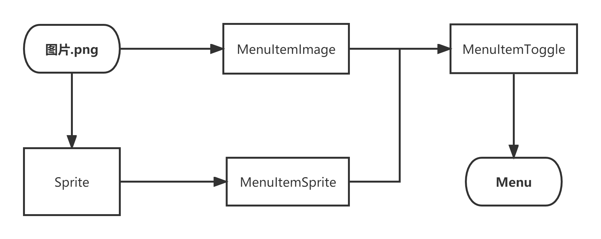

##### 1. 基本状态：正常、选中、禁止

##### 2. 类继承


##### 3. 文本菜单MenuItemLabel

- MenuItemFont相关方法

  > Cocos2d-x 3.11版本Lua中此类无可移植性，须使用LabelAtlas和MenuItemLabel结合实现

  - 设置字体：`cc.MenuItemFont:setFontName("font")`

  - 设置字号：`cc.MenuItemFont:setFontSize(int size)`

  - 创建实例：`local item = cc.MenuItemFont:create(string text)`

  - 通过LabelAtlas实现

    ```lua
    local labelAtlas = cc.LabelAtlas:create("Help",
            "menu/tuffy_bold_italic-charmap.png", 48, 65, string.byte(' '))
    local item = cc.MenuItemLabel:create(labelAtlas)
    ```

- MenuItemAtlas相关方法

##### 4. **精灵菜单MenuItemSprite

> 特点：精灵可以运动

- 创建

  - 基础创建：`local item = cc.MenuItemSprite:create(参数)`

    ```lua
    local startlocalNormal = cc.Sprite:create("menu/start-up.png")
    local startlocalSelected = cc.Sprite:create("menu/start-down.png")
    local startMenuItem = cc.MenuItemSprite:create(startlocalNormal, startlocalSelected)
    ```

    > 需要先创建3种不同状态的精灵
    >
    > 可借助纹理缓存中的资源创建精灵
  
    - 正常状态精灵：`normalSprite`
    - 选中状态精灵：`selectedSprite`
    - 禁用状态精灵（可省略）：`disabledSprite`

  - 使用子类MenuItemImage创建：`local item = cc.MenuItemSprite:create(参数)`
  
    ```lua
    local settingMenuItem = cc.MenuItemImage:create(
            "menu/setting-up.png",
            "menu/setting-down.png")
    ```

    > 使用图片直接创建，毕竟精灵本质上由图片构成
  
    - 正常状态图片：`normalImage`
    - 选中状态图片：`selectedImage`
    - 禁用状态图片（可省略）：`disabledImage`
  


##### 5. 开关菜单MenuItemToggle

- 创建：`local toggle = cc.MenuItemToggle:create(OnMenuItem, OffMenuItem)`

  > 需要先创建好开关对应的MenuItemImage
  >
  > MenuItemImage与MenuItemToggle的创建都需要两个状态，不同之处在于：
  >
  > - MenuItemImage的两个状态是**按下和抬起**的状态
  > - MenuItemToggle的两个状态是**选中前和选中后**的状态
  
  ```lua
  -- 创建开关状态对应的菜单项
  local soundOnMenuItem = cc.MenuItemImage:create("menu/on.png", "menu/on.png")
  local soundOffMenuItem = cc.MenuItemImage:create("menu/off.png", "menu/off.png")
  -- 创建开关菜单项
  local soundToggleMenuItem = cc.MenuItemToggle:create(soundOnMenuItem, soundOffMenuItem)
  soundToggleMenuItem:setPosition(director:convertToGL(cc.p(818, 220)))
  ```
  
- 获取勾选状态：`local state = toggleMenuItem:getSelectedIndex()`

  > 1是选中状态
  
- 设置勾选状态：`toggleMenuItem:setSelectedIndex(state)`


##### 6. **菜单Menu

> 3~5创建的相当于都是子菜单按钮，最后需要整合到一个“菜单”项中

- 使用菜单项创建菜单：`local menu = cc.Menu:create(item_1,item_2,...)`
- 垂直对齐：`menu:alignItemsVertically()`

##### 7. **点击事件处理函数

```lua
-- 点击事件
local function menuCallback(sender)
	-- 具体执行的代码
end
soundToggleMenuItem:registerScriptTapHandler(menuCallback)
```

- 定义：可传入参数 sender 的函数
- **注册：`MenuItem:registerScriptTapHandler(事件函数)`


### **精灵 cc.Sprite

##### 1. 相关原理

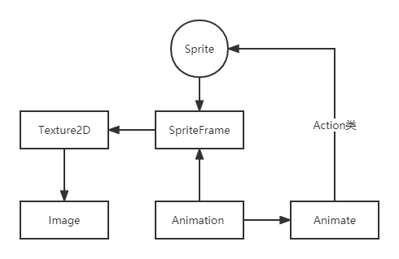

- Image：从文件中读取图片，生成缓冲数据供Texture2D使用
- Texture2D：可被绘制的纹理
- SpriteFrame：具有一定区域属性的纹理，精灵帧
- Animation：SpriteFrame序列
- Animate：将帧序列转化为Sprite可执行的Action类

##### 2. 类继承

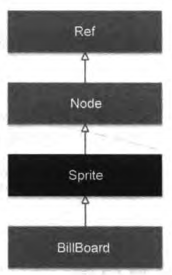

##### 2. 常用方法

- 创建

  - 基础创建：`local sprite = cc.Sprite:create()`

    > 纹理贴图等属性需要在之后设置

  - 纯色背景：`local sprite = cc.LayerColor:create(cc.c3b(r,g,b))`

  - 从图片文件创建：`local sprite = cc.Sprite:create("xxx.png",cc.rect)`

    > `local sprite = display:newSprite("xxx.png")`

    - 裁剪的矩形区域（可省略）：`cc.rect(px,py,width,height)`

      > 图片使用UI坐标系
      >
      > px、py为裁剪区域起始点坐标

  - 指定纹理创建：`local sprite = cc.Sprite:createWithTexture(texture,rect,rotated=false)`

    - 纹理：texture
    - 裁剪的矩形区域（可省略）：rect
    - 是否旋转纹理：rotated

  - 通过精灵帧创建：`local sprite = cc.Sprite:createWithSpriteFrame(frame)`

    > `local sprite = display:newSprite()`

  - **通过精灵帧名称创建：`local sprite = cc.Sprite:createWithSpriteFrameName(name)`

    > 需要先将 **坐标文件加入精灵帧缓存** ，具体在性能优化中介绍

  - 从缓存的图像帧创建：`local sprite = display:newSprite("# xxx.png")`

    > 用#表示精灵帧
    >
  
- 设置位置：`sprite:setPosition(cc.p(x,y))`

- 设置纹理：`sprite:setTexture(texture)`

  > 需要先获得纹理对象！！！
  >
  > ```lua
  > -- 通过纹理缓存TextureCache创建Texture2D对象
  > local cache = cc.Director:getInstance():getTextureCache():addImage("tree1.png")
  > -- 创建精灵
  > local sprite = cc.Sprite:create()
  > sprite:setTexture(cache)
  > sprite:setTextureRect(cc.rect(73, 72,182,270))
  > ```

- 设置纹理裁剪区域：`sprite:setTextureRect(cc.rect(x,y,width,height))`

- **背景图大小调整

  ```lua
  -- 使背景图片适配当前窗口大小（win_size为窗口大小）
  function Normal:setBgSize(bg,win_size)
      local func = "背景图大小自适应"
      self:introduce(func,true)
      cclog("窗口大小："..win_size.width..", "..win_size.height)
      local bg_size = bg:getContentSize()
      cclog("Sprite大小："..bg_size.width..", "..bg_size.height)
      -- 计算缩放比例
      bg:setScaleX(win_size.width/bg_size.width)
      bg:setScaleY(win_size.height/bg_size.height)
      self:introduce(func,false)
  end
  ```


##### 3. **性能优化

- 纹理图集Texture Atlas

  > 使用纹理图集Texture Atlas（也称为精灵表Sprite Sheet）可以将很多小图放在一张大图中，减少读取次数与碎片空间。

- **使用精灵帧缓存

  - 缓存分类

    - 纹理缓存TextureCache：使用可创建纹理对象

    - 精灵帧缓存SpriteFrameCache

      > 可从精灵表中创建精灵帧缓存，再从其中获取精灵对象
      >
      > 单一实例，类似Director

    - 动画缓存AnimationCache：精灵动画的每一帧都存放于此

  - 使用示例
  
    ```lua
    --创建层
    function GameScene:createLayer()
        cclog("GameScene init")
        local layer = cc.Layer:create()
    
        local bg = cc.Sprite:create("background.png")
        bg:setPosition(cc.p(size.width/2, size.height/2))
        layer:addChild(bg)
    
        -- 获取精灵帧缓存实例
        local frameCache = cc.SpriteFrameCache:getInstance()
        -- 将精灵帧坐标文件添加到缓存中
        frameCache:addSpriteFrames("SpirteSheet.plist")
    
        -- 通过名字创建
        local mountain1 = cc.Sprite:createWithSpriteFrameName("mountain1.png")
        mountain1:setAnchorPoint(cc.p(0, 0))
        mountain1:setPosition(cc.p(-200,80))
        layer:addChild(mountain1,0)
    
        -- 直接使用精灵帧创建
        local heroSpriteFrame = frameCache:getSpriteFrameByName("hero1.png")
        local hero1 = cc.Sprite:createWithSpriteFrame(heroSpriteFrame)
        hero1:setPosition(cc.p(800,200))
        layer:addChild(hero1,0)
    
        return layer
    end
    ```
  


### 数据存储cc.UserDefault

##### 1. 功能

- 以 k-v 形式保存数据，即使退出游戏依然游戏有效

  > key一般为string

- 支持类型

  - 数字类型：Integer、Float、Double
  - 字符串：String
  - 布尔值：Bool

- 存储位置：UserDefault.xml

  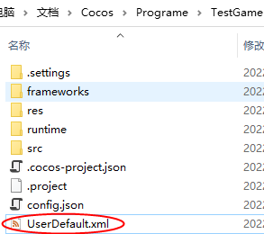

  ```xml
  <?xml version="1.0" encoding="UTF-8"?>
  <userDefaultRoot>
      <sound_key>false</sound_key>
      <music_key>false</music_key>
  </userDefaultRoot>
  ```

##### 2. **使用方法

- 获取实例：`local defaults = cc.UserDefault:getInstance()`

- 设置：`defaults:setTypeForKey(key,value)`

  > Type为目标值类型

- 获取：`local value = defaults:getTypeForKey(key,defaultValue)`

  > 根据key获取value，若无k-v，则以默认值进行设置


# 动作、特效、动画

### 动作

##### 1. 基础类继承

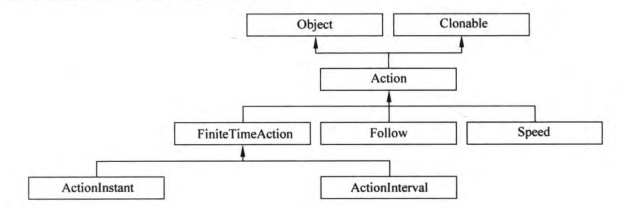

- 时限动作：FiniteTimeAction
  - 瞬时动作：ActionInstant
  - 间隔动作：ActionInterval
- 跟随动作：Follow
- 动作运行速率调整：Speed

##### 2. **Node类动作使用方法

> 具体动作在3~6

- 运行指定动作：`node:runAction(Action * action)`

  > 开始运行后，不必再控制

- 停止指定动作

  - `node:stopAction(Action * action)`

  - node:`stopActionByTag(int tag)`

    > 需要先设置好tag

  - `node:stopAllAction()`

##### 3. 瞬时动作

> 立刻执行的动作
>
> cc.动作名:create()

- 移动到目标点：`cc.Place:create(cc.p(x,y))`
- 翻转
  - 水平翻转：`cc.FlipX:create(true)`
  - 垂直翻转：`cc.FlipY:create(true)`
- 隐藏与显示
  - 隐藏：`cc.Hide:create()`
  - 显示：`cc.Show:create()`

##### 4. **间隔动作

> 需要一定时间完成，可通过duration设置执行时间
>
> cc.名称To或By:create()

- 移动

  - 目标移动：`cc.MoveTo:create(int time, cc.p(x,y))`
  - 相对运动：`cc.MoveBy:create(int time, cc.p(x,y))`

- 跳动：`cc.JumpXX:create(int time, cc.p(x,y),int height, int 次数)`

- 贝塞尔曲线动作：`cc.BezierBy:create(int time,bezier)`

  ```lua
  local bezier = {
                  cc.p(0, size.height / 2),			-- 第一控制点
                  cc.p(300, - size.height / 2),		-- 第二控制点
                  cc.p(100, 100)						-- 结束点
              }
  sprite:runAction(cc.BezierBy:create(3,bezier))
  ```

- 缩放：`cc.ScaleXX:create(int time, int scale)`

- 旋转：`cc.RotateXX:create(int time, int 角度)`

- 闪烁：`cc.Blink:create(int time, int 次数)`

- 染色：`cc.TintXX:create(int time,r,g,b)`

- 不透明度变化：`cc.FadeTo:create(int time,int 不透明度百分比数)`

- 淡入淡出

  - 淡入：`cc.FadeIn(int time,int 淡入不透明度)`

    > 需要先设置Sprite本身的不透明度

    ```lua
    sprite:setOpacity(10)
    sprite:runAction(cc.FadeIn:create(5))
    ```

  - 淡出：`cc.FadeIn(int time,int 淡出不透明度)`

##### 5. 组合动作

> 按一定次序将上述基本动作组合

- 顺序动作组合创建：`cc.Sequence:create(ac1,ac2,...)`

  ```lua
  -- 创建动作
  local ac0 = sprite:runAction(cc.Place:create(p))
  local ac1 = sprite:runAction(cc.MoveTo:create(2,cc.p(size.width - 130, size.height - 200)))
  local ac2 = sprite:runAction(cc.JumpBy:create(2, cc.p(8, 8),6, 3))
  local ac3 = sprite:runAction(cc.Blink:create(2,3))
  local ac4 = sprite:runAction(cc.TintBy:create(0.5,0,255,255))
  -- 执行动作组合
  sprite:runAction(cc.Sequence:create(ac0, ac1, ac2, ac3, ac4, ac0))
  ```

- 并行动作组合创建：`cc.Spawn:create(ac1,ac2,...)`

- 重复动作创建：`cc.Reapeat:create(动作组合, int 次数)`

- 无限重复动作创建：`cc.ReapeatForever:create(动作组合, int 次数)`

- 反动作：`local ac_re = ac:reverse()`

  > 通常只有 **XXXBy** 这种相对运动支持反动作

##### 6. 非匀速速度控制

> cc.EaseXXX:create()

- 以线性速度执行动作
  - 慢-快：`cc.EaseIn(action,int 速度倍数)`
  - 快-慢：`cc.EaseOut(action,int 速度倍数)`
  - 慢-快-慢：`cc.EaseInOut(action,int 速度倍数)`
- 正弦变换速度
  - 慢-快：`cc.EaseSineIn(action)`
  - 快-慢：`cc.EaseSineOut(action)`
  - 慢-快-慢：`cc.EaseSineInOut(action)`
- 指数变换速度
  - 慢-快：`cc.EaseExponentialIn(action)`
  - 快-慢：`cc.EaseExponentialOut(action)`
  - 慢-快-慢：`cc.EaseExponentialInOut(action)`
- 随机变换速度：`cc.Speed:create(action, (math.random()*5))`

##### 7. 函数调用动作

> 顺序动作执行的中间或结束后，可回调某函数，并将此步骤作为一个动作

- 创建无参调用或传入自身调用动作：`cc.CallFunc:create(函数名)`

  ```lua
  -- 无参调用函数
  local function CallBack1()
      sprite:runAction(cc.TintBy:create(0.5, 255, 0, 255))
  end
  
  function MyActionScene:OnCallFunc()
      cclog("MyActionScene OnCallFunc")
      local ac1 = cc.MoveBy:create(2, cc.p(100, 100))
      local ac2 = ac1:reverse()
  	-- 创建调用动作
      local acf = cc.CallFunc:create(CallBack1)
      local seq = cc.Sequence:create(ac1, acf, ac2)
      sprite:runAction(cc.Sequence:create(seq))
  end
  
  -- 将精灵传入的函数
  local function CallBack2(pSender)
      local sp = pSender
      sp:runAction(cc.TintBy:create(1, 255, 0, 255))
  end
  
  function MyActionScene:OnCallFuncN()
      cclog("MyActionScene OnCallFuncN")
      local ac1 = cc.MoveBy:create(2, cc.p(100, 100))
      local ac2 = ac1:reverse()
  	-- 创建调用动作
      local acf = cc.CallFunc:create(CallBack2)
      local seq = cc.Sequence:create(ac1, acf, ac2)
      sprite:runAction(cc.Sequence:create(seq))
  end
  ```

- 创建有参调用动作：`cc.CallFunc:create(函数名，其他参数)`

  ```lua
  local function CallBack3(pSender, table)
      local sp = pSender
      cclog("CallBack3 %d", table[1])
      sp:runAction(cc.TintBy:create(table[1], table[2], table[3], table[4]))
  end
  
  function MyActionScene:OnCallFuncND()
      cclog("MyActionScene OnCallFuncND")
      local ac1 = cc.MoveBy:create(2, cc.p(100, 100))
      local ac2 = ac1:reverse()
  	-- 创建调用动作
      local acf = cc.CallFunc:create(CallBack3, { 1, 255, 0, 255 })
      local seq = cc.Sequence:create(ac1, acf, ac2)
      sprite:runAction(cc.Sequence:create(seq))
  end
  ```

  

### 特效 GridAction

> 网格动作，本质上是间隔动作

##### 1. 类继承

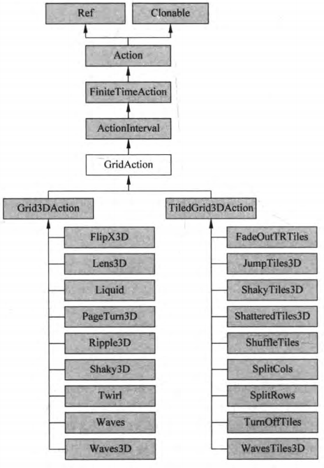

##### 2. 网格动作管理类cc.NodeGrid

- 创建：`gridN = cc.NodeGrid:create()`

##### 3. 常见特效

- X轴3D翻转：`cc.FlipX3D:create(float time)`
- 翻页：`cc.PageTurn3D:create(float time, 网格大小cc.size(15,10))`
- 凸透镜：`cc.Lens3D:create(float time, cc.size(15,10), cc.p(中心点坐标), int 半径)`
- 晃动：`cc.Shaky3D:create(float time cc.size(15,10), int 晃动范围, 是否有Z轴晃动)`
- 3D波动：`cc.Waves3D:create(float time, cc.size(15,10), int 波动次数, int 振幅)`
- 3D瓦片跳动：`cc.JumpTiles3D:create(float time, cc.size(15,10), 跳动次数, 跳动幅度)`
- 3D瓦片晃动：`cc.ShakyTiles3D:create(float time, cc.size(16,12), 5, false)`
- 3D瓦片波动：`cc.WavesTiles3D:create(float time, cc.size(15,10), 4, 120)`


### **帧动画

> 场景过渡动画在场景部分

##### 1. 类继承

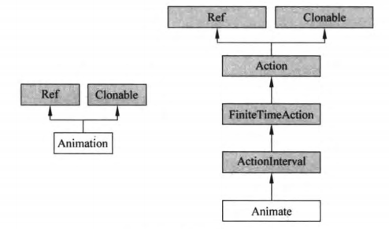

- 动画类Animation：保存很多动画帧
- 动画动作类Animate：属于间隔动作

##### 2. **使用示例

- 创建Animation对象：`local animation = cc.Animation:create()`
- 获取组成动画的精灵帧：`local spriteFrame = spriteFrame:getSpriteFrameByName(name)`
- 将精灵帧加入Animation：`animation:addSpriteFrame(sprite)`
- 设置相关参数
  - 帧间隔：`animation:setDelayPerUnit(float time)`
  - 动画执行完毕后是否还原：`animation:setRestoreOriginalFrame(true)`
- 根据Animation创建动画动作：`local action = cc.Animate:create(animation)`

```lua
-- 点击菜单选项播放动画
local function OnAction(menuItemSender)

        if not isPlaying then

            --///////////////动画开始//////////////////////
            local animation = cc.Animation:create()
            for i=1,4 do
            	-- 当前帧图片名称
                local frameName = string.format("h%d.png",i)
                cclog("frameName = %s",frameName)
            	-- 创建精灵帧
                local spriteFrame = spriteFrame:getSpriteFrameByName(frameName)
            	-- 加入animation对象中 
                animation:addSpriteFrame(spriteFrame)
            end

            animation:setDelayPerUnit(0.15)            --设置两个帧播放时间
            animation:setRestoreOriginalFrame(true)    --动画执行后还原初始状态
        	-- 创建动画动作
            local action = cc.Animate:create(animation)
        	-- 重复播放
            sprite:runAction(cc.RepeatForever:create(action))
            --//////////////////动画结束///////////////////
            isPlaying = true
        
        else
            sprite:stopAllActions()
            isPlaying = false
        end
    end
-- 注册事件
toggleMenuItem:registerScriptTapHandler(OnAction)
```


# 用户事件

### **事件处理机制

> 设置：定义函数-->设定为指定Listener的事件处理函数-->用事件分发器注册Listener
>
> 处理事件：分发器将事件按优先级传给Listener-->Listener调用对应的处理函数
>
> ```lua
> -- 定义处理函数
> local function touchBegan(touch, event)
>     cclog("touchBegan")
>     -- <处理函数代码>
> end
> 
> -- 创建一个事件监听器 OneByOne 为单点触摸
> local listener1 = cc.EventListenerTouchOneByOne:create()
> -- 绑定事件的处理函数
> listener1:registerScriptHandler(touchBegan, cc.Handler.EVENT_TOUCH_BEGAN)
> 
> local eventDispatcher = cc.Director:getInstance():getEventDispatcher()
> -- 设置监听器监听对象
> eventDispatcher:addEventListenerWithSceneGraphPriority(listener1, boxA)
> ```
>

##### 1.重要角色

- 事件
  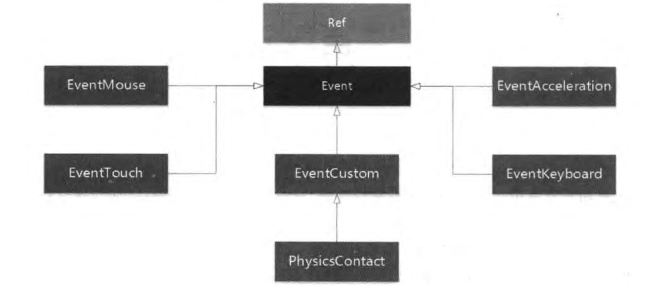

- 事件源：发生事件的对象

  > 层、精灵、菜单等

- **事件处理者：事件监听器类EventListener
  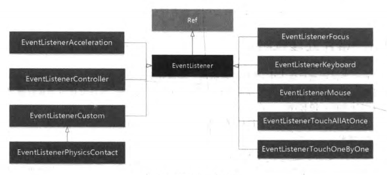

##### 2. 事件分发器

> 注册、注销监听器Listener，事件分发优先级设定

- **获取：`cc.Director:getInstance():getEventDispatcher()`

  > 与导演一样是**单例设计**

- **注册监听器

  - 指定固定优先级：`dispatcher:addEventListenerWithFixedPriority(listener,prio)`

    > 值越小优先级越高

  - 根据监听对象显示优先级设定事件优先级：`dispatcher:addEventListenerWithSceneGraphPriority(listener,node)`

- 注销监听器

  > 注销需要注意位置
  >
  > 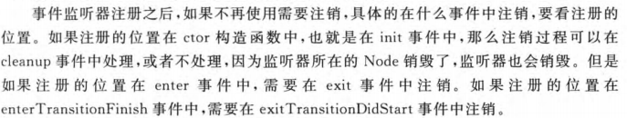

  - 指定注销：`dispatcher:removeEventListener(listener)`

  - 注销自定义监听器：`dispatcher:removeCustomEventListener(customListener)`

  - 注销所有：`dispatcher:removeAllEventListener()`

    > 使用此方法将导致菜单也无法使用注册的回调函数相应事件

##### 3. **触摸事件监听器

- **创建监听器：`local listener = cc.监听器:create()`

- 复制监听器：`local listener_2 = listener:clone()`

- 可监听事件

  - 单点触摸监听器

    - 单指触碰：`cc.Handler.EVENT_TOUCH_BEGAN`

    - 单指移动：`cc.Handler.EVENT_TOUCH_MOVED`

    - 单指离开：`cc.Handler.EVENT_TOUCH_ENDED`

    - 单指取消：`cc.Handler.EVENT_TOUCH_CANCELLED`

  - 多点触摸监听器

    - 单指触碰：`cc.Handler.EVENT_TOUCHES_BEGAN`
    - 单指移动：`cc.Handler.EVENT_TOUCHES_MOVED`
    - 单指离开：`cc.Handler.EVENT_TOUCHES_ENDED`
    - 单指取消：`cc.Handler.EVENT_TOUCHES_CANCELLED`

- **触摸事件处理函数：`local funtion(touch, node)`

  > 关键在于利用 **触摸点位置** 与 **触摸的对象大小** 两个数据判断是否成功触摸某对象
  >
  > 建议在将对象添加到层时，**设置相应的标签**，方便在处理时确定被触摸的对象

  ```lua
  -- 触摸点判定函数
  local function isContainsPoint(touch, node)
      -- 获取触摸点相对坐标
      local locationInNode = node:convertToNodeSpace(touch:getLocation())
      -- 创建判定矩形
      local s = node:getContentSize()
      local rect = cc.rect(0, 0, s.width, s.height)
      if cc.rectContainsPoint(rect, locationInNode) then
          return true
      end
      return false
  end
  
  -- 触摸开始处理函数
  local function touchBegan(touch, event)
      cclog("touchBegan")
      -- 获取事件所绑定的 node
      local node = event:getCurrentTarget()
      -- 点击范围判断检测
      if isContainsPoint(touch, node) then
          cclog("sprite x = %d, y = %d ", locationInNode.x, locationInNode.y)
          cclog("sprite tag = %d", node:getTag())
          node:runAction(cc.ScaleBy:create(0.06, 1.06))
          return true
      end
      return false
  end
  
  -- 触摸移动处理函数
  local function touchMoved(touch, event)
      cclog("touchMoved")
      -- 获取事件所绑定的 node
      local node = event:getCurrentTarget()
      -- 触摸的精灵的当前位置
      local currentPosX, currentPosY = node:getPosition()
      -- 触摸点移动前后位置之差
      local diff = touch:getDelta()
      -- 移动触摸的精灵（使其跟随触摸点）
      node:setPosition(cc.p(currentPosX + diff.x, currentPosY + diff.y))
  end
  ```

  - 触摸点`touch`
    - 获取触摸坐标：`touch:getLocation()`
    - **获取触摸点移动量：`local diff = touch:getDelta()`
  - 触摸事件`event`
    - **获取发生触摸事件的node对象：`local node = event:getCurrentTarget()`

- **绑定事件的处理函数：`listener:registerScriptHandler(处理函数, 可监听的事件)`

  - 开始：`cc.Handler.EVENT_TOUCH_BEGAN`

    > 注意：只有处理此事件的函数返回 **true** ，才能触发触摸移动等后续事件

  - 移动：`cc.Handler.EVENT_TOUCH_MOVED`

  - 结束：`cc.Handler.EVENT_TOUCH_ENDED`

- 是否吞没事件：`listener:setSwallowTouches(true)`

  > 吞没后，事件不会再传递给下一个优先级的Node

- Touch对象

  > 触摸产生

  - 获取之前的位置
    - UI坐标：`touch:getPreviousLocationInView()`
    - OpenGL坐标：`touch:getPreviousLocation()`
  - 获取当前位置
    - UI坐标：`touch:getLocationInView()`
    - OpenGL坐标：`touch:getLocation()`

##### 4. **键盘事件监听器

- 创建：`local keyListener = cc.EventListenerKeyboard:create()`

- 可监听事件
  - 按下：`EVENT_KEYBOARD_PRESSED`
  - 抬起：`EVENT_KEYBOARD_RELEASED`
  
- 键盘事件处理函数

  > 可以用一个label来显示按下的键

  ```lua
  -- 处理函数
  local function onKeyPressed(keyCode, event)
      local buf = string.format("%d 键按下!",keyCode)
      local label = event:getCurrentTarget()
      label:setString(buf)	-- 显示按键事件信息
  end
  
  function GameScene:createLayer()
      local layer = cc.Layer:create()
      
      -- 信息显示label
      local statusLabel = cc.Label:createWithSystemFont("没有键盘事件接收到!", "", 40)
      statusLabel:setAnchorPoint(cc.p(0.5, 0.5))
      statusLabel:setPosition(cc.p(size.width/2, size.height/2))
      layer:addChild(statusLabel)
      -- 创建一个键盘监听器
      local listener = cc.EventListenerKeyboard:create()
      listener:registerScriptHandler(onKeyPressed, cc.Handler.EVENT_KEYBOARD_PRESSED )
  	-- 绑定处理函数
      local eventDispatcher = self:getEventDispatcher()
      -- 添加监听器
      eventDispatcher:addEventListenerWithSceneGraphPriority(listener, statusLabel)
  
      return layer
  end
  ```

  - 按键：`int keyCode`

    > 传入的是按键编号

    | 按键     | 编号        |
    | -------- | ----------- |
    | 0~9      | 76~85       |
    | a~z      | 124~149     |
    | 左右上下 | 26,27,28,29 |

  - 触摸事件`event`
    - **获取发生触摸事件的node对象：`local node = event:getCurrentTarget()`
  
- **绑定事件的处理函数：`listener:registerScriptHandler(处理函数, 可监听的事件)`


### 加速度计与加速度事件

##### 1. 加速度计

> 可感应轴向上线性加速度的变化
>
> IOS和Android设备采用右手坐标系


##### 2. 加速度计事件处理

> 可通过 **事件分发器** 和 **层加速度计事件** 两种方式来访问加速度计数据

- 启动对象加速度计：`Node:setAccelerometerEnable(true)`

- 回调函数所需处理的参数

  - event

  - x方向加速度：x

    > 单位为g

  - y方向加速度：y

  - z方向加速度：z

  - 时间戳属性：timestamp

    > 事件发生的相对时间

- 创建加速度计事件监听器：`local listener = cc.EventListenerAcceleration:create(回调函数)`

  > 同时进行监听器创建和事件处理函数绑定

##### 3.  案例

```lua
--创建层
function GameScene:createLayer()
    local layer = cc.Layer:create()
    -- 启动层加速度计
    layer:setAccelerometerEnabled(true)

    --贴图的纹理图片宽高必须是2的n次幂，128x128
    local bg = cc.Sprite:create("BackgroundTile.png", cc.rect(0, 0, size.width, size.height))
    --贴图的纹理参数，水平重复平铺，垂直重复平铺
    bg:getTexture():setTexParameters(gl.LINEAR, gl.LINEAR, gl.REPEAT, gl.REPEAT)
    bg:setPosition(cc.p(size.width/2, size.height/2))
    layer:addChild(bg, 0)

    local ball = cc.Sprite:create("Ball.png")
    ball:setPosition(cc.p(size.width/2, size.height/2))
    layer:addChild(ball, 10, kBall_Tag)

    -- 加速度计事件回调函数
    local function accelerometerListener(event,x,y,z,timestamp)
        cclog("{x = %f, y = %f}", x, y)

        local ball = layer:getChildByTag(kBall_Tag)     -- 获取小球
        local s = ball:getContentSize()                 -- 获取球大小
        local p0x,p0y = ball:getPosition()              -- 获取球位置
        -- 速度SPEED已预先定义
        local p1x =  p0x + x * SPEED                    -- 获取x方向移动目标位置
        if (p1x - s.width/2) <0 then
            p1x = s.width/2
        end
        if (p1x + s.width / 2) > size.width then
            p1x = size.width - s.width / 2
        end
        local p1y =  p0y + y * SPEED                    -- 获取y方向移动目标位置
        if (p1y - s.height/2) < 0 then
            p1y = s.height/2
        end
        if (p1y + s.height/2) > size.height then
            p1y = size.height - s.height/2
        end
        -- 执行移动
        ball:runAction(cc.Place:create(cc.p( p1x, p1y)))
    end

    -- 创建一个加速度监听器
    local listerner  = cc.EventListenerAcceleration:create(accelerometerListener)
    self:getEventDispatcher():addEventListenerWithSceneGraphPriority(listerner,ball)

    return layer
end
```

------


# 进阶

### **音乐和音效

##### 1. API支持

- 音频

  | 平台            | 格式                                    |
  | --------------- | --------------------------------------- |
  | Android         | 与android.media.MediaPlayer支持格式相同 |
  | IOS             | MP3、CAFF                               |
  | Windows         | MIDI、WAV、MP3                          |
  | Windows Phone 8 | MIDI、WAV                               |

- 音效

  | 平台            | 格式         |
  | --------------- | ------------ |
  | Android         | **Ogg**、WAV |
  | IOS             | CAFF         |
  | Windows         | MIDI、WAV    |
  | Windows Phone 8 | MIDI、WAV    |

##### 2. 音频引擎AudioEngine

- 预处理

  > 对音频文件进行解压（如MP3-->WAV），否则直接播放会产生卡顿
  >
  > 在整个游戏运行过程中 **只需进行一次** ，最好放在 **main.lua** 中
  >
  > 路径为 /res 下的路径

  - 预处理BGM文件：`AudioEngine.preloadMusic(pszFilePath)`
  - 预处理音效文件：`AudioEngine.preloadEffect(pszFilePath)`

- 播放

  - `AudioEngine.playMusic(path, isLoop)`

    > 建议在生命周期的 ”enterTransitionFinish" 事件处理中进行此步骤
    >
    > 可防止被前一场景的停止播放干扰

  - `local id = AudioEngine.playEffect(path)`

    > 一般在点击事件处理函数中进行
    >
    > 建议在在main程序中使用 **全局变量保存是否允许播放音效的状态**

- 暂停

  - `AudioEngine.pauseMusic()`
  - `AudioEngine.pauseEffect(id)`
  - `AudioEngine.pauseAllEffects()`

- 继续

  - `AudioEngine.resumeMusic()`
  - `AudioEngine.resumeEffect(id)`
  - `AudioEngine.resumeAllEffects()`

- 是否正在播放：`AudioEngine.isMusicPlaying()`

- 停止

  - `AudioEngine.stopMusic()`

    > 同样在生命周期处理函数中执行，但情况比较复杂
    >
    > 若在 **exit** 执行，会影响下一场景的播放
    >
    > 若在 **exitTransitionStart** 执行，下一场景若在 **init** 时播放，会冲突
    >
    > 若在 **cleanup** 执行，如果使用replace进行场景跳转，也会冲突
    >
    > 因此建议：不停止播放

  - `AudioEngine.stopEffect(id)`

  - `AudioEngine.stopAllEffects()`


### 粒子系统

##### 1. 类继承

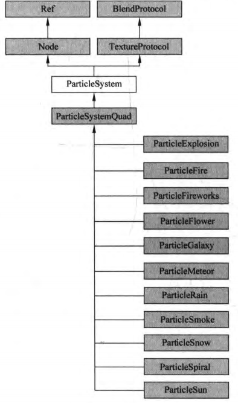

##### 2. 基本概念

- 粒子发射模式

  - 重力模式：相对中心点做远离/接近
  - 半径模式：绕中心段旋转

- **粒子系统属性：`cc.粒子类:create():set属性(参数)`

  > var表示偏差，即随机上下浮动的修正值
  >
  > 实际值 = 原始值startRadius ± 浮动值startRadiusVar

  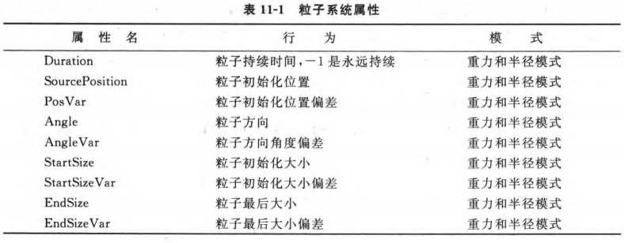

  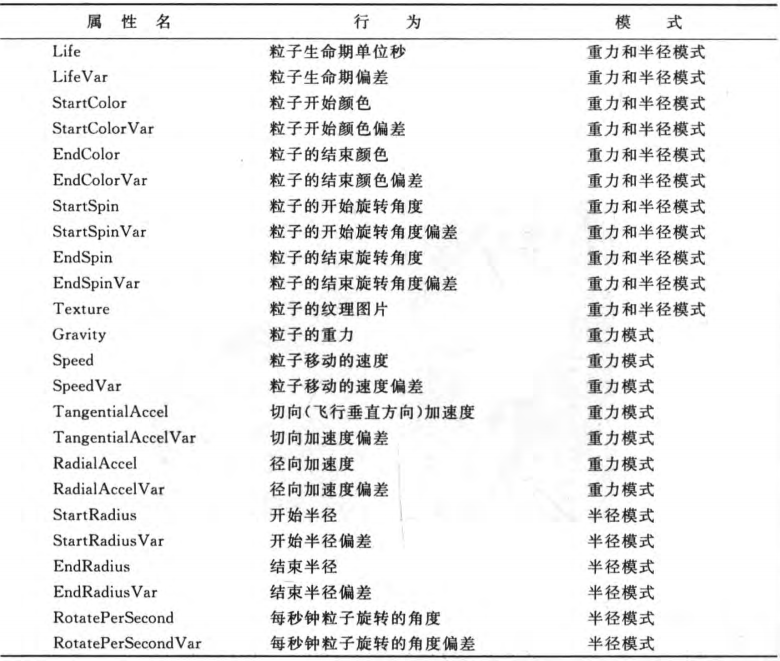

##### 3. **内置粒子系统

- 类别

  > 名称都是 **ParticleXXX**

  - 重力模式
    - 火焰：Fire
    - 烟花：Fireworks
    - 花粒子：Flower
    - 流星：Meteor
    - 雪：Snow
    - 烟：Smoke
    - 太阳：Sun
    - 雨：Rain

  - 半径模式
    - 爆炸：Explosion
    - 星系：Galaxy
    - 旋涡：Spiral

- **常用方法

  - 创建：`local particle = cc.ParticleXXX:create()`
  - 设置属性：`particle:set属性(参数)`


##### 4. 自定义粒子系统

> 通过创建ParticleSystemQuad对象，实现各种粒子效果


### 瓦片地图

##### 1. 地图性能问题

- 小纹理图片重复贴图

  ```lua
  --贴图的纹理图片宽高必须是2的n次幂，128x128
  local bg = cc.Sprite:create("图片.png", cc.rect(0, 0, size.width, size.height))
  --贴图的纹理参数，水平重复平铺，垂直重复平铺
  bg:getTexture():setTexParameters(gl.LINEAR, gl.LINEAR, gl.REPEAT, gl.REPEAT)
  bg:setPosition(cc.p(size.width / 2, size.height / 2))
  layer:addChild(bg, 0)
  ```

- Texture2D问题：只能重复、有规律

##### 2. **瓦片地图API访问类

- 瓦片地图类TMXTiledMap
  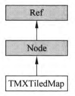

  - **创建瓦片地图：`local map = cc.TMXTiledMap:create("xxx.tmx")`

    > 使用 **tmx** 文件创建

  - 获得TMXLayer对象：`local bg = _tileMap:getLayer(name)`

  - **获得层中TMXObject对象组集合：`local group = _tileMap:getObjectGroup(name)`

    > 对象组中存放了许多对象信息

  - 获得地图尺寸：`getMapSize()`

    > 单位是瓦片
  
  - **获得瓦片尺寸：`local t_size = _tileMap:getTileSize()`
  
    > 单位是像素，通过 **.width** 和 **.height** 访问属性
  
- 地图层类TMXLayer
  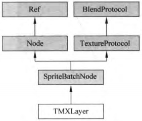

  - 获得层名称：`getLayerName()`
  - 获得层尺寸：`getLayerSize()`
  - 获得瓦片尺寸：`getMapTileSize()`
  - 通过瓦片坐标获得像素坐标：`getPositionAt(tileCoordinate)`
  - 通过瓦片坐标获得GID：`getTileGIDAt(tileCoordinate)`

- 对象组集合TMXObjectGroup
  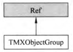

  - 获得属性值：`group:getProperty(name)`

  - **获得对象信息：`local spawnPoint = group:getObject(name)`

    > 

  - 获得对象属性：`group:getProperties()`

  - 获得所有对象：`group:getObjects()`

##### 3. **使用

- 直接通过tmx资源创建背景

  ```lua
  -- 瓦片地图
  local bg = cc.TMXTiledMap:create("red_bg.tmx")
  bg:setPosition(cc.p(size.width/2,size.height/2))
  bg:setAnchorPoint(cc.p(0.5,0.5))
  bg:setScaleX(size.width/bg:getContentSize().width)
  bg:setScaleY(size.height/bg:getContentSize().height)
  layer:addChild(bg)
  Normal:tip("瓦片地图载入完成")
  ```

- 


### **物理引擎

##### 1. 物理引擎API

##### 2. 使用方法


### **Cocos2dx GUI控件

> 都继承自Widget
>
> GUI控件都拥有相同的命名控件：**ccui**，表示Cocos Studio中使用的控件
>
> 创建：`ccui.控件:create()`
>
> 可监听事件类型：`ccui.XXXXEvenType.XXXX`

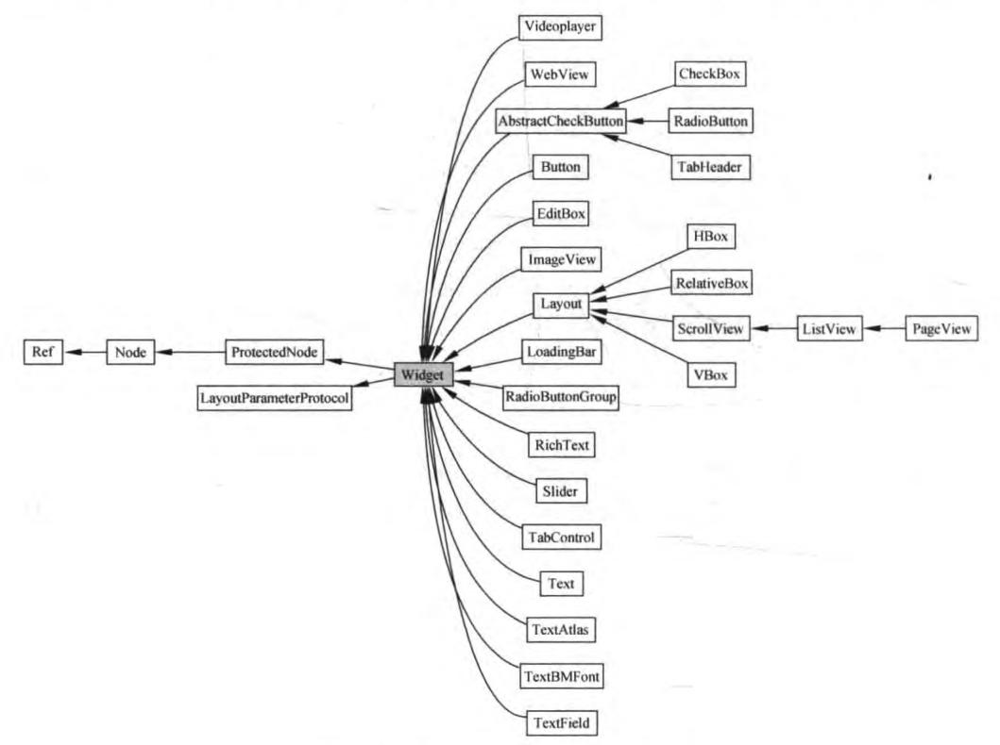

##### 1. **按钮Button

> 与菜单项类似，有正常、选中、不可用3种状态

- 创建：`local button = ccui.Button:create(正常状态.png, 选中状态.png,不可选状态.png)`

  - 可选参数：`textType = TextureResType::LOCAL`

    > LOCAL表示从纹理图片中加载，PLIST表示从Atlas图片集中加载

- 自定义事件处理函数：`local function Callback(sender, eventType)`

  > 与MenuItem的处理函数不同在于，可作为 **多种事件的处理函数** ，并 **接收事件类型**

  - eventType：此次事件的类型

    - 触碰：`ccui.TouchEventType.began`

    - 移动：`ccui.TouchEventType.moved`

    - 离开：`ccui.TouchEventType.ended`

      > 注意：只有离开屏幕点 **在Btn范围内** 才会触发！！！
      >
      > 相当于省去了判定触摸点位置的过程

- 添加事件监听处理函数：`button:addTouchEventListener(CloseCallback)`

  > 相当于使用MenuItem时的 `menu_Back:registerScriptTapHandler(Cb_Back)`

##### 2. ImageView

##### 3. 文本控件

##### 4. RadioButton

##### 5. **CheckBox

> 单个CheckBox可作为开关使用

- 创建：`local ckb = ccui.CheckBox:create(未选中.png, 选中.png)`
- 自定义事件处理函数：`local function onChangedCheckBox(sender, eventType)`
  - eventType：此次事件的类型
    - 选中：`ccui.CheckBoxEventType.selected`
    - 取消：`ccui.CheckBoxEventType.unselected`
- 添加处理函数：`ckb:addEventListener(onChangedCheckBox)`

##### 6. LoadingBar

##### 7. 滑块控件

------


# 性能优化

### 缓存

##### 1. 缓存种类

> 都是单例，使用 `cc.XXXXCache:getInstance()` 获取

- 纹理缓存 TextureCache

- 精灵帧缓存 SpriteFrameCache

  > 通过此方式加载的图片最后也会被存储到纹理缓存中

- 动画缓存 AnimationCache

- 着色器缓存 ShaderCache

##### 2. 场景与资源

> 不同场景使用时长不同，对缓存应该分别处理

##### 3. **使用方法

- 纹理缓存TextureCache

  - 获取实例：`local tc = cc.Director:getInstance():getTextureCache()`

  - 通过图片创建Texture2D图像：`local texture = tc:addImage("xxx.png")`

  - 创建精灵

    ```lua
    local sprite = cc.Sprite:create()			-- 空精灵
    sprite:setTexture(texture)					-- 设置纹理图片
    sprite:setTextureRect(cc.rect(o_x,o_y,w,h))	-- 裁剪范围
    sprite:setPosition(cc.p(x,y))
    layer:addChild(sprite)
    ```

- **精灵帧缓存SpriteFrameCache

  - **获取实例：`local sfc  = cc.SpriteFrameCache:getInstance()`

  - **载入列表文件：`sfc:addSpriteFrames("xxx.plist")`

    > 之后即可用 cc.Sprite:createWithSpriteFrameName("xxx.png")创建精灵了

  - **根据缓存帧创建精灵：`local sprite = sfc:getSpriteFrameByName(name) `

  - 清除

    - `sfc:removeSpriteFramesFromFile("xxx/plist")`

    - `sfc:removeSpriteFrameByName(name)`

    - `sfc:removeUnusedSpriteFrames()`

      > 会清除别的场景的精灵帧缓存

    - `sfc:removeSpriteFrames()`
  
      > 会清除所有精灵帧缓存

##### 4. **缓存的创建与清除时机

- 短周期缓存

  - 载入时机

    > 一般在场景的 **生命周期-enter** 事件处理中进行
    >
    > 不能在场景 **构造函数/init事件处理** 中进行，因为返回场景时不会调用

  - 清除时机

    > 一般在场景的 **生命周期-exit** 事件处理中进行

- 长周期缓存

  > 通常不考虑缓存清除

  - 贯穿整个游戏的长周期缓存

    > 一般在游戏初始界面的构造函数中进行创建

  - 关卡长周期缓存

    > 一般在对应关卡的构造函数中进行创建


### 图片与纹理优化

##### 1. 图片格式

> 移动平台推荐PNG格式，因为 **JPG加载到缓存后会被转化为PNG格式**

- PNG
  - 设计目的：替代GIF和TIFF
  - 无损压缩，可以有Alpha通道数据，文件较大
  - 支持透明
  - 不支持动画
- JPG
  - 与平台无关的格式
  - 支持高级别压缩，以牺牲质量换取更小的文件
  - 不支持透明
  - 适合 **颜色丰富的写实图片**

##### 2. 拼图

> 将小图拼成大图有利于减少IO操作

##### 3. 纹理像素格式

##### 4. **纹理缓存异步加载

> 避免一次加载过多资源造成卡顿

```lua
-- 创建层
function GameScene:createLayer()

    local layer = cc.Layer:create()

    -- 异步加载处理函数
    local function loadingCallBack(texture)
        -- 已加载图片数+1
        _numberOfLoadedSprites  = _numberOfLoadedSprites + 1
        -- 显示加载百分比
        local str = string.format("%d%%",(_numberOfLoadedSprites / _numberOfSprites)*100)
        _labelPercent:setString(str)

        _imageOffset = _imageOffset +1
        local i = _imageOffset * 60
        cclog("i,_imageOffset = %d,  %d",i,_imageOffset)

        -- 正式加载当前遍历到的图片
        local sprite = cc.Sprite:createWithTexture(texture)
        sprite:setAnchorPoint(cc.p(0,0))
        layer:addChild(sprite, -1)
        --math.floor取小于该数的最大整数
        local x =  math.floor(i % size.width)
        local y =  math.floor(i / size.width) * 60
        cclog("x,y = %d,  %d",x,y)
        sprite:setPosition(cc.p( x, y))

        if _numberOfLoadedSprites == _numberOfSprites then
            _numberOfLoadedSprites = 0
        end
    end

    -- 显示进度
    _labelLoading = cc.Label:createWithTTF("loading...", "fonts/Marker Felt.ttf", 35)
    _labelLoading:setPosition(cc.p(size.width / 2, size.height / 2 - 20))
    layer:addChild(_labelLoading)
    _labelPercent = cc.Label:createWithTTF("0%%", "fonts/Marker Felt.ttf", 35)
    _labelPercent:setPosition(cc.p(size.width / 2, size.height / 2 + 20))
    layer:addChild(_labelPercent)

    _numberOfLoadedSprites = 0      -- 已加载图片数
    _imageOffset = 0                -- 图片总数？
    
	-- 获取文件全路径文件
    local sharedFileUtils = cc.FileUtils:getInstance()
    local fullPathForFilename = sharedFileUtils:fullPathForFilename("ImageMetaData.plist")

    -- 从描述文件中读取图片基本信息
    local vec = sharedFileUtils:getValueVectorFromFile(fullPathForFilename)
    _numberOfSprites = table.getn(vec)
    cclog(_numberOfSprites)

    -- 根据图片基本信息，逐个加载图片
    for i=1, table.getn(vec) do
        local row = vec[i]  -- 获取当前正在读入的图片信息
        local filename = "icons/" .. row["filename"]
        cc.Director:getInstance()
            :getTextureCache():addImageAsync(filename, loadingCallBack)
    end
    
    return layer
    
end
```

- 获取图片信息

  - 获取FileUtils实例：`local FileUtils = cc.FileUtils:getInstance()`
  - 获取信息文件路径：`local path =  FileUtils:fullPathForFilename("xxx.plist")` 
  - 读取图片信息：`local vec = FileUtils:getValueVectorFromFile(fullPathForFilename)`

- 纹理异步加载：`TextureCache:addImageAsync(filename, loadingCallBack)`

  - 图片名称 filename：xxx.png

  - 处理函数：addImageAsync会 **使用 filename调用处理函数**

    > 在处理函数中完成真正的加载

##### 5. 背景图片优化方法

- 舍去Alpha通道

  > 因为背景不需要透明度

- 拼图

- 加载到纹理缓存的时机

  > 作为短周期还是长周期？

- 小图重复贴图作为背景

  ```lua
  -- 贴图的纹理图片宽高必须是2的n次幂，128x128
  local bg = cc.Sprite:create("BackgroundTile.png", cc.rect(0, 0, size.width, size.height))
  -- 贴图的纹理参数，水平重复平铺，垂直重复平铺
  bg:getTexture():setTexParameters(gl.LINEAR, gl.LINEAR, gl.REPEAT, gl.REPEAT)
  bg:setPosition(cc.p(size.width / 2, size.height / 2))
  layer:addChild(bg, 0)
  ```

- 瓦片地图

  > 高效，但易造成背景重复
  >
  > 地图中的层 **不宜超过4层**

- 背景z深度的优化

  > 把背景中的不同部分放到不同层，改善视觉效果


### 声音优化

------


# 数据与网络


# 平台移植

### Android

##### 1. 准备工作

- Java
- Android SDK
- Android NDK
- Ant

##### 2. 问题

- NDK版本问题
  - [x] Android NDK: Found platform level in ./project.properties. Setting APP_PLATFORM to android-19.
    Android NDK: WARNING: APP_PLATFORM **android-19 is higher than android:minSdkVersion 9** in ./AndroidManifest.xml. NDK binaries will *not* be compatible with devices older than android-19.
    
    > 修改AndroidManifest.xml中的属性配置
    >
    > ```xml
    > <uses-sdk android:minSdkVersion="19"/>
    > ```
    
  - [x] C:/Cocos/Cocos2d-x/cocos2d-x-3.10/Android/android-ndk-r23c/build//../build/core/add-application.mk:178: *** Android NDK: APP_STL gnustl_static is no longer supported. Please switch to either c++_static or c++_shared.
  
    > 更换NDK版本：android-ndk-r23c --> android-ndk-r12b
  
- NDK文件丢失？ 
  
  - [ ] Android NDK: ERROR:C:\Cocos\Cocos2d-x/cocos2d-x-3.10/cocos//scripting/lua-bindings/proj.android/prebuilt-mk/Android.mk:cocos2d_lua_android_static: LOCAL_SRC_FILES points to a missing file
  - [ ] Android NDK: Check that C:/Cocos/Cocos2d-x/cocos2d-x-3.10/cocos//scripting/lua-bindings/proj.android/prebuilt-mk/..\..\..\..\..\prebuilt\android/arm64-v8a/libluacocos2dandroid.a **exists  or that its path is correct**
  - [ ] C:/Cocos/Cocos2d-x/cocos2d-x-3.10/Android/android-ndk-r12b/build//../build/core/prebuilt-library.mk:45: *** Android NDK: Aborting    .  Stop.
  
- 是


#### IOS

##### 1. 问题

- Argument value 10880 is outside the valid range[0,255]

  > cocos2d_libs\external\bullet\LinearMath\btVector3.h
  >
  > cocos2d_libs\external\bullet\LinearMath\btMatrix3x3.h


