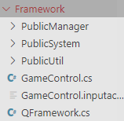

# 基础方法

### 程序

##### 输出

- 简单输出：`print(Object message)` 和 `Debug.Log(Object message)`

- 格式化输出：`Debug.LogFormat`

  > 与 `Console.WriteLine` 类似

##### 定时调用

```c#
// 只能调用无需参数的函数
Invoke("AttackEnd", f1.0);

public void AttackEnd()
{
    
}
```

##### **委托判存与发布

```c#
// 委托若存在，执行
委托?.Invoke()
```

##### 访问其他脚本成员

- 设置目标成员为静态成员

  > 适用于少量允许访问的对象

- 在目标脚本中设置静态访问实例

  > 适用于允许访问的对象较多时

  ```c#
  // 此脚本为需要在其他位置访问的脚本
  public class A: MonoBehaviour 
  {
  	public static A instance; // 提供给外部用于访问的静态实例
   
   	// 使用Awake()确保单例模式在使用前已被初始化
  	void Awake()
      {
  		instance = this;
  	}
   	
   	// 其他脚本通过 A.instance.成员 即可访问
   	public int name;
  
  }
  
  ```

  


### 组件

##### **获得组件

```c#
// 组件类 变量名称 = 游戏对象.GetComponent<组件类>()
Rigidbody rb = other.gameObject.GetComponent<Rigidbody>();
```

##### 获取对象

- 本体：`GameObject 任意组件.gameObject`
- 子对象
  - 

##### 颜色Color

- 创建：`Color color = new Color(float r, float g, float b, float a);`

------


### 位置

##### 获取位置

##### 坐标变换

- 镜头-->世界：`Vector3 position = Camera.main.ScreenToWorldPoint(Vector3 pos)`


### 数学工具 Mathf

##### 变量控制

- 防止越界：`float Mathf.Clamp(float x,float min,float max)`

  > 常用于防止数据越界
  >
  > x<min，返回min
  >
  > x>max，返回max
  >
  
- 步长趋近：`float Mathf.MoveTowards(float x,float y,float delta)`

  > 将x向y最大移动delta

##### 近似

- 是否近似相等：`Mathf.Approximately(float a,float b)`

------


# 检测

### 碰撞检测

##### 使用刚体、碰撞体

##### 射线检测

> 缺点：不能从对象身上发射，否则会先碰到本对象

- 射线命中信息：`RaycastHit2D hitInfo;`

  - 碰撞对象Collider：`collider`
  - 碰撞对象刚体：`rigidbody`

- 射线检测：`RaycastHit2D Raycast(Vector2 origin, Vector2 direction, float distance);`

- 使用示例

  ```c#
  // 通过射线检测判断玩家是否在地面上
  void GroundCheckRay()
  {
      // 不能从玩家身上发射，否则会先碰撞到玩家
      Debug.DrawRay(transform.position+new Vector3(0,-0.505f,0),new Vector2(0,-0.2f),Color.cyan);
      hitInfo = Physics2D.Raycast(transform.position+new Vector3(0,-0.505f,0),new Vector2(0,-1),0.1f);
      if(hitInfo)
      {
          // print(hitInfo.collider.name);
          if(hitInfo.collider.tag=="Ground" && isJump)
          {
              // print("落地");
              isJump = false;
          }
      }
  }
  ```

##### Physics图层检测

> 指定检测对象所在的Layer

- 相关方法

  - 获取图层：`LayerMask layerMask = LayerMask.GetMask(string layerName);`

  - 盒形检测：`Physics.OverlapBox`

    - 检测中心点：`Vector3 center`

      > 通常与主体position相关

    - Vector3 halfExtents

    - Quaternion orientation

    - 目标图层：`LayerMask layerMask`

    - QueryTriggerInteraction queryTriggerInteraction

  - `Physics.OverlapCapsule`

  - `Physics.OverlapSphere`

- 示例

  - 子弹检测

    ```c#
    public class Bullet : MonoBehaviour
    {
        LayerMask layerMask;
        
        void Start()
        {
            // 指定检测哪些Layer
            layerMask = LayerMask.GetMask("图层1","图层2");
        }
        
        void FixedUpdate()
        {
            // 获取碰撞对象
            var collider = Physics2D.OverlapBox(transform.position, transform.localScale, 0, layerMask);
            if(collider)
            {
                // 碰撞处理
            }
        }
    }
    ```

  - 地面检测

    ```c#
    LayerMask groundLM = LayerMask.GetMask("Ground");
    
    void GroundCheckLayer()
    {
    	if(Physics2D.OverlapBox(
            transform.position+colliderHeight*0.5f*Vector3.down,
            Vector3.one*0.02f,
            0,groundLM)
          )
        {
            if(isJump) print("落地");
            isJump = false;
        }
    }
    ```

    


------


# 角色控制

### 键盘控制移动

##### 获取输入

- 按键：`Input.GetKey(KeyCode.W)`
- 轴输入：`Input.GetAxisRaw("Horizontal")`

##### 使用 transform

```c#
float v = 1.0f;
float dt = Time.fixedDeltaTime;
// 键盘控制
public void MoveNormal()
{
    if (Input.GetKey(KeyCode.W)) transform.Translate(Vector3.forward * dt * v);
    else if (Input.GetKey(KeyCode.S)) transform.Translate(Vector3.back * dt * v);
    else if (Input.GetKey(KeyCode.A)) transform.Translate(Vector3.left * dt * v);
    else if (Input.GetKey(KeyCode.D)) transform.Translate(Vector3.right * dt * v);
    if (Input.GetKey(KeyCode.Q)) transform.Rotate(Vector3.down);
    else if (Input.GetKey(KeyCode.E)) transform.Rotate(Vector3.up);
}

// 运动倾斜
public void MoveSmooth()
{
    vertical = Input.GetAxis("Vertical");
    horizontal = Input.GetAxis("Horizontal");
    transform.Translate(new Vector3(horizontal*dt*v,0,vertical*dt*v));
    transform.Rotate(Vector3.up * Input.GetAxis("Mouse X")*v*5);
    // 倾斜（只倾斜模型）
    transform.GetChild(0).localEulerAngles = new Vector3(vertical * 20, 0, -horizontal * 20);
}
```

##### 刚体速度设置

- 设置速度

  ```c#
  void MoveStandard()
  {
      // 跳跃
      if (Input.GetKey(KeyCode.Space)&&!isJump)    
      {
          rb.velocity = new Vector2(rb.velocity.x, jumpVelocity);
          // print("跳跃！");
          isJump = true;
      }
  	// 水平移动
      float curDir = Input.GetAxisRaw("Horizontal");
      if(dir+curDir==0)
      {
          dir = (int)curDir;
      }
      rb.velocity = new Vector2(curDir * vScale, rb.velocity.y);
  }
  ```

- 平滑移动

  ```c#
  void MoveSmooth()
  {
      // 水平移动
      float curDir = Input.GetAxisRaw("Horizontal");
      if(curDir!=0)
      {
          float vx = Mathf.Clamp(rb.velocity.x+curDir*accDelta,-vScale,vScale);
          rb.velocity = new Vector2(vx, rb.velocity.y);
      }
      else if(curDir==0)
      {
          // 减速
          print("减速中");
          rb.velocity = new Vector2(Mathf.MoveTowards(rb.velocity.x,0,decDelta), rb.velocity.y);
      }
      dir = (int)curDir;
  }
  ```

  


### 鼠标控制移动

##### 锁定鼠标运动

> 将鼠标锁定在屏幕中央，并隐藏

```c#
private void MouseLock(bool choice)
{
    if(choice)
    {
        Cursor.lockState = CursorLockMode.Locked;
        Cursor.visible = false;
    }
    else
    {
        Cursor.lockState = CursorLockMode.None;
        Cursor.visible = true;
    }
}
```

##### 点击移动

> 需要先进行 **导航地形处理**

```c#
Ray mouseRay;			// 射线变量
RaycastHit hitInfo;		// 存储射线检测信息
NavMeshAgent agent = GetComponent<NavMeshAgent>();

private void MouseClickRayDetect(Ray ray)
{
    if (Physics.Raycast(ray, out hitInfo))
    {
        print("鼠标点击到了：" + hitInfo.point);
    }
}
private void MouseClick()
{
    if(Input.GetMouseButtonDown(1))
    {
        // 创建射线
        mouseRay = Camera.main.ScreenPointToRay(Input.mousePosition);
        // 探测
        MouseClickRayDetect(mouseRay);
        // 绘制
    	Debug.DrawRay(mouseRay.origin, mouseRay.direction*20, Color.cyan);
    	// 移动
    	agent.SetDestination(hitInfo.point);
    }
}
```


### 角色位移状态

##### 跳跃

```c#
bool isJump = false;
void PlayerJump()
{
    if(isJump)		// 防止连续跳跃
    {
        Debug.LogError("正在跳跃，无法再次跳跃");
        return;
    }
    rb.velocity = new Vector2(rb.velocity.x, jumpVelocity);
    StartCoroutine("setJump");
}
// 为防止跳跃起始时离地面过近导致地面检测判断为落地，在跳跃之后再设置为跳跃状态
IEnumerator setJump()
{
    yield return new WaitForEndOfFrame();
    isJump = true;
    Debug.Log("正在跳跃");
}
```


### InputSystem

##### 移动处理

> 要考虑手柄的平滑取值

```c#
public void OnMove(InputAction.CallbackContext context)
{
    // 构造Event并发送
    if(context.performed)
    {
        // Move的ActionType是Value
        Vector2 input = context.ReadValue<Vector2>();
        // 不同设备输入处理
        switch(curDeviceId)
        {
            case MyInputDevice.Keyboard:
                moveDir.x = input.x;
                moveDir.y = input.y;
                break;
            case MyInputDevice.Gamepad:
                moveDir.x = Math.Abs(input.x)>sensitive?input.x:0f;
                moveDir.y = Math.Abs(input.y)>sensitive ? input.y : 0f;
                break;
        }
        this.SendEvent(moveDir);
        Debug.Log(input);
    }
    else if(context.canceled)
    {
        switch(curDeviceId)
        {
            /*  
                键盘需要进行多方向键处理
                    当同时按下多个方向键时，松开其中一个就会触发context.canceled
                    但是此时可能别的方向键仍然被按压
                    需要判断是否还有按下的按键
                例如：松开A，若仍然按着D，则直接向右而不是停下
            */
            case MyInputDevice.Keyboard:
                var keyboard = Keyboard.current;
                switch(moveDir.x)
                {
                    case -1:
                        moveDir.x = keyboard.dKey.wasPressedThisFrame || keyboard.rightArrowKey.wasPressedThisFrame ? 1 : 0;
                        break;
                    case 1:
                        moveDir.x = keyboard.aKey.wasPressedThisFrame || keyboard.leftArrowKey.wasPressedThisFrame ? -1 : 0;
                        break;
                }
                switch(moveDir.y)
                {
                    case -1:
                        moveDir.y = keyboard.wKey.wasPressedThisFrame || keyboard.upArrowKey.wasPressedThisFrame ? 1 : 0;
                        break;
                    case 1:
                        moveDir.y = keyboard.sKey.wasPressedThisFrame || keyboard.downArrowKey.wasPressedThisFrame ? -1 : 0;
                        break;
                }
                break;
            default:
                moveDir.x = 0;
                moveDir.y = 0;
                break;
        }
        this.SendEvent(moveDir);
    }

}
```


------


# 多媒体管理

### 音频管理

##### 意义

- 便于统一管理
- 防止音频播放混乱
- 防止因对象销毁而音频播放不完全

------


# 自定义框架

> `namespace ProjectUtil`




### 动态系统 Public System

##### 基本系统 BaseSystem

```c#
using System;
using System.Collections;
using System.Collections.Generic;
using UnityEngine;
using UnityEngine.UI;
using QFPlatformShooting;


namespace ProjectUtil
{
    /*
        项目基础系统
            通常为 [单例] ，因此各个System一般没有继承的情况
            有些功能不针对某特定对象，但是又需要MonoBehaviour的特性（例如启动协程、每帧更新）
            因此可以创建System游戏对象来执行这些程序
            在某些框架下（例如QFramework），不必创建对应的游戏对象即可运行
            
        BaseSystem为基本管理对象的脚本
        可将各种子System挂载到此模块的GameObject下，防止场景切换导致销毁
        需要Update的Manager可以将其更新方法注册到此脚本中的 Updates 上

        注意：需要调整执行顺序 Execution Order
    */
    
    public class BaseSystem : MonoBehaviour
    {
        public static BaseSystem instance;
        // public static BaseSystem Instance
        // {
        //     get
        //     {
        //         if(instance==null)
        //         {
        //             // 如果没初始化过，根据脚本名称创建游戏对象
        //             var o = new GameObject(typeof(BaseSystem).Name);
        //             instance = o.AddComponent<BaseSystem>();
        //             GameObject.DontDestroyOnLoad(o);
        //         }
        //         return instance;
        //     }
        // }
        
        public Action Updates;              // 需要执行的Update方法（常用于更新System的状态）
        public MusicManager musicManager;

        private void Awake() {
            Debug.Log("BaseSystem: Awake");
            if(!instance)
            {
                instance = this;
                GameObject.DontDestroyOnLoad(gameObject);
            }
            else{
                Destroy(gameObject);
                return;
            }
            gameObject.name = "BaseSystem";

            InitSystem<ResourceLoadSystem>();
            InitSystem<ResourceSystem>();
        }

        // 初始化目标子系统
        public void InitSystem<T>() where T : MonoBehaviour
        {
            string systemName = typeof(T).Name;
            if(GameObject.Find(systemName)) return;
            GameObject system = new GameObject(typeof(T).Name);
            system.transform.SetParent(transform);
            system.AddComponent<T>();
        }


        void Start() {
            Debug.Log("BaseSystem: Start");
            // musicManager = new MusicManager(gameObject,null,null);
            // musicManager.PlayBgm("英雄の証");
            // Updates += musicManager.Update;

        }


        void Update()
        {
            transform.position = Camera.main.transform.position;
            Updates?.Invoke();
        }

    }
}
```

##### 资源加载系统 ResourceLoadSystem

```c#
using System;
using System.Collections;
using System.Collections.Generic;
using System.Linq;
using System.Threading.Tasks;
using UnityEngine;
using QFramework;
using QFPlatformShooting;

namespace ProjectUtil
{
    /*
        资源加载System
            由于非MonoBehaviour无法启动协程，因此异步加载必须要由此对象实现
            只保存静态、动态加载方法，不负责保存家加载结果
            使用时，请传入资源在 Resources/ 下的完整路径
                例如：Prefab/Bullet

    */
    public interface IResourceLoadSystem
    {
        // 静态加载
        public T SyncLoad<T>(string name) where T :UnityEngine.Object;
        // 动态加载（传入回调函数作为请求的回调函数）
        public void AsyncLoadCb<T>(string name,Action<AsyncOperation> cb) where T :UnityEngine.Object;

        // 动态加载（协程）
        // 必须传入接收加载结果的变量，可以选择性传入回调函数来处理加载结果
        public void AsyncLoadCor<T>(string name,ref T result,Action<T> cb=null) where T :UnityEngine.Object;

    }


    public class ResourceLoadSystem : MonoBehaviour , IResourceLoadSystem
    {
        public static ResourceLoadSystem instance;
        UnityEngine.Object result;


        private void Awake() {
            Debug.Log("ResourceLoadSystem: Awake");
            instance = this;
        }


        // 静态加载
        public T SyncLoad<T>(string name) where T :UnityEngine.Object
        {
            Debug.Log("静态加载 目标："+name);
            T ret = Resources.Load<T>(name);
            return ret;
        }


        // 动态加载（回调函数）
        public void AsyncLoadCb<T>(string name,Action<AsyncOperation> cb) where T :UnityEngine.Object
        {
            Debug.Log("动态加载(回调) 目标："+name);
            ResourceRequest request = Resources.LoadAsync<T>(name);
            request.completed += cb;
        }


        // 动态加载（协程）
        // 必须传入接收加载结果的变量，可以选择性传入回调函数来处理加载结果
        public void AsyncLoadCor<T>(string name,ref T result,Action<T> cb=null) where T :UnityEngine.Object
        {
            Debug.Log("动态加载(协程) 目标："+name);
            StartCoroutine(Load<T>(name,result,cb));
        }
        IEnumerator Load<T>(string name,T result,Action<T> cb=null) where T :UnityEngine.Object
        {
            // 创建请求
            ResourceRequest request = Resources.LoadAsync<UnityEngine.Object>(name);
            yield return request;
            if(request.isDone && request.asset!=null)
            {
                result = request.asset as T;
                Debug.Log("加载成功");
            }
            else Debug.Log("加载失败");
            // 调用回调处理加载结果
            cb?.Invoke(result);
        }

    }
}
```

##### 资源管理系统 ResourceSystem

```c#
using System;
using System.Collections;
using System.Collections.Generic;
using System.Linq;
using System.Threading.Tasks;
using UnityEngine;


namespace ProjectUtil
{
    /*
        资源系统
            保存当前项目使用的通用资源管理类的系统
            通过不同类型的ResourceManager，存储本项目所需的所有资源
            例如：图片、音乐、预制体等
    */
    public interface IResourceSystem
    {
        public void InitResourceManager();
    }

    public class ResourceSystem : MonoBehaviour , IResourceSystem
    {
        public static ResourceSystem instance;
        // public static ResourceSystem Instance
        // {
        //     get {
        //         if(instance==null)
        //         {
        //             // 如果没初始化过，根据脚本名称创建游戏对象
        //             string name = typeof(ResourceSystem).Name;
        //             var o = GameObject.Find(name);
        //             if(o==null)
        //             {
        //                 new GameObject(name);
        //                 o.transform.parent = BaseSystem.instance.gameObject.transform;
        //                 instance = o.AddComponent<ResourceSystem>();
        //             }
        //             else
        //                 instance = o.GetComponent<ResourceSystem>(); 
        //         }
        //         return instance;
        //     }
        // }

        // 本项目所使用的资源类型与对应的Manager
        public ResourceManager<Sprite> spriteManager;
        public ResourceManager<AudioClip> musicManager;
        public ResourceManager<GameObject> prefabManager;


        private void Awake() {
            instance = this;
            InitResourceManager();
            Debug.Log("ResourceSystem: Awake");
        }


        public void InitResourceManager()
        {
            spriteManager = new ResourceManager<Sprite>(null);
            musicManager = new ResourceManager<AudioClip>(null);
            prefabManager = new ResourceManager<GameObject>(null);
        }
    }

}
```

##### 测试系统 TestSystem

```c#
using System;
using System.Collections;
using System.Collections.Generic;
using UnityEngine;
using UnityEngine.UI;
using QFPlatformShooting;

namespace ProjectUtil
{
    /*
        测试管理
            创建测试Manager对象并测试相关方法
    */

    public class TestSystem : MonoBehaviour
    {
        public static TestSystem instance;

        GameObject testObject;
        Component testComponent;

        void Awake() {
            Debug.Log("TestManager: Awake");
            instance = this;
        }

        void Start() {
            Debug.Log("TestManager: Start");
            // GameObject ob = new GameObject("dsh");
            // print(ob.name);
            // ChangeObjectName(ob,"htm");
            // print(ob.name);

            // TestRecycle();

            // CreateTestObject();
        }

        void Update() {
            
        }

        
        // 更改传入对象的名称
        void ChangeObjectName(GameObject ob,string name) 
        {
            var other = ob;
            other.name = "htm";
        }

        // 测试回收与引用类型的特性
        void TestRecycle()
        {
            TestManager<GameObject> test = new TestManager<GameObject>(gameObject);
            test.printList();
            for(int i=test.objectList.Count-1;i>-1;i--)
            {
                GameObject ob = test.objectList[i];
                if(ob.name=="zdd") ob.name="张大地";
                else if(ob.name=="cwf") test.Remove(ob);
            }
                
            test.printList();
        }


        // 测试：脚本控制为别的游戏对象添加子对象，并在之后销毁
        public void CreateTestObject()
        {
            GameObject parent = GameObject.Find("Player");
            testObject = new GameObject("testObject");
            testObject.transform.parent = parent.transform;
            testObject.AddComponent<Rigidbody2D>();
            for(int i=0;i<3;i++) new GameObject("sameNameObject").transform.parent = parent.transform;
        }
        public void DestroyTestObject()
        {
            Debug.Log("摧毁测试对象");
            // if(testObject) Destroy(testObject);
            testObject.transform.SetParent(null);
            Destroy(GameObject.Find("sameNameObject"));
        }

        
    }
}
```

##### 计时系统 TimerSystem

```c#
using System;
using System.Collections;
using System.Collections.Generic;
using UnityEngine;
using UnityEngine.UI;


namespace ProjectUtil
{
    /*
        计时器系统
            持有一个计时器Manager用于存储计时器
            自动更新计时器
    */

    public class TimerSystem : MonoBehaviour
    {
        public static TimerSystem instance;
        public TimerManager timerManager;
        
        private void Awake() {
            instance = this;
            timerManager = new TimerManager();
        }


        private void Update() {
            timerManager.UpdateAllTimer();
        }
    }

}
```


### 工具类 PublicUtil

##### 渐变数据工具 FadeUtil

```c#
using System;
using System.Collections;
using System.Collections.Generic;
using System.Linq;
using System.Threading.Tasks;
using UnityEngine;


namespace ProjectUtil
{
    /*
        渐变工具
            执行Update时，会使渐变值在指定范围内渐变
    */
    public enum FadeSate
    {
        Stop,       // 停止
        In,         // 渐入（渐变变量增加）
        Out         // 渐出
    }

    public interface IFadeUtil
    {
        // 设置渐变范围
        public void SetRange(float min,float max);
        // 设置渐变状态（淡入/淡出）
        public void SetState(FadeSate state,bool init=false,Action cb=null);
        // 更新渐变值（根据当前渐变状态）
        public float Update();
    }
    

    public class FadeUtil
    {
        float curValue;                         // 当前值
        public float CurValue => curValue;
        float step;                             // 渐变步长
        public float Step
        {
            get {return step;}
            set {step=value;}
        }
        float min;                              // 最小值
        public float Min
        {
            get {return min;}
            set {min=value;}
        }
        float max;                              // 最大值
        public float Max
        {
            get {return max;}
            set {max=value;}
        }
        FadeSate state;                         // 当前工作状态
        public FadeSate State => state;
        Action callBack;                        // 结束回调

        public FadeUtil(float min,float max,float step=0.1f)
        {
            this.min = min;
            this.max = max;
            this.step = step;
            state = FadeSate.Stop;
            Debug.Log("FadeUtil构造完毕");
        }

        // 设置渐变范围（最大最小值）
        public void SetRange(float min,float max)
        {
            this.min = min;
            this.max = max;
        }

        // 设置渐变状态（可以选择是否重置当前值）
        public void SetState(FadeSate state,bool init=false,Action cb=null)
        {
            Console.WriteLine(state);
            this.state = state;
            if(cb!=null) callBack = cb;
            switch(state)
            {
                case FadeSate.Stop:
                    break;
                case FadeSate.In:
                    if(init) curValue = min;
                    break;
                case FadeSate.Out:
                    if(init) curValue = max;
                    break;
            }
        }

        // 更新当前渐变值
        public float Update()
        {
            if(state==FadeSate.Stop) return curValue;
            switch(state)
            {
                case FadeSate.In:
                    if(curValue<max)
                    {
                        Debug.Log(string.Format("渐入，{0} -> {1}",curValue,max));
                        curValue = Mathf.MoveTowards(curValue,max,Time.deltaTime);
                    }
                    else
                    {
                        Debug.Log("渐入结束");
                        curValue = max;
                        callBack?.Invoke();
                        SetState(FadeSate.Stop);
                    }
                    break;
                case FadeSate.Out:
                    if(curValue>min)
                    {
                        Debug.Log(string.Format("渐入，{0} -> {1}",curValue,min));
                        curValue = Mathf.MoveTowards(curValue,min,step);
                    }
                    else
                    {
                        Debug.Log("渐出结束");
                        curValue = min;
                        callBack?.Invoke();
                        SetState(FadeSate.Stop);
                    }
                    break;
            }
            return curValue;
        }


    }
}
```

##### 计时器工具 TimerUtil

```c#
using System;
using System.Collections;
using System.Collections.Generic;
using System.Linq;
using System.Threading.Tasks;
using UnityEngine;


namespace ProjectUtil
{
    /*
        计时器工具类
            
    */
    public interface ITimerUtil
    {
        public void Start(float delayTime, Action<TimerUtil> onFinished, bool isLoop);
        public bool IsFinished {get;}
        public void UpdateTimer();
        public void Stop();
    }


    public class TimerUtil : ITimerUtil
    {
        float finishTime;               // 结束时间
        float delayTime;                // 计时时间
        bool isFinished;                // 是否计时结束
        public bool IsFinished
        {
            get {return isFinished;}
        }
        public Action<TimerUtil> onFinished;              // 结束回调
        bool isLoop;                    // 是否是循环


        // 开始
        public void Start(float delayTime, Action<TimerUtil> onFinished, bool isLoop)
        {
            this.delayTime = delayTime;
            finishTime = Time.time+delayTime;
            this.onFinished = onFinished;
            this.isLoop = isLoop;
            isFinished = false;
        }

        public void Stop()
        {
            isFinished = true;
        }

        public void UpdateTimer()
        {
            // Time.time会自动增长，其实这里的Update只需判断是否到时间
            if(isFinished) return;
            if(Time.time<finishTime) return;
            else    // 时间到，判断是否循环
            {
                onFinished?.Invoke(this);
                if(isLoop) finishTime += delayTime;
                else
                {
                    onFinished = null;
                    Stop();
                } 
            }
        }
    
    }
}
```

##### 单例 SingleMono

> 有Bug

```c#
 using System;
using System.Collections;
using System.Collections.Generic;
using System.Linq;
using System.Threading.Tasks;
using UnityEngine;


namespace ProjectUtil
{
    /*
        单例类模板
            部分游戏对象可能需要在整个过程中都保持单例状态
            将类名称通过泛型传递
        
        例如：
            定义一个用于执行System的Update的工具类
            public class SystemObjectCtrl : SingleMono<SystemObjectCtrl> , IController
    */
    public interface ISingleMono<T> where T:MonoBehaviour
    {
        public static T Instance {get;}
    }
    

    public abstract class SingleMono<T> : MonoBehaviour where T:MonoBehaviour
    {
        protected static T instance;
        public static T Instance
        {
            get 
            {
                if(instance==null)
                {
                    // 如果没初始化过，根据脚本名称创建游戏对象
                    var o = new GameObject(typeof(T).Name);
                    instance = o.AddComponent<T>();
                    GameObject.DontDestroyOnLoad(o);
                }
                return instance;
            }
        }

    }

}
```


### 静态管理模型 Public Manager

##### 管理类模板 Manager

```c#
using System;
using System.Collections;
using System.Collections.Generic;
using System.Linq;
using System.Threading.Tasks;
using UnityEngine;


namespace ProjectUtil
{
    /*
        通用Manager基类
            Manager相当于与拥有特定功能的工具类，一般用于 [存储各种对象] 
            不直接控制游戏对象，即不直接作为游戏脚本挂载，因此不继承Monobehaviour
            但是部分功能必须依赖Monobehaviour的特性
            因此可能需要在对应的System中创建Manager对象来使用预定义的功能
            有些系统也在特定情况下也需要对应的System执行操作
            使用时，请先 [创建Manager对象]

        注：
            由于一般被System使用，而System有可能不在切换场景时摧毁
            因此Manager最好提供Clear方法
            
        例如：
            MusicSystem 创建 BehaviourManager 来管理AudioSource组件
                        创建 ResourceManager 来管理需要播放的音乐资源
            资源管理ResourceManager 需要 ResourceLoadSystem 来执行加载资源的具体操作
    */

    public abstract class Manager<T>
    {
        protected string[] relativeSystems;             // 本Manager工作所需要的System支持
        protected GameObject userObject;                // 使用本Manager的游戏对象

        public Manager(GameObject gameObject)
        {
            this.userObject = gameObject;
            initRelativeSystems();
            CheckSystem();
        }

        protected abstract void initRelativeSystems();

        // 检查是否缺少所需的System
        protected bool CheckSystem()
        {
            if(relativeSystems==null) return true;
            // 记录缺少的System
            List<string> error = new List<string>();
            for(int i=0;i<relativeSystems.Length;i++)
                if(GameObject.Find(relativeSystems[i])==null) error.Add(relativeSystems[i]);

            if(error.Count>0)
            {
                string str= string.Join(",", (string[])error.ToArray());
                Debug.Log("缺少System："+str);
                return false;
            }
            return true;
        }

        public abstract void Clear();
    }
}
```

##### 资源管理类 ResourceManager

```c#
using System;
using System.Collections;
using System.Collections.Generic;
using System.Linq;
using System.Threading.Tasks;
using UnityEngine;
using QFramework;
using QFPlatformShooting;

namespace ProjectUtil
{
    /*
        资源管理系统
            负责用字典 [存储] 项目加载的资源，具体的 [加载] 由 [ResourceLoadManager] 实现
            支持：Sprite、AudioClip等
            存储结构：[资源名称]--[资源]        （资源名称都是Resources/下的完整路径，以避免同名文件）
            不存在的资源会自动加载
            可以跟存储对象的类型创建不同的存储对象

        注：
            只负责存储未使用的资源，正在使用的资源请在使用处管理
            传入的目标资源名称需要是 Resources/ 下的完整路径

        示例：
            管理加载的各种图片：
                ResourceManageSystem<Sprite> spriteManager = new ResourceManageSystem(gameObject);
            管理加载的音乐资源：
                clipManager = new ResourceManageSystem<AudioClip>(gameObject);
    */
    public interface IResourceManager<T> where T :UnityEngine.Object
    {
        // 获取一个对应类型的资源
        public T Get(string name);
        // 获取一个对应类型的资源（用参数直接接收结果）
        public void Get(string name,out T ret);
        // 获取一个对应类型的资源（用回调函数处理）
        public void Get(string name,Action<T> callBack);
    }


    public class ResourceManager<T> : Manager<T>,IResourceManager<T> where T :UnityEngine.Object 
    {

        // 存储加载过的资源
        protected Dictionary<string,T> resource;
        // 默认资源路径（实际路径为 "Resources/" + dir + name
        string defaultDir;  
        public string DefaultDir
        {
            get {return defaultDir;}
            set {defaultDir=value;}
        }


        public ResourceManager(GameObject root) : base(root)
        {
            resource = new Dictionary<string,T>();
        }
        protected override void initRelativeSystems()
        {
            relativeSystems = new string[]{"ResourceLoadSystem"};
        }


        // 清空当前存储的资源
        public override void Clear()
        {
            resource.Clear();
        }


        public T Get(string name)
        {
            T ret;
            if(resource.TryGetValue(name,out ret)) return ret;
            ret = ResourceLoadSystem.instance.SyncLoad<T>(name);
            resource.Add(name,ret);
            return ret;
        }


        // 取出对象（引用型加载结果/回调函数）
        public void Get(string name,out T ret) 
        {
            if(resource.TryGetValue(name,out ret)) return;

            ResourceLoadSystem.instance.AsyncLoadCor<T>(name,ref ret,ob=>{
                resource.Add(name,ob);
            });
        }


        public void Get(string name,Action<T> callBack) 
        {
            T ret;
            // 若当前资源库中 有目标对象，取出、执行回调，返回
            if(resource.TryGetValue(name,out ret))
            {
                callBack(ret);
                return;
            }

            // 当前库中没有目标资源，加载目标资源
            Debug.Log("当前资源库中不存在资源："+name+"，正在加载");
            callBack += ob=>{
                resource.TryAdd(name,ob);
            };
            ResourceLoadSystem.instance.AsyncLoadCor<T>(name,ref ret,callBack);
        }

    }
}
```

##### 预制体管理类 RepPrefabManager

```c#
using System;
using System.Collections;
using System.Collections.Generic;
using System.Linq;
using System.Threading.Tasks;
using UnityEngine;


namespace ProjectUtil
{
    /*
        动态游戏对象管理 Repetitive Prefab Object Manager
            专门负责管理游戏中需要重复创建且大量出现的游戏对象（例如子弹）
            这些游戏对象通常根据有限的Prefab资源创建
            支持 [同时管理多个Prefab和其复制体]
        
        注：
            请传入完整路径，[支持] 对 [不同路径下的同名] Prefab的管理
            因为 prefabDir 中保存了同名Prefab的所有可能路径
    */

    public interface IRepPrefabObjManager
    {
        // 添加使用的预制体名称与其对应的路径
        public void AddPrefab(string dir, string name);
        // 根据名称获取一个预制体（请传入完整路径）
        public GameObject Get(string dir, string name,Transform parent=null);
        // 回收预制体(因为预制体本身就可以挂载脚本，因此不提供自动回收方法)
        public void Recycle(GameObject ob,Action<GameObject> callback=null);
        // 同时设置所有已激活的复制对象
        public void SetAllActiveObject(string dir, string name,Action<GameObject> setCb);

    }


    public class RepPrefabObjManager : Manager<GameObject>, IRepPrefabObjManager
    {
        // 复制体挂载的目标父对象
        GameObject parentTarget;
        public GameObject ParentTarget
        {
            get {return parentTarget;}
            set {parentTarget = value;}
        }
        // 保存Prefab名称、路径信息和Prefab资源
        ResourceManager<GameObject> prefabs;                    // 加载的各个路径与对应的Prefab资源
        Dictionary<string,List<string>> prefabDir;              // 不同名称Prefab的路径                    key是Prefab名称，value是该Prefab的不同路径
        // 保存创建的复制体（名称都是预制体的路径+名称）
        Dictionary<string,List<GameObject>> obActived;          // 各个Prefab与其已激活的各的复制体         key是Prefab路径+名称
        Dictionary<string,Queue<GameObject>> obUnactived;       // 各个Prefab与其未激活的各的复制体         key是Prefab路径+名称


        public RepPrefabObjManager(GameObject gameObject) : base(gameObject)
        {
            parentTarget = gameObject;
            prefabs = ResourceSystem.instance.prefabManager;
            prefabDir = new Dictionary<string, List<string>>();
            obActived = new Dictionary<string, List<GameObject>>();
            obUnactived = new Dictionary<string, Queue<GameObject>>();
        }
        protected override void initRelativeSystems()
        {
            relativeSystems = new string[]{"ResourceLoadSystem"};
        }


        // 添加可能需要的Prefab
        public void AddPrefab(string dir, string name)
        {
            if(!prefabDir.ContainsKey(name))     // 如果Prefab不存在，加载、保存路径信息
            {
                prefabDir.Add(name,new List<string>(new string[]{dir}));
                prefabs.Get(dir+name,ob=>{
                    Debug.Log("已添加Prefab："+dir+name);
                });
                
            }
            else                                // 目标名称存在，判断目标路径是否存在
            {
                if(prefabDir[name].Contains(dir)) return;
                prefabDir[name].Add(dir);
                prefabs.Get(dir+name,ob=>{
                    Debug.Log("已添加Prefab："+dir+name);
                });
            }
            // 初始化激活/未激活列表
            string prefabName = dir+name;
            obActived.Add(prefabName,new List<GameObject>());
            obUnactived.Add(prefabName,new Queue<GameObject>());
        }


        // 获取目标类型Prefab的可用复制体
        public GameObject Get(string dir, string name,Transform parent=null)
        {
            AddPrefab(dir,name);                        // 保证Prefab本体存在

            GameObject ret;
            string prefabName = dir+name;

            if(obUnactived[prefabName].Count==0)        // 该Prefab不存在未激活的复制体
            {
                ret = GameObject.Instantiate(prefabs.Get(prefabName));
                ret.name = prefabName;
                Recycle(ret);
            }

            ret = obUnactived[prefabName].Dequeue();
            ret.transform.eulerAngles = new Vector3(0,0,0);
            if(parent) ret.transform.parent = parent;   // 也可以将复制体挂到别的对象身上
            else ret.transform.parent = parentTarget.transform;
            ret.SetActive(true);
            obActived[prefabName].Add(ret);

            return ret;
        }


        // 回收目标复制体（自动判断Prefab本体并回收到对应队列）
        public void Recycle(GameObject ob, Action<GameObject> callback=null)
        {
            string prefabName = ob.name;
            if(obActived[prefabName].Contains(ob)) obActived[prefabName].Remove(ob);
            ob.SetActive(false);
            obUnactived[prefabName].Enqueue(ob);
            callback?.Invoke(ob);
        }


        
        public void SetAllActiveObject(string dir, string name,Action<GameObject> setCb)
        {
            string prefabName = dir+name; 
            foreach(GameObject ob in obActived[prefabName]) setCb(ob);
        }

        public override void Clear()
        {
            prefabs.Clear();
            prefabDir.Clear();
            foreach(string name in obActived.Keys)
            {
                foreach(GameObject ob in obActived[name])
                {
                    GameObject.Destroy(ob);
                }
            }
            obActived.Clear();
            foreach(string name in obUnactived.Keys)
            {
                foreach(GameObject ob in obActived[name])
                {
                    GameObject.Destroy(ob);
                }
            }
            obUnactived.Clear();
        }
    }
}
```

##### 组件管理类 BehaviourManager

```c#
using System;
using System.Collections;
using System.Collections.Generic;
using System.Linq;
using System.Threading.Tasks;
using UnityEngine;


namespace ProjectUtil
{
    /*
        组件管理
            用字典存储可能会用到的多个组件
            由于主要用于静态存储，不需要帧更新，所以定义为普通类
            可以跟存储组件的类型创建不同的存储对象
        注：
            [只负责保存组件]
            常用于 [需要挂载很多组件的对象] ，组件无论是否激活都归此类管理
            得益于引用类型的特点，可直接传入需要操作的对象
            组件激活后 [自动挂载到 userObject]  （这是由于创建组件需要通过 AddComponent 方法）

        示例：某个游戏对象可能有多个音频组件AudioSource，创建本Manager进行管理
            BehaviourManager<AudioSource> audioSourceManager = new ComponentManager<AudioSource>(gameObject);
    */
    public interface IBehaviourManager<T> where T : Behaviour
    {
        public void Active(out T component);
        // public void Remove(out T component);
        public void Recycle(T component,Action<T> callback=null);
        public void RecycleAllAuto(Func<T,bool> judge,Action<T> callback=null);
        public void SetAllActiveComponent(Action<T> setCb);
    }


    public class BehaviourManager<T> : Manager<T>, IBehaviourManager<T> where T : Behaviour
    {
        protected List<T> cpActivated;            // 已激活的组件
        protected Queue<T> cpUnactivated;         // 未激活的组件


        public BehaviourManager(GameObject root) : base(root)
        {
            cpActivated = new List<T>();
            cpUnactivated = new Queue<T>();
        }
        protected override void initRelativeSystems()
        {
            relativeSystems = new string[]{};
        }


        // 激活：从未激活队列中取出，激活，加入激活列表，返回组件对象
        public void Active(out T component)
        {
            // 取出
            if(cpUnactivated.Count>0)
                component = cpUnactivated.Dequeue();
            else
            {
                if(userObject==null)
                {
                    Debug.Log("对应的系统对象不存在，无法激活新的组件");
                    component = null;
                    return;
                }
                component = userObject.AddComponent<T>();
            }
            // 激活
            component.enabled = true;
            cpActivated.Add(component);
        }


        // 回收：从激活列表中删除，加入未激活队列，可用回调处理回收的目标
        public void Recycle(T component,Action<T> callback=null)
        {
            component.enabled = false;
            cpActivated.Remove(component);
            cpUnactivated.Enqueue(component);
            callback?.Invoke(component);
        }
        public void RecycleAt(int index,Action<T> callback=null)
        {
            if(index>=cpActivated.Count || index<0) return;
            T component = cpActivated[index];
            component.enabled = false;
            cpActivated.Remove(component);
            cpUnactivated.Enqueue(component);
            callback?.Invoke(component);
        }


        // 自动回收：根据回收条件，回收当前激活列表中可回收的对象，可用回调处理回收的目标
        public void RecycleAllAuto(Func<T,bool> judge,Action<T> callback=null)
        {
            for(int i=cpActivated.Count-1;i>=0;i--)
                if(judge(cpActivated[i]))
                {
                    callback?.Invoke(cpActivated[i]);
                    RecycleAt(i,callback);
                }
        }


        // 对激活的组件进行统一操作
        public void SetAllActiveComponent(Action<T> setCb)
        {
            foreach(T component in cpActivated) setCb(component);
        }

        // 清空存储数据
        public override void Clear()
        {
            foreach(T cp in cpActivated) GameObject.Destroy(cp);
            cpActivated.Clear();
            foreach(T cp in cpUnactivated) GameObject.Destroy(cp);
            cpUnactivated.Clear();
        }
    }
}
```

##### 音乐管理类 MusicManager

```c#
using System;
using System.Collections.Generic;
using System.Linq;
using System.Threading.Tasks;
using UnityEngine;


namespace ProjectUtil
{
    /*
        声音管理工具
            挂载此脚本的对象可作为声音管理对象，负责播放音效、BGM
            声音分类：
                Bgm：持续播放，很少更改，单一播放
                音效：大量短音频资源，可能会重复播放、叠加播放
            因此：
                Bgm用一个组件控制
                音效用 ResourceManager + 继承BehaviourManager 控制
    */
    public interface IMusicManager
    {
        public float BgmVolume {get;set;}
        public float SoundVolume {get;set;}
        public ResourceManager<AudioClip> ClipManager {get;}

        // 播放Bgm：由于Bgm同一时间唯一，因此只提供播放方法即可
        public void PlayBgm(string name);
        public void StopBgm(bool isPause);
        // 播放音效：支持用回调控制目标音效所在的音频组件
        public void PlaySound(string name,Action<AudioSource> callback=null,GameObject target=null);
        public void StopSound(AudioSource sound);
    }


    public class MusicManager : BehaviourManager<AudioSource> , IMusicManager
    {
        // 资源目录
        string soundDir;                // Resources下音效所在目录
        string bgmDir;                  // Resources下bgm所在目录

        // 音量
        float bgmVolume;                // Bgm音量
        public float BgmVolume 
        {
            get {return bgmVolume;}
            set 
            {
                bgmVolume = value;
                fadeUtil.SetRange(0,bgmVolume);
            }
        }
        float soundVolume;              // 音效音量
        public float SoundVolume
        {
            get {return soundVolume;}
            set {soundVolume = value;}
        }

        AudioSource mBgm;               // 播放Bgm的组件
        AudioSource tempSource;
        FadeUtil fadeUtil;              // 实现淡入淡出效果的工具
        // 存储加载的声音资源 
        ResourceManager<AudioClip> clipManager;
        public ResourceManager<AudioClip> ClipManager
        {
            get {return clipManager;}
        }
        
                         
        
        
        public MusicManager(GameObject gameObject,string soundDir=null,string bgmDir = null) : base(gameObject)
        {
            soundDir = "Audio/Sound/";
            bgmDir = "Audio/BGM/";
            if(soundDir!=null) this.soundDir = soundDir;
            if(bgmDir!=null) this.bgmDir = bgmDir;
            
            bgmVolume = 1f;
            soundVolume = 1f;

            fadeUtil = new FadeUtil(0,bgmVolume,Time.deltaTime);
            clipManager = ResourceSystem.instance.musicManager;

            Debug.Log("MusicManager：构造完毕");
        }
        protected override void initRelativeSystems()
        {
            relativeSystems = new string[]{"ResourceSystem"};
        }


        // 需要在对象的Update中执行
        public void Update()
        {
            if(fadeUtil.State!=FadeSate.Stop)
            {
                // Debug.Log("当前状态："+fadeUtil.State);
                mBgm.volume = fadeUtil.Update();
            }
        }


        public void PlayBgm(string name)
        {
            if(mBgm==null)
            {
                    mBgm = userObject.AddComponent<AudioSource>();
                    mBgm.loop = true;
                    mBgm.volume = 0;
            }
            // 资源库中取得资源
            clipManager.Get(bgmDir+name,GetBgmCallBack);
        }
        // 获取Bgm资源回调处理
        public void GetBgmCallBack(AudioClip bgm)
        {
            if(bgm) Debug.Log("正在处理获取的Bgm："+bgm.name);
            if(!mBgm.isPlaying)     // 当前无播放的Bgm
            {
                fadeUtil.SetState(FadeSate.In,true,null);
                mBgm.clip = bgm;
                mBgm.Play();
            }
            else                    // 当前有正在播放的Bgm
            {
                fadeUtil.SetState(FadeSate.Out,false,()=>{
                    // 之前Bgm淡出后，渐入当前Bgm
                    mBgm.Stop();
                    mBgm.clip = bgm;
                    fadeUtil.SetState(FadeSate.In,true);
                    mBgm.Play();
                });
                
            }
            if(bgm) Debug.Log("MusicManager 当前Bgm："+mBgm.clip.name);
        }

        public void StopBgm(bool isPause)
        {
            if(isPause) mBgm.Pause();
            else mBgm.Stop();
        }


        public void PlaySound(string name, Action<AudioSource> callback = null,GameObject target=null)
        {
            // 获取组件
            RecycleAllAuto( audioS=>audioS.isPlaying );
            Active(out tempSource);
            // 获取资源
            clipManager.Get(soundDir+name,(clip)=>{
                tempSource.clip = clip;
                tempSource.loop = false;
                tempSource.volume = soundVolume;
                tempSource.Play();
                callback?.Invoke(tempSource);
            });
        }

        // 主要针对循环音效
        public void StopSound(AudioSource sound)
        {
            sound.Stop();
            Recycle(sound);
        }
        public void StopSoundAt(int index)
        {
            RecycleAt(index,(c)=>{c.Stop();});
        }

        public override void Clear()
        {
            base.Clear();
        }
    }


}
```

##### C#对象管理类 NormalObjectManager

```c#
using System;
using System.Collections;
using System.Collections.Generic;
using System.Linq;
using System.Threading.Tasks;


namespace ProjectUtil
{
    /*
        自定义类的对象管理
            专门负责管理需要重复创建且大量出现的自定义类对象（例如计时器）
            不同于RepPrefabObjManager。此类主要针对一些与Unity无关的自定义类
            同一个NormalObjectManager对象 [只能管理同一个类的对象]

        注：被管理对象的类必须支持无参构造
    */
    public interface INormalObjectManager<T>
    {
        public T Get(Action<T> callback);
        public void Recycle(T ob);
        public void Clear();
    }


    public class NormalObjectManager<T> : Manager<T>, INormalObjectManager<T>
    {
        protected List<T> workingList;            // 正在使用的类对象
        protected Queue<T> availableQue;          // 未被使用的类对象
        Func<T> create;                  // 目标类的构造函数

        public NormalObjectManager(Func<T> ctor) : base(null)
        {
            create = ctor;
        }
        protected override void initRelativeSystems()
        {

        }
        

        public virtual T Get(Action<T> callback)
        {
            T ret;
            if(availableQue.Count==0)
            {
                ret = create();
                Recycle(ret);
            }

            ret = availableQue.Dequeue();
            workingList.Add(ret);
            callback?.Invoke(ret);
            return ret;
        }

        public void Recycle(T ob)
        {
            if(workingList.Contains(ob)) workingList.Remove(ob);
            availableQue.Enqueue(ob);
        }

        public override void Clear()
        {
            workingList.Clear();
            availableQue.Clear();
        }
    }
}
```

##### 测试管理类 TestManager

```c#
using System;
using System.Collections;
using System.Collections.Generic;
using System.Linq;
using System.Threading.Tasks;
using UnityEngine;


namespace ProjectUtil
{
    public class TestManager<T> : Manager<T> where T : UnityEngine.Object
    {
        public List<GameObject> objectList;
        public Queue<GameObject> recycleList;
        string[] nameArr;


        public TestManager(GameObject sys) : base(sys)
        {
            objectList = new List<GameObject>();
            recycleList = new Queue<GameObject>();
            nameArr = new string[]{"dsh","htm","zdd","htm2","cwf","xg"};
            initList();
        }
        protected override void initRelativeSystems()
        {
            relativeSystems = new string[]{"TestSystem"};
        }

        void initList()
        {
            foreach(string s in nameArr)
            {
                GameObject ob = new GameObject(s);
                ob.transform.SetParent(userObject.transform);
                objectList.Add(ob);
            }
        }
        public void printList()
        {
            int n = objectList.Count;
            string[] curName = new string[n];
            Debug.Log("对象列表：");
            for(int i=0;i<n;i++)
                Debug.Log(objectList[i].name);
            Debug.Log("回收列表顶部：");
            if(recycleList.Count>0) Debug.Log(recycleList.Peek().name);
        }


        // 测试外部数据操作
        public void Remove(GameObject ob)
        {
            objectList.Remove(ob);
            recycleList.Enqueue(ob);
        }

        public override void Clear()
        {
            
        }
    }
}
```

##### 计时器管理类 TimerManager

```c#
using System;
using System.Collections;
using System.Collections.Generic;
using System.Linq;
using System.Threading.Tasks;


namespace ProjectUtil
{
    /*
        计时器Manager
            存储未使用的和正在使用的计时器
            提供了两种Get方法
            需要手动更新计时器
    */
    public interface ITimerManager
    {
        public TimerUtil GetWithStart(float delayTime, Action<TimerUtil> onFinished, bool isLoop,Action<TimerUtil> callback);
        public void UpdateAllTimer();
    }

    public class TimerManager : NormalObjectManager<TimerUtil> , ITimerManager
    {
        public TimerManager() : base(null)
        {
            
        }

        public override TimerUtil Get(Action<TimerUtil> callback=null)
        {
            TimerUtil ret;
            if(availableQue.Count==0)
            {
                ret = new TimerUtil();
                Recycle(ret);
            }

            ret = availableQue.Dequeue();
            workingList.Add(ret);
            ret.onFinished += RecycleOnEnd;
            callback?.Invoke(ret);
            return ret;
        }
        public TimerUtil GetWithStart(float delayTime, Action<TimerUtil> onFinished, bool isLoop,Action<TimerUtil> callback=null)
        {
            TimerUtil ret;
            if(availableQue.Count==0)
            {
                ret = new TimerUtil();
                Recycle(ret);
            }

            ret = availableQue.Dequeue();
            workingList.Add(ret);
            onFinished += RecycleOnEnd;
            ret.Start(delayTime,onFinished,isLoop);
            callback?.Invoke(ret);
            return ret;
        }
        void RecycleOnEnd(TimerUtil timer)
        {
            Recycle(timer);
        }


        public void UpdateAllTimer()
        {
            int n = workingList.Count;
            if(n==0) return;
            for(int i=n-1;i>-1;i--) workingList[i].UpdateTimer();
        }
    }
}
```


------


# QFramework

### 基础

##### 底层Architecture

##### IController 

> 表现层
>
> 一般情况下，MonoBehaviour 均为表现层

- 接收底层状态变化

-  更新UI

- 获取 System、Model

- 接收、监听Event

- **发送Command**

  > 实现表现层和底层的交互逻辑

##### ISystem

- 封装多个表现层的共享逻辑

  > 游戏计时
  >
  > 成就

- 获取 System、Model

- 接收、发送Event

##### IModel

> 数据层
>
> 负责数据的定义、数据的 **增删查改** 方法的提供

- 数据操作
- 获取Utility
- 发送Event

##### IUtility

> 区分对象工具和静态工具
>
> 负责提供基础设施，比如存储方法、序列化方法、网络连接方法、蓝牙方法、SDK、框架继承等
>
> 可以集成第三方库，或者封装API

##### ICommand

* 可以获取System
* 可以获取Model
* 可以发送Event
* 可以发送Command

##### **通信机制


- 表层对象可获取底层对象
- IController 对 System、Model 操作只能用Command
- IController之间只能通过 Command--Event 交互
- 底层控制 IController 只能用 Event
- 只有 ISystem、IModel 能够注册Event
- 只有 ISystem、IController 能够监听Event


##### 安装

* QFramework.cs 
  * 直接复制[此代码](QFramework.cs)到自己项目中的任意脚本中
* QFramework.cs 与 官方示例
  * [点此下载 unitypackage](./QFramework.cs.Examples.unitypackage)

* QFramework.ToolKits
  * [点此下载 unitypackage](./QFramework.Toolkits.unitypackage)
* QFramework.ToolKitsPro
  * 从 [AssetStore](http://u3d.as/SJ9) 安装


### 数据类 BindableProperty

##### 关系图

##### 源码

```c#
public class BindableProperty<T> : IBindableProperty<T>
{
    public BindableProperty(T defaultValue = default)
    {
        mValue = defaultValue;
    }

    protected T mValue;

    public T Value
    {
        get => GetValue();
        set
        {
            if (value == null && mValue == null) return;
            if (value != null && value.Equals(mValue)) return;

            SetValue(value);
            mOnValueChanged?.Invoke(value);
        }
    }

    protected virtual void SetValue(T newValue)
    {
        mValue = newValue;
    }

    protected virtual T GetValue()
    {
        return mValue;
    }

    public void SetValueWithoutEvent(T newValue)
    {
        mValue = newValue;
    }

    private Action<T> mOnValueChanged = (v) => { };

    public IUnRegister Register(Action<T> onValueChanged)
    {
        mOnValueChanged += onValueChanged;
        return new BindablePropertyUnRegister<T>()
        {
            BindableProperty = this,
            OnValueChanged = onValueChanged
        };
    }

    public IUnRegister RegisterWithInitValue(Action<T> onValueChanged)
    {
        onValueChanged(mValue);
        return Register(onValueChanged);
    }

    public static implicit operator T(BindableProperty<T> property)
    {
        return property.Value;
    }

    public override string ToString()
    {
        return Value.ToString();
    }

    public void UnRegister(Action<T> onValueChanged)
    {
        mOnValueChanged -= onValueChanged;
    }
}
```

##### 主要成员

- 数据：`T Value`

  > 本身为protected
  >
  > 提供了对外的get、set

- 值变动监听：`private Action<T> mOnValueChanged = (v) => { };`

  > 在对数据进行set时，若存在对应Action，调用

##### 常用方法

- 创建对象：`BindableProperty<T> 变量名 {get;set;} = new BindableProperty<T>(T 初始值);`

- 访问数据：`变量.Value`

- 注册值监听

  - `变量.Register(Action<T> onValueChanged)`

  - `变量.RegisterWithInitValue`

    > 与前者区别在于会在注册时先用当前数据调用一次监听Action

##### 示例

```c#
using UnityEngine;

namespace QFramework.Example
{
    public class BindablePropertyExample : MonoBehaviour
    {
        // 创建变量
        private BindableProperty<int> mSomeValue = new BindableProperty<int>(0);
        private BindableProperty<string> mName = new BindableProperty<string>("QFramework");
        
        // 注册监听
        void Start()
        {
            mSomeValue.Register(newValue =>
            {
                Debug.Log(newValue);
            }).UnRegisterWhenGameObjectDestroyed(gameObject);

            mName.RegisterWithInitValue(newName =>
            {
                Debug.Log(mName);
            }).UnRegisterWhenGameObjectDestroyed(gameObject);
        }
        
        void Update()
        {

            if (Input.GetMouseButtonDown(0))
            {
                mSomeValue.Value++;
            }
        }
    }
}


// 输出结果
// QFramework
// 按下鼠标左键,输出:
// 1
// 按下鼠标左键,输出:
// 2
```


### Event

> 本质上是结构体？？

##### 定义

```c#
public struct ActiveDestinationEvt
{
	public bool active;
}
```

##### 使用

- 获得发送Event功能：`ICanSendEvent`

  > 可以让Contoller实现此接口来获得发送Event的能力

- 发送Event：

  - `this.SendEvent<Event结构体类型>();`
  - `this.SendEvent<>(Event结构体对象);`


### ICommand

##### 定义

> 如果想创建支持参数的Command
>
> 可以 **自建构造函数接受参数**，并在发送Command的时候使用创建Command对象发方式创建

```c#
public class ActiveDestinationCmd : AbstractCommand
{
    // 必须实现的方法
    protected override void OnExecute()
    {
        this.SendEvent<ActiveDestinationEvt>();
    }
}
```

##### 发送Command

- 按类别：`this.SendCommand<Cmd类>();`

  > 此方式发送的Cmd一般不具有变动参数
- 按对象：`this.SendCommand(Cmd对象);`


### IModel

> 一般用于保存本次游戏的相关数据

##### 预定义虚Model类

> QFrame中定义的抽象类，实现IModel
>
> 可视为一个简略的Model，方便创建自定义Model

```c#
public abstract class AbstractModel : IModel
{
    // 架构
    private IArchitecture mArchitecturel;

    // IModel所需实现的架构类相关方法
    // 继承了此类的Model不必再自己写一遍相关方法
    IArchitecture IBelongToArchitecture.GetArchitecture()
    {
        return mArchitecturel;
    }
    void ICanSetArchitecture.SetArchitecture(IArchitecture architecture)
    {
        mArchitecturel = architecture;
    }

    void IModel.Init()
    {
        OnInit();
    }
	
    // 继承该抽象类的Model必须实现其相应的初始化方法
    protected abstract void OnInit();
}
```

##### 自定义Model规范与实现

> 项目内不同的Model有各自的规范，通过定义接口来规定这些规范
>
> 用这种方式可以清晰地将自定义Model的属性、方法列在接口中，并在类里实现

```c#
// 通过接口规定本项目中的 GameModel 规范
public interface IGameModel : IModel
{
    // 规定属性
    BindableProperty<int> Score {get;}
}


public class GameModel : AbstractModel, IGameModel
{
    // 实现接口规定的属性
    BindableProperty<int> IGameModel.Score {get;} = new BindableProperty<int>(0);
	
    // 实现AbstractModel的抽象方法
    protected override void OnInit()
    {
        // throw new NotImplementedException();
    }
}
```


### IArchitecture

> 底层框架

##### 定义

```c#
public class 框架类名称 : Architecture<框架类名称>
{
    protected override void Init()
    {
        
    }
}
```

##### 常用方法

- 注册Model：`RegisterModel<自定义IModel>(new 自定义Model());`
- 注册System：``

##### 示例

```c#
// 实现QF底层类
public class PlatformShootingGame : Architecture<PlatformShootingGame>
{
    protected override void Init()
    {
        // 注册本项目的 IModel
        RegisterModel<IGameModel>(new GameModel());
    }
}
```


### IController

> 挂载在游戏对象上，直接控制游戏对象

##### 定义

```c#
using System;
using System.Collections;
using System.Collections.Generic;
using UnityEngine;
using UnityEngine.UI;
using QFramework;

namespace QFPlatformShooting
{
    public class QFUIManager : MonoBehaviour, IController
    {
		// 必须实现的底层类相关方法：返回本项目框架接口
        IArchitecture IBelongToArchitecture.GetArchitecture()
        {
            return PlatformShootingGame.Interface;
        }

        void Start()
        {
            
        }

        // Update is called once per frame
        void Update()
        {

        }
        
    }
    
    
}
```

##### 常用方法

- 获取Model：`this.GetModel<T>()`

  ```c#
  using System;
  using System.Collections;
  using System.Collections.Generic;
  using UnityEngine;
  using UnityEngine.UI;
  using QFramework;
  
  namespace QFPlatformShooting
  {
      public class QFUIManager : MonoBehaviour, IController
      {
          public Text ScoreText;
  
          IArchitecture IBelongToArchitecture.GetArchitecture()
          {
              return PlatformShootingGame.Interface;
          }
  
  
          void Start()
          {
              if (ScoreText == null) ScoreText = GameObject.Find("UI/Canvas/ScoreText").GetComponent<Text>();
              this.GetModel<IGameModel>().Score.Register(OnScoreChanged).UnRegisterWhenGameObjectDestroyed(gameObject);
          }
  
  
          ///////////////////////// UI相关方法 /////////////////////////
          // 当前分数增加
          // 注册为BindableProperty的监听时间，每当值变更时，也改变UI
          void OnScoreChanged(int score)
          {
              ScoreText.text = ScoreText.text.Substring(0,3) + score.ToString();
              print("当前分数："+score);
              if(score==2) this.SendCommand<ActiveDestinationCmd>();
          }
  
          
      }
  }
  ```

- 获取System：`this.GetSystem<T>()`

  ```c#
  this.GetSystem<ICameraSystem>().SetTarget(transform);
  ```
- 注册监听的Event：`this.RegisterEvent<Event结构体类型>(处理方法)`

  > 事件发生时，会将事件结构体传入处理方法

  ```c#
  // 关卡终点
  public class QFDestination : MonoBehaviour , IController
  {
      IArchitecture IBelongToArchitecture.GetArchitecture()
      {
          return PlatformShootingGame.Interface;
      }
  
      // Start is called before the first frame update
      void Start()
      {
          gameObject.SetActive(false);
          // 注册监听的Event
          this.RegisterEvent<ActiveDestinationEvt>(OnActiveDestination);
      }
  
      // 事件处理方法
      // 当事件“激活终点”发生时，激活游戏对象
      private void OnActiveDestination(ActiveDestinationEvt obj)
      {
          gameObject.SetActive(true);
      }
  }
  ```

- 发送Command

  - `this.SendCommand<Command类名>();`
  - `this.SendCommand(new Command类名());`
  
    > 这种方式可以调用对应Command的构造函数
    >
    > 因此支持传递参数


##### 示例


### ISystem

##### 定义

##### 常用方法

- 发送Event
- 获取Model

------


