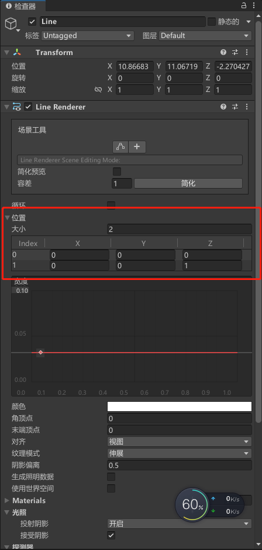

# 基础

### 界面

> 资源 --> 项目窗口、层级窗口 --> 场景，检查器、控制台

##### 布局设置


##### 场景窗口

- 快捷键Q~Y可切换不同工具
- 按住右键即可使用WASD控制视角


##### 层级窗口 Hierarchy

- 可查看场景内所有游戏对象


- 右键可快速创建对象

##### 检查器 Inspector

- 查看选中游戏对象的详细信息、组件
- 可将脚本直接拖拽到窗口进行挂载


##### 项目文件窗口 Project

- 存放项目的所有资源


##### 控制台 Console

- 输出报错、警告信息
- 可通过代码向控制台输出信息
- **双击**提示信息可**定位对应代码位置**


### 项目内容

##### 场景 Scene

- 切割游戏的单位

- 一个游戏至少一个场景

- 场景跳转常用加载页面过渡，无缝大地图则是实时加载、卸载游戏资源

- **默认存储位置**：`Assets/Scenes`

  > 只保存场景中的对象、挂载的组件、组件参数等信息，不保存资源

##### 游戏对象 Game Object

- 场景中的一切物体都是游戏对象

  > 模型、灯光、特效、相机、UI、脚本

- 可以互相组成父子关系

- 可在游戏运行时动态增删改查

##### 组件 Component

- 组件本质是**脚本**，通过**挂载在游戏对象上**，决定游戏对象的功能
- Unity自带很多常用组件，用户编写的C#脚本也可作为组件


### 生命周期

> 同一脚本的生命周期执行顺序固定
>
> 但 **不同脚本的顺序不固定**

##### 1. Awake()

##### 2. Start()

##### 3. Update() / FixedUpdate()

> 按帧/时间执行

##### 4. LateUpdate()

> 每次Update之后执行
>
> 由此可以固定实现不同物体Update的先后顺序
>
> 例如：

------


# 脚本 Script

### 基本特性

- 挂载在游戏对象上
- 一个脚本只能有1个类，**继承MonoBehaviour**，名称与脚本名一致
- 类中定义的变量可在界面中看到


### 创建

##### 1. 编译器设置


##### 2. 添加脚本组件


### 基础结构

```c#
public class FirstSpell : MonoBehaviour
{
    // 该函数在第一次刷新之前调用
    void Start()
    {

    }

    // 每次刷新时调用
    void Update()
    {
        
    }
}
```


### **委托

##### 委托：delegate

- 针对情况：事件驱动

  > 各个类之间可能拥有复杂的组织关系，形成 **触发-执行** 机制
  >
  > 当某个类执行某方法时，可能会引发其余多个类执行各自的方法

- 原理

  > 将一些 **参数、返回值类型一致的方法** **批量执行**，相当于同一类型方法的容器类型
  >
  > 将事件单独定义，并 **与相关的方法绑定**
  >
  > 事件发生时，**执行所有绑定的方法**

- 使用

  - 声明委托类型


  > delegate类似于一种数据类型
  >
  > 通过声明规定的是此类委托变量 **可绑定的方法的参数、返回值类型**

  ```c#
  public delegate 返回值类型 自定义委托类型名称(type 参数)
  ```

  - 创建委托


  > 创建 **存储同类型方法的容器**

  ```c#
  自定义委托类型名称型 委托1, 委托2, ... ;
  ```

  - 绑定/解绑委托方法


  > **委托方法** 的返回值、传入参数必须 **与委托声明一致**
  >
  > 调用委托变量时，**所有绑定的委托方法都将被执行**

  ```c#
  // 添加到委托的方法的参数、返回值类型必须与声明委托类型时规定的一致
  委托 += 方法;
  委托 -= 方法;
  委托 = null;		// 清空
  
  // 当委托方法比较简单时，可使用匿名方法
  xxxxxxxxxx 委托变量 += (传入的参数名称) => {//方法内容}；
  ```

- 使用示例

  ```c#
  // 委托
  public delegate void Event(string s);
  Event output;
  public void test_Delegate()
  {
      string func = "委托";
      utils.funcStart(func);
  
      output += (s) => { Console.WriteLine("委托方法1，"+s);};
      output += (s) => { Console.WriteLine("委托方法2，"+s);};
      output("执行");
      // 输出：
      // 	委托方法1，执行
      // 	委托方法2，执行
  
      utils.funcEnd(func);
  }
  ```


##### 无返回值委托：Action

> 实际上是在System中 **事先定声明好的委托类型**
>
> 可以指向一个 **任意参数、无返回值** 的方法

- 定义

  > 委托需要先声明委托类型，以规定参数、返回值类型
  >
  > 但Action不用先声明类型

  - 无参数：`Action action = 方法名;`

  - 有参数：`Action<T,T,...> action = 方法名;`

    > 通过泛型规定参数类型

- 使用

  - 无参数：`action()`
  - 有参数：`action(参数1, 餐数2, ...)`

- 例子

  ```c#
  // 动作
  public void hit()
  {
      Console.WriteLine("打击！！");
  }
  public void hitEnemy(string name,int num)
  {
      Console.WriteLine("打击{0}{1}下",name,num);
  }
  public void test_Action()
  {
      string func = "Action";
      utils.funcStart(func);
  
      Action a1 = hit;
      Action<string,int> a2 = hitEnemy;
      a1();				// "打击！！"
      a2("敌人",4);		   // "打击敌人4下"
  
      utils.funcEnd(func);
  }
  ```

##### **UnityEvent

> 与Action类似

- 引入：`using UnityEngine.Events`

- 定义：`pulbic UnityEvent action;`

  > 注：若非使用界面直接进行绑定，请在此步骤创建对象

- 常用操作

  - 绑定：`action.AddListener(方法名)`

  - 解除

    - 单独：`action.RemoveListener(方法名)`
    - 全部：`action.RemoveAllListeners()`

  - 直接操作

    > 挂在了UnityEvent变量所在的脚本的游戏对象
    >
    > 可以通过界面上的操作直接进行绑定、删除

    

    - 于1处添加 挂载了 **待绑定方法所在脚本** 的游戏对象

      > 例如此处讲带绑定方法所在的脚本挂载到了 Events 这个游戏对象上

    - **于2处选择绑定的方法

      > 可选择的方法分为静态和动态两种
      >
      > 
      >
      > - 动态：绑定的方法接受脚本中 **调用时传递的参数**
      > - 静态：接受在界面上 **规定的参数**，优先级高于调用传递的参数
      >
      > 若该委托类型有 **多个参数**，则 **只能进行动态绑定**
    
  - 脚本操作

    > 

- 使用示例

  - 定义、调用

    ```c#
    using System.Collections;
    using System.Collections.Generic;
    using UnityEngine;
    using UnityEngine.Events;
    
    public class Manager : MonoBehaviour
    {
        public UnityEvent<GameObject> report;
        public GameObject ball;
        public GameObject capsule;
    
        void Start()
        {
            // 绑定（在界面上绑定）
        }
    
        void Update()
        {
            // 调用委托，根据按键输出对应对象的位置信息
            if (Input.GetKeyUp(KeyCode.J)) report?.Invoke(ball);
            else if (Input.GetKeyUp(KeyCode.K)) report?.Invoke(capsule);
        }
    
    }
    ```

  - 绑定

    


### 通用方法

##### 输出日志：`print(string text)`

##### **获得组件

```c#
// 组件类 变量名称 = 游戏对象.GetComponent<组件类>()
Rigidbody rb = other.gameObject.GetComponent<Rigidbody>();
```

##### 颜色Color

##### **委托判存与发布

```c#
// 委托若存在，执行
委托?.Invoke()
```

##### 锁定鼠标运动

```c#
// 将鼠标固定在屏幕中央并隐藏
private void MouseLock(bool choice)
{
    if(choice)
    {
        Cursor.lockState = CursorLockMode.Locked;
        Cursor.visible = false;
    }
    else
    {
        Cursor.lockState = CursorLockMode.None;
        Cursor.visible = true;
    }
}
```

##### **鼠标点击移动

> 

```c#
Ray mouseRay;
RaycastHit hitInfo;		// 存储射线检测信息
NavMeshAgent agent = GetComponent<NavMeshAgent>();

private void MouseClickRayDetect(Ray ray)
{
    if (Physics.Raycast(ray, out hitInfo))
    {
        print("鼠标点击到了：" + hitInfo.point);
    }
}
private void MouseClick()
{
    // 创建射线
    if(Input.GetMouseButtonDown(1))
    {
        mouseRay = Camera.main.ScreenPointToRay(Input.mousePosition);
        MouseClickRayDetect(mouseRay);
    }
    // 绘制
    Debug.DrawRay(mouseRay.origin, mouseRay.direction*20, Color.cyan);
    // 移动
    agent.SetDestination(hitInfo.point)
}
```


### 游戏对象类

##### 常用属性

- 名称 name
- 标签 tag
- 变换组件 transform

------


# 变换 Transform

> 属性信息为 **Vector3** 向量类型
>
> 将对象拖拽到另一对象上，即可进行父子关系的设置
>
> 子对象以父对象位置为原点

### **向量 Vector

> 结构体
>
> 可以进行加减操作！！

- 属性

  - float x
  - float y
  - float z

- 赋值：`vec = new Vector3(x,y,z)`

- 单位向量

  > 还有向左、向右

  - 向前：`Vector3 v = Vector3.forward` 
  - 向后： `Vector3 v = Vector3.back`

- **距离计算**：`float dis = Vector3.Distance(v1,v2)`


### 基础属性

> 不能对向量的单个属性进行操作，**必须同一赋值**

##### 位置

- 绝对：`transform.position`
- 相对：`transform.local`
- 移动
  - 向量累加：`transform.position += new Vector3(0.01f,0,0)`
  - **直接移动**：`transform.Translate(x,y,z)`
  
    > 一般放在Update()中执行
    >
    > 但由于帧间隔不一定，通常需要乘上帧间隔 **保证速度一致性**
    >
    > 例如：`transform.Translate(Vector3.forward * Time.deltaTime)`
    >
    > 坐标为**相对坐标**

##### 姿态

- 绝对：`transform.eulerAngles`
- 相对：`transform.localEulerAngles(Vector3)`
- 旋转：`transform.Rotate(1,0,0)`

##### 缩放

- 绝对：`transform.lossyScale`
- 相对：`transform.localScale`


### 常用方法

##### 移动控制

- 指定按键控制
- ```c#
  float v = 1.0f;
  void Update()
  {
      if (Input.GetKey(KeyCode.W)) transform.Translate(0, 0, v* Time.deltaTime);
      else if (Input.GetKey(KeyCode.S)) transform.Translate(0, 0, -v* Time.deltaTime);
      else if (Input.GetKey(KeyCode.A)) transform.Translate(-v* Time.deltaTime, 0, 0);
      else if (Input.GetKey(KeyCode.D)) transform.Translate(v * Time.deltaTime, 0, 0);
      else if (Input.GetKey(KeyCode.Space)) transform.Translate(0, v* Time.deltaTime, 0);
      else if (Input.GetKey(KeyCode.LeftControl)) transform.Translate(0, -v* Time.deltaTime, 0);
  }
  
  
  // 使用方向向量
  void FixedUpdate()
  {
      if (Input.GetKey(KeyCode.W)) transform.Translate(Vector3.forward * Time.fixedDeltaTime * v);
      else if (Input.GetKey(KeyCode.S)) transform.Translate(Vector3.back * Time.fixedDeltaTime * v);
      else if (Input.GetKey(KeyCode.A)) transform.Translate(Vector3.left * Time.fixedDeltaTime * v);
      else if (Input.GetKey(KeyCode.D)) transform.Translate(Vector3.right * Time.fixedDeltaTime * v);
      if (Input.GetKey(KeyCode.Q)) transform.Rotate(Vector3.down);
      else if (Input.GetKey(KeyCode.E)) transform.Rotate(Vector3.up);
  }
  ```

- 通用平滑方向控制
  
  
  ```c#
  using System.Collections;
  using System.Collections.Generic;
  using UnityEngine;
  
  public class Player : MonoBehaviour
  {
      float v = 3.0f;             // 标准速度
      float dt;
      float vertical;
      float horizontal;
  
      // Start is called before the first frame update
      void Start()
      {
          dt = Time.fixedDeltaTime;
      }
  
      // Update is called once per frame
      void FixedUpdate()
      {
          MoveSmooth();
      }
  
      private void MoveSmooth()
      {
          vertical = Input.GetAxis("Vertical");
          horizontal = Input.GetAxis("Horizontal");
          transform.Translate(new Vector3(horizontal*dt*v,0,vertical*dt*v));
          transform.Rotate(Vector3.up * Input.GetAxis("Mouse X")*v*10);
          // 倾斜（只倾斜模型）
          transform.GetChild(0).localEulerAngles = new Vector3(vertical * 20, 0, -horizontal * 20);
      }
  }
  ```
  
  


------


# **刚体与碰撞

### 刚体 Rigidbody

##### 常见属性


- 质量 Mass

- 质心位置 centerOfMass

- 阻力 Drag

- 角阻力 Angular Drag

- 是否使用重力 Use Gravity

- 是否受物理法则影响 is Kinematic

- 渲染插值 Interpolate

- **碰撞检测方式 Collision Detection

  > 防止速度过快时碰撞检测失效

  - 离散 Discrete
  - 连续 Continuous
  - 动态连续 Continuous Dynamic
  - 推测连续 Continuous Speculative

- 运动限制 Constraints

##### 对象方法

- 创建：`public Rigidbody body;`
- 受力运动：`body.AddForce(Vector3 dir,mod)`


### 连接关节 Joint

> 关节所在的物体必须具有Rigidbody
>
> 连接的对象可以是刚体或关节

##### Spring Joint


- 连接体 Connected Body

  > 可以直接将对象拖拽到这里进行设置
  >
  > 连接后，被连接物体的初始位置为其本身的位置


### 碰撞组件 Collider

> 只有 **双方都具备Collider** 时才会发生碰撞
>
> 只有 **具有Rigidbody** 的对象会受到碰撞的影响
>
> 不具备刚体的物体则只能作为碰撞物体，本身不发生运动

##### 自定义形状：碰撞体编辑器


##### **碰撞检测处理

> 2D版本：`XXXX2D`
>
> 条件
>
> - 双方均有Collider
> - 需要受到碰撞影响的一方应具有Rigidbody

```c#
public class TestController : MonoBehaviour
{
    // 碰撞周期检测
    private void OnCollisionEnter(Collision collision)
    {
        // 开始碰撞
    }

    private void OnCollisionStay(Collision collision)
    {
        // 碰撞中
    }

    private void OnCollisionExit(Collision collision)
    {
        // 碰撞结束
    }
}
```

##### **碰撞对象属性

> 即碰撞周期检测传入的 `Collision collision`

- 碰撞到的对象：`collision.gameObject`
  - 名称：`name`
- 碰撞对象的刚体组件：`collision.rigidbody`
- 碰撞对象的碰撞组件：`collision.collider`
- 碰撞对象的Transform组件：`collision.transform`

##### 碰撞触发器

> 勾选 `Is Trigger` 后，将**仅作为碰撞触发器**，而 **不阻碍** 其他物体运动
>
> 常用于传送点等功能的实现
>
> 

```c#
public class TestController : MonoBehaviour
{
    // 碰撞触发器
    private void OnTriggerEnter(Collision collision)
    {
        // 开始碰撞
    }

    private void OnTriggerStay(Collision collision)
    {
        // 碰撞中
        /*
        	注意：
        		一般需要在触发时持续判断的事件
        		建议结合状态变量在Update中判断
        		因为OnTriggerStay的执行频率不够高
        */
    }

    private void OnTriggerExit(Collision collision)
    {
        // 碰撞结束
    }
}
```

##### 鼠标碰撞处理

```c#
public class TestController : MonoBehaviour
{

    private void OnMouseEnter()
    {
        // 开始碰撞
    }

    private void OnMouseOver()
    {
        // 停留
    }

    private void OnMouseExit()
    {
        // 离开
    }
    
    private void OnMouseDown()
    {
        
    }
    
    private void OnMouseUp()
    {
        
    }
    
    private void OnMouseUpAsButton()
    {
        // 鼠标按下时，抬起鼠标调用
    }
    
    private void OnMouseDrag()
    {
        // 拖拽
    }
}
```


### **Physics

##### 射线Ray

- 创建：

- 起点：Vector3 origin
- 方向：Vector3 direction

##### **射线检测Raycast

> 非常常用！！！
>
> 需要先定义类成员：`RaycastHit hitInfo`，以接受检测信息
>
> 可用于仿真射击判定

- **检测结果**信息存储变量：`RaycastHit hitInfo`

  > 用于接收检测到的第一个对象

  - 碰撞体：`hitInfo.collider`
    - 对象：`.gameObject`
    - 对象名称：`.name`
  - 碰撞点位置：`hitInfo.point`
  - 碰撞面法线：`hitInfo.normal`
  
- **返回第一个对象**：

  - `bool res = Physics.Raycast(Vector3 origin, Vector3 dir,out hitInfo)`

    > 其他可选参数
    >
    > - float 最大距离
    > - int 层

  - `bool res = Physics.Raycast(Ray ray,out hitInfo)`
  
    ```c#
    public RaycastHit hitInfo;		// 定义类成员
    
    void Update()
    {
        // 射线检测
        if(Physics.Raycast(transform.position, new Vector3(4, 0, 0),out hitInfo,4))
        {
            print("射线碰撞检测："+hitInfo.collider.tag);
        }
    }
    ```


- 返回所有对象：`RaycastHit[] res = Physics.RaycastAll`

##### **射线显示**

> `Debug.DrawRay(起点,向量,颜色);`

```c#
public void OnDrawGizmos()
{
    Debug.DrawRay(transform.position,new Vector3(4,0,0),Color.blue);
}
```

------


# 导航系统Navigation

> 使用A*算法

### 地形处理

##### 静态地形

- 打开导航系统界面
  
- 设定**区域代价**
  
- 设定对象区域类型
  
- 设置主体属性，烘焙
  

##### 动态地形

> 动态障碍物、可开关的门等

- 移动障碍：``Nav Mesh Obstacle` `
- 跳板：`off Mesh Link`


### 导航控制

##### 添加组件

> Nav Mesh Agent


##### 脚本控制

> `using UnityEngine.AI;`

- 获取组件：`agent = GetComponent<NavMeshAgent>();`

- **设置目标点**：`agent.SetDestination(Vector3 target)`

  > 可与鼠标点击移动相结合

  ```c#
  public class PlayerController : MonoBehaviour
  {
      NavMeshAgent agent;
      Ray mouseRay;
      RaycastHit hitInfo;
  
  
      void Start()
      {
          agent = GetComponent<NavMeshAgent>();
      }
  
  
      void Update()
      {
          if (Input.GetMouseButtonUp(1))
          {
              print("开始移动");
              mouseRay = Camera.main.ScreenPointToRay(Input.mousePosition);
              if (Physics.Raycast(mouseRay, out hitInfo)) agent.SetDestination(hitInfo.point);
          }
      }
      
  }
  ```

- 常用属性

  - 是否在寻路中：`bool agent.hasPath`
  - 当前速度：`Vector3 agent.velocity`


# 渲染与显示

### 模型构成


### 渲染组件 Renderer

##### 添加

> 一般是自动添加Renderer组件，针对不同对象添加的组件类型也不同
>
> - 一般3D：Mesh Renderer
> - 绑定了骨骼的模型：Skinned Mesh Renderer
> - 2D：SpriteRenderer

##### 材质 Material

- 可直接在组件中更改Material
- 创建材质：`项目窗口中 右键 --> 创建 --> 材质`
- 项目窗口中的材质可直接拖拽到物体上或面板中的Material来进行替换

##### 着色器 Shader

- 作用

  > 运行在GPU上的指令，告诉GPU如何渲染图像
  >
  > Unity采用 **CG/HLSL** 作为Shader语言
  >
  > 通常由TA编写

- 使用：材质的面板上可直接更换Shader


### 相机组件 Camera

##### 裁剪平面 Clipping Planes

> 视野范围

##### 投影 Projection

- 三维透视模式 Perspective
  
- 正交模式 orthographic
  

##### 运动技巧

> 为保证相机跟随物体移动
>
> 携带相机的对象的运动应放在 **LateUpdate** 中处理


### 光源 Light

##### 类型选择 Type

- 直接选择类型
  
  - 聚光灯 Spot
  - 定向光源 Directional
  - 点光源 Point
  - 区域光源 Area
- 创建预置光源
  

##### 常用属性

- 颜色 Color
- 强度 Intensity
- 影子类型 Shadow Type
- 范围 Range
- 椎体角度 Spot Angle

##### 烘焙模式 Mode

> 烘焙：为减少GPU工作量，**对于不移动的光源和物体**，将光照效果绘 **制成图像贴在材质上**
>
> 对光源或物体进行改动后，需要重新烘焙

- 实时 Realtime

- 混合 Mixed

  > 针对场景中同时存在静物、动物的情形
  >
  > 烘焙方法如下

  - 将静物设置为static

  - 生成照明（Subtractive）

    > Subtractive会烘焙直接、间接光照和阴影，适合低端设备

- 已烘焙 Baked

  > 烘焙方法如下

  - 选择模式：Baked
  
  - 将对象设置为静态物体
  
  - 生成照明
    
    
    
    

------


# 输入输出

### Input 输入检测类

##### 按键枚举类 KeyCode

- 访问：`KeyCode.按键`

  > 例如：KeyCode.W

##### 键盘输入

- 按下：`boolean Input.GetKeyDown(KeyCode.按键)`
- 抬起：`boolean Input.GetKeyUp(KeyCode.按键)`
- 按住：`boolean Input.GetKey(KeyCode.按键)`

##### 键盘、手柄方向轴输入

> 无论什么设备，大部分输入都与 **Vertical、Horizontal** 两个轴相关
>
> 有效避免判断到底是哪个按键的问题

- 获取轴输入：`float Input.GetAxis("轴名称")`

  > 连续值，操作后渐变

  - 键盘、手柄轴：Horizontal、Vertical

    > 正向值最大为1，反向最大为-1

  - 鼠标轴：Mouse X、Mouse Y

    > 可不断增大


##### 鼠标输入

- 按键：`bool Input.GetMouseButtonDown(int index)`

  > 0-左键，1-右键，2-中键

- 位置：`Vector3 Input.mousePosition`


### 文件IO


# UI组件

### 基础

在层级处直接创建，初次生成还会创建两个对象：

##### Canvas：画布

> UI对象只有作为画布的子物体时，才能被看见
>
> Canvas下排在下面的UI组件，显示优先级高

- Rect Transform

  > Transform的子类
  >
  > **UI组件独有**

  - Pos XYZ：矩形区中心点相对父物体锚点的坐标

  - Width、Height

  - 

- 渲染模式Render Mode 

  - 覆盖
  - 相机
  - 世界空间

- 画布缩放Canvas Scaler

  - 按像素 Constant Pixel Size
  - 按屏幕尺寸
  - 按物理尺寸

##### EventSystem：事件系统

> 让UI对象可以被触发
>
> 通常 **只有一个**

##### UI组件对象

- 引入： `using UnityEngine.UI;`
- 创建变量：`控件类型 控件名称`


### **UI控件触发事件

> 引用：`UnityEngine.EventSystems`

##### 参数类型PointerEventData

- 接受XXX事件的游戏对象：`GameObject pointerXXX`

##### 点击

> 引入 **IPointer** 系列接口

```c#
using System.Collections;
using System.Collections.Generic;
using UnityEngine;
using UnityEngine.EventSystems;

public class PointerScript : MonoBehaviour, 
                                                 IPointerClickHandler, IPointerDownHandler, IPointerUpHandler,
                                                 IPointerEnterHandler, IPointerExitHandler
{
    public void OnPointerEnter(PointerEventData eventData)
    {
        // 进入
        // 对应UI控件：eventData.pointerEnter
    }
    
    public void OnPointerDown(PointerEventData eventData)
    {
        // 按下
        // 对应UI控件：eventData.pointerPress
    }
                                                     
    public void OnPointerClick(PointerEventData eventData)
    {
        // 点击
        // 对应UI控件：eventData.pointerClick
    }

    

    public void OnPointerUp(PointerEventData eventData)
    {
        // 抬起
    }

    
    public void OnPointerExit(PointerEventData eventData)
    {
        // 移出
        // 对应UI控件：eventData.
    }    
}
```

##### 拖拽

> 引入 **Drag** 系列接口

```c#

```


### 项目规范

> 根据实际需要进行改动

##### 事件处理委托数组

> 可通过枚举变量访问数组对应的位置
>
> `委托数组`

```c#
using System.Collections;
using System.Collections.Generic;
using UnityEngine;
using System;
using UnityEngine.Events;
using UnityEngine.EventSystems;


public class UIEvents : MonoBehaviour
{
    // 利用枚举类型对事件进行编号，对应不同事件委托在数组中的序号
    // Btn点击事件编号
    public enum PointerEvent
    {
        Enter = 0, Down, Click, Up, Exit
    }
    // Btn拖拽事件编号
    public enum DragEvent
    {
        Enter
    }
    
    // Btn点击事件处理
    public static UnityEvent<PointerEventData>[] btnPointEvent = new UnityEvent<PointerEventData>[System.Enum.GetValues(typeof(PointerEvent)).Length];
    // Btn拖拽事件处理
    public static UnityEvent<PointerEventData>[] btnDragEvent = new UnityEvent<PointerEventData>[System.Enum.GetValues(typeof(DragEvent)).Length];

    // 按钮事件报告（通用）
    public static void ReportBtnPoint(PointerEventData data)
    {
        if (data.pointerEnter != null) print("当前进入的Btn：" + data.pointerEnter.name);
        if (data.pointerClick != null) print("当前点击的Btn：" + data.pointerClick.name);
    }
}
```

##### 绑定通用方法

```c#
using System.Collections;
using System.Collections.Generic;
using UnityEngine;
using UnityEngine.Events;
using UnityEngine.EventSystems;
using UnityEngine.UI;


// 管理各种UI事件
public class UIManager : MonoBehaviour
{
    void Start()
    {
        // 绑定Btn点击委托
        foreach(TempleEvents.PointerEvent v in System.Enum.GetValues(typeof(TempleEvents.PointerEvent)))
        {
            // 在此处为所有事件的委托绑定通用方法
            UnityEvent<PointerEventData> newEvent = new UnityEvent<PointerEventData>();
            newEvent.AddListener(TempleEvents.ReportBtnPoint);
            TempleEvents.btnPointEvent[(int)v] = newEvent;
        }
        print("Btn点击委托绑定完成");
    }
}
```


### Text


### Button

##### 属性

##### 点击事件设定

> 可以在界面中直接设定（类似）

- 创建UI控件管理脚本进行直接设定点击事件处理

  > 相当于在控件的界面中直接选择Function进行设定
  >
  > 

  ```c#
  using System.Collections;
  using System.Collections.Generic;
  using UnityEngine;
  using UnityEngine.Events;
  using UnityEngine.EventSystems;
  using UnityEngine.UI;
  
  
  // 管理各种UI事件
  public class UIManager : MonoBehaviour
  {
      public Button btnTest;		// 需要在界面中设定对应的游戏对象
  
      void Start()
      {
          btnTest.OnClick.AddListener(()=>print("点击"));
      }
  }
  ```

- 在单独持有的脚本中对各个事件进行设定

  > 注意：进入事件通常会被Btn上的Text控件触发
  >
  > Click必定会触发Enter？？？

  ```c#
  using System.Collections;
  using System.Collections.Generic;
  using UnityEngine;
  using UnityEngine.EventSystems;
  
  public class BtnTest : MonoBehaviour,
                                         IPointerClickHandler, IPointerEnterHandler
  {
      public void OnPointerClick(PointerEventData eventData)
      {
          TempleEvents.btnPointEvent[(int)TempleEvents.PointerEvent.Click]?.Invoke(eventData);
      }
  
      public void OnPointerEnter(PointerEventData eventData)
      {
          TempleEvents.ReportBtnPoint(eventData);
      }
  
  }
  ```


------


# 动画与特效

### 动画

##### 动画组件Animation

- 窗口创建

  - 添加 Animation
    

  - 打开动画创建窗口：窗口 --> 动画 --> 动画
    

    - 可以选择现有的动画或创建新的动画

    - **添加配置**：添加当前对象在动画中需要改变属性的相关组件

      > 缩放动画：transform.Scale

  - 添加**关键帧**

    > Unity会在关键帧数值间平滑过渡

    - 点击录制
    - 选定时间点
    - 选定属性，更改值
    - 点击录制，完成创建

  - 设置播放模式
    

- 脚本控制

  ```c#
  using System.Collections;
  using System.Collections.Generic;
  using UnityEngine;
  
  public class CubeController : MonoBehaviour
  {
      Animation anim;
  
      void Start()
      {
          anim = GetComponent<Animation>();       // 获取组件
          anim.Play("CubeAnimation");
      }
  
      void Update()
      {
          if (Input.GetKeyUp(KeyCode.LeftAlt))
          {
              print("减速播放");
              anim["CubeAnimation"].speed = 0.5f;
          }
          else if (Input.GetKeyUp(KeyCode.RightAlt))
          {
              print("原速播放");
              anim["CubeAnimation"].speed = 1f;
          }
      }
   
  }
  ```

  - 获取组件：`Animation anim = GetComponent<Animation>();` 

  - 播放

    - 默认动画：`anim.Play();`
    - 指定动画：`anim.Play("名称");`

  - 停止

    - 默认动画：`anim.Stop();`
    - 指定动画：`anim.Stop("名称");`

  - 访问动画：`anim["名称"]`

    - 当前播放的时长：`float time`

    - 总时长：`float length`

    - 播放速度：`float speed`

      > 可设定，负数为反向播放

    - 播放进度：`float normalizedTime`

      > 0~1

##### **动画器与状态机 Animator&StateMachine

- 添加动画器 Animator
  

- 创建动画器控制器 AnimatorController
  

- 查看当前对象状态机
  

- **状态机**
  

  - 基础

    > Entry为入口，链接默认状态
    >
    > Exit为出口

  - 操作

    - 设定默认动画状态
      
    - 添加动画资源（直接拖拽）
    - 设定流向
      
    - 添加状态参数
      
    - 设定状态转换条件
      
    - 子状态机
      
    - 自定义动画过度
      

- 脚本控制

  - 获取组件：`Animator anim = GetComponent<Animator>();`

  - 创建状态参数

    - 获取：`anim.GetXXX("名称")`
    - 设定：`anim.SetXXX("名称")`

    


### 粒子系统 Particle System

##### 简单创建


##### **脚本控制

- 获取组件：`ParticleSystem particle = GetComponent<ParticleSystem>();`
- 进度控制
  - 播放：`particle.Play();`
  - 暂停：`particle.Pause();`
  - 停止：`particle.Stop();`


### 线条特效 Trail&Line

##### 拖尾渲染器 Trail

> 关键属性是滞留时间和渐变颜色
>
> 双击宽度可添加控制点

##### 线渲染器

- 获取组件：`LineRenderer line = GetComponent<LineRenderer>();`

- 线条位置点

  

  - 设置总数量：`line.positionCount = x;`

  - 设置中间点

    > 可绘制函数曲线

    - 单独设置：`line.SetPosition(length, Vector3 dir)`

    - 集体设置:`line.SetPositions(Vector3[] positions);`

      


### 多媒体


# Bolt可视化编程


