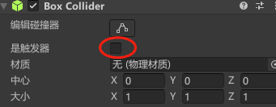

# 基础

### 界面

> 资源 --> 项目窗口、层级窗口 --> 场景，检查器、控制台

##### 布局设置


##### 场景窗口

- 快捷键Q~Y可切换不同工具
- 按住右键即可使用WASD控制视角


##### 层级窗口 Hierarchy

- 可查看场景内所有游戏对象


- 右键可快速创建对象

##### 检查器 Inspector

- 查看选中游戏对象的详细信息、组件
- 可将脚本直接拖拽到窗口进行挂载


##### 项目文件窗口 Project

- 存放项目的所有资源


##### 控制台 Console

- 输出报错、警告信息
- 可通过代码向控制台输出信息
- **双击**提示信息可**定位对应代码位置**


### 项目内容

##### 场景 Scene

- 切割游戏的单位

- 一个游戏至少一个场景

- 场景跳转常用加载页面过渡，无缝大地图则是实时加载、卸载游戏资源

- **默认存储位置**：`Assets/Scenes`

  > 只保存场景中的对象、挂载的组件、组件参数等信息，不保存资源

##### 游戏对象 Game Object

- 场景中的一切物体都是游戏对象

  > 模型、灯光、特效、相机、UI、脚本

- 可以互相组成父子关系

- 可在游戏运行时动态增删改查

##### 组件 Component

- 组件本质是**脚本**，通过**挂载在游戏对象上**，决定游戏对象的功能
- Unity自带很多常用组件，用户编写的C#脚本也可作为组件


### 生命周期

> 同一脚本的生命周期执行顺序固定
>
> 但 **不同脚本的顺序不固定**

##### 1. Awake()

##### 2. Start()

##### 3. Update() / FixedUpdate()

> 按帧/时间执行

##### 4. LateUpdate()

> 每次Update之后执行
>
> 由此可以固定实现不同物体Update的先后顺序
>
> 例如：

------


# 脚本 Script

### 基本特性

- 挂载在游戏对象上
- 一个脚本只能有1个类，**继承MonoBehaviour**，名称与脚本名一致
- 类中定义的变量可在界面中看到


### 创建

##### 1. 编译器设置


##### 2. 添加脚本组件


### 基础结构

```c#
public class FirstSpell : MonoBehaviour
{
    // 该函数在第一次刷新之前调用
    void Start()
    {

    }

    // 每次刷新时调用
    void Update()
    {
        
    }
}
```


### 通用方法

##### 输出日志：`print(string text)`

##### **获得组件：`组件类 变量名称 = 游戏对象.GetComponent<组件类>()`

> `Rigidbody rb = other.gameObject.GetComponent<Rigidbody>();`

##### 颜色Color

##### 委托判存与发布

```c#
委托?.Invoke()
```


### 游戏对象类

##### 常用属性

- 名称 name
- 标签 tag
- 变换组件 transform

------


# 变换 Transform

> 属性信息为 **Vector3** 向量类型
>
> 将对象拖拽到另一对象上，即可进行父子关系的设置
>
> 子对象以父对象位置为原点

### **向量 Vector

> 结构体
>
> 可以进行加减操作！！

- 属性

  - float x
  - float y
  - float z

- 赋值：`vec = new Vector3(x,y,z)`

- 单位向量

  > 还有向左、向右

  - 向前：`Vector3 v = Vector3.forward` 
  - 向后： `Vector3 v = Vector3.back`

- **距离计算**：`float dis = Vector3.Distance(v1,v2)`


### 基础属性

> 不能对向量的单个属性进行操作，**必须同一赋值**

##### 位置

- 绝对：`transform.position`
- 相对：`transform.local`
- 移动
  - 向量累加：`transform.position += new Vector3(0.01f,0,0)`
  - **直接移动**：`transform.Translate(x,y,z)`
  
    > 一般放在Update()中执行
    >
    > 但由于帧间隔不一定，通常需要乘上帧间隔 **保证速度一致性**
    >
    > 例如：`transform.Translate(Vector3.forward * Time.deltaTime)`
    >
    > 坐标为**相对坐标**

##### 姿态

- 绝对：`transform.eulerAngles`
- 相对：`transform.localEulerAngles`
- 旋转：`transform.Rotate(1,0,0)`

##### 缩放

- 绝对：`transform.lossyScale`
- 相对：`transform.localScale`


### 常用方法

##### 键盘移动控制

```c#
float v = 1.0f;
void Update()
{
    if (Input.GetKey(KeyCode.W)) transform.Translate(0, 0, v* Time.deltaTime);
    else if (Input.GetKey(KeyCode.S)) transform.Translate(0, 0, -v* Time.deltaTime);
    else if (Input.GetKey(KeyCode.A)) transform.Translate(-v* Time.deltaTime, 0, 0);
    else if (Input.GetKey(KeyCode.D)) transform.Translate(v * Time.deltaTime, 0, 0);
    else if (Input.GetKey(KeyCode.Space)) transform.Translate(0, v* Time.deltaTime, 0);
    else if (Input.GetKey(KeyCode.LeftControl)) transform.Translate(0, -v* Time.deltaTime, 0);
}


// 使用方向向量
void FixedUpdate()
{
    if (Input.GetKey(KeyCode.W)) transform.Translate(Vector3.forward * Time.fixedDeltaTime * v);
    else if (Input.GetKey(KeyCode.S)) transform.Translate(Vector3.back * Time.fixedDeltaTime * v);
    else if (Input.GetKey(KeyCode.A)) transform.Translate(Vector3.left * Time.fixedDeltaTime * v);
    else if (Input.GetKey(KeyCode.D)) transform.Translate(Vector3.right * Time.fixedDeltaTime * v);
    else if (Input.GetKey(KeyCode.Q)) transform.Rotate(Vector3.down);
    else if (Input.GetKey(KeyCode.E)) transform.Rotate(Vector3.up);
}
```

------


# **刚体与碰撞

### 刚体 Rigidbody

##### 常见属性


- 质量 Mass

- 阻力 Drag

- 角阻力 Angular Drag

- 是否使用重力 Use Gravity

- 是否受物理法则影响 is Kinematic

- 渲染插值 Interpolate

- **碰撞检测方式 Collision Detection

  > 防止速度过快时碰撞检测失效

  - 离散 Discrete
  - 连续 Continuous
  - 动态连续 Continuous Dynamic
  - 推测连续 Continuous Speculative

- 运动限制 Constraints

##### 对象方法

- 创建：`public Rigidbody body;`
- 受力运动：`body.AddForce(Vector3 dir,mod)`


### 连接关节 Joint

> 关节所在的物体必须具有Rigidbody
>
> 连接的对象可以是刚体或关节

##### Spring Joint


- 连接体 Connected Body

  > 可以直接将对象拖拽到这里进行设置
  >
  > 连接后，被连接物体的初始位置为其本身的位置


### 碰撞组件 Collider

> 只有 **双方都具备Collider** 时才会发生碰撞
>
> 只有 **具有Rigidbody** 的对象会受到碰撞的影响
>
> 不具备刚体的物体则只能作为碰撞物体，本身不发生运动

##### 自定义形状：碰撞体编辑器


##### **碰撞检测处理

> 2D版本：`XXXX2D`
>
> 条件
>
> - 双方均有Collider
> - 需要受到碰撞影响的一方应具有Rigidbody

```c#
public class TestController : MonoBehaviour
{
    // 碰撞周期检测
    private void OnCollisionEnter(Collision collision)
    {
        // 开始碰撞
    }

    private void OnCollisionStay(Collision collision)
    {
        // 碰撞中
    }

    private void OnCollisionExit(Collision collision)
    {
        // 碰撞结束
    }
}
```

##### **碰撞对象属性

> 即碰撞周期检测传入的 `Collision collision`

- 碰撞到的对象：`collision.gameObject`
  - 名称：`name`
- 碰撞对象的刚体组件：`collision.rigidbody`
- 碰撞对象的碰撞组件：`collision.collider`
- 碰撞对象的Transform组件：`collision.transform`

##### 碰撞触发器

> 勾选 `Is Trigger` 后，将**仅作为碰撞触发器**，而 **不阻碍** 其他物体运动
>
> 常用于传送点等功能的实现
>
> 

```c#
public class TestController : MonoBehaviour
{
    // 碰撞触发器
    private void OnTriggerEnter(Collision collision)
    {
        // 开始碰撞
    }

    private void OnTriggerStay(Collision collision)
    {
        // 碰撞中
        /*
        	注意：
        		一般需要在触发时持续判断的事件
        		建议结合状态变量在Update中判断
        		因为OnTriggerStay的执行频率不够高
        */
    }

    private void OnTriggerExit(Collision collision)
    {
        // 碰撞结束
    }
}
```

##### 鼠标碰撞处理

```c#
public class TestController : MonoBehaviour
{

    private void OnMouseEnter()
    {
        // 开始碰撞
    }

    private void OnMouseOver()
    {
        // 停留
    }

    private void OnMouseExit()
    {
        // 离开
    }
    
    private void OnMouseDown()
    {
        
    }
    
    private void OnMouseUp()
    {
        
    }
    
    private void OnMouseUpAsButton()
    {
        // 鼠标按下时，抬起鼠标调用
    }
    
    private void OnMouseDrag()
    {
        // 拖拽
    }
}
```


### **Physics

##### **射线检测

> 需要先定义类成员：`RaycastHit hitInfo`
>
> 可用于仿真射击判定

- 返回第一个对象：`bool res = Physics.Raycast(Vector3 origin, Vector3 dir,out hitInfo)`

  > 其他可选参数
  >
  > - float 最大距离
  > - int 层

  ```c#
  public RaycastHit hitInfo;
  
  void Update()
  {
      // 射线检测
      if(Physics.Raycast(transform.position, new Vector3(4, 0, 0),out hitInfo,4))
      {
          print("射线碰撞检测："+hitInfo.collider.tag);
      }
  }
  ```

  - 射线起点 origin
  - 方向 dir
  - 检测结果 out RaycastHit hitInfo
    - 碰撞体：`hitInfo.collider`
      - 对象：`.gameObject`
      - 对象名称：`.name`
    - 碰撞点位置：`hitInfo.point`
    - 碰撞面法线：`hitInfo.normal`

- 返回所有对象：`RaycastHit[] res = Physics.RaycastAll`

- 射线显示：`Debug.DrawRay(位置,方向与长度,颜色);`

  ```c#
  public void OnDrawGizmos()
  {
      Debug.DrawRay(transform.position,new Vector3(4,0,0),Color.blue);
  }
  ```

  


# 渲染与显示

### 模型构成


### 渲染组件 Renderer

##### 添加

> 一般是自动添加Renderer组件，针对不同对象添加的组件类型也不同
>
> - 一般3D：Mesh Renderer
> - 绑定了骨骼的模型：Skinned Mesh Renderer
> - 2D：SpriteRenderer

##### 材质 Material

- 可直接在组件中更改Material
- 创建材质：`项目窗口中 右键 --> 创建 --> 材质`
- 项目窗口中的材质可直接拖拽到物体上或面板中的Material来进行替换

##### 着色器 Shader

- 作用

  > 运行在GPU上的指令，告诉GPU如何渲染图像
  >
  > Unity采用 **CG/HLSL** 作为Shader语言
  >
  > 通常由TA编写

- 使用：材质的面板上可直接更换Shader


### 相机组件 Camera

##### 裁剪平面 Clipping Planes

> 视野范围

##### 投影 Projection

- 三维透视模式 Perspective
  
- 正交模式 orthographic
  

##### 运动技巧

> 为保证相机跟随物体移动
>
> 携带相机的对象的运动应放在 **LateUpdate** 中处理


### 光源 Light

##### 类型选择 Type

- 直接选择类型
  
  - 聚光灯 Spot
  - 定向光源 Directional
  - 点光源 Point
  - 区域光源 Area
- 创建预置光源
  

##### 常用属性

- 颜色 Color
- 强度 Intensity
- 影子类型 Shadow Type
- 范围 Range
- 椎体角度 Spot Angle

##### 烘焙模式 Mode

> 烘焙：为减少GPU工作量，**对于不移动的光源和物体**，将光照效果绘 **制成图像贴在材质上**
>
> 对光源或物体进行改动后，需要重新烘焙

- 实时 Realtime

- 混合 Mixed

  > 针对场景中同时存在静物、动物的情形
  >
  > 烘焙方法如下

  - 将静物设置为static

  - 生成照明（Subtractive）

    > Subtractive会烘焙直接、间接光照和阴影，适合低端设备

- 已烘焙 Baked

  > 烘焙方法如下

  - 选择模式：Baked
  
  - 将对象设置为静态物体
  
  - 生成照明
    
    
    
    

------


# 输入输出

### Input 输入检测类

##### 按键枚举类 KeyCode

- 访问：`KeyCode.按键`

  > 例如：KeyCode.W

##### 键盘

- 按下：`boolean Input.GetKeyDown(KeyCode.按键)`
- 抬起：`boolean Input.GetKeyUp(KeyCode.按键)`
- 按住：`boolean Input.GetKey(KeyCode.按键)`

##### 鼠标


# Bolt可视化编程


