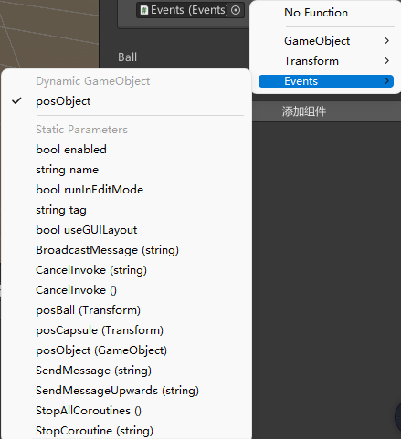
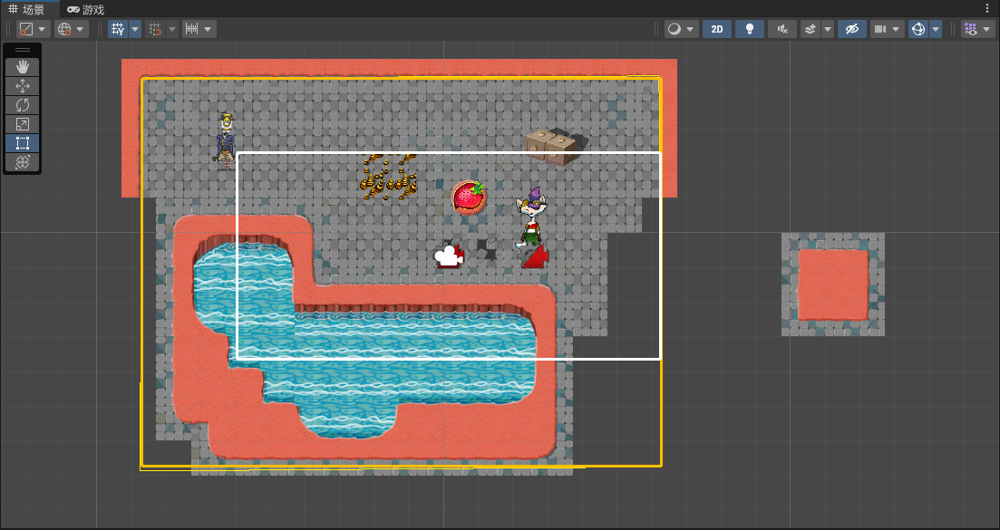
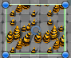
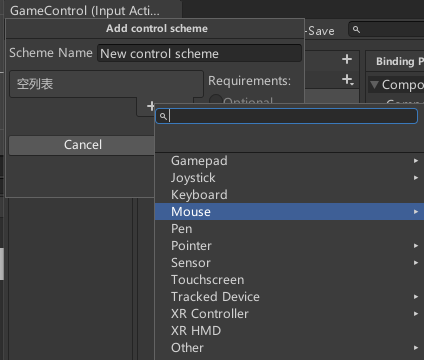
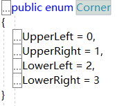
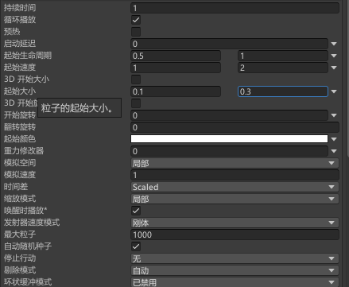
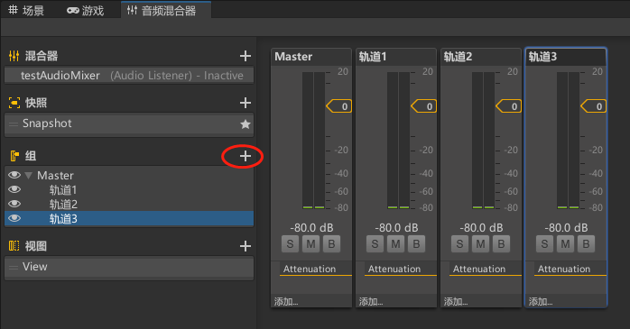
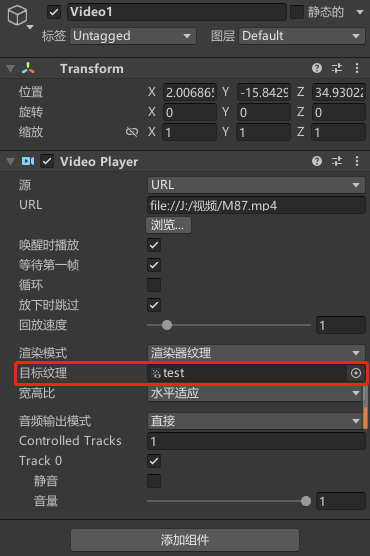

# 基础

### 界面

> 资源 --> 项目窗口、层级窗口 --> 场景，检查器、控制台

##### 布局设置


##### 场景窗口

- 快捷键Q~Y可切换不同工具
- 按住右键即可使用WASD控制视角


##### 层级窗口 Hierarchy

- 可查看场景内所有游戏对象


- 右键可快速创建对象

##### 检查器 Inspector

- 查看选中游戏对象的详细信息、组件
- 可将脚本直接拖拽到窗口进行挂载


##### 项目文件窗口 Project

- 存放项目的所有资源


##### 控制台 Console

- 输出报错、警告信息
- 可通过代码向控制台输出信息
- **双击**提示信息可**定位对应代码位置**


### 项目内容

##### 场景 Scene

- 切割游戏的单位

- 一个游戏至少一个场景

- 场景跳转常用加载页面过渡，无缝大地图则是实时加载、卸载游戏资源

- **默认存储位置**：`Assets/Scenes`

  > 只保存场景中的对象、挂载的组件、组件参数等信息，不保存资源

##### 游戏对象 Game Object

- 场景中的一切物体都是游戏对象

  > 模型、灯光、特效、相机、UI、脚本

- 可以互相组成父子关系

- 可在游戏运行时动态增删改查

##### 组件 Component

- 组件本质是**脚本**，通过**挂载在游戏对象上**，决定游戏对象的功能
- Unity自带很多常用组件，用户编写的C#脚本也可作为组件


### 生命周期

> 同一脚本的生命周期执行顺序固定
>
> 但 **不同脚本的顺序不固定**

##### 1. Awake()

> 进入场景时执行
>
> 当 **GameObject激活** 但禁用脚本时，仍会执行Awake
>
> 说明只要GameObject激活，脚本就会加载到内存中

##### 2. Start()

> 注意：物体重新激活后不会再执行Start

##### 3. Update() / FixedUpdate()

> 按帧/时间执行
>
> 若涉及刚体等 **物理运算**，建议使用FixedUpdate，但可以借助Update保存用户输入避免丢失输入

##### 4. LateUpdate()

> 每次Update之后执行
>
> 由此可以固定实现不同物体Update的先后顺序


### 导出

> File --> Build Settings

------


# 脚本 Script

### 基本特性

- 挂载在游戏对象上
- 一个脚本只能有1个类，**继承MonoBehaviour**，名称与脚本名一致
- 类中定义的public变量可在界面中看到
- 若想某变量应用于其他脚本类，需要定义为 `public static`


### 创建

##### 编译器设置


##### 添加脚本组件


##### 程序创建


##### 控制脚本

- 控制是否执行：`GetComponent<string ScriptName>().enable = true/false`


### 基础结构

```c#
public class FirstSpell : MonoBehaviour
{
    // 该函数在第一次刷新之前调用
    void Start()
    {

    }

    // 每次刷新时调用
    void Update()
    {
        
    }
}
```


### **委托

> 批量执行同类函数

##### 委托：delegate

- 针对情况：事件驱动

  > 各个类之间可能拥有复杂的组织关系，形成 **触发-执行** 机制
  >
  > 当某个类执行某方法时，可能会引发其余多个类执行各自的方法

- 原理

  > 将一些 **参数、返回值类型一致的方法** **批量执行**，相当于同一类型方法的容器类型
  >
  > 将事件单独定义，并 **与相关的方法绑定**
  >
  > 事件发生时，**执行所有绑定的方法**

- 使用

  - 声明委托类型


  > delegate类似于一种数据类型
  >
  > 通过声明规定的是此类委托变量 **可绑定的方法的参数、返回值类型**

  ```c#
  public delegate 返回值类型 自定义委托类型名称(type 参数)
  ```

  - 创建委托


  > 创建 **存储同类型方法的容器**

  ```c#
  自定义委托类型名称型 委托1, 委托2, ... ;
  ```

  - 绑定/解绑委托方法


  > **委托方法** 的返回值、传入参数必须 **与委托声明一致**
  >
  > 调用委托变量时，**所有绑定的委托方法都将被执行**

  ```c#
  // 添加到委托的方法的参数、返回值类型必须与声明委托类型时规定的一致
  委托 += 方法;
  委托 -= 方法;
  委托 = null;		// 清空
  
  // 当委托方法比较简单时，可使用匿名方法
  xxxxxxxxxx 委托变量 += (传入的参数名称) => {//方法内容}；
  ```

- 使用示例

  ```c#
  // 委托
  public delegate void Event(string s);
  Event output;
  public void test_Delegate()
  {
      string func = "委托";
      utils.funcStart(func);
  
      output += (s) => { Console.WriteLine("委托方法1，"+s);};
      output += (s) => { Console.WriteLine("委托方法2，"+s);};
      output("执行");
      // 输出：
      // 	委托方法1，执行
      // 	委托方法2，执行
  
      utils.funcEnd(func);
  }
  ```


##### 无返回值委托：Action

> 实际上是在System中 **事先定声明好的委托类型**
>
> 可以指向一个 **任意参数、无返回值** 的方法

- 定义

  > 委托需要先声明委托类型，以规定参数、返回值类型
  >
  > 但Action不用先声明类型

  - 无参数：`Action action = 方法名;`

  - 有参数：`Action<T,T,...> action = 方法名;`

    > 通过泛型规定参数类型

- 使用

  - 无参数执行：`action()`
  - 有参数执行：`action(参数1, 餐数2, ...)`

- 例子

  ```c#
  // 动作
  public void hit()
  {
      Console.WriteLine("打击！！");
  }
  public void hitEnemy(string name,int num)
  {
      Console.WriteLine("打击{0}{1}下",name,num);
  }
  public void test_Action()
  {
      string func = "Action";
      utils.funcStart(func);
  
      Action a1 = hit;
      Action<string,int> a2 = hitEnemy;
      a1();				// "打击！！"
      a2("敌人",4);		   // "打击敌人4下"
  
      utils.funcEnd(func);
  }
  ```

##### UnityAction

- 定义
- 使用

##### **UnityEvent

> 与Action类似

- 引入：`using UnityEngine.Events`

- 定义

  - `pulbic UnityEvent<T> action;`

    > 注：此方式定以后必须在界面上绑定事件

  - 直接定义对象：`UnityEvent event = new UnityEvent<T>()`

- 常用操作

  - 绑定：`event.AddListener(UnityAction action)`

  - 解除

    - 单独：`event.RemoveListener(方法名)`
    - 全部：`event.RemoveAllListeners()`

  - 调用：`event?.Invoke(参数)`

  - 直接操作

    > 挂在了UnityEvent变量所在的脚本的游戏对象
    >
    > 可以通过界面上的操作直接进行绑定、删除

    

    - 于1处添加 挂载了 **待绑定方法所在脚本** 的游戏对象

      > 例如此处讲带绑定方法所在的脚本挂载到了 Events 这个游戏对象上

    - **于2处选择绑定的方法

      > 可选择的方法分为静态和动态两种
      >
      > 
      >
      > - 动态：绑定的方法接受脚本中 **调用时传递的参数**
      > - 静态：接受在界面上 **规定的参数**，优先级高于调用传递的参数
      >
      > 若该委托类型有 **多个参数**，则 **只能进行动态绑定**
    
  - 脚本操作

- 使用示例

  - 定义、调用

    ```c#
    using System.Collections;
    using System.Collections.Generic;
    using UnityEngine;
    using UnityEngine.Events;
    
    public class Manager : MonoBehaviour
    {
        public UnityEvent<GameObject> report;
        public GameObject ball;
        public GameObject capsule;
    
        void Start()
        {
            // 绑定（在界面上绑定）
        }
    
        void Update()
        {
            // 调用委托，根据按键输出对应对象的位置信息
            if (Input.GetKeyUp(KeyCode.J)) report?.Invoke(ball);
            else if (Input.GetKeyUp(KeyCode.K)) report?.Invoke(capsule);
        }
    
    }
    ```

  - 绑定

    


### 游戏对象类

##### 常用属性

- 名称：`string name`
- 标签：`string tag`
- 变换组件：`Transform transform`
- 是否激活：`SetActive(bool choice)`

##### 方法

- **查找目标游戏对象**

  - 根据名称：`GameObject ob = GameObject.Find(string name)`

    > 名称格式可以为：
    >
    > - "xxx"
    > - "/xxx"
    > - "父对象/子对象"

  - 根据标签

    - 单个：`GameObject ob = GameObject.FindWithTag(string tag)`
    - 多个：`GameObject[] obArray = GameObject.FindGameObjectsWithTag(string tag)`

  - 根据类型

    - 单个：`GameObject ob = GameObject.FindObjectOfType(string type)`
    - 多个：`GameObject[] obArray = GameObject.FindObjectsOfType(string type)`
  
- 添加组件：`gameObject.AddComponent<T>()`

- 判断tag：`bool ob.CompareTag(string tag)`

- 转场保护：`GameObject.DontDestroyOnLoad(gameObject)`


### 图层

##### 图层

```c#
public struct LayerMask
{
    //
    // 摘要:
    //     Converts a layer mask value to an integer value.
    public int value { get; set; }

    //
    // 摘要:
    //     Given a set of layer names as defined by either a Builtin or a User Layer in
    //     the, returns the equivalent layer mask for all of them.
    //
    // 参数:
    //   layerNames:
    //     List of layer names to convert to a layer mask.
    //
    // 返回结果:
    //     The layer mask created from the layerNames.
    public static int GetMask(params string[] layerNames);
    //
    // 摘要:
    //     Given a layer number, returns the name of the layer as defined in either a Builtin
    //     or a User Layer in the.
    //
    // 参数:
    //   layer:
    [NativeMethodAttribute("LayerToString")]
    [StaticAccessorAttribute("GetTagManager()", Bindings.StaticAccessorType.Dot)]
    public static string LayerToName(int layer);
    //
    // 摘要:
    //     Given a layer name, returns the layer index as defined by either a Builtin or
    //     a User Layer in the.
    //
    // 参数:
    //   layerName:
    [NativeMethodAttribute("StringToLayer")]
    [StaticAccessorAttribute("GetTagManager()", Bindings.StaticAccessorType.Dot)]
    public static int NameToLayer(string layerName);

    public static implicit operator int(LayerMask mask);
    public static implicit operator LayerMask(int intVal);
}
```


------


# 镜头 Camera

### 脚本控制

##### 常用方法

- 获取主相机：`GameObject Camera.main`


### Cinemachine 包

##### 功能介绍

> **Cinemachine** 使你可以创建**复杂的 3D 摄像机设置**，从而允许在多个摄像机之间移动和切换。
>
> 你现在只需用来让摄像机跟随 **2D** 目标。**Cinemachine** 还包括 **2D helper 功能**，可将摄像机限制在特定边界范围内，这样就不会显示地图边界之外的对象。
>
> **Cinemachine** 可与多个摄像机配合使用，并根据游戏的需要在多个摄像机之间进行切换，例如在对话中对某个镜头与反拍镜头进行切换。

##### 基础设置

- 创建对象
  
- 相机视野范围
  

##### 跟随目标


##### 移动范围限制 Cinemachine Confiner

- 添加拓展
  

- 创建用于实现限制的Collider

  > 创建一个空对象用来专门挂载这个限制移动范围的Collider

  

- 设定范围限制Collider

  > 设定后，虚拟相机的视野（白框）会被限定在Collider范围（黄框）内

  

  

  

------


# 游戏对象 GameObject

##### 基础特性

- 引用类型

  > 可实现脚本a在目标对象上添加子对象x，脚本b在条件满足时从脚本a获取存储x的变量，并进行操作


# 变换 Transform

> 属性信息为 **Vector3** 向量类型
>
> 将对象拖拽到另一对象上，即可进行父子关系的设置
>
> 子对象以父对象位置为原点

### **向量 Vector

> 结构体
>
> 可以进行加减操作！！

- 属性

  - float x
  - float y
  - float z
  - 模长：`float magnitude`
  - 单位向量：`Vector2 normalized `

    > 借此可以实现伸缩

- 赋值：`vec = new Vector3(x,y,z)`

- 单位向量

  > 还有向左、向右

  - 向前：`Vector3 v = Vector3.forward` 
  - 向后： `Vector3 v = Vector3.back`

- **距离计算**：`float dis = Vector3.Distance(v1,v2)`

- 单位化：`v.Normalize()`


### 基础属性&方法

> 不能对向量的单个属性进行操作，**必须同一赋值**

##### 位置

- 绝对：`Vector3D transform.position`

  > 在2D中，可以用Vector2D接收
- 相对：`transform.localPosition`
- 移动
  - 向量累加：`transform.position += new Vector3(0.01f,0,0)`
  - **直接移动**：`transform.Translate(x,y,z)`
  
    > 一般放在Update()中执行
    >
    > 但由于帧间隔不一定，通常需要乘上帧间隔 **保证速度一致性**
    >
    > 例如：`transform.Translate(Vector3.forward * Time.deltaTime)`
    >
    > 坐标为**相对坐标**

##### 姿态

- 绝对：`transform.eulerAngles`

  > 相对世界坐标系
  >
  > x、y、z分别表示绕3个轴旋转的绝对角度
- 相对：`Vector3 transform.localEulerAngles`

  > x、y、z分别表示绕自身3个轴旋转的角度
  >
  > 面板上显示的也是这个值
- 设置绝对姿态：`Quaternion.Euler transform.rotation`

  ```c#
  bullet.transform.rotation = Quaternion.Euler(0,0,0);
  ```
- 旋转运动：`transform.Rotate(x,y,z)`

  > 绕 **自身** 3轴分别以x、y、z速度旋转

##### 缩放

- 绝对：`transform.lossyScale`
- 相对：`transform.localScale`

##### 层级关系

- 设置父节点：`transform.SetParent(Transform parentTF)`

  > 通过 `transform.SetParent(null)`
  >
  > 可将对象放到最外层
- 获取子对象
  - 获取子对象组件：`组件类型[] transform.GetComponentsInChildren<组件>();`
  - **获取子对象**：`GameObject child = transform.GetChild(int index)`
  - 查找直接子对象：`GameObject child = transform.Find(string name)`
  
    > 与GameObject.Find不同，**只能查找直接子对象**
  
  - 删除所有子对象：`transform.DetachChildren()`


### 常见应用

##### 移动控制

- 指定按键控制

  ```c#
  float v = 1.0f;
  void Update()
  {
      if (Input.GetKey(KeyCode.W)) transform.Translate(0, 0, v* Time.deltaTime);
      else if (Input.GetKey(KeyCode.S)) transform.Translate(0, 0, -v* Time.deltaTime);
      else if (Input.GetKey(KeyCode.A)) transform.Translate(-v* Time.deltaTime, 0, 0);
      else if (Input.GetKey(KeyCode.D)) transform.Translate(v * Time.deltaTime, 0, 0);
      else if (Input.GetKey(KeyCode.Space)) transform.Translate(0, v* Time.deltaTime, 0);
      else if (Input.GetKey(KeyCode.LeftControl)) transform.Translate(0, -v* Time.deltaTime, 0);
  }
  
  
  // 使用方向向量
  void FixedUpdate()
  {
      if (Input.GetKey(KeyCode.W)) transform.Translate(Vector3.forward * Time.fixedDeltaTime * v);
      else if (Input.GetKey(KeyCode.S)) transform.Translate(Vector3.back * Time.fixedDeltaTime * v);
      else if (Input.GetKey(KeyCode.A)) transform.Translate(Vector3.left * Time.fixedDeltaTime * v);
      else if (Input.GetKey(KeyCode.D)) transform.Translate(Vector3.right * Time.fixedDeltaTime * v);
      if (Input.GetKey(KeyCode.Q)) transform.Rotate(Vector3.down);
      else if (Input.GetKey(KeyCode.E)) transform.Rotate(Vector3.up);
  }
  ```

- 通用平滑方向控制
  
  
  ```c#
  using System.Collections;
  using System.Collections.Generic;
  using UnityEngine;
  
  public class Player : MonoBehaviour
  {
      float v = 3.0f;             // 标准速度
      float dt;
      float vertical;
      float horizontal;
  
      // Start is called before the first frame update
      void Start()
      {
          dt = Time.fixedDeltaTime;
      }
  
      // Update is called once per frame
      void FixedUpdate()
      {
          MoveSmooth();
      }
  
      private void MoveSmooth()
      {
          vertical = Input.GetAxis("Vertical");
          horizontal = Input.GetAxis("Horizontal");
          transform.Translate(new Vector3(horizontal*dt*v,0,vertical*dt*v));
          transform.Rotate(Vector3.up * Input.GetAxis("Mouse X")*v*10);
          // 倾斜（只倾斜模型）
          transform.GetChild(0).localEulerAngles = new Vector3(vertical * 20, 0, -horizontal * 20);
      }
  }
  ```
  


### Rect Transform

##### 基础属性

- 位置

  > 自身轴心相对自身锚点的位置

- 大小

- 锚点

  > 如果有父对象，则自动定位在父对象的几何中心
  >
  > 锚点还可以**圈定自动拉伸范围**
  >
  > 示例中，角色头像的锚点设定在4个角，这样当拉伸父对象时，**角色头像的相对位置不会变化**

  

- 轴心

  > 调整大小时，是根据轴心调整大小

- 旋转

- 缩放

##### 脚本控制

- 

------


# **刚体与碰撞

### 刚体 Rigidbody

> 用于模拟物体受力
>
> 若刚体的速度低于sleepAngularVelocity和sleepVelocity
>
> 就会在一定帧后设置为 **休眠状态** ，不在进行碰撞监测和物理模拟

##### 常见属性

> 若想影响刚体属性，需要在FixedUpdate中


- 质量 Mass

- 质心位置 centerOfMass

- 阻力 Drag

- 角阻力 Angular Drag

- 是否使用重力 Use Gravity

- 是否受物理法则影响 is Kinematic

- 渲染插值 Interpolate

- **碰撞检测方式 Collision Detection

  > 防止速度过快时碰撞检测失效

  - 离散 Discrete
  - 连续 Continuous
  - 动态连续 Continuous Dynamic
  - 推测连续 Continuous Speculative

- 休眠模式

  > 为了优化资源，**物理系统**在**刚体**停止移动时会停止计算刚体的碰撞

- 运动限制 Constraints

- 速度 velocity

##### 对象方法

- 创建：`public Rigidbody body;`
- 受力运动：`body.AddForce(Vector3 dir,mod)`
- 移动刚体：`body.MovePosition(Vector3 pos)`


### 连接关节 Joint

> 关节所在的物体必须具有Rigidbody
>
> 连接的对象可以是刚体或关节

##### Spring Joint


- 连接体 Connected Body

  > 可以直接将对象拖拽到这里进行设置
  >
  > 连接后，被连接物体的初始位置为其本身的位置


### 碰撞组件 Collider

> 只有 **双方都具备Collider** 时才会发生碰撞
>
> 只有 **具有Rigidbody** 的对象会受到碰撞的影响（因为有刚体才能进行物理行为模拟）
>
> **不具备刚体** 的物体则 **只能作为静止的被碰撞物体** ，本身不发生运动

##### Collider类型


- 

##### 组件属性

- 碰撞体大小：`Vector2 collider.size`

  > 一般规则的碰撞体都有

##### 自定义形状：碰撞体编辑器


##### **碰撞检测处理

> 2D版本：`XXXX2D`
>
> 条件
>
> - 双方均有Collider
> - 需要受到碰撞影响的一方应具有Rigidbody

```c#
public class TestController : MonoBehaviour
{
    // 碰撞周期检测
    private void OnCollisionEnter(Collision collision)
    {
        // 开始碰撞
    }

    private void OnCollisionStay(Collision collision)
    {
        // 碰撞中
    }

    private void OnCollisionExit(Collision collision)
    {
        // 碰撞结束
    }
}
```

##### **碰撞对象属性

> 即碰撞周期检测传入的 `Collision collision`

- 碰撞到的对象：`collision.gameObject`
  - 名称：`name`
- 碰撞对象的刚体组件：`collision.rigidbody`
- 碰撞对象的碰撞组件：`collision.collider`
- 碰撞对象的Transform组件：`collision.transform`

##### 碰撞触发器

> 勾选 `Is Trigger` 后，将**仅作为碰撞触发器**，而 **不阻碍** 其他物体运动
>
> 常用于传送点等功能的实现
>
> 

- **条件**

  - 双方都有Collider
  - 必须有一方带有Rigidbody且是运动的
  - 至少有一方开启了IsTrigger

- 触发函数

  ```c#
  public class TestController : MonoBehaviour
  {
      // 碰撞触发器
      private void OnTriggerEnter(Collision collision)
      {
          // 开始碰撞
      }
  
      private void OnTriggerStay(Collision collision)
      {
          // 碰撞中
          /*
          	注意：
          		一般需要在触发时持续判断的事件
          		建议结合状态变量在Update中判断
          		因为OnTriggerStay的执行频率不够高
          */
      }
  
      private void OnTriggerExit(Collision collision)
      {
          // 碰撞结束
      }
  }
  ```


##### 鼠标碰撞处理

```c#
public class TestController : MonoBehaviour
{

    private void OnMouseEnter()
    {
        // 开始碰撞
    }

    private void OnMouseOver()
    {
        // 停留
    }

    private void OnMouseExit()
    {
        // 离开
    }
    
    private void OnMouseDown()
    {
        
    }
    
    private void OnMouseUp()
    {
        
    }
    
    private void OnMouseUpAsButton()
    {
        // 鼠标按下时，抬起鼠标调用
    }
    
    private void OnMouseDrag()
    {
        // 拖拽
    }
}
```


### **Physics

##### 射线Ray

- 创建：

- 起点：Vector3 origin
- 方向：Vector3 direction

##### **射线检测Raycast

> 非常常用！！！
>
> 需要先定义类成员：`RaycastHit hitInfo`，以接受检测信息
>
> 可用于仿真射击判定

- **检测结果**数据结构：`RaycastHit hitInfo`

  > 用于接收检测到的第一个对象

  - 碰撞体：`hitInfo.collider`
    - 对象：`.gameObject`
    - 对象名称：`.name`
  - 碰撞点位置：`hitInfo.point`
  - 碰撞面法线：`hitInfo.normal`
  
- **检测第一个对象**：`Physics.RayCast`

  - 3D方法定义

    ```c#
    // 摘要:
    //     Same as above using ray.origin and ray.direction instead of origin and direction.
    //
    // 参数:
    //   ray:
    //     The starting point and direction of the ray.
    //
    //   maxDistance:
    //     The max distance the ray should check for collisions.
    //
    //   layerMask:
    //     A that is used to selectively ignore colliders when casting a ray.
    //
    //   queryTriggerInteraction:
    //     Specifies whether this query should hit Triggers.
    //
    // 返回结果:
    //     Returns true when the ray intersects any collider, otherwise false.
    public static bool Raycast(Ray ray, [Internal.DefaultValue("Mathf.Infinity")] float maxDistance, [Internal.DefaultValue("DefaultRaycastLayers")] int layerMask, [Internal.DefaultValue("QueryTriggerInteraction.UseGlobal")] QueryTriggerInteraction queryTriggerInteraction);
    
    public static bool Raycast(Vector3 origin, Vector3 direction, out RaycastHit hitInfo, float maxDistance, int layerMask, QueryTriggerInteraction queryTriggerInteraction);
    [ExcludeFromDocs]
    [RequiredByNativeCodeAttribute]
    
    public static bool Raycast(Vector3 origin, Vector3 direction, out RaycastHit hitInfo, float maxDistance, int layerMask);
    [ExcludeFromDocs]
    
    public static bool Raycast(Vector3 origin, Vector3 direction, out RaycastHit hitInfo, float maxDistance);
    [ExcludeFromDocs]
    
    public static bool Raycast(Vector3 origin, Vector3 direction, float maxDistance);
    [ExcludeFromDocs]
    
    public static bool Raycast(Vector3 origin, Vector3 direction, float maxDistance, int layerMask);
    [ExcludeFromDocs]
    
    public static bool Raycast(Vector3 origin, Vector3 direction, out RaycastHit hitInfo);
    [ExcludeFromDocs]
    
    public static bool Raycast(Ray ray, out RaycastHit hitInfo);
    [ExcludeFromDocs]
    
    public static bool Raycast(Ray ray, out RaycastHit hitInfo, float maxDistance);
    [ExcludeFromDocs]
    
    public static bool Raycast(Ray ray, out RaycastHit hitInfo, float maxDistance, int layerMask);
    
    public static bool Raycast(Ray ray, out RaycastHit hitInfo, [Internal.DefaultValue("Mathf.Infinity")] float maxDistance, [Internal.DefaultValue("DefaultRaycastLayers")] int layerMask, [Internal.DefaultValue("QueryTriggerInteraction.UseGlobal")] QueryTriggerInteraction queryTriggerInteraction);
    
    public static bool Raycast(Ray ray);
    
    public static bool Raycast(Ray ray, float maxDistance);
    
    public static bool Raycast(Ray ray, float maxDistance, int layerMask);
    ```
  
  - 2D方法定义
  
    ```c#
    public static RaycastHit2D Raycast(Vector2 origin, Vector2 direction);
    
    public static RaycastHit2D Raycast(Vector2 origin, Vector2 direction, float distance);
    
    public static RaycastHit2D Raycast(Vector2 origin, Vector2 direction, float distance, int layerMask);
    
    public static RaycastHit2D Raycast(Vector2 origin, Vector2 direction, float distance, int layerMask, float minDepth);
    
    public static int Raycast(Vector2 origin, Vector2 direction, ContactFilter2D contactFilter, RaycastHit2D[] results);
    ```
  
    
  
  - 常见用法：`Raycast(Vector3 origin, Vector3 direction, out RaycastHit hitInfo, float maxDistance, int layerMask)`
  
    > 至少需要 *起点、方向、输出的碰撞* 3个变量
    >
    > 可以用 *int layerMask* 来 **规定检测哪个图层的对象**
  
    ```c#
    public RaycastHit hitInfo;		// 定义类成员
    
    void Update()
    {
        // 射线检测
        if(Physics.Raycast(transform.position, new Vector3(4, 0, 0),out hitInfo,4))
        {
            print("射线碰撞检测："+hitInfo.collider.tag);
        }
    }
    
    
    // 检测玩家是否在地面上
    void GroundCheck()
    {
        // 不能从玩家身上发射，否则会先碰撞到玩家
        Debug.DrawRay(transform.position+new Vector3(0,-0.505f,0),new Vector2(0,-0.2f),Color.cyan);
        hitInfo = Physics2D.Raycast(transform.position+new Vector3(0,-0.505f,0),new Vector2(0,-1),0.1f);
        if(hitInfo)
        {
            print(hitInfo.collider.name);
            if(hitInfo.collider.tag=="Ground" && isJump)
            {
                print("落地");
                isJump = false;
            }
        }
    }
    ```


- 返回所有对象：`RaycastHit[] res = Physics.RaycastAll`

##### **射线显示**

> `Debug.DrawRay(起点,向量,颜色);`

```c#
public void OnDrawGizmos()
{
    Debug.DrawRay(transform.position,new Vector3(4,0,0),Color.blue);
}
```

------


# 导航系统Navigation

> 使用A*算法

### 地形处理

##### 静态地形

- 打开导航系统界面
  
- 设定**区域代价**
  
- 设定对象区域类型
  
- 设置主体属性，烘焙
  

##### 动态地形

> 动态障碍物、可开关的门等

- 移动障碍：``Nav Mesh Obstacle` `
- 跳板：`off Mesh Link`


### 导航控制

##### 添加组件

> Nav Mesh Agent


##### 脚本控制

> `using UnityEngine.AI;`

- 获取组件：`agent = GetComponent<NavMeshAgent>();`

- **设置目标点**：`agent.SetDestination(Vector3 target)`

  > 可与鼠标点击移动相结合

  ```c#
  public class PlayerController : MonoBehaviour
  {
      NavMeshAgent agent;
      Ray mouseRay;
      RaycastHit hitInfo;
  
  
      void Start()
      {
          agent = GetComponent<NavMeshAgent>();
      }
  
  
      void Update()
      {
          if (Input.GetMouseButtonUp(1))
          {
              print("开始移动");
              mouseRay = Camera.main.ScreenPointToRay(Input.mousePosition);
              if (Physics.Raycast(mouseRay, out hitInfo)) agent.SetDestination(hitInfo.point);
          }
      }
      
  }
  ```

- 停止导航：`agent.ResetPath();`

- 常用属性

  - 是否在寻路中：`bool agent.hasPath`
  - 当前速度：`Vector3 agent.velocity`


# 渲染与显示

### 模型构成


### 渲染组件 Renderer

##### 添加

> 一般是自动添加Renderer组件，针对不同对象添加的组件类型也不同
>

- 一般3D：Mesh Renderer

- 绑定了骨骼的模型：Skinned Mesh Renderer

- 2D图片：SpriteRenderer

  - 绘制模式

    > 通过矩形工具改变Sprite形状的方式

    - 简单：拉伸
      
    - 平铺：用Sprite铺满区域
      

##### 材质 Material

- 可直接在组件中更改Material
- 创建材质：`项目窗口中 右键 --> 创建 --> 材质`
- 项目窗口中的材质可直接拖拽到物体上或面板中的Material来进行替换

##### 着色器 Shader

- 作用

  > 运行在GPU上的指令，告诉GPU如何渲染图像
  >
  > Unity采用 **CG/HLSL** 作为Shader语言
  >
  > 通常由TA编写

- 使用：材质的面板上可直接更换Shader


### 相机组件 Camera

##### 裁剪平面 Clipping Planes

> 视野范围

##### 投影 Projection

- 三维透视模式 Perspective
  
- 正交模式 orthographic
  

##### 运动技巧

> 为保证相机跟随物体移动
>
> 携带相机的对象的运动应放在 **LateUpdate** 中处理


### 光源 Light

##### 类型选择 Type

- 直接选择类型
  
  - 聚光灯 Spot
  - 定向光源 Directional
  - 点光源 Point
  - 区域光源 Area
- 创建预置光源
  

##### 常用属性

- 颜色 Color
- 强度 Intensity
- 影子类型 Shadow Type
- 范围 Range
- 椎体角度 Spot Angle

##### 烘焙模式 Mode

> 烘焙：为减少GPU工作量，**对于不移动的光源和物体**，将光照效果绘 **制成图像贴在材质上**
>
> 对光源或物体进行改动后，需要重新烘焙

- 实时 Realtime

- 混合 Mixed

  > 针对场景中同时存在静物、动物的情形
  >
  > 烘焙方法如下

  - 将静物设置为static

  - 生成照明（Subtractive）

    > Subtractive会烘焙直接、间接光照和阴影，适合低端设备

- 已烘焙 Baked

  > 烘焙方法如下

  - 选择模式：Baked
  
  - 将对象设置为静态物体
  
  - 生成照明
    
    
    
    

------


# 瓦片地图

### 导入Sprite

##### 添加资源

##### 配置


- Sprite模式

  > 设置为多个可 **将一张图拆分成多个Sprite**，即视为 **图集**

  - 单位像素数

    > 场景中一个单元格显示多少像素，一般设置为与图像大小一致
    
  - 轴心
  
    > 影响图层排序
  
- 

##### Sprite Editor


- 切片

  - 类型

    - 自动
    - 按大小切分
    - 按行列数切分

  - 切片

    > 进行常识性切分，之后需要点击应用
  
- 设置轴心

##### Sprite Renderer组件

> 直接作为游戏对象的图片都会有此组件

- Sprite：资源

- Sprite Sorting Point

  - 中心：以图像中心作为图层顺序排序点

  - 轴心：以Sprite轴心为图层排序点

    > 图中情况若仍以中心为排序点，则人物会挡住箱子

    

- 排序图层

- 图层顺序


### 瓦片地图

##### 制作瓦片

- 创建
  
- 设置Sprite
  

##### 绘制地图

- 瓦片绘板

  > 相当于调色板，可用瓦片绘板里的资源绘制瓦片地图

  - 打开面板
    

  - 添加瓦片

    > 直接拖动即可
    >
    > 也可以直接将Sprite拖拽到此处来自动创建瓦片资源

    

- 瓦片地图对象

  - 创建
    

  - 结构

    - Grid：网格

    - Tilemap：瓦片地图

      > 可同时存在多张地图

- 绘制

  - 选择绘制工具

    

  - 在网格上绘制

  - 修改图层渲染顺序处理遮挡
    

##### 渲染顺序

- 图层顺序：设置 **图层顺序**

  > 越小越先绘制，在下方

- 前后遮挡：编辑-项目设置-图形

  > 设为1则对应轴坐标参与排序

  


### 瓦片地图Collider

##### 单片Collider

> 为每种选择使用Collider的瓦片设置单独的Collider

- 为Tilemap对象添加 **Tilemap Collider**
  
- 设定瓦片资源是否使用Collider
  
  

##### 复合Collider

> 单片Collider十分耗费性能，采用复合Collider可以将小块Collider自动拼接成大块

- 添加组件：Composite Collider
- 设置
  


# 输入输出

### Input 输入检测类

##### 按键枚举类 KeyCode

- 访问：`KeyCode.按键`

  > 例如：KeyCode.W

##### 键盘输入

- 按下：`boolean Input.GetKeyDown(KeyCode.按键)`
- 抬起：`boolean Input.GetKeyUp(KeyCode.按键)`
- 按住：`boolean Input.GetKey(KeyCode.按键)`

##### 方向轴输入

> 无论什么设备，大部分输入都与 **Vertical、Horizontal** 两个轴相关
>
> 有效避免判断到底是哪个按键的问题
>
> 可用于高效实现玩家控制角色移动

- 获取轴输入：`float Input.GetAxis("轴名称")`

  > **连续值**，操作后 **渐变**

  - 键盘、手柄轴：Horizontal、Vertical

    > 正向值最大为1，反向最大为-1

  - 鼠标轴：Mouse X、Mouse Y

    > 可不断增大
  
- 获取轴输入（方向）：`float Input.GetAxisRaw(string name)`

  > 返回：-1、0、1


##### 鼠标输入

- 按键：`bool Input.GetMouseButtonDown(int index)`

  > 0-左键，1-右键，2-中键

- 位置：`Vector3 Input.mousePosition`


### 新输入系统

> 


##### 基础

- 安装：包管理器 -- Unity注册表 -- 搜索input
- 测试：windows -- Analysis -- Input Debugger
  

##### 绑定监听

- 创建配置文件：创建 -- Input Action
  

- 控制方案 Control Scheme

  > 例如：
  >
  > 角色的移动射击瞄准可以通过键鼠来操控，也可以通过手柄来操控，但一名玩家同时只能选择其中一种方案来操控角色，如果系统 **同时监听不同输入设备的输入信号**，会造成 **CPU资源的浪费**

  

- 动作映射 Action Map

  > 一套输入控制方案
  >
  > 例如：方向键在 [游戏中方案] 应控制角色移动，但在 [UI界面方案] 用于切换选项

- 动作行为 Actions

  > 用于对同类型绑定进行 **分类**，例如 移动（WASD或方向键）、跳跃等
  >
  > **管理多个Binding与Composite**，关联多个Control，为开发者自定义回调函数提供监听的事件
  >
  > 提供了 **5种事件**，开发者需要自定义回调函数

  - **动作生命周期**

    > 但按住两个相反方向按键时，默认返回Canceled
    >
    > 有些Action可能关联了组合绑定，当组合绑定中的任意一个输入取消时，都会进入canceled
    >
    > 

  - **Action Type**

    > **按压值**：**处于[0,1]的float型** 模拟信号，用于感应按钮是否被按压，按压值 **达到按压阈值时**，按钮才能视为被按下
    >
    > **控件消歧**：如果Action绑定了多个Control，选择近期被响应最频繁的控件作为主Control，此Action触发的回调函数将带有来自该Control的参数。
    >
    > **初始状态检查**：启用 Action时，Action绑定的Control可能已经具有非默认状态，系统依次检查所有被绑定到此Action的Control，并立即响应处于非默认状态下的控件。

    

  - **Control Type**

    > 限定监听的输入类型
    >
    > 只有 **当ActionType不是Button时** 才可选择
    >
    > 当ActionType为Button时，只会监听选择的按键
    >
    > Vector2接收[-1.0, 1.0]方向
    
    

- **监听绑定**

  > 输入系统将 **游戏行为Action与玩家输入Control之间的映射** 抽象为Binding
  >
  > Binding包含一条指向Control的控件路径，多个Binding可以指向同一个Control，一个Action可包含多个Binding
  >
  > 系统收到某个输入时，会 **驱动所有绑定了该输入的Action进行响应**

  - 单独绑定

    > 例如：监听手柄左摇杆

    

  - 组合绑定

    > 多个Control同时驱动以模仿一个不同类型的Control
    >
    > Composite包含多个Binding，这些被绑定Control的状态值会组合在一起成为一个新状态值传递给逻辑。

    

  - **组合类型**
    
    

  - **模式**
    

  - 交互策略 Interaction

    > 交互策略表示Control状态值触发Action交互事件的某种方案
    >
    > 为Binding或Action添加多种交互策略，**添加到Action的交互策略会作用到Action下所有Binding上**
    >
    > 如果Binding没有设置交互策略，则根据Action的类型使用默认的交互策略。

  - 处理策略 Processor

    > 处理策略表示Control状态值的一些数值处理方法
    >
    > 处理后的结果**作为Action回调函数的参数**供开发者访问
    >
    > 添加在Binding或Action上，添加到Action的处理策略会作用到Action下所有Binding上。
    >
    > 如果Binding没有设置处理策略，则不作任何处理，直接使用Control的状态值作为回调函数的参数。

    

##### 配置类

- 创建
  
  > 类名与文件名自动保持一致
  
  
  
- 动作映射对应的接口：`I映射名称Actions`
  

#####  **输入变更处理

> InputSystem会自动监听输入设备和输入动作（不一定被当前映射处理）的变动
>
> 关键在添加监听方法，不一定要创建单独的类

- Action变更

  > 不特指某个Action，只要输入的Action变化了，都会触发监听方法

  - 系统监听：`Action<object, InputActionChange> InputSystem.onActionChange`

    - 动作状态

      ```c#
      public enum InputActionChange
      {
          ActionEnabled = 0,
          ActionDisabled = 1,
          ActionMapEnabled = 2,
          ActionMapDisabled = 3,
          ActionStarted = 4,
          ActionPerformed = 5,
          ActionCanceled = 6,
          BoundControlsAboutToChange = 7,
          BoundControlsChanged = 8
      }
      ```
  - 注册自定义处理：`InputSystem.onActionChange += OnActionChange;`
  - 处理函数示例

    ```c#
    // 动作变更时，检测当前输入设备
    void DetectCurInputDevice(object ob, InputActionChange change)
    {
        // 当前Action的状态，当玩家未进行操作时直接返回
        if(change!=InputActionChange.ActionPerformed) return;
        // 获取输入设备
        InputDevice device = (ob as InputAction).activeControl.device;
        // 设定当前设备
        SetCurDevice(device);
    }
    
    
    // 设定当前设备
    void SetCurDevice(InputDevice device)
    {
        if(device==null || device==curDevice) return;
    
        // 获取设备类型
        Type type = null;
        if(device is Keyboard) type = typeof(Keyboard);
        else if(device is Gamepad) type = typeof(Gamepad);
        else if(device is Pointer) type = typeof(Pointer);
        else if(device is Joystick) type = typeof(Joystick);
        // 处理
        if(type==null || !deviceChangeActions.TryGetValue(type,out Action callback)) return;
        else
        {
            Debug.Log("当前设备类型："+type);
            curDevice = device;
            callback?.Invoke();     // 调用设备类型对应的处理方法
        }
    
    }
    ```

- 设备变更

  - 系统监听：`Action<InputDevice, InputDeviceChange> onDeviceChange`

    - 设备类型
    - 设备状态：`InputDeviceChange`

      ```c#
      public enum InputDeviceChange
      {
          Added = 0,
          Removed = 1,
          Disconnected = 2,
          Reconnected = 3,
          Enabled = 4,
          Disabled = 5,
          UsageChanged = 6,
          ConfigurationChanged = 7,
          SoftReset = 8,
          HardReset = 9,
          Destroyed = 10
      }
      ```


##### **映射动作输入处理

> 在进行动作变更处理 **OnActionChange后** ，InputSystem会 **调用当前映射的动作输入处理类**
>
> 相当于先判断Action是否变化，在针对输入的Action进行处理
>
> **一套映射对应一个处理类**

- 创建处理类

  - 继承映射接口：`GameControl.I映射名称Actions`
  - 注册处理类：`mControls.映射名称.SetCallbacks(this);`
  - 激活/禁用：`mControls.映射名称.Enable() 或 Disable()`

- **处理事件变量**：`InputAction.CallbackContext context`

  - 判断Action的生命周期：`bool context.生命周期`
    
  
  - 读取输入
  
    > 根据 **ActionType** ，调用不同的方法读取输入值
  
    - Value：`T v = context.ReadValue<T>()`
  
      > T根据 **Control Type**
  
    - Button：`bool isPressed = context.ReadValueAsButton()`
  

示例

- 设定
    
    
- 程序
  
    - 导出的配置类：`GameControl`
    
    - 输入设备变更系统：`InputDeviceSystem`
    
        ```c#
        using System;
        using System.Collections.Generic;
        using System.Linq;
        using System.Threading.Tasks;
        using UnityEngine;
        using QFramework;
        using UnityEngine.InputSystem;
        
        
        
        namespace QFPlatformShooting
        {
            /*
                输入设备变更System
                    在 Action变更 和 设备变更 时都会进行设备检查
            */
            public interface IInputDeviceSystem : ISystem
            {
                void Enable();
                void Disable();
                void RegistDeviceChange<T>(Action act);
            }
        
        
            public class InputDeviceSystem : AbstractSystem, IInputDeviceSystem
            {
                // 保存设备类型及对应的处理事件
                Dictionary<Type,Action> deviceChangeActions;
                InputDevice curDevice;
        
                protected override void OnInit()
                {
                    deviceChangeActions = new Dictionary<Type, Action>();
                    // Enable();
                }
                public void Disable()
                {
                    InputSystem.onActionChange -= DetectCurInputDevice;
                    InputSystem.onDeviceChange -= OnDeviceChange;
                    deviceChangeActions.Clear();
                }
                public void Enable()
                {
                    InputSystem.onActionChange += DetectCurInputDevice;
                    InputSystem.onDeviceChange += OnDeviceChange;
                }
        
                // 注册设备及对应的处理事件（字典保存）
                public void RegistDeviceChange<T>(Action act)
                {
                    // 获取设备类型
                    var type = typeof(T);
                    if(deviceChangeActions.ContainsKey(type))
                    {
                        deviceChangeActions[type] += act;
                    }
                    else
                    {
                        deviceChangeActions.Add(type,act);
                    }
                }
        
        
                // 当输入的Action变化时，检测当前输入设备
                void DetectCurInputDevice(object ob, InputActionChange change)
                {
                    // 当前Action的状态，当玩家未进行操作时直接返回
                    if(change!=InputActionChange.ActionPerformed) return;
                    // Debug.Log("检测到输入Action变化");
                    // 获取输入设备
                    InputDevice device = (ob as InputAction).activeControl.device;
                    SetCurDevice(device);
                }
                
                // 设备变更处理
                void OnDeviceChange(InputDevice device,InputDeviceChange state)
                {
                    switch(state)
                    {
                        case InputDeviceChange.Reconnected:
                            Debug.Log("设备：重新连接");
                            SetCurDevice(device);
                            break;
                        case InputDeviceChange.Disconnected:
                            Debug.Log("设备：断开连接");
        #if UNITY_STANDALONE || UNITY_EDITOR
                            device = Keyboard.current;
                            SetCurDevice(device);
        #endif
                            break;
                        
                    }
                }
        
                // 设定当前设备
                void SetCurDevice(InputDevice device)
                {
                    if(device==null || device==curDevice) return;
        
                    // 获取设备类型
                    Type type = null;
                    if(device is Keyboard) type = typeof(Keyboard);
                    else if(device is Gamepad) type = typeof(Gamepad);
                    else if(device is Pointer) type = typeof(Pointer);
                    else if(device is Joystick) type = typeof(Joystick);
                    // 处理
                    if(type==null || !deviceChangeActions.TryGetValue(type,out Action callback)) return;
                    else
                    {
                        Debug.Log("当前设备类型："+type);
                        curDevice = device;
                        callback?.Invoke();     // 调用设备类型对应的处理方法
                    }
        
                }
        
                
            }
        
        }
        ```
    
    - 输入处理：`输入`
    
        ```C#
        using System;
        using System.Collections.Generic;
        using System.Linq;
        using System.Threading.Tasks;
        using UnityEngine;
        using QFramework;
        using UnityEngine.InputSystem;
        
        namespace QFPlatformShooting
        {
            /*
                玩家输入系统（使用InputSystem）
            */ 
            public interface IPlayerInputSystem : ISystem
            {
                void Enable(bool choice);
                void Disable();
            }
        
        
            // 设备类型枚举
            public enum MyInputDevice
            {
                Keyboard,Gamepad,Pointer
            }
        
        
            public class PlayerInputSystem : AbstractSystem, IPlayerInputSystem, GameControl.IPlayMapActions
            {
                GameControl mControls = new GameControl();
                // Event变量
                DirInputEvt moveDir;
                JumpInputEvt jump;
                ShootInputEvt shoot;
                InputDeviceSystem deviceSystem;         // 设备系统
                MyInputDevice curDeviceId;              // 保存当前设备类型id
                float sensitive;                        // 手柄摇杆阈值
        
        
                protected override void OnInit()
                {
                    sensitive = 0.1f;
        
                    // 将当前类设定为输入处理
                    mControls.PlayMap.SetCallbacks(this);
                    // Enable();
        
                    // 在设备变更系统中注册设备类型对应的变更处理
                    deviceSystem = this.GetSystem<InputDeviceSystem>();
                    deviceSystem.RegistDeviceChange<Keyboard>(() => { curDeviceId = MyInputDevice.Keyboard;});
                    deviceSystem.RegistDeviceChange<Gamepad>(() => { curDeviceId = MyInputDevice.Gamepad;});
                    deviceSystem.RegistDeviceChange<Pointer>(() => { curDeviceId = MyInputDevice.Pointer;});
                }
                public void Enable(bool isEnable)
                {
                    if(isEnable)
                    {
                        mControls.PlayMap.Enable();
                        deviceSystem.Enable();
                    }
                    else
                    {
                        Disable();
                    }
                }
        
                public void Disable()
                {
                    mControls.PlayMap.Disable();
                    deviceSystem.Disable();
                }
        
                // Action处理：移动（ActionType = Value , ControlType = Vector2）
                public void OnMove(InputAction.CallbackContext context)
                {
                    // 构造Event并发送
                    if(context.performed)
                    {
                        // Debug.Log("Action：移动");
                        // Move的ActionType是Value
                        Vector2 input = context.ReadValue<Vector2>();
                        // 不同设备输入处理
                        switch(curDeviceId)
                        {
                            case MyInputDevice.Keyboard:
                                moveDir.x = input.x;
                                moveDir.y = input.y;
                                break;
                            case MyInputDevice.Gamepad:
                                moveDir.x = Math.Abs(input.x)>sensitive? input.x : 0f;
                                moveDir.y = Math.Abs(input.y)>sensitive ? input.y : 0f;
                                break;
                        }
                        this.SendEvent(moveDir);
                        Debug.Log(input);
                    }
                    else if(context.canceled)
                    {
                        switch(curDeviceId)
                        {
                            /*  
                                键盘需要进行多方向键处理
                                    当同时按下多个方向键时，松开其中一个就会触发context.canceled
                                    但是此时可能别的方向键仍然被按压
                                    需要判断是否还有按下的按键
                                例如：松开A，若仍然按着D，则直接向右而不是停下
                            */
                            case MyInputDevice.Keyboard:
                                var keyboard = Keyboard.current;
                                switch(moveDir.x)
                                {
                                    case -1:
                                        moveDir.x = keyboard.dKey.wasPressedThisFrame || keyboard.rightArrowKey.wasPressedThisFrame ? 1 : 0;
                                        break;
                                    case 1:
                                        moveDir.x = keyboard.aKey.wasPressedThisFrame || keyboard.leftArrowKey.wasPressedThisFrame ? -1 : 0;
                                        break;
                                }
                                switch(moveDir.y)
                                {
                                    case -1:
                                        moveDir.y = keyboard.wKey.wasPressedThisFrame || keyboard.upArrowKey.wasPressedThisFrame ? 1 : 0;
                                        break;
                                    case 1:
                                        moveDir.y = keyboard.sKey.wasPressedThisFrame || keyboard.downArrowKey.wasPressedThisFrame ? -1 : 0;
                                        break;
                                }
                                break;
                            default:
                                moveDir.x = 0;
                                moveDir.y = 0;
                                break;
                        }
                        this.SendEvent(moveDir);
                    }
        
                }
        
                // Action处理：跳跃（ActionType = Button）
                public void OnJump(InputAction.CallbackContext context)
                {
                    
                    if(context.started)
                    {
                        // Debug.Log("Action：跳跃");
                        this.SendEvent(jump);
                    } 
                }
        
                // Action处理：射击（ActionType = Button）
                public void OnShoot(InputAction.CallbackContext context)
                {
                    
                    if(context.started)
                    {   
                        // Debug.Log("Action：射击");
                        shoot.isShooting = context.ReadValueAsButton();
                        this.SendEvent(shoot);
                        
                    }
                    // else if(context.canceled)
                    // {
                    //     Debug.Log("停止射击");
                    //     shoot.isShooting = context.ReadValueAsButton();
                    //     this.SendEvent(shoot);
                    // }
                }
        
        
            }
        }
        ```
    
- 结果
    


### 文件IO


### 控制台输出


# UI组件

### 基础

> 在层级处直接创建，初次生成还会创建两个对象

##### Canvas：画布

> UI对象只有作为画布的子物体时，才能被看见
>
> Canvas下排在下面的UI组件，显示优先级高

- Rect Transform

  > Transform的子类
  >
  > **UI组件独有**

  - Pos XYZ：矩形区域轴心相对其锚点的位置
  - Width、Height
  
- 渲染模式Render Mode 

  > 渲染到哪里？

  - 覆盖

    > 同一个相机下，UI永远位于游戏对象前面
  - 相机

    > 同一个相机下，UI可能被游戏对象遮挡
  - 世界空间

- 画布缩放Canvas Scaler

  > 固定像素/物理尺寸时，无论屏幕大小如何变化，UI大小保持不变
  >
  > 但若屏幕太小，会显得UI过大
  
  - 按像素 Constant Pixel Size
  - 按屏幕尺寸
  - 按物理尺寸

##### EventSystem：事件系统

> 让UI对象可以被触发
>
> 通常 **只有一个**

##### UI组件对象

- 引入： `using UnityEngine.UI;`
- 创建变量：`控件类型 控件名称`

##### **控件位置

- 锚点 Anchors

  > 相对画布中心的位置比例，(1, 1)为右上角

- 轴心 Pivot

  > 组件的中心，一般为 (0.5, 0.5)

- **位置**

  > 组件 **轴心** 相对 **锚点** 的位置


### RectTransform

##### 基础属性

- 矩形：`Rect rect`
  - 宽度：`float width`


### **UI控件触发事件

> 引用：`UnityEngine.EventSystems`
>
> 脚本 **挂载到哪个UI对象上，就由哪个对象接收事件**

##### 参数类型PointerEventData

- 接受XXX事件的游戏对象：`GameObject pointerXXX`

##### 点击

> 引入 **IPointer** 系列接口

```c#
using System.Collections;
using System.Collections.Generic;
using UnityEngine;
using UnityEngine.EventSystems;

public class PointerScript : MonoBehaviour, 
                                                 IPointerClickHandler, IPointerDownHandler, IPointerUpHandler,
                                                 IPointerEnterHandler, IPointerExitHandler
{
    public void OnPointerEnter(PointerEventData eventData)
    {
        // 进入
        // 对应UI控件：eventData.pointerEnter
    }
    
    public void OnPointerDown(PointerEventData eventData)
    {
        // 按下
        // 对应UI控件：eventData.pointerPress
    }
                                                     
    public void OnPointerClick(PointerEventData eventData)
    {
        // 点击
        // 对应UI控件：eventData.pointerClick
    }

    

    public void OnPointerUp(PointerEventData eventData)
    {
        // 抬起
    }

    
    public void OnPointerExit(PointerEventData eventData)
    {
        // 移出
        // 对应UI控件：eventData.
    }    
}
```

##### 拖拽

> 引入 **Drag** 系列接口

```c#

```


### 项目规范

> 根据实际需要进行改动

##### 事件处理委托数组

> 可通过枚举变量访问数组对应的位置
>
> `委托数组`

```c#
using System.Collections;
using System.Collections.Generic;
using UnityEngine;
using System;
using UnityEngine.Events;
using UnityEngine.EventSystems;


public class UIEvents : MonoBehaviour
{
    // 利用枚举类型对事件进行编号，对应不同事件委托在数组中的序号
    // Btn点击事件编号
    public enum PointerEvent
    {
        Enter = 0, Down, Click, Up, Exit
    }
    // Btn拖拽事件编号
    public enum DragEvent
    {
        Enter
    }
    
    // Btn点击事件处理存储数组
    public static UnityEvent<PointerEventData>[] btnPointEvent = new UnityEvent<PointerEventData>[System.Enum.GetValues(typeof(PointerEvent)).Length];
    // Btn拖拽事件处理存储数组
    public static UnityEvent<PointerEventData>[] btnDragEvent = new UnityEvent<PointerEventData>[System.Enum.GetValues(typeof(DragEvent)).Length];

    // 按钮事件报告（通用）
    public static void ReportBtnPoint(PointerEventData data)
    {
        if (data.pointerEnter != null) print("当前进入的Btn：" + data.pointerEnter.name);
        if (data.pointerClick != null) print("当前点击的Btn：" + data.pointerClick.name);
    }
}
```

##### 绑定通用方法

```c#
using System.Collections;
using System.Collections.Generic;
using UnityEngine;
using UnityEngine.Events;
using UnityEngine.EventSystems;
using UnityEngine.UI;


// 管理各种UI事件
public class UIManager : MonoBehaviour
{
    void Start()
    {
        // 为数组中的各个Btn点击处理绑定委托
        foreach(TempleEvents.PointerEvent v in System.Enum.GetValues(typeof(TempleEvents.PointerEvent)))
        {
            // 创建委托
            UnityEvent<PointerEventData> newEvent = new UnityEvent<PointerEventData>();
            newEvent.AddListener(TempleEvents.ReportBtnPoint);		// 在此处为所有事件的委托绑定通用方法
            TempleEvents.btnPointEvent[(int)v] = newEvent;			// 存储在数组中
        }
        print("Btn点击委托绑定完成");
    }
}
```


### 常用UI组件

##### Text

- 获取组件

  - 当前对象：`Text text = GetComponent<Text>();`

  - 其他对象：`public Text TextTitle;`

    > 之后直接从界面拖拽设置即可

- 属性

  - 文本内容：`string text.text`

    > 支持格式字符（换行、缩进）

  - 字号：`int text.fontSize`

  - 行间距：`float text.lineSpacing`

    > 应考虑组件本身的宽高，防止无法显示出来

  - 风格：`text.fontStyle`

    ```c#
    public enum FontStyle
    {
        //
        // 摘要:
        //     No special style is applied.
        Normal,
        //
        // 摘要:
        //     Bold style applied to your texts.
        Bold,
        //
        // 摘要:
        //     Italic style applied to your texts.
        Italic,
        //
        // 摘要:
        //     Bold and Italic styles applied to your texts.
        BoldAndItalic
    }
    ```
    
  - 对齐：`text.alignment`
  
    > 垂直：Upper、Middle、Lower
    >
    > 水平：Left、Center、Right
  
    ```c#
    //
    // 摘要:
    //     Where the anchor of the text is placed.
    public enum TextAnchor
    {
        //
        // 摘要:
        //     Text is anchored in upper left corner.
        UpperLeft,
        //
        // 摘要:
        //     Text is anchored in upper side, centered horizontally.
        UpperCenter,
        //
        // 摘要:
        //     Text is anchored in upper right corner.
        UpperRight,
        //
        // 摘要:
        //     Text is anchored in left side, centered vertically.
        MiddleLeft,
        //
        // 摘要:
        //     Text is centered both horizontally and vertically.
        MiddleCenter,
        //
        // 摘要:
        //     Text is anchored in right side, centered vertically.
        MiddleRight,
        //
        // 摘要:
        //     Text is anchored in lower left corner.
        LowerLeft,
        //
        // 摘要:
        //     Text is anchored in lower side, centered horizontally.
        LowerCenter,
        //
        // 摘要:
        //     Text is anchored in lower right corner.
        LowerRight
    }
    ```
  
    - 溢出
  
      > 当内容过多时，如何显示
      
      - 水平：`text.horizontalOverflow`
  
          ```c#
          public enum HorizontalWrapMode
          {
              Wrap,		// 自动换行
              Overflow	// 溢出
          }
          ```
      
      - 垂直：`text.verticalOverflow`
      
          ```c#
          public enum VerticalWrapMode
          {
              Truncate,	// 隐藏溢出部分
              Overflow	// 溢出
          }
          ```
      
    - 是否自动调节字体大小以防止溢出：`bool text.resizeTextForBestFit`
  
    - 是否支持富文本：`bool text.supportRichText`
  
      > 支持后，可通过html语言设置文本格式
      >
      > 例如：`TextTitle.text = "UGUI测试\n\t\t\t<b>dsh</b>";`
  
      - 加粗：`<b></b>`
      - 斜体：`<i></i>`
      - 大小：`<size=30></size>`
      - 颜色：`<color=#十六进制RGB></color>`
  

##### Image

- 图片预处理

  > 导入图片后，需要先进行处理，将 **纹理类型** 转换成Sprite格式
  >
  > 点击 **Sprite Edior** ，还可以对图片进行九宫格处理

  

- 获取组件：`Image image = GetComponent<Image>(); `

- 属性

  - 图像源：`Sprite image.sprite`

  - 图像类型：`Image.Type image.type`

    ```c#
    public enum Type
    {
        Simple,
    	Sliced,		// 需要图像先做九宫格分割，拉伸时4个角形状不变
        Tiled,		// 平铺，用原图像重复填充整个Image控件区域
        Filled		// 填充
    }
    ```

    - **填充类型属性设定**

      > 通过创建灰色半透明的Filled类型Image，并控制填充量
      >
      > 可实现技能冷却的效果

      ```c#
      public class ImgController : MonoBehaviour
      {
          Image image;
          public Sprite sourceImg;
          float cdTime = 5f;		// cd
          float curTime;			// 当前cd倒计时
      
          void Start()
          {
              image = GetComponent<Image>();
      		// 填充属性
              image.fillMethod = Image.FillMethod.Radial360;
              image.fillOrigin = 2;			// 0底部，1右，2顶，3左
              image.fillClockwise = false;	// 是否是顺时针
              curTime = cdTime;
          }
      
          // Update is called once per frame
          void Update()
          {
              if(curTime>0) curTime -= Time.deltaTime;
              else curTime = cdTime;
              // 设定当前的填充量
              image.fillAmount = curTime/cdTime;
          }
      }
      ```

##### RawImage

- 获取组件：`RawImage rImg = GetComponent<RawImage>();`

- 属性

  - 图像源文件：`Texture rImg.texture`

    > 不再要求一定是 Sprite，**任何texture都可以**
    >
    > 以此特性，可实现小屏幕效果

  - **UV Rect**：`Rect rImg.uvRect`

    > 源文件的显示窗口，相当于从此窗口显示 **源文件平铺的效果**
    >
    > x、y为窗口相对图片中心的比例位置，中心为(0, 0)
    >
    > W、H为窗口的宽高相对图片宽高的倍数，增大之后会压缩图片来实现 **窗口的相对增大**
    >
    > 对于一张动画帧组合图，可通过实时更新x、y的值来实现动画的播放
    >
    > 由于x、y、w、h都是 **比例数值** ，因此不会受到图片大小本身的影响

    

    ```c#
    using System.Collections;
    using System.Collections.Generic;
    using UnityEngine;
    using UnityEngine.UI;
    
    public class RImgController : MonoBehaviour
    {
        RawImage rImg;
        public Texture img;
        Rect cur;
    
    
        void Start()
        {
            rImg = GetComponent<RawImage>();
            //rImg.texture = img;
        }
    
        // Update is called once per frame
        void Update()
        {
            cur = rImg.uvRect;		// 上一次的矩形
            // 不断向右移动显示窗（图片向左移动）
            rImg.uvRect  = new Rect(cur.x+Time.deltaTime,cur.y,cur.width,cur.height);
        }
    }
    ```

- 特殊操作：显示另一个视角

  > 将相机视角渲染成texture，再用RawImage显示
  
  - 创建新相机
  - 创建 Render Texture
    
  - 将新相机视角的目标纹理设定为刚刚创建的texture
    
  - 通过RawImage显示新相机输出的texture
    

##### Button

- 点击事件设定

  - 直接绑定 **无参监听事件**

    > 可以在界面中直接设定点击事件
    >
    > 但此方法 **只能设置无参数的UnityEvent**
    >
    > 一般当Btn **只需要处理简单的点击事件** 时，采用此方式

    

    ```c#
    using System.Collections;
    using System.Collections.Generic;
    using UnityEngine;
    using UnityEngine.Events;
    using UnityEngine.EventSystems;
    using UnityEngine.UI;
    
    
    // 管理各种UI事件的脚本
    public class UIManager : MonoBehaviour
    {
        public Button btnTest;		// 需要在界面中设定对应的游戏对象
    
        void Start()
        {
            btnTest.OnClick.AddListener(()=>print("点击"));
        }
    }
    ```

  - 在**单独持有的脚本**中对各个事件进行设定

    > 注意：进入事件通常会被Btn上的Text控件触发
    >
    > Click必定会触发Enter？？？

    ```c#
    using System.Collections;
    using System.Collections.Generic;
    using UnityEngine;
    using UnityEngine.EventSystems;
    
    // 目标Btn自己的脚本
    public class BtnTest : MonoBehaviour,
                                           IPointerClickHandler, IPointerEnterHandler
    {
        // 点击
        public void OnPointerClick(PointerEventData eventData)
        {
           print(eventData.pointerClick);		// 输出点击的Btn对象
           TempleEvents.btnPointEvent[(int)TempleEvents.PointerEvent.Click]?.Invoke(eventData);
        }
    
        // 进入
        public void OnPointerEnter(PointerEventData eventData)
        {
            TempleEvents.ReportBtnPoint(eventData);
        }
    
    }
    ```

- 方向键遍历

  > 设置后，可使用方向键自由选中Button

  
  
- 测试

  ```c#
  using System.Collections;
  using System.Collections.Generic;
  using UnityEngine;
  using UnityEngine.UI;
  using UnityEngine.Events;
  using UnityEngine.EventSystems;
  
  public class BtnPause : MonoBehaviour,
                                              IPointerClickHandler, IPointerEnterHandler, IPointerExitHandler
  {
      bool isPlaying;
  
      void Start()
      {
          isPlaying = true;
          UIEvent.Pause?.Invoke(isPlaying);
          transform.GetChild(0).gameObject.GetComponent<Text>().text = "正在播放：" + isPlaying.ToString();
  
  
      }
  
      public void OnPointerClick(PointerEventData eventData)
      {
          print(eventData.pointerClick);
          // 点击后，暂停
          isPlaying = !isPlaying;
          UIEvent.Pause?.Invoke(isPlaying);
          // 设置子对象的文字内容
          transform.GetChild(0).gameObject.GetComponent<Text>().text = "正在播放："+isPlaying.ToString();
      }
  
      public void OnPointerEnter(PointerEventData eventData)
      {
          
      }
  
      public void OnPointerExit(PointerEventData eventData)
      {
      }
  }
  
  ```

##### Toggle

> 可实现 **单选/复选**

- 获取组件：`Toggle tg = GetComponent<Toggle>();`

- 是否被选中：`bool tg.isOn`

- 设定监听事件

  > 当isOn状态改变后，调用监听方法

  - 直接绑定：`tg.onValueChanged.AddListener(UnityEvent<bool> uEvent);`

  - 界面绑定

    > 此方式似乎可绑定无参事件

    

- **ToggleGroup**

  - 创建父对象，挂载 **ToggleGroup** 组件
    
  - 在子Toggle上设置 **ToggleGroup**
    
  - 获取组件：` ToggleGroup toggleGroup = GetComponent<ToggleGroup>();`
  - 是否允关闭（默认状态下全都不选中）：`bool toggleGroup.allowSwitchOff`

##### Slider

- 构成

  > 滑动杆、滑动把手本质都是 **Image**
  > 

  - Background：滑动条未滑动的地方，
  - Fill Area：滑动条填充的地方

- 获取控件：`Slider slider = GetComponent<Slider>();`

- 取值

  - 最小值：`float slider.minValue`
  - 最大值：`float slider.maxValue`
  - 当前值：`float slider.value`
  - 当前归一化值：`float slider.normalizedValue`

- 方向：`Slider.Direction slider.direction`
- 监听事件
  - 直接绑定：`slider.onValueChanged.AddListener(UnityEvent<float> uEvent);`
  - 界面绑定
    

##### Scrollbar

- 组成
  

  - Scrollbar
  - Sliding Area：滑块区域
  - Handle：滑块

- 颜色
  

- 获取组件：`Scrollbar sbar = GetComponent<Scrollbar>(); `

- 滑块：`RectTransform sbar.handleRect`

- 取值

  - 值：`float sbar.value`

  - 大小：`float sbar.size`

    > 滑块占整个滑动区域的百分比

  - 步骤数量：`int sbar.numberOfSteps`

    > 完成滑动过程的步骤数
    >
    > 默认为0，即平滑滑动；1无效
    >
    > 通常设定 steps*size=1

- 监听：`sbar.onValueChanged.AddListener(UnityAction<float> act);`

  ```c#
  using System.Collections;
  using System.Collections.Generic;
  using UnityEngine;
  using UnityEngine.UI;
  using UnityEngine.Events;
  
  public class ScrollController : MonoBehaviour
  {
      public Scrollbar sbar;
      UnityAction<float> SbarCb;
  
      void Start()
      {
          // 绑定委托
          SbarCb += Cb_1;
          SbarCb += Cb_2;
          // 添加监听
          sbar.onValueChanged.AddListener((float v)=>print(v));
          sbar.onValueChanged.AddListener(SbarCb);
          
      }
  
      void Cb_1(float v)
      {
          if ((int)(v * 100) == 50) print("一半了");
      }
      void Cb_2(float v)
      {
          if ((int)(v * 100) == 100) print("结束了时");
      }
  }
  
  ```

  

##### ScrollView

- 结构
  

  - Viewport：遮罩组件

    - Content

      > 显示内容的父对象
      >
      > 其真实大小比Viewport大，但只显示Viewport的部分

  - 水平/垂直滑块

- 内容排布组件：**GridLayoutGroup**

  > 常用于管理遮罩下的内容

  - 获取组件：`GridLayoutGroup gridLG = GetComponent<GridLayoutGroup>();`
  - 单元格大小：`Vector2 gridLG.cellSize`
  - 间距：`int gridLG.padding.left`
  - 起始角落：`GridLayoutGroup.Corner gridLG.startCorner`
    
  - 启动轴：`GridLayoutGroup.Axis gridLG.startAxis`
    - Horizon
    - Vertical
  - 约束：`GridLayoutGroup.Constraint gridLG.constraint`
    
  - 约束量：`int gridLG.constraintCount`

##### 下拉框 Dropdown

- 结构
  

  - Label：显示当前选中的选项

  - Arrow：展开箭头

  - Template：展开区域的模板，默认disable

    > 展开后，根据Template **动态创建** 一个名为 DropdownList 的对象来 **展示选项**

- 获取组件：`Dropdown dropDown = GetComponent<Dropdown>();`

- 相关对象

  - 模板：`RectTransform dropDown.template`

    > 本质上是一个ScrollView
    >
    > 其下的Content的RectTransform的高度决定了可显示选项的多少
    >
    > 若高度不够则只能显示部分选项

  - 标题

    - 标题文本：`Text dropDown.captionText`
    - 标题图像：`Image dropDown.captionImage`

  - 项模板对象

    > Template下的Item，单个选项

    - 项文本：`Text dropDown.itemText`
    - 项图像：`Image dropDown.itemImage`

- **选项**

  - 选项数据：`Dropdown.OptionData optionTest`
    
  - 选项组：`List<Dropdown.OptionData> dropDown.options`

- 监听：`dropDown.onValueChanged.AddListener(UnityAction<int> act);`

  > 传入选中选项在 **options** 中的 **序号**

- 测试
  
  - 脚本
  
    ```c#
    using System.Collections;
    using System.Collections.Generic;
    using UnityEngine;
    using UnityEngine.UI;
    
    
    public class DropdownController : MonoBehaviour
    {
        Dropdown dropDown;
        Text textTitle;
        Dropdown.OptionData optionTest;
        
        void Start()
        {
            dropDown = GetComponent<Dropdown>();
            dropDown.options.Add(new Dropdown.OptionData("新建选项"));
            dropDown.onValueChanged.AddListener();
        }
    
        // Update is called once per frame
        void Update()
        {
            
        }
    
        // 监听函数可以在界面绑定
        public void Report(int index)
        {
            Debug.LogFormat("当前选项：{0} {1}",index, dropDown.options[index].text);
        }
    
        public void AddOption(string newOption)
        {
            dropDown.options.Add(new Dropdown.OptionData(newOption));
        }
    }
    ```
  
  - 效果
    
    
  

##### Inputfield

- 结构
  

  - Placeholder：当无输入时，显示占位
  - Text：显示当前输入的内容

- 获取组件：`InputField input = GetComponent<InputField>();`

- 子对象

  - 占位组件：`Text placeHoder = input.placeholder.gameObject.GetComponent<Text>();`
  - 显示组件：`Text textShow = input.textComponent;`

- 光标

  - 闪烁频率：`float input.caretBlinkRate`
  - 宽度：`int input.caretWidth`
  - 是否自定义颜色：`bool input.customCaretColor`
  - 颜色：`Color input.caretColor`

- 监听

  - 值改变：`input.onValueChanged.AddListener(UnityAction<string> act);`

  - 结束输入：`input.onEndEdit.AddListener(UnityAction<string> act);`

    > **按ESC** 或 **取消选中输入框** 时触发
    >
    > 按ESC会取消当前输入的内容

  - 提交：`input.onSubmit.AddListener(UnityAction<string> act);`

    > 按 **Enter** 提交
    >
    > 同时会 **触发输入结束**


### 其他效果组件

##### 描边 OutLine

##### 阴影 Shadow


### 实用技巧


------


# 动画与特效

### 动画

##### 动画资源 Animation Clip

> Animation Clip为基本的动画资源

- Animation动画制作窗口：窗口 --> 动画 --> 动画

  

  - 可以选择现有的动画或创建新的动画

    > 操作时一定要选中对应的Prefab或GameObject

  - **添加属性**：添加当前对象在动画中 **需要改变属性的相关组件**

    > 你可以对 **游戏对象** 任何组件中的任何属性进行随时间变化的动画处理。
    >
    > 窗口右侧时间轴显示每个属性的关键帧
    >
    > 例如缩放属性：transform.Scale

- 创建动画

  > 一定要以某个被选中的游戏对象/Prefab为对象制作动画

- 添加**关键帧**

  > Unity会在关键帧数值间平滑过渡

  - 点击录制
  - 选定时间点
  - 选定属性，更改值
  - 点击录制，完成创建

- 示例：使用图片创建动画

  - 将图片资源拖拽入窗口
  - 修改帧率 Samples
    

##### 动画组件Animation

- 添加组件
    
- 设置动画资源的播放模式
    

- 脚本控制

  ```c#
  using System.Collections;
  using System.Collections.Generic;
  using UnityEngine;
  
  public class CubeController : MonoBehaviour
  {
      Animation anim;
  
      void Start()
      {
          anim = GetComponent<Animation>();       // 获取组件
          anim.Play("CubeAnimation");
      }
  
      void Update()
      {
          if (Input.GetKeyUp(KeyCode.LeftAlt))
          {
              print("减速播放");
              anim["CubeAnimation"].speed = 0.5f;
          }
          else if (Input.GetKeyUp(KeyCode.RightAlt))
          {
              print("原速播放");
              anim["CubeAnimation"].speed = 1f;
          }
      }
   
  }
  ```

  - 获取组件：`Animation anim = GetComponent<Animation>();` 

  - 播放

    - 默认动画：`anim.Play();`
    - 指定动画：`anim.Play("名称");`

  - 停止

    - 默认动画：`anim.Stop();`
    - 指定动画：`anim.Stop("名称");`

  - 访问动画：`anim["名称"]`

    - 当前播放的时长：`float time`

    - 总时长：`float length`

    - 播放速度：`float speed`

      > 可设定，负数为反向播放

    - 播放进度：`float normalizedTime`

      > 0~1

##### 动画控制器 AnimatorController

- 创建动画器控制器

  > AnimatorController用于控制 **动画资源之间的切换**

  

- 编辑：Animator窗口

  - 进入

    > s也可以直接双击Controller进入

    

  - 界面
    

    - 左侧：**Layers** 和 **Parameters**

      > **Layers** 可用于 **3D 动画**，因为你可以将动画用于角色的不同部分。
      >
      > **Parameters** 由我们的脚本用来向 **Controller** 提供信息

    - 右侧：状态机

- **状态机**

  - 基础

    > Entry为入口，链接默认状态
    >
    > Exit为出口

  - 基本操作

    - 设定默认动画状态
      
    - 添加动画资源（直接拖拽）
  - 动画切换
    
    - 设定流向
      
    - 添加状态参数
      
    - 设定状态转换条件
      
      > 选中转换线条即可设置
      >
      > 如果没有条件，则在 **动画结束时发生过渡**，常用于瞬时状态
      
      
  - 子状态机
      
  - **创建状态**
      
  
- 状态机节点：混合树 Blend Tree

  > 将当前状态点用参数表示，并播放距离状态点最近的动画

  

  - 混合类型 Blend Type

    > 使用几个变量来设置动画切换条件
    >
    > 可以在左侧栏创建参数并选择

  - 行为转换

    - 添加Motion并设置动画资源、转换点
    - Blend Tree会 **自动播放距离当前参数最近的Motion**

##### 动画播放组件 Animator

> 挂载AnimationController，控制多个Animation Clip的切换

- 挂载方式

  - 添加组件

  - 直接拖拽多个Sprite
    

- 动画器 Animator

  

- 脚本控制

  - 获取组件：`Animator anim = GetComponent<Animator>();`

  - 操作状态参数

    - 获取：`anim.GetXXX("名称")`
    - 设定：`anim.SetXXX("名称")`

    


### 粒子系统 Particle System

##### 简单创建


##### 基础属性

> 数值属性可选择是固定值还是随机值



- 持续时间
- 循环播放 Looping
- 起始生命周期 Start Lifetime
- 起始速度 Start Speed
- 起始大小 Start Size
- 模拟空间 Simulation Space：粒子产生后使用世界/局部坐标
- 停止行动 Stop Action

##### 可选属性

> 通过勾选以启用

- 发射

  > 突发可以实现突然喷发的效果

  

- 形状
  

- 生命周期内大小

  > 大小渐变

  

- 生命周期内颜色 Color over Lifetime

  > 粒子的颜色、透明度渐变

- 纹理表格动画

  > 使用导入的图片资源作为粒子

  - 模式

    - 网格

    - 精灵

      > 直接指定Sprite

  - 开始帧

    > 限定使用哪张图

- 

##### **脚本控制

- 获取组件：`ParticleSystem particle = GetComponent<ParticleSystem>();`
- 进度控制
  - 播放：`particle.Play();`
  - 暂停：`particle.Pause();`
  - 停止：`particle.Stop();`


### 线条特效 Trail&Line

##### 拖尾渲染器 Trail

> 关键属性是滞留时间和渐变颜色
>
> 双击宽度可添加控制点

##### 线渲染器

- 获取组件：`LineRenderer line = GetComponent<LineRenderer>();`

- 线条位置点

  

  - 设置总数量：`line.positionCount = x;`

  - 设置中间点

    > 可绘制函数曲线

    - 单独设置：`line.SetPosition(length, Vector3 dir)`

    - 集体设置:`line.SetPositions(Vector3[] positions);`


------


# 多媒体

### 声音接收

> Audio Listener
>
> **唯一**


### 单一声源 AudioSource

##### 添加组件

> 在3D Sound Settings中可配置多普勒效应


##### 脚本控制

- 获取组件：`AudioSource aSource = GetComponent<AudioSource>();`

- 音效文件：`aSource.clip = Resources.Load<AudioClip>(string dir)`

- 播放控制
  
  > 注意：对象的销毁音效最好使用统一的音效管理脚本进行播放，否则易**因对象销毁而播放不完全**
  
  - 播放：`aSource.Play();`
  - 暂停：`aSource.Pause();`
  - 停止：`aSource.Stop();`
  - 是否正在播放：`bool isPlaying`
  
- 声音控制
  - 音量：`float aSource.volume`
  - 音调：`float aSource.pitch`


### 混合声轨 AudioMixer

##### 创建混合音轨

- 创建文件
  

- 打开面板
  

- 添加轨道
  

- 将声音输出到轨道

  > 创建空对象，挂载 **Audio Source**
  >
  > 将轨道拖拽到 **输出**

  

##### 脚本控制

- 获取组件
  - 引入：`using UnityEngine.Audio;`
  - 创建变量：`public AudioMixer aMixer;`
  - 拖拽混合音轨进行设置


### 视频 Video Player

##### 创建

- 视频源
  - 视频文件
  - URL
- 输出模式
  - 渲染器纹理 Renderer Texture
    - 创建输出目标纹理
      
    - 设置输出纹理
      
    - 在UI-RawImage中使用
      

##### 脚本控制

- 引入：`using UnityEngine.Video;`
- 获取组件：`VideoPlayer vPlayer = GetComponent<AudioSource>(); `
- 播放控制
  - 播放：`vPlayer.Play();`
  - 暂停：`vPlayer.Pause();`
  - 停止：`vPlayer.Stop();`

------


# 线程与协程

### C#多线程

##### 使用

> 一般将核心逻辑放在主线程上

##### 脚本控制

- 引入：`using System.Threading.Tasks;`

- 手动启动新线程

  - `Task.Run(Func 方法)`

  - `Task.Run(Action action)`

    > 也可以传入匿名函数

- 延迟等待：`await Task.Delay(int time);`

  > 传入毫秒数

- 多线程方法：`async 返回类型 方法名()`

  > 使用 **async** 关键词，使该方法支持多线程
  >
  > **必须含有延迟等待**
  >
  > 使用貌似有bug，不建议


### 协程/枚举器 IEnumerator

> 运行在同一线程上
>
> 实际上是枚举器

##### 协程方法

- 定义协程方法：`IEnumerator 方法名(参数类型 参数)`

- 返回操作：`yield return YieldInstruction` 

  > 执行到此处，会将指令挂起，直到yield return返回的操作结束
  >
  > 甚至可用此方式多次返回结果

  ```c#
  // 等待几秒（WaitForSeconds受Time.timeScale影响）
  yield returnyield return new WaitForSeconds(float seconds);
  yield return new WaitForSecondsRealtime(float seconds);
  yield return new WaitForEndOfFrame();		// 等待本次Update结束
  yield return new WaitForFixedUpdate();		// 等待本次FixedUpdate结束
  yield return null;							// 等待一帧
  ```

##### 协程控制

- 控制方法：

  - 启动：` Coroutine StartCoroutine(方法名(参数));`

    > 这是一个属于**Monobehavior** 类的方法

    ```c#
    public Coroutine StartCoroutine(IEnumerator routine);
    public Coroutine StartCoroutine(string methodName);
    public Coroutine StartCoroutine(string methodName, [DefaultValue("null")] object value);
    ```

  - 停止：`StopCoroutine(Coroutine coroutine)`

- 本质

  > 代码运行到**StartCoroutine**以后，开始在每个 **Update** 后处理 **传入的迭代器方法**
  >
  > Unity在每帧做的工作就是：调用协程（迭代器）的MoveNext() 方法，**如果yield return返回 true ，就从当前位置继续往下执行**，否则只执行之前的代码
  >
  > 脚本的enable对协程无影响，但游戏对象的 `gameObject.SetActive(false)`则会使已启动的协程完全停止
  >
  > 也就说协程虽然是在MonoBehvaviour启动的（StartCoroutine）但是协程函数的地位完全是跟MonoBehaviour是一个层次的，不受MonoBehaviour的状态影响，但 **跟MonoBehaviour脚本一样受gameObject 控制**
  
- 示例

  - 监听某个值

    ```c#
    // 协程：监听Update中i的值
    IEnumerator ListenerI()
    {
        while(true)
        {
            yield return new WaitForEndOfFrame();
            if(i==56)
            {
                print("协程检测：i=" + i);
                break;
            }
         }
        yield return new WaitForSeconds(1);
        while (true)
        {
            yield return new WaitForEndOfFrame();
            if (i == 999)
            {
                print("协程检测：i=" + i);
                break;
            }
        }
    }
    ```

    


# 场景

### 场景设置

> File --> Build Settings


### 脚本控制

##### 场景切换

- 引入：`using UnityEngine.SceneManagement;`

- 加载场景：`SceneManager.LoadScene(int index 或 string name)`

- 获取当前场景：`Scene curScene = SceneManager.GetActiveScene();`

- 协程切换：`AsyncOperation operation = SceneManager.LoadSceneAsync(int index);`

  > 返回一个AsyncOperation变量
  >
  > 可添加加载方式
  >
  > **使用有问题？？？**

  ```c#
  void Update()
  {
      if(Input.GetKeyDown(KeyCode.Return)) SceneChange(1);
  }
  
  IEnumerator SceneChange(int index)
  {
      AsyncOperation operation = SceneManager.LoadSceneAsync(index);
      yield return operation;
  }
  ```

  - 加载进度：`float operation.progress`
  - 是否加载完成：`bool operation.isDone`
  - 完成后的回调：`Action<AsyncOperation> operation.completed`
  - 加载后是否开启场景：`bool operation.allowSceneActivation`

- 加载方式：`LoadSceneMode`

  > 枚举类
  
  - 叠加：`Additive`


### 细节分层 LoD

##### 添加组件

> 一般将不同精度的资源放在同一个空物体下
>
> 再为空物体挂载LoD组件


------


# 预制体与对象池

### 预制体 Prefab

> 针对游戏中需要动态创建、销毁的对象
>
> 比较消耗性能

##### 一般生成方式

- 放置一个 **关闭的** 游戏对象作为 **本体**

- 复制对象：`GameObject newObject = Instantiate(GameObject originObject);`

  > 复制体的默认名称为："本体名称(Clone)"

- 销毁对象：`Destroy(GameObject ob)`

##### 预制体方式生成

> 某些对象用到的时候才会生成，不必一开始就生成

- 新建预制体Prefab

  > 新建Resources
  >
  > 将对象直接拖拽到 `Assets/Resources` 中
  >
  > 之后可直接从Hierarchy中删除

  

- 加载预制体资源

  > 加载后即可使用 **Instantiate** 进行复制

  - 直接加载：`GameObject prefabObject = Resources.Load<GameObject>(string dir);`

    > 路径dir实际上为：`Asset/Resourse/dir`
    >
    > 即预制体在Resourse下的路径
    >
    > 不带文件类型后缀
  
  - 异步加载
  
    - 事件监听
    
      ```c#
      void Start()
      {
          // 利用事件监听加载
          ResourceRequest request = Resources.LoadAsync<GameObject>("xxx");
          request.completed += LoadOver;		// 结束后，自动调用LoadOver
      }
      
      // 监听
      void LoadOver(AsynOperation rq)
      {
          print("加载完毕");
      }
      ```
    
    - 协程
    
      ```c#
      void Start()
      {
          // 启动协程
          StartCoroutine(LoadPrefabAsync("xxx"));
      
      }
      
      IEnumerator LoadPrefabAsync(string name)
      {
          // 创建请求
          ResourceRequest request = Resources.LoadAsync<GameObject>(name);
          yield return request;
      	// 获取加载结果
          originBullet = (GameObject)request.asset;
          // 创建复制体
          newBullet = Instantiate(originBullet);
          newBullet.SetActive(true);
          newBullet.transform.SetParent(transform);
      }
      ```
    
  

##### 预制体覆盖属性

> 如果对应用到场景中的预制体对象进行修改，则只会修改该对象
>
> 但可以通过覆盖来将改动应用到所有预制体对象


### 对象池

> 用一个Queue来管理复制体
>
> 当 **队列为空** 时，**创建复制体** 并入队；**队列非空**，则 **出队** 以获取复制体
>
> 用 **入队代替销毁**
>
> 如此一来，**当队列非空时，不会创建新的复制体**

##### 对象池控制类

```c#
using System.Collections;
using System.Collections.Generic;
using UnityEngine;

public class Factory
{
    /* 
    	多类对象的对象池，以方便实现对多种Prefab的控制
    		对象名称 - 对象池
    */
    Dictionary<string,Queue<GameObject>> objectPool;
    // 池游戏对象，用于作为池中对象的父节点，方便后续统一管理
    GameObject pool;    
    // 加载的预制体
    GameObject originSquareRed;
    GameObject originCapsuleBlue;
    
    public Factory()
    {
        // 该对象将直接加入到场景中
        pool = new GameObject("Pool");
        objectPool = new Dictionary<string, Queue<GameObject>>();
        // 加载预制体
        ResourceRequest request_1 = Resources.LoadAsync<GameObject>("SquareRed");
        request_1.completed += LoadOverSqureRed;
        ResourceRequest request_2 = Resources.LoadAsync<GameObject>("CapsuleBlue");
        request_2.completed += LoadOverCapsuleBlue;
        Debug.Log("对象池创建完毕");
    }

    // 加载预制体
    void LoadOverSqureRed(AsyncOperation request)
    {
        originSquareRed = (request as ResourceRequest)?.asset as GameObject;
        Debug.Log("SquareRed 加载完毕");
    }
    void LoadOverCapsuleBlue(AsyncOperation request)
    {
        originCapsuleBlue = (request as ResourceRequest)?.asset as GameObject;
        Debug.Log("CapsuleBlue 加载完毕");
    }

    // 获得一个预制体对象
    public GameObject getObject(string name)
    {
        GameObject ob;
        if(!objectPool.ContainsKey(name) || objectPool[name].Count==0)
        {
            // 实例化
            if(name=="SquareRed")
                ob = GameObject.Instantiate(originSquareRed);
            else ob = GameObject.Instantiate(originCapsuleBlue);
            ob.transform.SetParent(pool.transform);
            pushObject(ob);
        }
        ob = objectPool[name].Dequeue();
        ob.SetActive(true);
        
        return ob;
    }

    // 回收对象
    public void pushObject(GameObject ob)
    {
        ob.SetActive(false);
        // 获得对象复制体对应的本体名称
        string name = ob.name.Replace("(Clone)",string.Empty);
        if(!objectPool.ContainsKey(name))
            objectPool.Add(name,new Queue<GameObject>());
        objectPool[name].Enqueue(ob);
    }
}
```

##### 使用

```c#
using System.Collections;
using System.Collections.Generic;
using UnityEngine;

public class TestPrefabCtrl : MonoBehaviour
{
    Factory factory;
    // Start is called before the first frame update
    void Start()
    {
        // 初始化对象池管理
        factory = new Factory();
    }

    // Update is called once per frame
    void Update()
    {
        if(Input.GetKeyUp(KeyCode.Mouse0))
        {
            var ob = factory.getObject("SquareRed");
            ob.transform.position = Camera.main.ScreenToWorldPoint(Input.mousePosition+ new Vector3(0,0,10));
            // print(Input.mousePosition);
            StartCoroutine(RecycleObject(ob));
        }
        if(Input.GetKeyUp(KeyCode.Mouse1))
        {
            
            var ob = factory.getObject("CapsuleBlue");
            ob.transform.position = Camera.main.ScreenToWorldPoint(Input.mousePosition+ new Vector3(0,0,10));
            // print(Input.mousePosition);
            StartCoroutine(RecycleObject(ob));
        }
    }

    IEnumerator RecycleObject(GameObject ob)
    {
        yield return new WaitForSecondsRealtime(2f);
        factory.pushObject(ob);		// 2s后，回收
    }
}

```


------


# 网络技术

### 网络请求 Request

##### 基础知识

- 请求类型

  - 获得：Get
  - 传输：Post

- 传输类型：Json

  > 信息都以 **名称-内容** 的键值对呈现，并通过不同格式组织成不同类型

##### 脚本控制

> 一般通过协程完成网络请求

- 引入：`using UnityEngine.Networking;`

- 创建请求对象

  - 静态创建：`UnityWebRequest request = UnityWebRequest.Get("unity.cn");`

  - 动态创建

    ```c#
    // 创建请求（需创建接收）
    UnityWebRequest request = new UnityWebRequest("unity.cn","GET");
    request.downloadHandler = new DownloadHandlerBuffer();
    ```

  - 返回结果：`request.downloadHandler`

    - 文字形式：`string request.downloadHandler.text`

  - 请求结果码：`request.responseCode`

    > 404等

  - 错误信息：`request.error`

- 发送请求：`yield return request.SendWebRequest();`


### JSON

> 只有 **public变量** 和 **标记为可序列化的类** 可参与转化

##### 对象 --> Json文本

```c#
string json = JsonUtility.ToJson(对象, bool 是否自动换行);
print(json);
```

##### Json文本 --> 对象

> 需创建新对象进行保存

##### 示例

- 类

  ```c#
  public class Player
  {
      public string name;
      public int age = 0;
      public string id;
      public Game favGame;
      
      public Player()
      {
  
      }
      public Player(string name, int age, string id, Game favGame)
      {
          this.name = name;
          this.age = age;
          this.id = id;
          this.favGame = favGame;
      }
  }
  
  
  [System.Serializable]
  public class Game
  {
      public string name;
      public string category;
  
      public Game(string name,string category)
      {
          this.name = name;
          this.category = category;
      }
  }
  ```

- Json应用

  ```c#
  IEnumerator JsonTest()
  {
      yield return new WaitForSecondsRealtime(4);
      print("Json测试");
      json = JsonUtility.ToJson(player, true);
      print(json+"\n\n\n\n");
      /*
      	{
              "name": "dsh",
              "age": 23,
              "id": "起名难",
              "favGame": {
                  "name": "DotA",
                  "category": "DotA-Like"
              }
          }
      */
      
      Player newplayer = JsonUtility.FromJson<Player>(json);
      newplayer.age += 20;
      print(newplayer.age);	// 43
      print(player.age);		// 23
  }
  ```

  

### 正则表达式 Regular Expression

> 用于从复杂的字符串中精准提取目标内容

##### 字符类型

- 普通字符

  > 需要精确匹配的字符，例如：“name”

- 元字符

  - “.”：非换行符
  - “元字符*”：任意数量的目标类型字符

##### 脚本控制

- 引入：`using System.Text.RegularExpressions;`
- 获得匹配结果
  - 普通匹配结果：`string res = Regex.Match(string str, string "正则表达式").Value`

------


# IO与存档

### 数据存储

##### 简单数据存储 PlayerPrefs

> 不同平台存储位置不同，Windows存储在注册表中

- 创建键值对
  - `PlayerPrefs.SetInt(string key, int value)`
  - `PlayerPrefs.SetFloat(string key, float value)`
  - `PlayerPrefs.SetString(string key, string value)`
- 保存数据：`PlayerPrefs.Save()`
- 判存：`PlayerPrefs.HasKey(string key)`
- 获取数据：`PlayerPrefs.GetXXX(string key)`
- 删除数据
  - `PlayerPrefs.DeleteKey(string key)`
  - `PlayerPrefs.DeleteAll()`

##### 对象文本IO存储

> 文本可以无后缀名，也可自定义后缀
>
> `using System.IO;`

- 将对象转换为Json字符串：`string json = JsonUtility.ToJson(对象, bool 是否自动换行);`
- 创建路径：`string path = Application.persistentDataPath + "/路径/文件名.后缀";`
- 存储到指定位置：`File.WriteAllText(string path)`
- 读取：`string data = File.ReadAllText(string path)`
- 删除：`File.Delete(string path)`


### 数据保护

##### 加密解密类

```c#
using System;
using System.IO;
using System.Text;
using System.Security.Cryptography;
using System.Collections;
using System.Collections.Generic;
using UnityEngine;

public class Cryptor : MonoBehaviour
{
    static Aes aes = Aes.Create();

    public static void SetKeyAndIV(string key, string iv)
    {
        aes.Key = Encoding.ASCII.GetBytes(key);
        aes.IV = Encoding.ASCII.GetBytes(iv);
    }

    public static string Encrypt(string plainStr)
    {
        MemoryStream ms = new MemoryStream();
        CryptoStream cs = new CryptoStream(ms, aes.CreateEncryptor(), CryptoStreamMode.Write);
        StreamWriter writer = new StreamWriter(cs,Encoding.UTF8);
        writer.Write(plainStr);                                                              // 写入原始明文
        writer.Close();
        return Convert.ToBase64String(ms.ToArray());                  // 获得加密后的内容
    }

    public static string Decrypt(string cipherStr)
    {
        MemoryStream ms = new MemoryStream(Convert.FromBase64String(cipherStr));
        CryptoStream cs = new CryptoStream(ms, aes.CreateDecryptor(), CryptoStreamMode.Read);
        StreamReader reader = new StreamReader(cs,Encoding.UTF8);
        string plainStr = reader.ReadToEnd();
        reader.Close();
        return plainStr;
    }
}
```

##### 使用

> 先设置密文Key和IV，再加密解密

------


# 构建、运行、分发

### 构建

##### 基础设置

> 项目设置 --> 播放器 

##### 构建设置


##### 生成


