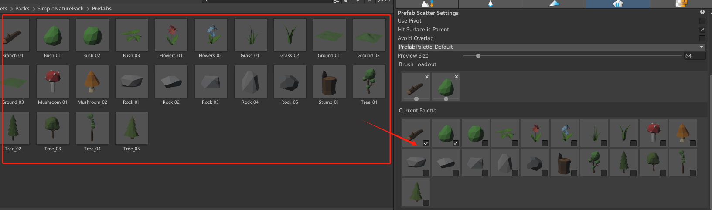
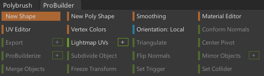
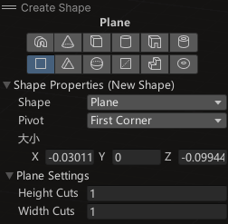
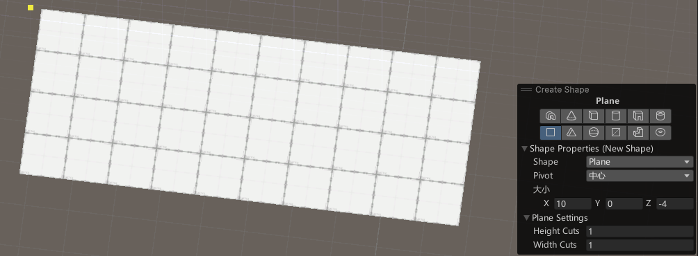
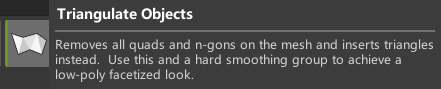
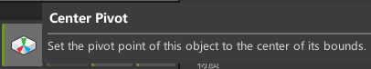
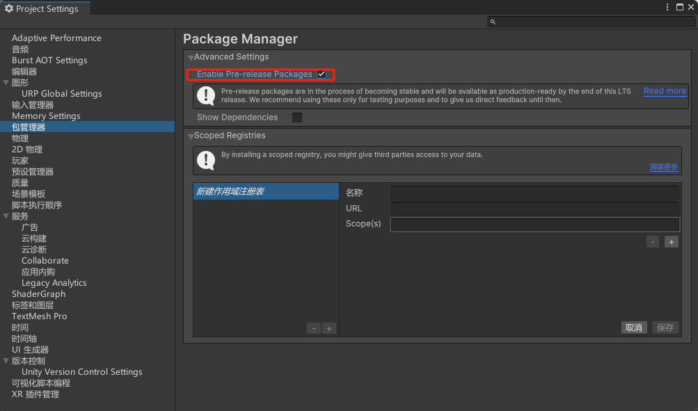
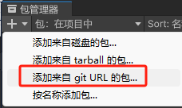
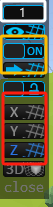

# Bolt

# 绘制工具 PolyBrush

> 地形调整与绘制

### 导入

> 如果没有使用URP或HDRP，导入Standard

### 工具窗口

> 在导航栏-工具中即可打开窗口
>
> 红框内为各个工具的公用设置

##### 基础设置

- 镜像笔刷 Brush Mirroring

##### 高度工具

- 基本操作：默认向上，Ctrl向下

  > 调整地形高低起伏

- 调整方向Direction

  - 法线 BrushNormal

  - 坐标系轴 Global X/Y/Z

##### 柔化工具

  > 柔化地形变化

  ##### 染色工具

  > **必须是PolyBrush Shader Texture**

  - 创建PolyBrush Shader Texture

    

  - 将Texture添加到对象上，即可染色

  - 染色设置

    - Brush 笔刷
    - Fill 按块填色
    - Flood 全部填充

##### Prefab放置工具

  - 添加素材：将Prefab拖拽到Current Palette

  - 选择放置对象：勾选Current Palette中的Prefab将其添加到Brush Loadout

    > Brush Loadout中的多个Prefab随机出现，可调整各个Prefab的出现概率

  - 放置/删除：左键放置，按住Ctrl删除

    > Strength调整密度
    >
    > 建议勾选Use Pivot、Hit Surface is Parent、Avoid Overlap

##### Texture放置工具

# Pro Builder

### Shape

##### 类型

##### 实例

- 创建Plane
  

### 其他工具

##### 三角对象转换

##### 锚点

# 辅助网格 Pre Grid

### 导入

> 需要先启用Pre-release Packages
>
> *com.unity.progrids*

### 使用

##### 网格大小

##### 移动吸附

##### 网格显示

