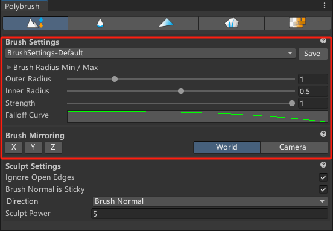
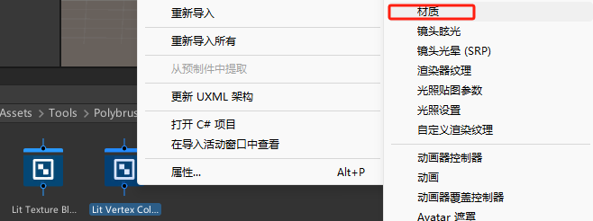

# Bolt

# PolyBrush

### 基础

##### 导入

> 如果没有使用URP或HDRP，导入Standard

##### 工具窗口

> 在导航栏-工具中即可打开窗口
>
> 红框内为各个工具的公用设置

- 基础设置

  - 镜像笔刷 Brush Mirroring

- 高度：默认向上，Ctrl向下

  > 调整地形高低起伏

  - Direction
    - 法线 BrushNormal
    - 坐标系轴 Global X/Y/Z

- 柔化

  > 柔化地形变化

- 染色

  > 必须是PolyBrush Shader Texture

  - 创建PolyBrush Shader Texture

    

  - 将Texture添加到对象上，即可染色

  - 染色设置

    - Brush 笔刷
    - Fill 按块填色
    - Flood 全部填充

- **快速放置Prefab**

  - 

- 快速放置Texture

