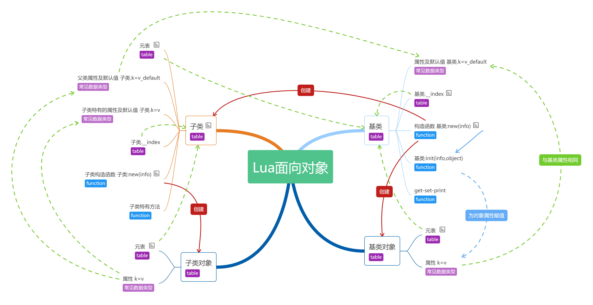
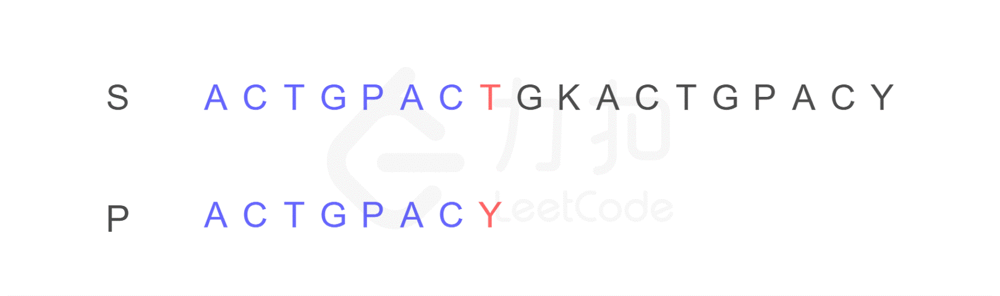
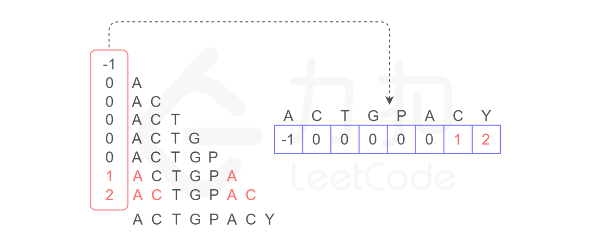
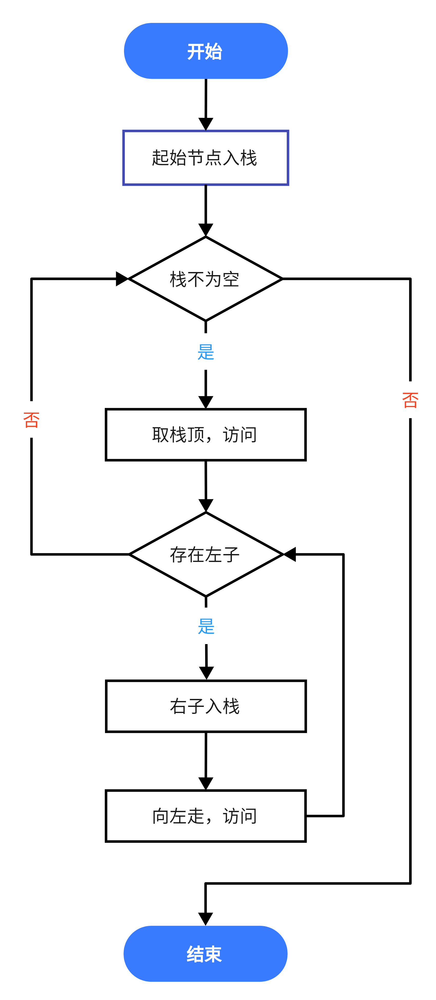
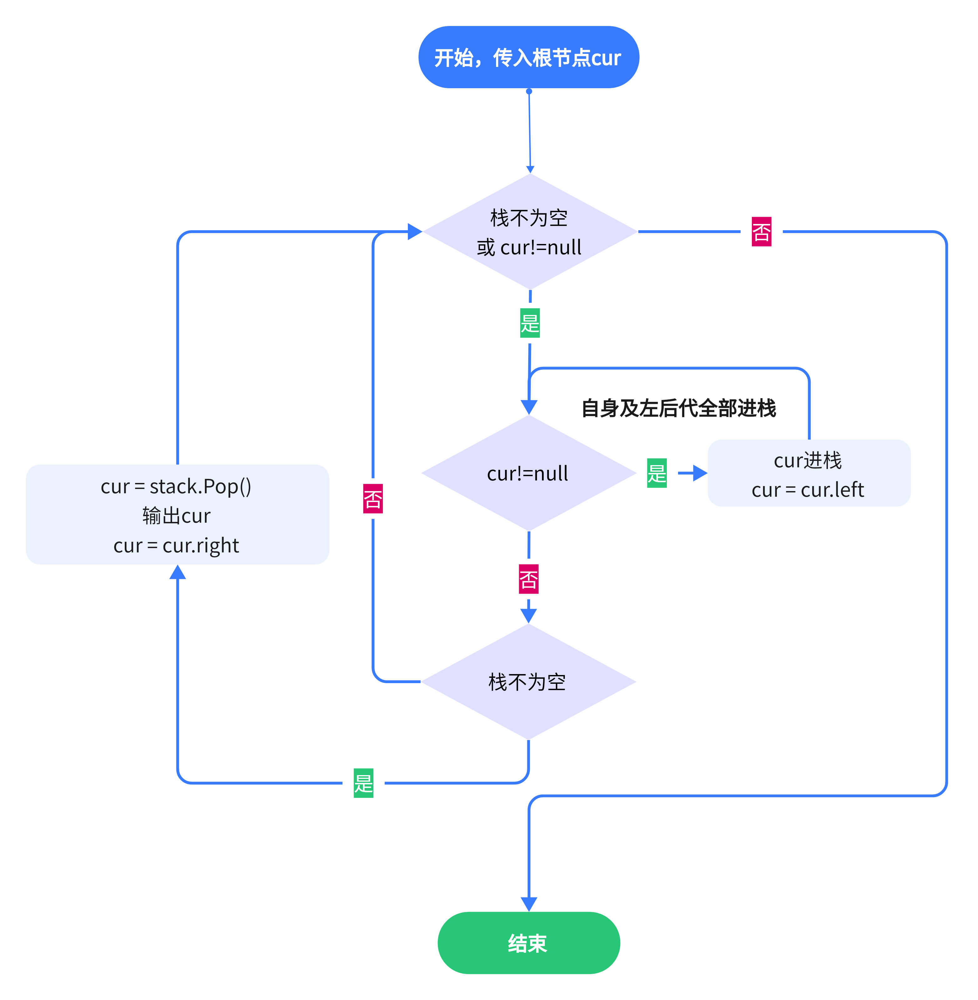
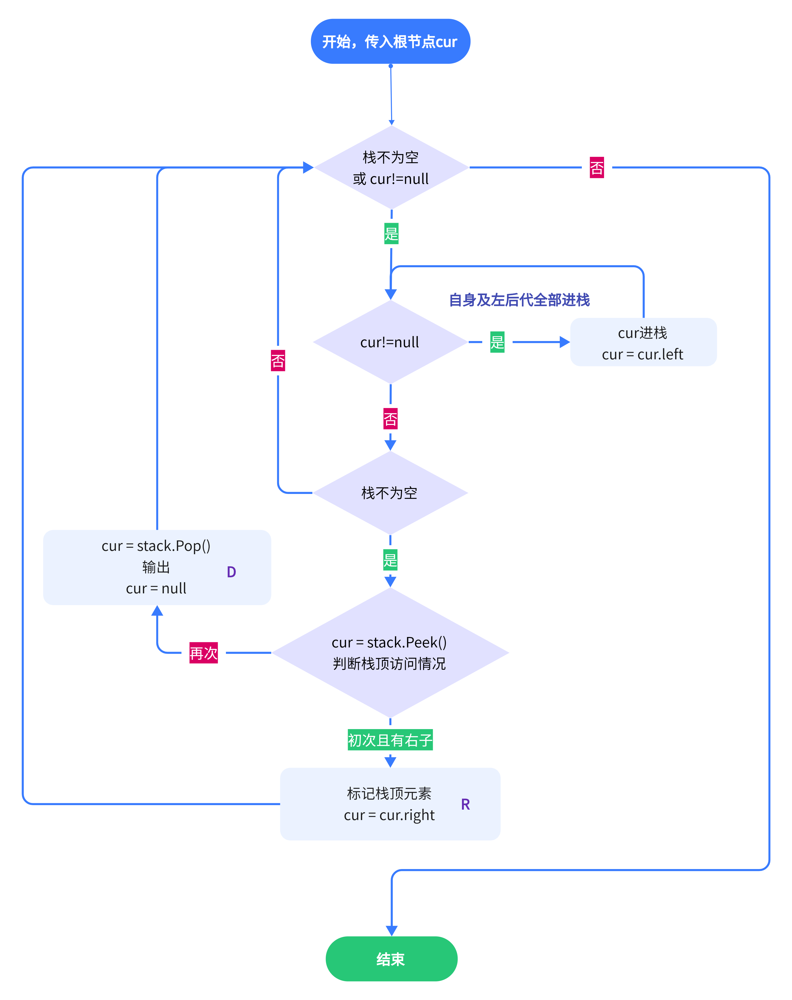
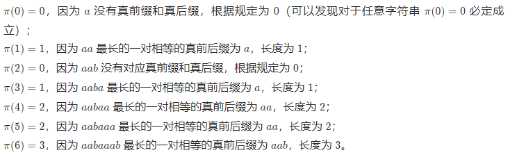

# 程序结构

### C语言


### JAVA


### Python

```python
def 函数(参数):
    # 函数程序

if __name__ == '__main__':
    # 主函数
```


### C#

1. **同一命名空间的类**皆可在同一项目的任意文件中调用创建实例
2. 若要使用**其他类的方法，必须创建实例**
3. 同一类的方法可以直接使用

```c#
namespace 命名空间
{
    class 类名称
    {
        static void Main(string[] args)
        {
            // 程序入口
            // 只能直接调用static修饰的函数
            // 或是先创建实例再调用其他函数
        }
    }
    
    class 类名称
    {
        // ……
    }
}
```


------


# 语言基础

### 数据类型

##### C#

- 获取类型：`object.GetType()`
- 数值型
- 引用型
  - 类对象

##### Lua

- 获取类型：`type = type(x)`

  > 结果的类型为字符串

- 数值型

- 引用型


### 输入输出

##### Python

##### Java

##### C#

```c#
Console.WriteLine("..."+"...")
Console.Write("这是输出序号：{0}，输出内容：{}",x,y)
```

##### Lua

```lua
print(x,y)
print(x.."\n")
```


### 条件

##### C#

> 与C语言相同

##### lua

```lua
if conditon then
    --
else
    --
end
```


### 循环

##### C

##### Python

```python
for i in range(n):
    # 循环变量范围：0~n-1

for i in range(x,y):
    # 循环变量范围：x~y-1
    
for i in range(x,y,k):
    # 循环变量范围：每次循环后x+=k，且x<y或x>y
```

##### Java

##### C#

```c#
for(int i=0;i<n;i++)
{
    // 常用循环
}

foreach(type i in list) 
{
    // 对于数组中的每个元素
}
```

##### Lua

> 可以借助于break或return跳出当前块

- while

  ```lua
  i = 0
  while condition do
      -- 内容
  end
  ```

- for

  - 数值循环：`for i=start,end,step do ...... end`

    > **i** 从 **start** 以步长 **step** 增长到 **end** ，默认step=1
    >
    > 相当于 for(int i=start; i<=end; i = i+step)

  - 泛型循环

    > 多用于借助迭代器处理数组（用ipairs()）、table（用pairs()）

    ```lua
    a = {x,y,z}
    for index,var in ipairs(a) do
        --
    end
    ```

- repeat

  ```lua
  repeat
      --
  until condition
  ```


### 运算

|        | C    | Python                               | Java | C#                               |
| ------ | ---- | ------------------------------------ | ---- | -------------------------------- |
| 加减   |      |                                      |      |                                  |
| 除     |      | /，//                                |      |                                  |
| 乘方   |      | pow(x,y) 或pow(x,y,z)<br />x^y%z，** |      | Math.Pow(x,n)                    |
| 开方   |      |                                      |      |                                  |
| 对数   |      |                                      |      | Math.Log(x,n)                    |
| 绝对值 |      |                                      |      | Math.Abs(x)                      |
| 随机数 |      |                                      |      |                                  |
| 最值   |      |                                      |      | Math.Max(x,y)<br />Math.Min(x,y) |

##### Lua

- 算术运算符
  - 指数：^
  - 取模：%
- 逻辑运算
  - 不等：~=
- 逻辑运算：and, or, not


### 前缀

##### C#

- 静态修饰符static

  > 可修饰对象：类、字段、属性、方法，使其具有 **单一实例** 的特性
  >
  > 内存分配时，静态优先且有序

  - 静态类

    - **不能实例化、继承**
    - 仅包含**静态成员**，不能包含构造函数

  - 静态成员

    - 存在唯一，在加载类的时候被创建在静态存储区中，直到程序退出

    - 无法使用this或base

      > 因为类的实例对象可能不存在

  - 静态方法

    - 不属于特定的对象，

    - 可访问静态成员

    - 无法直接访问实例成员，但可将实例成员作为参数传递给静态方法

      > 因为静态方法先于实例成员创建

  - 静态构造函数

    - 无法继承
    - 在类定义时可以与非静态构造方法一起定义

  - 示例

    ```c#
    class Program
     {
             public static int i =0;
             public Program()
             {
                 i = 1;
                 Console.Write("实例构造方法被调用");
             }
             static Program()
             {
                 i = 2;
                 Console.Write("静态构造函数被执行");
             }
             static void Main(string[] args)
             {
                 Console.Write(Program.i);//结果为2，首先，类被加载，所有的静态成员被创建在静态存储区，i=0,接着调用了类的成员，这时候静态构造函数就会被调用，i=2
                 Program p = new Program();
                 Console.Write(Program.i);//结果为1，实力化后，调用了实例构造函数，i=1，因为静态构造函数只执行一次，所以不会再执行。
             }
     }
    ```

- 其他

  | 访问修饰符         | 可访问       | 不可访问   |
  | ------------------ | ------------ | ---------- |
  | public             | 全部         | 无         |
  | private            | 当前类       | 子类、实例 |
  | protected          | 当前类、子类 | 实例       |
  | internal           | 项目内部     |            |
  | protected internal |              |            |

------


# 面向对象-类

### Python

##### 1. 创建

> 在成员方法中若要调用其他的成员方法或类成员
>
> 需要借助 **self**

```python
class 类名称():
    '帮助文档'
    
    # 类成员
    name = ''
    
    # 构造方法
    def __init__(self, 类成员):
        self.类成员 = 传入的类成员值
        
    # get-set
    def getName(self):
        return self.name
    def setName(self,name):
        self.name = name
    
    # 类方法
    def 函数名(参数):
        # 方法程序
```

##### 2. 构造实例

> 若不在同一文件，需要先导入：`from 文件名称 import 类名称`

```python
对象名 = 类名称(参数)
```


### JAVA


### C#

> 引用类型

##### 1. 基类/父类定义

```c#
class 类名称
{
    // 成员
    // 方法
}
```

- 类成员/属性：`修饰 Type 名称 = 值;`

  - 被 **static** 修饰的类成员，无论有多少对象，只有一个该成员副本

    > 各对象共享一个静态成员

  - 被 private/protected 修饰的类成员，需要定义 **Get-Set**

    > 定义后可当做public修饰的成员进行使用，但 **名称首字母要大写**

    ```c#
    protected string name
    
    public string Name
    	{
    		get { return name; }
    		set { name = value; }
    	}
    ```

- **构造函数

  ```c#
  // 必须是public修饰
  public 类名称(type 参数)
  {
      this.属性 = 参数;
  }
  ```

- 析构函数（非必须）

  > 无返回值，不能有参数、继承、重载
  >
  > 用于在结束程序时释放内存

  ```c#
  ~类名称()
  {
      
  }
  ```

- 类方法

  - 被 **static** 修饰的类方法，只能访问静态变量

##### 2. 创建对象

```c#
类名称 对象名称 = new 类名称(参数)
```

##### 3. **继承

- 继承标识：`class 子类: 父类`

- 构造函数：若父类有带参构造，子类必须先实现

  > 用: base(参数) 向父类构造方法传递参数

  ```c#
  class Person
      {
          protected string name = "";
          protected int age = -1;
          protected List<string> info = new List<string>();
          public string Name
          {
              get { return name; }
              set { name = value; }
          }
          public int Age
          {
              get { return age; }
              set { age = value; }
          }
  
          // 有参构造
          public Person()
          {
  
          }
          public Person(string name="",int age=-1)
          {
              this.name =  name;
              this.age = age;
          }
  
          public virtual void initInfo()
          {
              info.Add("name："+name);
              info.Add("age："+age.ToString());
          }
          public override string ToString()
          {
              initInfo();
              string ret = string.Join("；\n",(string[])info.ToArray());
              return ret;
          }
      }
  
  
  
      class Player:Person
      {
          private string gameId = "";
          public List<string> games = new List<string>();
          public string GameId
          {
              get {return gameId;}
              set {gameId=value;}
          }
  
          public Player(string name,int age, string gameId):base(name,age)
          {
              this.gameId = gameId;
          }
  
          public override void initInfo()
          {
              base.initInfo();
              info.Add(gameId);
              info.Add(string.Join(", ",(string[])games.ToArray()));
          }
  
      }
  ```

##### 4. **动态多态性

- 虚virtual：**允许** 重写

  > 通过父子类中的虚方法与重写实现
  >
  > 调用子类重写的方法时，会 **先执行虚方法语句** ，再执行重写语句
  >
  > 因此，不建议重写有返回值的方法

  - 父类中的虚方法定义

    ```c#
    public virtual 返回值类型 函数名称(参数)
    {
        // 虚方法执行语句
    }
    ```


  - 子类中的重写

    ```c#
    public override 返回值类型 虚方法名称(参数)
    {
    	base.虚方法名称(参数);
    	// 子类添加的执行语句
    }
    ```

- 抽象abstract：**必须** 重写

  - 特点
    - 抽象方法必须存在于抽象类中，且不能被实现
    - 抽象类不能被实现，只能被继承，构造函数和省略
    - 抽象方法 **必须被重写**


##### 5. **类的运算符重载

> 可以定义两个类的运算，定义在类内
> 适合属性需要运算的类
>
> 修饰：static，virtual

```c#
public 函数修饰 返回值类型 operator+ (参数) {}
```

- 重定义加法

  ```c#
  public static 类名称 operator +(类名称 x, 类名称 b)
  {
      // 运算过程
  }
  ```

##### 6. 自定义索引器

##### 7. **委托：delegate

- 针对情况：事件驱动

  > 各个类之间可能拥有复杂的组织关系，形成 **触发-执行** 机制
  >
  > 当某个类执行某方法时，可能会引发其余多个类执行各自的方法

- 原理

  > 将一些 **参数、返回值类型一致的方法** **批量执行**，相当于同一类型方法的容器类型
  >
  > 将事件单独定义，并 **与相关的方法绑定**
  >
  > 事件发生时，**执行所有绑定的方法**

- 声明委托类型

  > 其实规定的是此类委托变量 **可绑定的方法的参数、返回值类型**

  ```c#
  public delegate 返回值类型 委托类型名称(type 参数)
  ```

- 创建委托

  > 创建 **存储同类型方法的容器**

  ```c#
  委托类型 委托1, 委托2, ... ;
  ```

- 绑定/解绑委托方法

  > **委托方法** 的返回值、传入参数必须 **与委托声明一致**
  >
  > 调用委托变量时，**所有绑定的委托方法都将被执行**

  ```c#
  委托 += 委托方法;
  委托 -= 委托方法;
  
  // 当委托方法比较简单时，可使用匿名方法
  xxxxxxxxxx 委托变量 += (传入的参数名称) => {//方法内容}；
  ```

- 例

  ```c#
  // 委托
          public delegate void Event(string s);
          Event output;
          public void test_Delegate()
          {
              string func = "委托";
              utils.funcStart(func);
  
              output += (s) => { Console.WriteLine("委托方法1，"+s);};
              output += (s) => { Console.WriteLine("委托方法2，"+s);};
              output("执行");
              // 输出：
              // 	委托方法1，执行
              // 	委托方法2，执行
  
              utils.funcEnd(func);
          }
  ```


##### 8. 无返回值委托：Action

> 相当于简化版的delegate
>
> 可以指向一个 **任意参数、无返回值** 的方法

- 定义

  > 不用先定义类型

  - 无参数：`Action action = 方法名;`
  - 有参数：`Action<T,T,...> action = 方法名;`

- 使用

  - 无参数：`action()`
  - 有参数：`action(参数1, 餐数2, ...)`

- 例子

  ```c#
  // 动作
          public void hit()
          {
              Console.WriteLine("打击！！");
          }
          public void hitEnemy(string name,int num)
          {
              Console.WriteLine("打击{0}{1}下",name,num);
          }
          public void test_Action()
          {
              string func = "Action";
              utils.funcStart(func);
  
              Action a1 = hit;
              Action<string,int> a2 = hitEnemy;
              a1();				// "打击！！"
              a2("敌人",4);		   // "打击敌人4下"
  
              utils.funcEnd(func);
          }
  ```

##### 9. **接口

> 与类相似，但是 **只包含需要实现的方法的定义**
>
> 实现类必须  **实现接口中定义的所有方法**
>
> 实现时直接定义即可，不必加override

```c#
interface 接口
{
    // 成员声明
    void 方法名称();
}
```


### Lua

> 尽量不在对象的方法中使用全局变量，否则容易使该方法将与全局变量相关，而非对象本身
>
> ```lua
> Account = {balance=0}
> function Account.withdraw(v)
> 	Account.balance = Account.balance - v    
> end
> 
> a = Account; Account = nil
> a.withdraw(100)		-- 错误，因为方法与Account有关，而Account已被回收
> ```
>
> 借助 **:** 和 **self** ，在方法定义和引用时自动传入对象本身



##### 1. 基类定义

- 类属性及其默认值：`类名称 = {成员1=v1, 成员2=v2, ...}`

- 将基类的 **__index方法设置为自己**

  > 这样在创建对象时不必再说明基类方法
  >
  > 当对象调用类方法时，将直接从基类中寻找对应方法

- **构造方法

  > 建议将对象创建与对象属性赋值分开，**防止将错误的类设置为对象的元表**
  >
  > **步骤**：（关键在2、3）
  >
  > 1. 初始化对象空table
  > 2. **将基类设置为对象元表**
  > 3. 根据传入参数，为对象**属性赋值**
  > 4. 返回对象
  >
  > 例子：a.withdraw(v)，步骤如下
  >
  > ​	a中没有withdraw，去元表的__index里寻找
  >
  > ​	getmetatable(a).__index.withdraw(a,v)
  >
  > ​	--> Account.__index.withdraw(a,v)
  >
  > ​	--> Account.withdraw(a,v)，相当于调用了基类的方法

  ```lua
  -- 构造方法
  function 基类:new(o)     
      local o = {}
      -- 使 基类.__index = 基类，优化调用时的搜索
      self.__index = self 
      -- 将基类作为新对象的元表，即将基本属性、方法附加给对象实例
      setmetatable(o,self)
      self:init(o,object)
      return o
  end
  ```

- **对象属性赋值方法：`类:init(info,object)`

  ```lua
  -- 属性赋值（避免无效属性）
  function Person:init(info,object)
      if info~=nil then
          for k,v in pairs(info) do
              if self[k]~=nil then
                  object[k]=v
              else
                  print("父类不含有属性"..k)
              end
          end
      --else
      --    print("属性使用默认值")
      end
  end
  ```

- 一般方法

  ```lua
  function 基类:方法(参数)
      -- 若要访问成员或其他方法，用 self. 访问
  end
  ```
  
- 示例：Person

  ```lua
  -- 属性初始化
  local Person = {name="无名",ismale=true,age=-1}
  Person.__index = Person
  
  -- 对象构造方法
  function Person:new(info)
      local object = {}
      self:init(info,object)
      setmetatable(object,Person)
      --print("构造完成\n")
      return object
  end
  
  -- 属性赋值（避免无效属性）
  function Person:init(info,object)
      if info~=nil then
          for k,v in pairs(info) do
              if self[k]~=nil then
                  object[k]=v
              else
                  print("父类不含有属性"..k)
              end
          end
      --else
      --    print("属性使用默认值")
      end
  end
  
  -- 属性相关方法
  function Person:get(k)
      return self[k]
  end
  function Person:set(k,v)
      self[k] = v
  end
  function Person:print(k)
      print(self[k])
  end
  
  return Person
  ```


##### 2. 创建对象：`对象 = 类:new({参数})`

> 继承表现为 **通过元表.__index保存基类信息**
>
> 对象结构：
>
> {
>
> ​	类属性 = 对象值,
>
> ​	元表 = 父类{ 类成员 = 默认值, 类方法，__index = 父类}
>
> }

```lua
local Person = require("test_object_oriented.Person")

local info = {name="dsh",ismale=true,age=22}
local dsh = Person.new(info)
dsh:print("age")	--> 22
```

##### 3. 子类继承

> 本质上也是通过父类构造方法创建的对象
>
> 只保存子类特有的属性和方法，**父类原有的属性和方法通过元表.__index访问**
>
> 注意需要重写父类的构造方法，**以免将父类绑定为对象的元表**

- 单继承

  > 子类构成：
  >
  > {
  >
  > ​	新的子类成员 = 默认值
  >
  > ​	子类方法
  >
  > ​	元表 = 父类{ 
  >
  > ​		父类成员 = 默认值, 
  >
  > ​		父类构造方法、一般方法，
  >
  > ​		__index = 父类}
  >
  > }

  ```lua
  local Person = require("test_object_oriented.Person")
  
  -- 继承
  local Player = Person:new()
  Player.game = "玩家身份"    -- 新属性
  Player.__index = Player
  
  
  -- 重写构造方法
  function Player:new(info)
      local object = {}
      self:init(info,object)
      setmetatable(object,self)
      return object
  end
  
  -- 新方法
  function Player:selfIntroduce()
      local sex
      if self.ismale then
          sex = "男"
      else
          sex = "女"
      end
      local info = {
          "我是"..self.name,
          "性别为"..sex,
          "今年"..self.age.."岁",
          "喜欢的游戏为"..self.game
      }
      print(table.concat(info,"，"))
  end
  
  return Player
  ```

- **多重继承

  > 本质：**在调用元表.__index查找目标时，在所有父类中进行搜索**
  
  ```lua
  ---
  --- Generated by EmmyLua(https://github.com/EmmyLua)
  --- Created by Administrator.
  --- DateTime: 2022/7/19 15:43
  ---
  
  --父类
  local Player = require("test_object_oriented.Player")
  local Student = require("test_object_oriented.Student")
  
  
  -- 继承
  local Employee = {}
  Employee.parents = {Player,Student}
  local function search(parents,k)    -- 多重继承的 __index搜索策略
      for i=1,#parents do
          local res = parents[i][k]
          if res then return res end
      end
      print(k.."无对应属性")
      return nil
  end
  setmetatable(Employee,
          {__index = function(t,k)
              return search(t.parents,k)
          end}
  )
  Employee.company = "公司名称"
  Employee.__index = Employee
  
  
  -- 构造方法
  function Employee:new(info)
      local object = {}
      self:init(info,object)
      setmetatable(object,self)
      return object
  end
  
  
  -- 新方法
  function Employee:employeeIntroduce()
      local sex
      local game
      if self.ismale then
          sex = "男"
      else
          sex = "女"
      end
      if type(self.game)=="table" then
          print("有多种游戏")
          game = table.concat(self.game,"、")
      else
          game = self.game
      end
      local info = {
          "我是"..self.name,
          "性别为"..sex,
          "今年"..self.age.."岁",
          "喜欢的游戏是"..game,
          "毕业于"..self.school,
          "目前在"..self.company.."工作"
      }
      print(table.concat(info,"，"))
  end
  
  
  return Employee
  ```

##### 4. 具有私有性的类的构造器

> 只能通过调用类方法访问成员
>
> 本质上是**不对方法进行命名**，而只返回访问方法的对象
>
> 如此一来，**类方法根本不是保存在基类中**，而是 **在生成对象时才定义**

```lua
function 类名称(参数)
    -- 保存类成员
    local self = {成员 = 默认值}
	-- 类方法：可直接通过self访问类成员
    local cost = function(v)
        self.balance = self.balance - v
    end
	-- 返回供外部访问的对象，将方法名与方法实现匹配
    return {
        cost = cost,
        save = save,
    }
end
```

##### 5. 单一方法

```lua
-- 针对只有一个成员的简单类和其对象
function newObj(value)
    -- value被保存在返回函数的closure中
    return function(action,v)
        if action=="get" then return value
        elseif action=="set" then value=v
        else error("无效操作")
        end
    end
end

a = newObj(10)
print("a = " .. a("get"))
a("set",a("get")+30)
print("a+30 = " .. a("get"))
```

------


# 字符串

### JAVA


### Python

> 在Python中，相同内容的字符串都是同一个对象

##### 1. 定义

- `string = "xxxxxxxxx"`
- `string = input()`

##### 2. 基本操作

- **访问单个字符：`string[index]`
- 拼接：`string + "xxx"`
- **判断字符相等：`str1 == str2`

##### 3. **将输入转换为list

- 输入格式：元素之间以空格分隔

- 转换方法：`list  = input().split()`

  > 常用于一组数据的输入处理
  >
  > 注意：输入的元素数据类型必须一致，必须**全是数字才能作为数组**，否则会被当做无法转成数字的str类型

##### 4. 将对象转换为1个字符串：`"拼接方式".join(对象)`

> 对象可以是列表、字符串，得到一个新的字符串

##### 5. 获取包含的字符：`chars = list(set(string))`

> 将字符串拆分、去除相同元素
>
> 配合使用numerate构造的字典或原始字符串，或split，即可轻松获取某字符出现的次数
>
> ```python
> # 存储每个字符
> str_list = list("s s s s s t t t t r r r".split())
> # 存储出现过的字符
> chars = list(set("sssssttttrrr"))	// s, t
> # 出现次数统计
> print(str_list.count(chars[0]))
> ```
>


### C#

> https://www.runoob.com/csharp/csharp-string.html

##### 1. 创建

- 直接定义：`String 名称 = "xxx"`

- 将char[]构造成字符串

  ```c#
  // 构造方法将字符数组拼接成字符串
  char[] letteres = {'H','e',……};
  string hello = new string(letters);
  ```

##### 2. **相关方法

```c#
string hello = "Hello world";

// 可当做字符数组访问单个字符（类型为char）
hello[1];
// 截取（类似于Python的切片操作）
string word = hello.Substring(beginIndex,num)

// 求长度
hello.Length;

// 是否包含
bool result = hello.Contains("e");

// 是否相等
result = hello.Equals("hello");
result = hello[index].Equals('c');
hello[index]=='c';

// 字符第一次出现的位置
int index = hello.IndexOf('l');

// 分割字符串
string[] arr = hello.Split(" ");
```

##### 3. **转换

- int与string

  - int --> string
    - `string str = num.ToString();`

  - string --> int
    - `int num = Convert.ToInt32(str)`

    - `int num = int.Parse(str)`

- int与char

  > 常用str[i]得到char类型数据
  >
  > 实际上是ASCII码的转换

  - char --> int：`int a = 'A'`

    > '0' --> 48

  - int --> char：`char a = (char)65`

  - 特殊操作

    ```c#
    // 循环输出大写字母（字符可直接进行加减操作，得到对应字符）
    for(int i='A';i<'E';i++) Console.WriteLine((char)i);
    ```

- string与char[]

  - string --> char[]：`char[] arr = str.ToCharArray();`

  - char[] --> string：`string str = new string(arr);`

- string与ArrayList / List

  - 获得列表：`ArrayList list = new ArrayList(str.Split(‘字符’) ) ;`

    > 相当于用分割字符将str分割，再将各部分加入ArrayList中
    >
    > **但没有确切的分割字符时，无效**

  - 获得字符串：`string str= string.Join(",", (string[])list.ToArray(typeof(string)));`

    > 需要 **元素类型相同 **！！！
    >
    > 尤其要 **小心char和string类型同时出现** ！！！
    >
    > 建议：通过字符串的**Substring**方法切割字符串并用ArrayList存储，最后再拼接

- string[] --> string：`string str= string.Join("拼接字符", strArray);`

  > 相当于把字符串数组的内容拼接


### Lua

##### 1. 定义

- 一般字符串：`string_test = ""`

- 字母字符串：`string_test = [[……]]`

  > 用此方法可以输出例如：“字符串”

  
  

##### 2. 操作

> Lua字符串是不可变的值，不能单独修改字符，但可以根据修改要求新建字符串

- **求长度：`string.len(s)`

- 拼接：`string_1 .. string_2`

  > 会自动将拼接的数字转换成字符串

- **输出

  - 一般输出：`print(string_test)`

    > 在print时，甚至能将两个数字拼接
    >
    > Lua会自动将与数字进行运算的数字字符转换成数字\

  - 格式化输出：`string.format("格式", var)`

    > 类似C语言

- **部分修改：`b = string.gsub(a, a的待修改部分, 修改目标内容)`

- 查找目标内容位置：`i,j = sting.find(字符串, 目标内容)`

  > 返回目标内容的开始、结束下标，从1开始

- 大小写转换

  - `string.upper(s)`
  - `string.lower(s)`

- 翻转：`string.reverse(s)`

- ASCII与字符互相转换

  - 转换成string：`string.char(x,y,z,...)`

    > 输入多个参数时，转换后自动拼接

  - 转换成整形：`string.byte(s, index)`

    > 将选定字符转换成ASCII码，默认第一个
    >
    > 当传入两个index时，可返回s[i]到s[j]的ASCII码

- **截取：`string,sub(s,start,end)`

  > 可以用此方式进行字符串单个字符的访问
  >
  > 当start=end时，可截取单独一个字符
  >
  > 负数代表倒数序号
  
- 分散字符串连接：`table.concat(strs,mod)`

  > 可将存储于table中的字符串连接
  >
  > mod为连接方式，例如：” “ 或 ”, “


### 经典问题

##### **字符串匹配算法KMP

- 描述

  > 判断一个字符串是否是另一个字符串的子串

  - 基础方法

    > 从标准字符串的开头开始逐个比较字符是否相同
    >
    > 不同，则从标准字符串的下一个字符卡死逐个比较

    

  - KMP

    > 发现不同字符后，从标准串的 i 和目标串的 j 开始逐个比较

    

- 关键：确定目标串的每个字符发生比较冲突时，下次比较开始的位置

  > 目标字符串 i 位置对应的下次比较开始的数组下标
  >
  > 为 0到i-1的最长公共前后缀长度
  >
  > 

##### 空格均匀排布

- 描述

  > 将字符串中的空格均匀排布在各个单词之间

- 关键

  - 用List存储单词
  - 用 `string.Join` 方法进行连接

```C#
public string ReorderString(string text)
{
    ArrayList result = new ArrayList();     // 所有单词
    int num_space = 0;                      // 空格数量
    int i;
    int count = 0;                          // 记录当前单词长度

    // 遍历，进行空格数量统计和单词存储
    for(i=0;i<text.Length;i++)
    {
        if(!text[i].Equals(' '))
        {
            count++;
            // Console.WriteLine("{0}, {1}",i,count);
        }
        else
        {
            num_space++;
            // 上一个单词结束，切割单词，加入result
            if(i>0 && !text[i-1].Equals(' '))
            {
                // Console.WriteLine(text.Substring(i-count,count));
                result.Add(text.Substring(i-count,count));
            }
            count = 0;
        }
    }
    if(count>0) result.Add(text.Substring(i-count,count));
    Console.WriteLine("遍历完成，单词数量：{0}，空格数量：{1}",result.Count,num_space);

    // 计算用于分割和结尾的空格数量，生成间隔空格和尾空格
    int n = 0;
    if(result.Count==1) n = 0;
    else n = num_space/(result.Count-1);
    string mid = "";
    for(i=0;i<n;i++) mid = mid+" ";
    if(result.Count==1) n = num_space;
    else n = num_space%(result.Count-1);
    string tail = "";
    for(i=0;i<n;i++) tail = tail+" ";

    Console.WriteLine(string.Join(mid, (string[])result.ToArray(typeof(string))) + tail + ";");
    return "\nover\n";
}
```


------


# 结构体

### C


### C#

##### 1. 定义

> 与类很相似
>
> 但是 **值类型** ，不支持继承，不能声明默认构造函数
>
> 可用于定义简单的数据类型

```c#
struct name
{
    // 变量
    
    // 方法
}
```

##### 2. 使用

> 用 **New** 操作符创建一个结构对象时，会调用适当的构造函数来创建结
>
> 若不使用 **New** ，只有在所有字段均初始化之后，才能被赋值

- `struct_type 名称 `
- `struct_type 名称 = new struct_type() `

------


# 枚举

> 一般用于定义简单的新类型数据

### C#

##### 1. 声明：`enum 名称 {x_1, x_2, ……}`

> 列表中的每个符号代表一个整数值，**后面的比前面的大1**
>
> 当对其中某个字符赋值时，前面的字符值不变，后面的字符值会自动改变
>
> 默认从0开始
>
> 必须 **定义在方法外**

##### 2. 使用：`名称.符号`

> 输出时一般 **直接输出符号**，除非涉及运算

```c#
class Test
    {
        Utils utils = new Utils();
        enum Game  {
                DotA, MHR, SC
                };


        public void test_Enum()
        {
            string func = "枚举";
            utils.funcStart(func);

            Game x = Game.DotA;
            Game y = Game.MHR;
            Game z = Game.SC;
            // 输出：DotA, MHR, 3
            Console.WriteLine("{0}, {1}, {2}",x,y,z+1);

            utils.funcEnd(func);
        }
}
```


------


# 元组

### JAVA


### C#

> 常用于 **返回多个值** 或者 **传递多个值**
>
> 注意：**不能作为类型参数** （比如创建元组类型的集合）

- 定义：`var tuple = Tuple.Create(v1,v2,v3,...)`
- 访问：`type v1 = tuple.Item1`


# 集合

> 常用于表元素去重
>
> 可借助于集合获取表中元素值的种类数目

### Python

> https://www.runoob.com/python3/python3-set.html#setmethod

##### 1. 定义

- 空集合：`set = set()`

- 直接赋值：`set = {value1, value2, ……}`

- 转换：set = set(object)

  > 若是列表/字符串，则还可以去重

##### 2. 基本操作

- 增
- 删
- 改
- 查

##### 3. 集合运算


### JAVA


### C#

##### 1. 哈希集HashSet

> 不支持排序
>
> **不重复**的**无序**列表
>
> 优势在于 **运算快** ，作为一种存放在内存的数据，可以很快的进行设置和取值的操作。
>
> 常**用于判断数据是否存在**，例如两个数据集是否有相同的数据

- 定义：`HashSet<type> set = new HashSet<type>(可选·数组)`

  > 可传入数组进行转换构造

- 求长度：`int len = set.Count`

- 添加：`set.Add(type data)`

- 判断存在：`bool result = set.Contains(type data) `

- 测试程序

  ```lua
  public void test_HashSet()
  {
      string func = "哈希集合";
      utils.funcStart(func);
  
      HashSet<int> hs = new HashSet<int>(new int[]{2,11,32,99});
      Console.WriteLine("存入1、4、10");
      hs.Add(1);
      hs.Add(4);
      hs.Add(10);
      Console.WriteLine("10是否在集合中：{0}",hs.Contains(10));
      int[] arr = hs.ToArray();
      utils.printArrayInt(arr);
  
      Console.WriteLine("\n数组转换成集合");
      ISet<int> set = new HashSet<int>(arr);
      Console.WriteLine("集合包含4？\t{0}",set.Contains(4));
  
  
      utils.funcEnd(func);
  }
  ```

  


# 顺序表

### C语言

##### 1. 顺序表/数组

- 数据结构

  > 用数组存储

  ```c
  #define MAX 10
  typedef int Datatype;	// 定义数据类型为int
  typedef struct node
  { Datatype data[MAX]; int last;} *List;
  ```

- 相关方法

  - 创建
  - 求长度

##### 

### JAVA

##### 1. 数组

> 不可直接输出
>
> 需要引入 **java.util.Arrays** 进行排序、比较
>
> https://www.runoob.com/java/java-array.html

- 定义
  - 简单实例：`type[] array = new type[size]`
  - 初始化：`type[] array = {value0, ……}`

- 访问

  - 按序号查询：`array[index]`
  
  - foreach循环访问
  
    ```java
      for(type element: array)
      {
          // 访问array中的每个element
      }
    ```
  
  - **求长度**：`array.length`
  
  - **排序**：`Arrays.sort(array)`
  
  - 翻转：`Collections.reverse(Array.asList(array))`
  
  - 比较：`Arrays.equals(array_1, array_2)`

##### 2. **数组列表 ArrayList

> 需要 **java.util.ArrayList**
>
> 可随意更改长度、内容，查找、修改效率高
>
> https://www.runoob.com/java/java-arraylist.html

- 定义：`ArrayList<Type> list = new ArrayList<>();`
- 访问
  - 添加元素：`list.add(value)`
  - 删除：`list.remove(index)`
  - 按序号查询：`list.get(index)`
  - foreach访问：`for(type element: list)`
  - 修改：`list.set(index, value)`
  - 求长度：`list.size()`
  - 转换成array：`list.toArray(array)`
  - 排序：`list.sort()`


### Python：列表

> 和字符串复合输出时要先转换成字符串：`str(list)`
>
> 求长度：`len(list)`

##### 1. 基本操作

- 定义
  - 一般初始化：`list = []`
  - 赋值初始化：`list = [value]*n`
- 基本操作

```python
'''
    Python中，list可实现线性表、堆栈
    操作方法：list.xxxx
        1. append(x)：添加到末尾
        2. insert(index,x)：插入到指定位置
        3. extend(L)：与另一个列表进行拼接
        4. remove(x)：删除第一个值为x的元素
        5. pop(index)：删除并返回指定位置的元素，默认删除最后一个元素
        6. clear()：清空
        7. index(x)：查找并返回第一个值为x的元素的索引
        8. count(x)：计算x出现的次数
        9. sort()：排序
        10. reverse()：倒序
        11. copy()：返回列表的复制
'''
```

##### 2. 访问

- 访问单个元素：`list[index]`

- 访问多个元素：`list[x,y]`

  > 返回一个**新的list**，元素为 **list[x]~list[y-1]**

##### 3. **扩展操作

- **将输入的字符串转换成列表：`list = input().split("分隔符",分割次数)`

  > .split()：默认分隔符为 **空格**，默认分割次数为 每次

- 列表相加：

- **元素求和：`sum(list)`

- **判断是否包含元素：`值 in list`

  > 这种方式省去了自己编写查找算法的工作，适合简单列表的处理
  
- 将列表元素转换为 **序号-数据**：`enumerate(list)`

  > 原先：[a, b, c, d]
  >
  > list(enumerate(list))：[(0,a), (1,b), (2,c), (3,d)]
  >
  > 使用for循环访问：`for i, element in enumerate(list)`
  
- 去重：`list(set(list_origin))`

  > 借助集合即可去重

##### 4. 二维数组

- 初始化

  ```python
  arr = [[0]*n for x in range(n)]
  ```

- **快速遍历求和

  ```python
  '''
  	使用product(x,y)生成笛卡尔积元组
  	(x[0],y[0])
  	(x[0],y[1])
  	……
  	(x[m],y[n])
  ''' 
  
  sum(关于arr[i][j]的求和条件 for i,j in product(range(len(arr)),range(len(arr[0])))
  ```


### C#

##### 1. 数组

> 不能直接输出

- 定义

  ```c#
  // 一维数组
  Type[] 名称 = new Type[size];
  Type[] 名称 = {内容};
  
  // 伪二维数组
  // 错误的初始化方式：Type[][] 名称 = new Type[m][n];
  Type[][] 名称 = new Type[m][];
  Type[][] 名称 = {new Type[]{...} , new Type[]{...} , ...}
  
  // 二维数组
  Type[,] 名称 = new Type[row,col]{{...} , {...}};
  Type[,] 名称 = new Type[,]{{...} , {...}};
  Type[,] 名称 = new Type[row,col];
  ```

- 访问

  - 序号访问

    - 一维：`arr[i]`

    - 伪二维：`arr[i][j]`
  
    - 二维：`arr[i,j]`
  
  - foreach访问
  
    ```c#
      foreach(Type i in 数组)
      {
          // 对每个元素进行访问
      }
    ```
  
- 基本操作

  - **求长度
  
    ```c#
    // 一维数组
    int len = arr.Length;
        
    // 二维数组
    int len = arr.Length;
    int row = arr.GetLength(0);
    int col = arr.GetLenght(1);
    ```
  - 排序：`Array.Sort(名称,排序方式)`
  
    > 默认为升序，但可以借助匿名函数的方式自定义排序
    >
    > 通过此方式，可以对多种数据类型的数组按需进行排序
    >
    > ```c#
    > // 升序
    > Array.Sort(arr,(a,b) => a-b);
    > 
    > // 降序
    > Array.Sort(arr,(a,b) => b-a);
    > ```
  - 翻转：`Array.Reverse(名称)`
  - 输出：`string.Join(",",arr)`
  
    > 拼接成字符串输出
  
- **转化：`.ToArray`

  > Set、List都可以用此方式转化成对应的数组

##### 2. **动态数组List

> 只能存储默认类型的数据
>
> 与ArrayList类似

- 定义

  ```c#
  // 默认创建
  List<type> list = new List<type>();
  
  // 根据数组创建
  List<type> list = new List<type>(type[] arr);
  ```

- 访问


##### 3. 任意类型动态数组ArrayList

> https://www.runoob.com/csharp/csharp-arraylist.html
>
> 需要：`using System.Collections;`
>
> 不同于List，可以存储 **任意类型** 的数据

- 定义

  - 创建：`ArrayList 名称 = new ArrayList()`

  - **将数组转化：`ArrayList arrayList = new ArrayList(array);`

    ```c#
    int[] intTest = new int[5] { 1, 2, 3, 4, 5 };
    ArrayList arrayListTest2 = new ArrayList(intTest);
    ```
    
  - **将string转化：`ArrayList list = new ArrayList(str.Split(','))`

    > 常见的分隔符包括 **','** **' '**等

- 访问
  
  - 单个访问：`datas[index]`
  - 循环遍历：`foreach(type x in datas) {}`
  
- 操作
  
  - 添加到末尾：`名称.Add(value)`
  
    > 尽量保证插入 **元素类型相同** ！！！
  
  - 插入
    - `名称.Insert(index, value)`
    - `名称.InsertRange(index, collection)`
    
  - 删除
    - 指定值：`名称.Remove(value)`
    - 指定序号：`名称.RemoveAt(index)`
    - 指定范围：`名称.RemoveRange(index, count)`
    
      > 输入起始序号和个数
    
  - 清空：`名称.Clear()`
  
  - **是否包含：`名称.Contains(value)`
  
  - **求对应值第一次出现的序号：`名称.IndexOf(value)`
  
  - **求长度：`名称.Count`
  
  - 排序
    - `名称.Sort()`
    - `名称.Reverse()`
  
- 转换
  
  - 转换为字符串：`string str= string.Join(",", (string[])list.ToArray(typeof(string)));`
  
    > 需要元素类型相同！！！
    >
    > 尤其要小心char和string类型同时出现！！！
    >
    > 建议：通过字符串的**Substring**方法切割字符串并用ArrayList存储，最后再拼接


### Lua

> table

##### 1. 定义

> 未被初始化的元素value为nil
>
> 注：Lua的table属于**引用类型**，即使用 `=` 进行复制操作后，连个变量指向同一个对象

- `a = {}`

- `a = {v1,v2,v3,...}`

  > 这种方式定义的是数组，key默认从1开始

##### 2. 操作

- 一般操作：可视为简化的动态数组，无法直接输出

  - 利用迭代器输出
  - **拼接输出：`s = table.concat(arr,"链接符号")`

- **求长度：`#table`

- 迭代器相关访问

  > https://www.runoob.com/lua/lua-iterators.html

  - **`ipairs(array)`

    > ipairs只能访问纯数组，访问有序

    ```lua
    for index,value in ipairs(array) do
        -- 
    end
    ```

  - 无状态迭代器

  - 多状态迭代器

- **连接：`table.concat(arrary, 连接方式, start, end)`

  > 连接方式：“ ”、”，“
  >
  > 可结合字符串切片实现对字符串单个字符的操作后的再输出

- 插入：`table.insert(array,pos,value)`

  > 默认为末尾
  >
  > 或直接指定k-v对

- 删除：`table.remove(array,pos)`

  > 默认为末尾

- **排序：`table.sort(table,comp)`

  > comp为可选的比较函数，例如
  >
  > ```lua
  > names = {"dsh","htm","cwf"}
  > age = {dsh=23, htm=21, cwf=22}
  > -- 年龄小的在前排序
  > table.sort(names, function(n1,n2) return age[n1]<age[n2] end)
  > ```


### 经典使用

##### 数组的对角线遍历


------


# 哈希表

> 集合哈希表，可实现根据存储元素访问其在列表中的序号的操作

### JAVA


### Python

> 字典

##### 1. 定义

- 一般定义：`dic = {k:v, k:v}`

  > 值可以取任何数据类型，但键必须是字符串，数字或元组。

- **从列表转化

  > 可通过此方式把列表的index作为值，把原来的数据作为键
  >
  > 以此方式可达成 值-->index 的映射

  ```python
  # hash = {data_1:index_1, data_2:index_2, ....}
  for index,data in enumerate(list):
  	hash[data] = index
  ```

##### 2. 访问：`dic[key]` 

##### 3. 基本操作

- 添加：`dic[new_key] = new_value`
- 删除
  - 删除单个：`del dic[key]`
  - 清空：`dic.clear()`


##### 4. 相关方法

- 求长度：`len(dic)`

- **根据key查找：`dic.get(key)`

  > 与访问不同的是，若无目标k-v，则返回None


### C#

##### 1. 排序列表SortedList

> SortedList 类代表了一系列按照键来排序的**键/值**对，这些键值对可以通过键和索引来访问。
>
> 排序列表是 **数组和哈希表** 的组合。
>
> 如果您使用索引访问各项，则它是一个动态数组（ArrayList）;
>
> 如果您使用键访问各项，则它是一个哈希表（Hashtable）。
>
> 集合中的各项总是按键值排序。
>
> https://www.runoob.com/csharp/csharp-sortedlist.html

- 定义：`SortedList sl = new SortedList()`
- 访问
- 基本操作
  - 求长度：`int len = sl.Count`
  - 获取key的集合：`ICollection key = sl.Keys`
  - 添加：`sl.Add(key,value)`
  - 是否存在：`bool result = sl.Contains(value)`

##### 2. **哈希表Hashtable

> 元素属于 **Object** 类型，有时 **需要类型转换** 操作

- 定义：`Hashtable ht = new Hashtable()`

- 访问

  - 普通访问：`ht[key]`

  - 获取key迭代器

    ```c#
    ICollection keys = ht.Keys;
    foreach(object k in keys)
    {
        // 对每个key的操作
    }
    ```

  - 获取value迭代器

    ```c#
    ICollection values = ht.Values;
    foreach(object v in values)
    {
        // 对每个value的操作
    }
    ```

- 求长度：`ht.Count`

- 添加：`ht.Add(object key, object value)`

- 移除：`ht.Remove(object key)`

- 判存

  - 根据key：`bool result = ht.ContainsKey(object key)`
  - 根据value：`bool result = ht.ContainsKey(object value)`

##### 3. **字典Dictionary

> 支持泛型，速度较快
>
> **数据类型固定**
>
> 需要引入：`System.Collection.Generic`

- 定义：`Dictionary<keyType,valueType> dict = new Dictionary<keyType,valueType>();`

- 访问

  - 单个访问：`valueType v = dict[keyType key]`

  - 遍历

    - 遍历键：`foreach(keyType key in dcit.Keys)`

    - 遍历值：`foreach(valueType value in dict.Values)`

    - 遍历键值对：`foreach(KeyValuePair<keyType,valueType> kv in dict)`

      > 键：kv.Key
      >
      > 值：kv.Value

- 操作

  - 增添：`dict.Add(keyType key,valueType value);`
  
    > 当两个相同的key都被加入时，会报错
  - 删除：`dict.Remove(ketType key)`
  - 判存
  
    - Key判存：`bool dict.ContainsKey(keyType key)`
    - Value判存：`bool dict.ContainsValue(valueType value)`


### Lua

##### 1. 定义

> 若混合定义了不带key或字段名称的value，则这些value从table[1]开始排列
>
> 注：Lua的table属于引用类型，即使用 `=` 进行复制操作后，连个变量指向同一个对象

```lua
t_hash = {[2]=199, ["我"]="狄仕豪",["你"]="什么",["他"]="哈哈哈","测试"}
t_hash_2 = {name="dsh", age=23,["我"]="狄仕豪"}
```

- `ha_list = {}`
- `hash = {key1=v1, key2=v2, ...}`

  > key可以为多种类型，但若不用 `["key"]`表达，则默认为字符串类型
  >
  > 访问时，`hash.key` 等效于 `hash["key"]

##### 2. 操作

- 访问

  - `t[key]`

  - `t.字段`

    > 要求定义格式：t = {字段1=v1, 字段2=v2, ...}
    >
    > 在table中用 **["key"]=v** 方式定义的同样可以用 **table.key** 访问
    >
    > 类似于类的定义

- 迭代器相关

  > https://www.runoob.com/lua/lua-iterators.html

  - pairs(t)

    > 对于索引、k-v混合型table，pairs先顺序访问索引数据，后无序访问k-v
    
    ```lua
    for k,v in pairs(info) do
        new[k] = v
    end
    ```
  - 无状态迭代器
  - 多状态迭代器

- 连接：`table.concat(t, 连接方式, start, end)`

  > 连接方式：“ ”、”，“

- 插入：`table.insert(t,pos,value)`

  > 默认为末尾

- 删除：`table.remove(t,pos)`

  > 默认为末尾

- 排序：`table.sort(t,comp)`

  > 注：不能比较类型不同的key
  
- **信息复制

  ```lua
  local info = {age=18,name="dsh",game="DotA"}
  
  local new = {}
  for k,v in pairs(info) do
      new[k] = v
  end
  ```

------


# 链表

### C语言

##### 数据结构

```c
typedef int Datatype;	// 定义数据类型为int
typedef struct 
	node{ Datatype data; struct node *next;} LLN;
```

##### 循环创建链表

```c
void CreateList(LLN *head)
{
	LLN *pre,*cur;					
	pre = head;
	while(1)
	{
		cur = (LLN*)malloc(sizeof(LLN));
        // 输入数据，存入data
		printf("\n请输入当前插入节点的数据：");
		scanf("%d",&(cur->data));	
		if(cur->data==end_code)
		{
			// 输入结束密码，链表创建结束
			printf("\n链表创建结束，长度为：%d\n",length);
			return;
		}
		pre->next = cur;			// 进行连接
		length++;
		pre = cur;
	}
}
```

##### 根据序号查找

```c
// 根据序号查找节点的函数Find_Index
void Find_Index(LLN *head,int index)
{
	if(length==0)					// 判断链表是否为空
	{
		printf("\n链表为空，请先创建\n");
		return;
	}
	if(index<1 || index>length)		// 判断输入的序号是否正确
	{
		printf("\n输入序号错误\n");
		return;
	}
	int i=0;						// 计数变量i
	LLN *finder;					// 辅助查找指针finder
	finder = head;		
	while(i<index && finder->next!=NULL)
	{
		finder = finder->next;		// 不断循环
		i++;
	}
	if(i==index) printf("\n成功找到目标节点，数据为：%d \n",finder->data);
	else return;
}
```


### Python

##### 节点类

```python
class ListNode:
    # value = 0
    # next = None
    def __init__(self,value=0, next=None):
        self.value = value
        self.next = next

    def __str__(self):
        hasNext = False
        if self.next:hasNext=True
        return str(self.value) + ", " + str(hasNext)

```

##### 循环输入创建


### JAVA

> 需要 **java.util.LinkedList**
>
> 增删效率高，需要通过循环访问列表中的所有元素时常用
>
> https://www.runoob.com/java/java-linkedlist.html

- 定义：`LinkedList<type> lisr = new LinkedList<type>()`
- 访问
  - 添加元素
    - 在末尾：`list.add(value)`或 `list.addLast(value)`
    - 在开头：`List.addFirst(value)`
  - 删除
    - `list.removeLast()`
    - `list.removeFirst()`
  - 访问
    - `list.getFirst()`
    - `list.getLast()`


### C#

> using System.Collections;
>
> C#泛型链表采用双向链表结构

##### 1. 创建

```c#
// type既可以是默认类型，也可以是自定义类
LinkedList<type> linkedlist = new LinkedList<type>();
```

##### 2. 节点

- 结构

  ```c#
  LinkedListNode<type> node;
  /*
  	父：		LinkedListNode<type> node.Previous
  	节点数据： type node.Value		
  	子：		LinkedListNode<type> node.Next
  */
  ```

- 创建

  ```c#
  // 需要传入node.Value的值
  LinkedListNode<type> node = new LinekedListNode<type>(data)
  ```

##### 3. 添加节点

- 头部添加：`linkedlist.AddFirst(type data)`
- 尾部添加：`linkedlist.AddLast(type data)`
- 添加在节点之后：`linkedList.AddAfter(LinkedListNode<type> node, LinkedListNode<type> newNode)`
- 添加在节点之前`linkedList.AddBefore(LinkedListNode<type> node, LinkedListNode<type> node)`

##### 4. 删除节点

- 删除目标节点：`linkedlist.Remove(LinkedListNode<type> node)`
- `linkedlist.RemoveFirst()`
- `linkedlist.RemoveLast()`

##### 5. 获取节点

- 首节点：`LinkedListNode<Data> first = dataList.First`
- 尾结点：`LinkedListNode<Data> last = dataList.Last;`

##### 6. 属性

- 长度：`int length = linkedlist.Count`

- 查找：`LinkedListNode<type> target = linkedlist.Find(type data)`

  > 不建议用于自定义类链表

- 翻转

  ```c#
  // 获取翻转结果迭代器
  IEnumerable<Data> reverse = linkedlist.Reverse<Data>();
  
  // 结果迭代器需要用foreach访问
  foreach(Data x in reverse)        
  {
      Console.WriteLine(x);
  }
  ```
  
  


### Lua

```lua
-- 初始化头结点（不存储任何数据）
list_head = {value = nil, next = nil}

-- 根据输入的长度随机生成数据
function create_random(head,len)
    local pre = head
    local cur = {}
    for i=1,len do
        cur = {value=math.random(1,len), next = nil}
        pre.next = cur
        pre = cur
    end
end

-- 遍历链表
function show_list(head)
    local p = head.next
    while p do
        print(p.value)
        p = p.next
    end
end

create_random(list_head,10)
show_list(list_head)
```

------


# 堆栈

### C语言

- 数据结构
- 相关方法


### JAVA

##### 1. 定义：`Stack<Object> stack = new Stack<Object>();`

##### 2. 访问

- 是否为空：`stack.empty()`

- 查看栈顶：`stack.peek()`

- **入栈**：`stack.push(value)`

- **出栈**：`stack.pop()`

- 查找出栈顺序位置：`stack.search(value)`

  > 返回目标值的出栈次序，从1开始


### C#

##### 1. 定义

- 不限定元素类型：`Stack 名称 = new Stack()`

  > 这种栈可接受任意类型元素，但在获取弹出元素时会有类型不确定的问题

- 限定元素类型：`Stack<类型> 名称 = new Stack<类型>()`

##### 2. 访问

- **求长度**：`stack.Count`

  > 栈空时，stack.Count=0
- 查看栈顶：`stack.Peek()`
- **入栈**：`stack.Push(value)`
- **出栈**：`stack.Pop()`
- 是否包含：`stack.Contains(value)`
- 清空：`stack.Clear()`

##### 3. 测试

```c#
static public void test_stack()
        {
            func_type("堆栈测试", true);

            Stack stack = new Stack();
            Console.WriteLine("请输入入栈元素个数：");
            int n = Convert.ToInt32(Console.ReadLine());
            string element;
            Console.WriteLine("请输入入栈元素：");
            // 入栈
            for (int i = 0; i < n; i++) stack.Push(Console.ReadLine());
            printf("\n堆栈内容（顶-->底）：");
            foreach (string x in stack) printf(x);

            func_type("堆栈测试", false);
        }
```


### 经典使用

##### 判断出栈顺序是否可行

> 给定 **入栈顺序** 和 **出栈结果** ，判断结是否可行
>
> 思路：若栈顶是出栈结果中当前遍历到的元素就出栈，否则入栈一个元素

```c#
public bool ValidateStackSequences(int[] pushed, int[] popped) 
{
    Stack<int> stack = new Stack<int>();
    int i=0,j=0;
    stack.Push(pushed[0]);
    while(i<pushed.Length)
    {
        while(stack.Count>0 && stack.Peek()==popped[j])
        {
            stack.Pop();
            j++;
        }
        else
        {
            stack.Push(pushed[i]);
            i++;
        }
    }
    if(stack.Count==0) return true;
    return false;
}
```

##### 单调栈

> 针对需要找到 **当前数据前后第一个与它构成某种关系的数据** 的问题
>
> 在栈中存储之前访问到的 **元素的下标**
>
> 若 **栈顶下标对应元素** 与 **当前访问到的元素** 符合某种关系，则进行操作

```c#
// 题目：计算优惠价格
// 类型：数组
/*
    商店里正在进行促销活动，如果你要买第 i 件商品，那么你可以得到与 prices[j] 相等的折扣
    其中 j 是满足 j > i 且 prices[j] <= prices[i] 的 最小下标 ，如果没有满足条件的 j ，你将没有任何折扣。
    请你返回一个数组，数组中第 i 个元素是折扣后你购买商品 i 最终需要支付的价格。
*/
// 本质：找到数组中每个数之后第一个比它小的数
public int[] FinalPrices(int[] prices) 
{
    int n = prices.Length;
    int[] ans = new int[n];
    Stack<int> stack = new Stack<int>();
    for (int i = n - 1; i >= 0; i--) {
        while (stack.Count > 0 && stack.Peek() > prices[i]) 
            stack.Pop();
        ans[i] = stack.Count == 0 ? prices[i] : prices[i] - stack.Peek();
        stack.Push(prices[i]);
    }
    return ans;
}
```

##### 二进制加法

> 模拟加法器

```c#
// 题目：二进制求和
public string AddBinary(string a, string b) 
{
    Stack<bool> st = new Stack<bool>();
    bool carry = false;
    int i=a.Length-1,j=b.Length-1;

    while(i>-1 || j>-1)
    {
        if(i<0)                 // b有剩余
        {
            if(b[j]=='0')
            {
                st.Push(carry);
                carry = false;
            }
            else
            {
                if(carry) st.Push(false);
                else st.Push(true);
            }
        }
        else if(j<0)            // a有剩余
        {
            if(a[i]=='0')
            {
                st.Push(carry);
                carry = false;
            }
            else
            {
                if(carry) st.Push(false);
                else st.Push(true);
            }
        }
        else
        {
            if(a[i]==b[j])      // 0&0 或 1&1，结果末尾为0
            {
                st.Push(carry);
                if(a[i]=='0') carry = false;
                else carry = true;
            }
            else                // 0&1，结果末尾为1
            {
                if(carry) st.Push(false);
                else st.Push(true);
            }
        }
        Console.WriteLine("i={0}, j={1}, 本次结果={2}, 进位={3}",i,j,st.Peek(),carry);
        i--;
        j--;
        
    }
    if(carry) st.Push(carry);
    
    string ret = "";
    // 根据栈构造结果
    while(st.Count>0)
    {
        if(st.Pop()) ret = ret+"1";
        else ret = ret+"0";
    }
    
    return ret;
}
```

##### 后缀表达式计算

```c#
ISet<string> op = new HashSet<string>(new string[]{"+","-","*","/"});
public void EvalRPN(string[] tokens) 
{
    Stack<string> st = new Stack<string>();
    int a,b;

    for(int i=0;i<tokens.Length;i++)
    {
        if(!op.Contains(tokens[i])) st.Push(tokens[i]);
        else
        {
            a = Convert.ToInt32(st.Pop());
            b = Convert.ToInt32(st.Pop());
            if(tokens[i].Equals("+")) st.Push((a+b).ToString());
            else if(tokens[i].Equals("-")) st.Push((b-a).ToString());
            else if(tokens[i].Equals("*")) st.Push((a*b).ToString());
            else if(tokens[i].Equals("/")) st.Push((b/a).ToString());
            Console.WriteLine("此次运算结果：{0} {1} {2} = {3}",a,tokens[i],b,st.Peek());
        }
    }  
}
```


##### DFS深度优先访问

> 经常需要一个集合或者tag属性来记录哪些元素被访问过

------


# 队列

### C语言

- 数据结构
- 相关方法


### JAVA

##### 1. 定义：`Queue<type> queue = new LinkedLisr<>()`

##### 2. 访问

- 进队：`queue.offer(value)`
- 出队：`queue.poll()`
- 查看队首：`queue.peek()`


### C#

##### 1. 定义：`Queue<type> 名称 = new Queue<type>()`

> 若无 <type> 则不限定数据类型

##### 2. 访问

- **求长度**：`Count`
- 查看栈顶：`queue.Peek()`
- **入队**：`queue.Enqueue(value)`
- **出栈**：`queue.Dequeue()`
- 是否包含：`queue.Contains(value)`
- 清空：`queue.Clear()`

##### 3. 测试程序


### Lua

> 将队列相关操作存储在队列操作器（一个table）中
>
> 与C语言比较像，用数组存储，同时保持头尾位置序号

##### 1. 创建

```lua
-- 队列操作器
Queue = {}

-- 队列创建，返回新的队列
function Queue.new()
    return {first=0, last=-1}
end
```

##### 2. 入队

- 从尾入

  ```lua
  -- 入尾
  function Queue.pushL(list,value)
      local last = list.last + 1
      list.last = last
      list[last] = value
  end
  ```

- 从头入

  ```lua
  -- 入头
  function Queue.pushF(list,value)
      local first = list.first - 1
      list.first = first
      list[first] = value
  end
  ```

##### 3. 出队

- 从头出

  ```lua
  -- 出头
  function Queue.popF(list)
      local first = list_head.first
      if first>list.last then error("队列为空") end
      local value = list[first]
      list[first] = nil
      list.first = first + 1
      return value
  end
  ```

- 从尾出

  ```lua
  -- 出尾
  function Queue.popL(list)
      local last = list_head.last
      if first>list.last then error("队列为空") end
      local value = list[last]
      list[last] = nil
      list.last = last - 1
      return value
  end
  ```


### 经典使用

##### BFS广度优先访问

> 常用于树、图、表的遍历
>
> 得益于BFS按层访问的特点，常用于寻找 **最短路径** 等问题的答案

```c#
public void func(Node start)
{
    Queue<node> que = new Queue<node>();
    que.Enqueue(start);
    while(que.Count>0)
    {
        // 用计数变量保证此轮只会访问到同一层的数据
        for(int i=0;i<que.Count;i++)
        {
            Node cur = que.Dequeue();
            /*
            	对当前节点进行相关操作
            */
            // 添加子节点
            if(cur.child!= null && cur.child.tag==0) que.Enqueue(cur.child);
        }
    }
}
```

##### 岛屿数组问题

> 用一个二维数组表示地图信息

```c#
// 计算岛屿数量
public class Solution {
    int index = 1;		// 下一个岛屿的序号
    
    public int NumIslands(char[][] grid) 
    {
        // 遍历每个地形
        for(int i=0;i<grid.Length;i++)
            for(int j=0;j<grid[0].Length;j++)
                if(dfs(grid,i,j)) index++;      // 访问到了新的岛屿，序号+1

        return index-1;
    }

    public bool inArea(char[][] grid,int i,int j)
    {
        if(i<grid.Length && j<grid[0].Length && i>-1 && j>-1) return true;
        else return false;
    }

    public bool dfs(char[][] grid,int i,int j)
    {
        if(!inArea(grid,i,j)) return false;
        if((int)grid[i][j]<(int)'1') return false;
        // 若已经访问过，不再访问
        if((int)grid[i][j]>(int)'1') return false;

        // 标记
        grid[i][j] = (char)((int)grid[i][j]+index);

        dfs(grid,i-1,j);
        dfs(grid,i+1,j);
        dfs(grid,i,j-1);
        dfs(grid,i,j+1);

        return true;
    }
    
}
```


------


# 树

> 树的遍历算法十分实用，例如：
>
> - DLR：常用于解决 **自顶向下** 的问题
> - LRD：常用于解决 **自下向上** 的问题

### 数据结构

##### C#

- 树节点结构

  ```c#
  class TreeNode
  {
      public int? data;                   // 数据
      public TreeNode? left  = null;      // 左子
      public TreeNode? right = null;      // 右子
  
      public TreeNode(int? data=null)
      {
          if(data!=-999) this.data = data;
          else this.data = null;
      }
      public override string ToString()
      {
          return "data = "+data;
      }
  }
  ```

- 树结构

  ```c#
  class Tree
  {
      TreeNode? root = null;              // 根节点
      // 树数据列表
      List<int>? dataList = null;
      int deep;                           // 深度
      int Count;                          // 节点总数
      int leaf;                           // 叶子总数
  }
  ```
  
- 创建

  > 队列建树核心步骤：
  >
  > ​	（选）队首出队，更换操作节点
  >
  > ​	创建新节点
  >
  > ​	添加为操作节点的子
  >
  > ​	新节点进队
  >
  > 类似于 **BFS**

  ```c#
  // 队列建树
  public void createByIntArray(int[] arr)
  {
      // 保存数据
      dataList = new List<int>(arr);
  
      // 借助队列进行创建
      Queue<TreeNode> help = new Queue<TreeNode>();
      this.root = new TreeNode(arr[0]);
      TreeNode? cur = root;
      TreeNode? node = null;
      for(int i=1;i<arr.Length;i++)
      {
          // 若这次即将加入新节点的是下一个操作节点的子，则更换当前操作节点
          if(i>1 && i%2==1 && help.Count>0) 
          {
              Console.WriteLine("上一操作节点添加完毕，节点：{0}；左子：{1}；右子：{2}",
                  cur,cur.left,cur.right);
              cur = help.Dequeue();
              Console.WriteLine("更换操作节点，当前节点为：{0}",cur);
          }
          // 根据数据创建新节点
          if(arr[i]!=-999) node = new TreeNode(arr[i]);
          else node = null;
          // 若新节点不为空，则添加为当前操作节点的子节点
          if(node!=null)
          {
              count++;
              if(i%2==1)
              {
                  cur.left = node;
                  Console.WriteLine("添加左子：{0}",node);
              }
              else
              {
                  cur.right = node;
                  Console.WriteLine("添加右子：{0}",node);
              }
          }
          else Console.WriteLine("该节点为空，不添加");
          // 进队，准备作为之后的操作节点
          if(node!=null) help.Enqueue(node);
          Console.WriteLine();
      }
      Console.WriteLine("上一操作节点添加完毕，节点：{0}；左子：{1}；右子：{2}",
                  cur,cur.left,cur.right);
  
      deep = (int)Math.Floor(Math.Log(dataList.Count,2)) + 1;
      for(int i=Convert.ToInt32(Math.Pow(2,deep-1))-1;i<dataList.Count;i++)
          if(dataList[i]!=-999) leaf++;
      Console.WriteLine("创建完毕！");
      Console.WriteLine("有效节点数：{0}；深度：{1}；叶子数：{2}\n",count,deep,leaf);
      this.Deep = deep;
      this.Count = count;
      this.Leaf = leaf;
  }
  ```

##### Python


### 遍历访问

##### DLR



- C#

  ```c#
  public void dlr(TreeNode? cur,bool choice = true)
  {
      if(cur==null) return;
      if(choice)
      {
          Console.WriteLine(cur);
          dlr(cur.left);
          dlr(cur.right);
      }
      else
      {
          Console.WriteLine("进行非递归DLR");
          Stack<TreeNode> stack = new Stack<TreeNode>();
          while(stack.Count>0 || cur!=null)
          {       
              Console.WriteLine(cur);
              if(cur.left!=null)
              {
                  if(cur.right!=null) stack.Push(cur.right);
                  cur = cur.left;
              }
              else if(cur.right!=null) cur = cur.right;
              else 
              {
                  if(stack.Count==0) cur = null;
                  else cur = stack.Pop();
              }
          }
          Console.WriteLine();
      }
  }
  ```

##### LDR



- C#

  ```c#
  public void ldr(TreeNode? cur,bool choice = true)
  {
      if(cur==null) return;
      if(choice)
      {
          dlr(cur.left);
          Console.WriteLine(cur);
          dlr(cur.right);
      }
      else
      {
          Console.WriteLine("进行非递归LDR，起点：{0}",cur);
          Stack<TreeNode> stack = new Stack<TreeNode>();
          while(stack.Count>0 || cur!=null)
          {
              // 全部左后代进栈
              while(cur!=null)
              {
                  stack.Push(cur);
                  cur = cur.left;
              }
              if(stack.Count>0)
              {
                  cur = stack.Pop();
                  Console.WriteLine(cur);
                  cur = cur.right;
              }
          }
          Console.WriteLine();
      }
  }
  ```

  

##### LRD



- C#

  ```c#
  public void lrd(TreeNode? cur,bool choice = true)
  {
      if(cur==null) return;
      if(choice)
      {
          dlr(cur.left);
          dlr(cur.right);
          Console.WriteLine(cur);
      }
      else
      {
          Console.WriteLine("进行非递归LRD，起点：{0}",cur);
          Stack<TreeNode> stack = new Stack<TreeNode>();
          while(stack.Count>0 || cur!=null)
          {
              // 全部左后代进栈
              while(cur!=null)
              {
                  stack.Push(cur);
                  cur = cur.left;
              }
              if(stack.Count>0)
              {
                  cur = stack.Peek();
                  // 初次
                  if(cur.flag && cur.right!=null) 
                  {
                      cur.flag = false;
                      cur = cur.right;
                  }
                  else    // 再次
                  {
                      cur = stack.Pop();
                      Console.WriteLine(cur);
                      cur = null;
                  }
              }
          }
          Console.WriteLine();
      }
  }
  ```

  

##### BFS访问

```c#
public void BFS(TreeNode? cur,bool choice)
{
    Console.WriteLine("进行BFS，起点：{0}",cur);
    Queue<TreeNode> que = new Queue<TreeNode>();
    if(!choice)
    {
        // 不分组
        while(cur!=null)
        {
            if(cur!=null) Console.WriteLine(cur);
            if(cur.left!=null) que.Enqueue(cur.left);
            if(cur.right!=null) que.Enqueue(cur.right);
            if(que.Count==0) break;
            cur = que.Dequeue();
        }
    }
    else
    {
        // 分组
        // List<List<TreeNode>> ret = new List<List<TreeNode>>();
        List<TreeNode> floor = new List<TreeNode>();
        que.Enqueue(cur);
        while(que.Count!=0)
        {
            while(que.Count!=0)
            {
                Console.WriteLine(que.Peek());
                floor.Add(que.Dequeue());
            }
            for(int i=0;i<floor.Count;i++)
            {
                if(floor[i].left!=null) que.Enqueue(floor[i].left);
                if(floor[i].right!=null) que.Enqueue(floor[i].right);
            }
            floor.Clear();
            Console.WriteLine();
        }
    }
}
```


### 经典问题

##### **二叉树结构字符串化

- `节点(左子)(右子)`

  ```c#
  // 存储结构字符串和对应的节点
  Dictionary<string,TreeNode> history = new Dictionary<string,TreeNode>();
  public string dfs(TreeNode cur)
  {
      if(cur==null) return "";
      // 子树字符串
      string str = cur.data.ToString() + "(";
      str = str + dfs(cur.left) + ")(";
      str = str + dfs(cur.right) + ")";
  	history.Add(str,cur);
      return str;
  }
  ```

##### 求深度

```c#
int deep = 0;
public int MaxDepth(TreeNode root) 
{
    dlr(root,1);		// 初始深度为1
    return deep;
}

public void dlr(TreeNode curNode,int curDeep)
{
    if(curNode==null) return;
    deep = Math.Max(deep,curDeep);
    dlr(curNode.left,curDeep+1);
    dlr(curNode.right,curDeep+1);
}
```

##### 用遍历结果构造二叉树

- 前序+中序

- 中序+后序

  > 递归：
  >
  > ​	后序遍历最后遍历根 --> 最后的节点为root
  >
  > ​	中序遍历顺序为LDR --> 根节点之前为左子树，之后为右子树
  >
  > 迭代：
  >
  > ​	LRD结果反向得到DRL
  >
  > ​	LDR结果反向得到RDL
  >
  > ​	转化为前序+中序

##### 公共祖先

- 分析条件

  > 两个节点p、q的最近公共祖先至少满足如下两个条件之一

  - p、q分为位于该节点的左右子树中
  - 该节点为p或q，且另一节点位于其子树中

- 访问结果：若p或q为当前节点或在节点子树中，返回true

  > 当访问左右子都返回true
  >
  > 或一个字为true、当前节点为p或q时
  >
  > 找到最近公共祖先

- 实现1：传递节点法

  > 深度优先遍历，从下往上
  >
  > 将最近公共祖先作为返回值不断返回到递归最上层

  ```c#
  public TreeNode LowestCommonAncestor(TreeNode root, TreeNode p, TreeNode q) 
  {
      if (root==p||root==q) {
          return root;
      }
      
      if (root!=null){
          TreeNode lNode=LowestCommonAncestor(root.left,p,q);
          TreeNode rNode=LowestCommonAncestor(root.right,p,q);
          // 最近公共祖先一定是最先满足一下条件的节点
          if (lNode!=null&&rNode!=null)
              return root;
          /*
          	情况1：两个节点都在当前节点的单边子树中，向上传递从下层递归获得的最近公共祖先
          	情况2：有节点不在当前节点子树中，该节点不是祖先，返回null
          */
          else if(lNode==null) return rNode;
          else return lNode;
      }
      
      return null;	// 当前节点为null
  }
  ```

- 实现2


# 图


# 查找

##### 0. 数据结构

- Python

  ```python
  class Data_struct:
      def __init__(self,key):
          self.key = key
  
      def getKey(self):
          return self.key
      def setKey(self,key):
          self.key = key
  ```

- C#

  ```c#
  class DataStruct    // 数据单元
      {
          int key;
          int data_int;
          string data_string;
      }
  ```
  
  

##### 1. 顺序查找

- Python

  ```python
  def sequential(list,key):
      func_type("顺序查找",1)
      index = len(list)-1
      # 查找条件
      while list[index].key != key:
          index = index-1
          if index<0: break
      print("目标数据序号为：" + str(index))
      func_type("顺序查找",0)
      return
  ```

  

##### 2. 折半查找

- Python

  ```python
  def half(list,key):
      func_type("折半查找", 1)
      low = 0
      high = len(list)
      while low<=high:
          mid = int((low + high)/2)
          if list[mid].key == key:
              break
          # 判断向左还是向右，若key非整型则需要修改判断条件
          else:
              if key<mid: high = mid-1
              else: low = mid+1
      if low>high: mid = -1
      print("目标数据序号为：" + str(index))
      func_type("折半查找", 0)
      return
  ```

  

##### 3. 借助于哈希表的查找

- Lua

  ```lua
  -- 给予存储表构造搜索用哈希表，通过值返回序号
  function create_searchHash(list)
      local search_hash = {}
      for i,v in ipairs(list) do
          search_hash[v] = i
      end
      return search_hash
  end
  
  function search(hash,v)
      index = hash[v]
      if index then print(v .. "的序号为：" .. index)
      else print(v.."不在表之中")
      end
  end
  ```

  


# 排序


### 插入排序

##### 0. 数据结构

- Python

  ```python
  class Data_struct:
      data = None
      def __init__(self,key):
          self.key = key
  
      def getKey(self):
          return self.key
      def setKey(self,key):
          self.key = key
  ```
  

##### 1. 直接插入

- Python

  ```python
  def direct_insert(list):
      func_type("直接插入排序",1)
      # 将当前对象插入到前面的有序列表中
      for i in range(len(list)):
          if i>0 and list[i].key<list[i-1].key:
              temp = list[i]
              for j in range(i - 1, -1, -1):
                  if temp.key < list[j].key:
                      list[j + 1] = list[j]
                      list[j] = temp
      print("\n排序结果：",end="")
      for data in list:
          print(data.key, end=" ")
      func_type("直接插入排序",0)
      return
  ```

##### 2. 折半插入

- Python

  ```python
  def half_insert(list):
      func_type("折半插入排序", 1)
      length = len(list)
      if length <= 1:
          print("无需排序")
          return
      for i in range(length):
          if i>0 and list[i].key < list[i-1].key:
              temp = list[i]
              low = 0
              high = i-1
              # 找到当前排序对象正确位置，类似折半查找
              # 不同的是，折半排序的正确位置是导致循环条件不成立的low
              while low <= high:
                  mid = int((low + high)/2)
                  if list[mid].key == temp.key: break
                  elif list[mid].key > temp.key:
                      high = mid - 1
                  else:
                      low = mid + 1
              # 将较大项向后移
              for j in range(i - 1, low - 1, -1):
                  list[j + 1] = list[j]
              list[low] = temp
      print("\n排序结果：", end="")
      for data in list:
          print(data.key, end=" ")
      func_type("折半插入排序", 0)
      return
  ```

##### 3. 链表插入

##### 4. 希尔排序

- Python

  ```python
  def shell(list):
      func_type("希尔排序", 1)
      length = len(list)
      # 初始步长
      gap = length // 2
      while gap > 0:
          for i in range(gap, length):
              # 把小的挪到前面
              for j in range(i,gap-1,-gap):
                  temp = list[j]
                  if list[j-gap].key > temp.key:
                      list[j] = list[j-gap]
                      list[j-gap] = temp
          # 得到新的步长
          gap = gap // 2
      print("\n排序结果：", end="")
      for data in list:
          print(data.key, end=" ")
      func_type("希尔排序", 0)
      return
  ```

- C#

  ```c#
  public int[] sortA(int[] arr)
      {
          int[] ret = arr;
          int len = arr.Length;
          int gap = len/2;
          int temp;
  
          while(gap>0)
          {
              for(int i=gap;i<len;i++)
                  for(int j=i;j>gap-1;j-=gap)
                  {
                      temp = ret[j];
                      if(ret[j-gap]>temp)
                      {
                          ret[j] = ret[j-gap];
                          ret[j-gap] = temp;
                      }
                  }
              gap = gap/2;
          }
  
          return ret;
      }
  ```

  


### 交换排序

##### 1. 冒泡排序

```python

```

##### 2. 快速排序

- Python

  ```python
  # 最表层：start=0，end=len(nums)-1
  def quick_sort(nums, start, end):
      if start >= end: return
      base = nums[start]
      right = end
      left = start
  
      while left < right:
          while left < right and nums[right] < base: right -= 1
          else: nums[left] = nums[right]
          # 换方向扫描
          while left < right and nums[left] > base: left += 1
          else: nums[right] = nums[left]
  
      # left 或者 right 对应的位置 赋值为基准值
      nums[left] = base
      quick_sort(nums, start, left-1)
      quick_sort(nums, left+1, end)
  ```

  


### 选择排序

##### 1. 直接选择

##### 2. 堆选择


### 二路归并


### 基数排序

------


# 动态规划

### 基础原型：背包问题

##### 问题描述

##### 状态转移

##### 解决方法


### 二阶背包问题

##### 问题描述

##### 状态转移

##### 解决方法


# 其他算法

### KMP算法

> Knuth-Morris-Pratt

##### 1. 前缀函数pre(i)

- 定义：*s* 的子串 **s[0:i]** 的最长的相等的真前缀与真后缀的长度

  > 即开头结尾相同内容的长度

- 示例：aabaaab
  

- 性质

  - `pre(i) <= pre(i-1)+1`

    > 在子串后面加入新的字符，最多能使前后相同部分长度+1

  - 若`s[i] = s[pre(i-1)]`，则`pre(i) = pre(i-1)+1`

    > 新的字符与之前子串前缀的下一个字符相等时，自然加入后使前后缀相同部分长度+1
    >
    > 关键性质，这样可以 **通过 pre(i-1) 求解 pre(i)**

- 求解pre(i)

  - 设 `j = pre(i-1)`

  - 当 `s[i] = s[j] = s[pre(i-1)` 时，有 `pre(i) = pre(i-1)+1`

    > 新加入的 s[i] 相当于延长了相等的前后缀

  - 当 `s[i] = s[j] != s[pre(i-1)` 时，新加入的字符s[i]不能加长原有的前后缀

    - 根据性质，必有 `pre(i) < pre(i-1)`，即 `pre(i) < j`


##### 2. 应用


