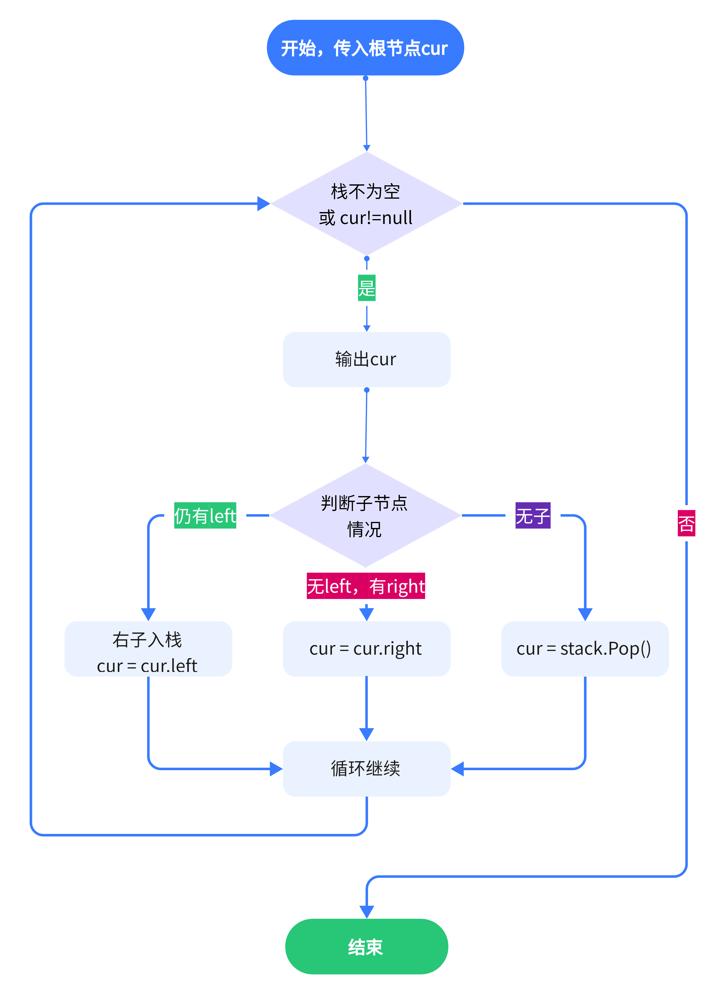
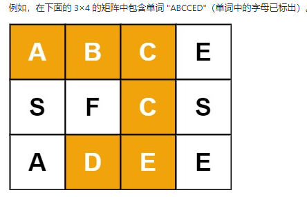

# 程序结构

### C语言


### JAVA


### Python

```python
def 函数(参数):
    # 函数程序

if __name__ == '__main__':
    # 主函数
```


### C#

1. **同一命名空间的类**皆可在同一项目的任意文件中调用创建实例
2. 若要使用**其他类的方法，必须创建实例**
3. 同一类的方法可以直接使用

```c#
namespace 命名空间
{
    class 类名称
    {
        static void Main(string[] args)
        {
            // 程序入口
            // 只能直接调用static修饰的函数
            // 或是先创建实例再调用其他函数
        }
    }
    
    class 类名称
    {
        // ……
    }
}
```


------


# 语言基础

### 数据类型

##### C++

- 一般数据类型

  - int
    - 最大值：`INT_MAX`

    - 最小值：`INT_MIN`

- 求数据类型：`char* typeid(x).name()`

- 指针：存储变量的地址

- 引用：`type& x = y;`

  > 创建目标的引用
  >
  > 可在参数传递、函数返回中发挥作用，类似C#的 ref

  ```c++
  void swap(int& x,int& y);
  
  int main()
  {
      int a = 10;
      int b = 20;
      
      swap(a,b);
  }
  
  // 虽然没有返回值，但通过引用实现了对原变量的修改
  void swap(int& x,int& y)
  {
      int temp;
      temp = x;
      x = y;
      y = temp;
      return;
  }
  ```

- 自动判断类型：`auto x`

##### C#

- 获取类型：`object.GetType()`

  > System.String等
- 数值型
- 引用型
  - 类对象
  - 数组
  
- **不定类型**

  - 引用指代 Object

    > 不包含数据本身，本质是 **指向数据的指针**
    >
    > 因此，使用时需要进行 **类型强制转换**

  - 静态不定 var：`var 变量名 = 值;`

    > 编译时确定类型，因此**不能进行不同类型的重新赋值**
    >
    > **必须在定义时初始化**

    ```c#
    // 合理用法
    var x = 10;
    x = 20;
    
    // 不可
    var y = 2;
    y = "hello";
    ```
  
  - 动态不定 dynamic：`dynamic 变量名 = 值;`
  
    > 用途最广


##### Lua

- 获取类型：`type = type(x)`

  > 结果的类型为字符串

- 数值型

- 引用型


### 输入输出

##### C++

- printf

- cout

  - 引入

    ```c++
    #include <iostream>
    using namespace std
    ```

    

  - 输出：`cout<<v1<<v2<<....<<endl`

##### Python

##### Java

##### C#

```c#
Console.WriteLine("..."+"...")
Console.Write("这是输出序号：{0}，输出内容：{}",x,y)
```

##### Lua

```lua
print(x,y)
print(x.."\n")
```


### 条件

##### C#

> 与C语言相同

##### lua

```lua
if conditon then
    --
else
    --
end
```


### 循环

##### C

##### Python

```python
for i in range(n):
    # 循环变量范围：0~n-1

for i in range(x,y):
    # 循环变量范围：x~y-1
    
for i in range(x,y,k):
    # 循环变量范围：每次循环后x+=k，且x<y或x>y
```

##### Java

##### C#

```c#
for(int i=0;i<n;i++)
{
    // 常用循环
}

foreach(type i in list) 
{
    // 对于数组中的每个元素
}

do
{
   statement(s);

}while( condition );
```

##### Lua

> 可以借助于break或return跳出当前块

- while

  ```lua
  i = 0
  while condition do
      -- 内容
  end
  ```

- for

  - 数值循环：`for i=start,end,step do ...... end`

    > **i** 从 **start** 以步长 **step** 增长到 **end** ，默认step=1
    >
    > 相当于 for(int i=start; i<=end; i = i+step)

  - 泛型循环

    > 多用于借助迭代器处理数组（用ipairs()）、table（用pairs()）

    ```lua
    a = {x,y,z}
    for index,var in ipairs(a) do
        --
    end
    ```

- repeat

  ```lua
  repeat
      --
  until condition
  ```


### 运算

|        | C++                           | Python                               | Java | C#                               |
| ------ | ----------------------------- | ------------------------------------ | ---- | -------------------------------- |
| 加减   |                               |                                      |      |                                  |
| 除     |                               | /，//                                |      |                                  |
| 乘方   | pow(x,n)                      | pow(x,y) 或pow(x,y,z)<br />x^y%z，** |      | Math.Pow(x,n)                    |
| 开方   | sqrt(f)                       |                                      |      | Math.Sqrt(x) 或 Math.Pow(x,0.5)  |
| 对数   |                               |                                      |      | Math.Log(x,n)                    |
| 绝对值 | abs(x)、fabs(x)               |                                      |      | Math.Abs(x)                      |
| 随机数 |                               |                                      |      |                                  |
| 求最值 |                               |                                      |      | Math.Max(x,y)<br />Math.Min(x,y) |
| 取整   | floor<br />ceil<br />round(x) |                                      |      |                                  |
| 最值   |                               |                                      |      |                                  |

##### Lua

- 算术运算符
  - 指数：^
  - 取模：%
- 逻辑运算
  - 不等：~=
- 逻辑运算：and, or, not

##### 数据类型与对应的最值

- C++
  

##### 位运算

- C++

- C#

  | 符号       | 运算             |
  | ---------- | ---------------- |
  | x <<或>> n | 左移或右移n位    |
  | &          | 与               |
  | \|         | 或               |
  | ^          | 异或             |
  | ~          | （包括符号位）取 |

- 经典问题：数组中只出现了1次的两个数

  - 问题描述

    >  一个整型数组 `nums` 里除两个数字之外，其他数字都出现了两次。请写程序找出这两个只出现一次的数字。要求时间复杂度是O(n)，空间复杂度是O(1)。

  - 分析

    - 相同数异或结果为0

      > 所有数的异或结果就是唯一一个出现了奇数次的数

    - 两个数不同，其二进制至少有1位不同

      > 则两数异或的结果的这一位为1

    - 将所有数按这一位是0还是1分组，转化为求一组数中出现了一次的数

  - 解决

    ```c++
    class Solution {
    public:
        vector<int> singleNumbers(vector<int>& nums) {
            int x = 0, y = 0, n = 0, m = 1;
            for(int num : nums)         // 1. 遍历异或
                n ^= num;
            while((n & m) == 0)         // 2. 循环左移，计算 m
                m <<= 1;
            for(int num : nums) {       // 3. 遍历 nums 分组
                if(num & m) x ^= num;   // 4. 当 num & m != 0
                else y ^= num;          // 4. 当 num & m == 0
            }
            return vector<int> {x, y};  // 5. 返回出现一次的数字
        }
    };
    ```

- 经典问题：交换int数据

  > 用异或操作


### 内存管理关键字

##### C++

> malloc、calloc、realloc都是在堆上分配的，**堆上分配的空间必须由用户自己来管理**，如果不释放，就会造成**内存泄漏**。
>
> 而**栈上分配的空间是由编译器来管理的**，具有函数作用域，出了函数作用域后系统会自动回收，不由用户管理，所以不用用户显式释放空间

- 堆栈


### 访问修饰符

##### C++

- 静态修饰符static

  - 作用于全局变量时，会使变量的作用范围限定在声明它的文件内

  - 作用于局部变量，会使该局部变量在函数调用期间保持

    ```c++
    #include <stdio.h>
    #include <stdlib.h>
    
    void testStatic(void)
    {
        // 用static修饰第变量只初始化一次，此处用count记录调用了几次
        static int count = 0;
        count++;
        printf("这是第 %d 次调用\n",count);
    }
    
    int main()
    {
        int i=0;
        while(i++<4) testStatic();
        return 0;
    }
    ```

##### C#

> 可以用 `event` 修饰，限定外界 **对委托变量只能使用+=或-=操作符**

- 静态修饰符static

  > 可修饰对象：类、字段、属性、方法，使其具有 **单一实例** 的特性
  >
  > 内存分配时，静态优先且有序

  - 静态类

    - **不能实例化、继承**
    - 仅包含**静态成员**，不能包含构造函数

  - 静态成员

    - 存在唯一，在 **加载类** 的时候被创建在静态存储区中，直到程序退出

    - 无法使用this或base

      > 因为类的实例对象可能不存在

  - 静态方法

    - 不属于特定的对象，

    - 可访问静态成员

    - 无法直接访问实例成员，但可将实例成员作为参数传递给静态方法

      > 因为静态方法先于实例成员创建

  - 静态构造函数

    - 无法继承
    - 在类定义时可以与非静态构造方法一起定义

  - 示例

    ```c#
    class Program
     {
             public static int i =0;
             public Program()
             {
                 i = 1;
                 Console.Write("实例构造方法被调用");
             }
             static Program()
             {
                 i = 2;
                 Console.Write("静态构造函数被执行");
             }
             static void Main(string[] args)
             {
                 Console.Write(Program.i);//结果为2，首先，类被加载，所有的静态成员被创建在静态存储区，i=0,接着调用了类的成员，这时候静态构造函数就会被调用，i=2
                 Program p = new Program();
                 Console.Write(Program.i);//结果为1，实力化后，调用了实例构造函数，i=1，因为静态构造函数只执行一次，所以不会再执行。
             }
     }
    ```

- 其他

  | 访问修饰符         | 可访问           | 不可访问   |
  | ------------------ | ---------------- | ---------- |
  | public             | 全部             | 无         |
  | private            | 当前类           | 子类、实例 |
  | protected          | 当前类、**子类** | 实例       |
  | internal           | 项目内部         |            |
  | protected internal |                  |            |


### 参数修饰符

##### C#

- 引用传递：ref

  - 传递参数

    > 函数体中任何对a的操作都会对变量本体产生影响
    >
    > 以此让局部变量像全局变量一样使用

    - 定义：`public 返回值 函数名(ref 参数类型 a, 参数类型 b)`
    - 调用：`函数名(ref 被引用传递的参数, b)`

  - 返回参数

    > 常用于返回**类成员的类方法**的定义
    >
    > 可以在主函数调用方法后直接修改类成员

    - 定义

      ```c#
      public ref 返回值类型 函数名(参数)
      {
          return ref 返回变量;
      }
      ```

    - 调用：`ref var 接收变量 = 函数名(参数)`

      > 此例子中用引用方式返回**类数组成员内的变量**
      >
      > 返回后**可直接修改对象数组成员**内的内容

      ```c#
      public class Book
      {
          public string Author;
          public string Title;
      }
      
      public class BookCollection
      {
          private Book[] books = { new Book { Title = "Call of the Wild, The", Author = "Jack London" },
                              new Book { Title = "Tale of Two Cities, A", Author = "Charles Dickens" }
                             };
          private Book nobook = null;
      
          public ref Book GetBookByTitle(string title)
          {
              for (int ctr = 0; ctr < books.Length; ctr++)
              {
                  if (title == books[ctr].Title)
                      return ref books[ctr];
              }
              return ref nobook;		// 接收后可直接对返回的books数组中的元素进行操作
          }
      
          public void ListBooks()
          {
              foreach (var book in books)
              {
                  Console.WriteLine($"{book.Title}, by {book.Author}");
              }
              Console.WriteLine();
          }
      }
      ```

- 数组传递：params

  - 定义：`public 返回值 函数名(param 参数类型[] arr)`

  - 调用：`函数名(参数1, 参数2, ...)`

    > 使用传入的多个参数 **自动构造数组**
    >
    > 类似于Lua的 **function(...)**

- 输出参数：out

  > 用该参数可让函数 **返回多个值**

  - 定义：`public 返回值 函数名(out 参数类型 ret,其他参数)`

  - 调用：`函数名(out ret,其他参数)`

    > 但必须提前定义好接收返回值的变量ret

  ```c#
  public void test_Out(int a,out int x,out int y)
  {
      x = a/10;
      y = a%10;
  }
  
  int x,y;		// 接收返回值的参数
  testPrograms.test_Out(34,out x,out y);
  Console.WriteLine("{0}  {1}",x,y);		// 3  4
  ```


### 指针

##### 基础

- 定义：`type* temp;`
- 赋值：`temp = &x;`
- C++空指针：`nullptr`

##### 数组与指针

  > 优先级：()>[]>*

  - 指针数组

    - 定义：`int* p[size];` 或 `int *p[size];`

      > 由于 [] 的优先级高于 *，因此优先定义为数组

    - 应用

      ```c++
      #include <iostream>
      using namespace std;
      int main()
      {
      	int* arr[3];		// 存放3个int指针
      	int a=1,b=2,c=3;
      	arr[0] = &a;		// 3个指针分别保存a、b、c的地址
      	arr[1] = &c;
      	arr[2] = &b;
      	for(int i=0;i<3;i++)
      		cout << *arr[i] << endl;	
          
          return 0;
      }
      ```

  - **数组指针**

    - 定义：`int (*p)[size];`

      > 指向大小为 `size*sizeof(int)` 的一片空间
      >
      > 数组名称指向数组首元素，而数组指针指向整个数组

    - 应用
    
      - 一维数组
    
        > 可视为每**只有一行的二维数组**
        >
        > 虽然在数值上 `arr==&arr`，都是数组首元素的地址，但是**意义不同**
        >
        > 前者指向 **首元素** ，后者指向 **整个数组**
        >
        > 在二维数组中无此问题，数组名称指向整个数组
      
        ```c++
        #include <iostream>
        using namespace std;
        int main()
        {
            int arr[] = {1,2,3,4};
            int (*p)[4];
            p = &arr;					// 注意：数组名称arr本质上是一个整形指针
        
              // 以下输出的都是arr[]首元素地址
            cout << arr << endl;
            cout << &arr[0] << endl;
            cout << p << endl;
            cout << *p << endl;			// 相当于输出arr
            cout << p[0] << endl;		// *(p+0)=arr
        
            cout << **p << endl;		// *arr = 1
            cout << (*p)[1] << endl;	// 2
            cout << *(*p+2) << endl;	// 3
        
        	return 0;
        }
        ```
      
      - 二维数组
      
        ```c++
        #include <iostream>
        using namespace std;
        int main()
        {
        	int arr[2][3] = {1,2,3,4,5,6};
        	int (*p)[3] = arr;
        	
            // arr[0][0]地址
        	cout << p << endl;
        	cout << arr << endl;
        	
            // arr[1][0]地址
        	cout << arr[1] << endl;
        	cout << p+1 << endl;
        	
            // arr[1][1] = 5
        	cout << *(*(p+1)+1) << endl;
        	
            return 0;
        }
        ```
        
        

### 泛型

> 不确定类型，只有 **在使用时** 采用具体的类型进行 **替代**

##### C++

- 函数模板

  > 无法接受数组、自定义数据类型

  - 定义

    > T只是个类型变量

    ```c++
    template<class T>
    返回值类型 函数名(T param)
    {
        
    }
        
    // 进行重载，以支持自定义类型
    template<> 返回值类型 函数名(自定义类型参数)
    {
        
    }
    ```

  - 使用

    - 自动推导参数类型

      > 直接调用
      >
      > 与普通函数不同，泛型函数 **自动推导类型时不会发生隐式类型转换**

    - 指定类型：`泛型函数<T的类型>(参数)`

      > 可发生隐式类型转换

- 类模板

  - 定义

    > 可指定默认类型

    ```c++
    template<class DataType1, class DataType2=type>
    class 类名称
    {
    public:
        DataType1 x;
        DataType2 y;
        类名称(DataType1 x,DataType2 y);
        test(DataType1 a,DataType2 b);
    }
    
    // 类成员在外部实现时，必须加上模板参数列表
    template<class T1,class T2>
    类名称<T1,T2>::test(DataType1 a,DataType2 b)
    {
        
    }
    ```

  - 使用

    > 可认为，在使用类模板时必须指出泛型类型

    - 创建对象

      > 无自动类型推导

    - 作参数

      ```c++
      // 只接受指定类型的对象
      void printPerson1(Person<string,int> &p){
          p.showPerson();
      }
      
      // 参数模板化
      template <class T1,class T2>
      void printPerson2(Person<T1,T2>&p){
          p.showPerson();
          cout << "T的类型为："<< typeid(T1).name() <<endl;
          cout << "T的类型为："<< typeid(T2).name() <<endl;
      }
      
      //整个类模板化
      template<class T>
      void printPerson3(T &p){
          p.showPerson();
          cout << "T的类型为："<< typeid(T).name() <<endl;
      }
      ```
    
    - 继承
    
      ```c++
      class 子类: public 父类<type>
      {
          
      }
      ```
    
      

##### C#

- 泛型函数

  > 即参数中有泛型的函数
  >
  > 标志为函数名后的**泛型占位符<T>**

  - 定义

    ```c#
    public 返回值类型 函数名称<T>(T 参数)
    {
        // 泛型参数只能进行所有类型均允许的操作
    }
    ```

  - 调用：`函数名称<类型>(参数)`

    > 需要传入泛型参数的具体类型

- 泛型类

  > 具有泛型成员的类
  >
  > 可以被普通类继承

  - 定义

    ```c#
    class SortData<T>
    {
        int index;      	// 数据序号，排序依据
        public T data;		// 泛型成员
    
        public int Index
        {
            get => index;
            set => index=value;
        }
        public T Data
        {
            get => data;
            set => data=value;
        }
    
    	
        // 构造函数无需注明泛型，但使用时需要传入泛型的具体类型
        public SortData(int i,T data)
        {
            index = i;
            this.data = data;
        }
    
        public override string ToString()
        {
            return index.ToString() + "  " + data.ToString();
        }
    }
    ```

  - 创建对象：`类名称<具体类型> 对象名 = new 类名称<具体类型>(构造参数);`

    > 例如创建 List：`List<int> list = new List<int>();`
    
  - **获取传入的自定义类的名称**：`typeof(T).Name`

##### Java


### 反射

> 在只知道一个对象Activator.CreateInstance(typeof(Computer));的外部而不了解内部结构的情况下，可以知道这个对象的内部实现
>
> 应用 **动态编译，在运行中创建对象、绑定对象**，提高了程序的灵活性和扩展性
>
> 但反射是一种 **解释操作**，在性能上不如静态编译快

##### C#

> 通过Type类获取程序集、模块、类的相关信息

- **创建Type对象**

  > 使用object.GetType()必须先创建一个实例，而后两种不需要创建实例
  >
  > 但使用typeof运算符仍然需要知道类型的编译时信息
  >
  > Type.GetType()静态方法不需要知道类型的编译时信息，所以是首选方法

  - 直接从对象获取：`Type type = 类对象.GetType();`

  - **根据类名称获取**：`Type type = Type.GetType(string className)`

    > 需要传入 **带命名空间的类全称**

  - 根据类获取：`Type type = typeof(MyClass)`

    > 传入数据类型（自定义类、string等）

- 属性

  - 获取类名称
    - 类名称：`string Name`
    - 带命名空间的类名称：`string FullName`
  - 基类：`string BaseType`

- 获取方法

  > 获取只能获取public修饰的
  >
  > 去掉s即可获得单个版本

  - 获取类成员：`MemberInfo[] GetMembers()`

    > 成员变量、属性（成员变量get-set方法）、成员方法

  -  获取字段：`FieldInfo[] GetFields()`

    > 成员变量

  - 获取属性：`PropertyInfo[] GetProperties()`

    > get-set方法

  - 获取方法：`MethodInfo[] GetMethods();`

  - 获取构造函数

    - 单个：`ConstructorInfo? GetConstructor(Type[] types)`

      > 通过Type数组指定传入的参数，根据参数获取对应的构造函数

    - 全部：`ConstructorInfo[] GetConstructors()`

  - 获取嵌套类：`Type[] GetNestedTypes()`

- **创建对象**

  - **使用构造函数创建**

    - 获取构造函数：`ConstructorInfo ctor = type.GetConstructor(new Type[]{typeof(参数类型)});`
    - 创建对象：`var ob = ctor?.Invoke(new object[]{参数值});`

  - 使用Activator创建：`var ob= Activator.CreateInstance(typeof(类),object?[]? args);`

  - 示例

    - 类
      ```c#
      /// <summary>
      /// 产品：电脑
      /// </summary>
      public class Computer : Product
      {
          public override string Name {get {return "Computer";}}
      
          public Computer()
          {
              price = 2000;
              ShowInfo();
          }
          public Computer(float price,string tag)
          {
              this.price = price;
              Console.WriteLine(tag);
              ShowInfo();
          }
      }
      
      
      /// <summary>
      /// 产品：手机
      /// </summary>
      public class Phone : Product
      {
          public override string Name {get {return "Phone";}}
      
          public Phone()
          {
              price = 1000;
              ShowInfo();
          }
          public Phone(float price)
          {
              this.price = price;
              ShowInfo();
          }
      }
      ```

    - 反射创建对象
      ```c#
      Type phoneType = Type.GetType("DesignMethod.Phone");
      ConstructorInfo ctor = phoneType.GetConstructor(new Type[]{typeof(float)});
      var phone = ctor?.Invoke(new object[]{4000});
      // 被生产的产品：Phone 4000元
      var computer = Activator.CreateInstance(typeof(Computer),8000,"拯救者");
      // 拯救者
      // 被生产的产品：Computer 8000元
      ```

      


### XML

##### XML基础

- 示例
  ```xml
  <?xml version="1.0" encoding="UTF-8"?>
  
  <!-- 注释 -->
  <bookstore>
      <book category="CHILDREN">
      	<title>Harry Potter</title> 
          <author>J K. Rowling</author> 
          <year>2005</year> 
          <price>29.99</price> 
      </book>
      <book category="WEB">
      	<title>Learning XML</title> 
        	<author>Erik T. Ray</author> 
        	<year>2003</year> 
        	<price>39.95</price> 
      </book>
  </bookstore> 
  ```

- 结构

  - 节点 Node：单个XML片段

  - **元素 Element**：开始标签到结束标签包括的部分

    > <book category="WEB"> 到 </book>

  - **属性 Attribute**

    > <book category="WEB"> 中的 category="WEB"

  - **内容**：开始标签和结束标签之间的内容

##### C#解析

- XmlNodedList 节点容器类

  > 实现了 *IEnumerable*，可用foreach访问
  >
  > 可用 [index] 访问存储的 XmlNode 元素

- **XmlNode**

  > 基类，重要

  - *string* Name：标签名称

  - *string* InnerText：内容

    > 无内容时，得到 `""`

  - *XmlNodeList* ChildNodes：子节点集合

    > 可用foreach遍历子节点
    
  - **获取目标子节点**

    - `public XmlNode? SelectSingleNode(string xpath);`
    - `public XmlNodeList? SelectNodes(string xpath);`

- XmlLinkedNode

  > 中间类，不太重要

  - 获取属性值：`string GetAttribute(string aName)`

- **XMLElement**：Xml元素类

  > 继承XmlLinkedNode

- 解析类 **XmlDocument**

  - 载入xml文件
    - 根据绝对路径载入：`Load(string path)`
  - **取得目标节点**：`XmlNode node = ducument.SelectSingleNode(string xmlPath)`

    > xmlPath是目标节点标签在xml文件中的路径，例如 `根标签/目标标签`

- 解析示例

  - xml

    ```xml
    <?xml version="1.0" encoding="UTF-8"?>
    <FruitShop>
        <Fruit name="apple">
            <price>10</price>
            <color>red</color>
        </Fruit>
        <Fruit name="banana">
            <price>15</price>
            <color>yellow</color>
        </Fruit>
        <Fruit>
            <price>15</price>
            <color>yellow</color>
        </Fruit>
        <Vegetable>
            <price>
                30
            </price>
            <color>green</color>
        </Vegetable>
    </FruitShop>
    ```

  - 解析代码

    ```c#
    public static void DocumentTest()
    {
        XmlDocument document = new XmlDocument();
        
        // 载入
        document.Load("/Users/dsh/Documents/C.Net/C#_onMac/xmlTest/test.xml");
    
        // 取得目标节点
        XmlNode fruitShopNode = document.SelectSingleNode("FruitShop");
        
        // 遍历目标节点的子元素集合
        foreach(XmlElement fruit in fruitShopNode.ChildNodes)
        {
            string name = fruit.GetAttribute("name");
            int price = int.Parse(fruit.ChildNodes[0].InnerText);
            string color = fruit.ChildNodes[1].InnerText;
            Console.WriteLine("{0} {1} {2}\n",name,price,color);
        }
        Console.WriteLine(fruitShopNode.Attributes);
    }
    ```

    

  


------


# 标准库

### Lua

##### 时间

- 时间table格式

  ```lua
  {year =2016, month = 11, day =23, hour =17, min =17, sec = 00}
  ```

- 时间-->时间戳：`local timeSecond = os.time()`

  > 计算目标时间距离1970.1.1.08:00时间的秒数
  >
  > 默认转换当前时间
  >
  > 可传入时间table来指定被转换的时间

- 时间戳-->时间table：`local timeTable = os.date("格式",timeSecond)`

  ```lua
  -- *t
  {
  
      "day"   = 1      --日
  
       "hour"  = 8     --小时
  
       "isdst" =false     --是否夏令时
  
       "min"   = 0     --分钟
  
       "month" = 1     --月
  
       "sec"   = 0     --秒
  
       "wday"  = 5     --星期5
  
       "yday"  = 1     --当年已过天数
  
       "year"  = 1970  --年
  
  }
  
  
  -- %Y-%m-%d%H:%M:%S     2016-11-23﹎17:17:00
  ```

------


# 结构体

### C

```c++
typedef struct node
{ Datatype data[MAX]; int last;} *List;
```


### C++

- 定义

  ```c++
  // 直接定义
  struct Person
  {
  	char name[20];
  	int age;
  	float height;
  };
  
  
  // 定义别名：Person
  typedef struct PersonType
  {
  	char name[20];
  	int age;
  	float height;
  }Person;
  ```

- 创建变量

  ```c++
  using namespace std;
  
  struct PersonStruct
  {
  	string name;
  	int age;
  	float height;
  }PersonS;
  
  
  void testStruct()
  {
      string funcName = "结构体";
      func(funcName, true);
  
      // 结构体指针
      struct PersonStruct* p = &PersonS;
      p->name = "dsh";
      p->age = 23;
      p->height = 164.5;
      cout << p->name << endl;		// dsh
  
      // 结构体
      PersonStruct x;
      x.name = "htm";
      x.age = 21;
      x.height = 180.1;
      cout << x.name << endl;			// htm
  
      func(funcName, false);
  }
  ```

  - 普通变量：`StructType x;`
  - **指针**

    - 指向现有变量：`struct StructType *temp = &结构体实例;`
    - 指向新结构体：`StructType* temp = new StructType(构造参数);`
  - 使用**构造函数**的创建

    ```c++
    struct ListNode
    {
    	int val;
    	ListNode* next;
        // 接收一个参数x，x赋给val，Null赋给next
        ListNode(int x) : val(x), next(NULL) { }
    };
    
    void test()
    {
        ListNode* pHead = new ListNode(0);
    }
    ```

- 访问成员

  - 普通变量：`x.成员`
  - 指针：`temp->成员`
  
- 测试

  ```c++
  struct PersonStruct
  {
  	string name;
  	int age;
  	float height;
  	PersonStruct():name("无名"),age(-1),height(0.0f){}
  	PersonStruct(string name,int age,float h):name(name),age(age),height(h)
  	{
  		cout<<"结构体 PersonStruct 创建完毕"<<endl;
  	}
  }PersonS;
  
  
  void testStruct()
  {
      PersonStruct x("dsh",23,164.5);
      cout<<x.name<<endl;					// dsh
      PersonStruct* dsh = &x;				// 指针指向x
      cout<<dsh->height<<endl;			// 164.5
      dsh = new PersonStruct();			// 指向新变量，调用无参构造方法
      cout<<dsh->name<<endl;				// “无名"
  }
  ```
  
  


### C#

##### 定义

> 与类很相似
>
> 但是 **值类型** ，不支持继承，不能声明默认构造函数
>
> 可用于定义简单的数据类型

```c#
struct name
{
    // 变量
    
    // 方法
}
```

##### 使用

> 用 **New** 操作符创建一个结构对象时，会调用适当的构造函数来创建结构体
>
> 若不使用 **New** ，只有在所有字段均初始化之后，才能被赋值

- `struct_type 名称 `
- `struct_type 名称 = new struct_type() `
- `struct_type 名称 = new struct_type() {//成员赋值}`

------


# 面向对象-类

### C++

##### 类的定义

- 声明放在.h文件

  > 例如：Person.h

  ```c++
  #pragma once
  #include <string>
  
  using namespace std;
  
  class Person
  {
  public:
  	string name;
  	int age;
  	bool gender;
  	// 构造函数
  	Person(string name="无名", int age=0, bool gender = true);
  	// 析构函数
  	~Person();
  	// 成员方法
  	void printInfo();
  	void grow();
  
  private:
  	const static int curNum = 0;
  };
  ```

- 实现放在.cpp文件

  > 例如：Person.cpp

  ```c++
  #include "Person.h"
  #include <iostream>
  
  // 构造函数
  Person::Person(string name, int age, bool gender) : name(name), age(age), gender(gender)
  {
  	cout << "Person对象创建完毕" << endl;
  }
  
  // 析构函数
  Person::~Person()
  {
  	cout << "清除Person对象" << endl;
  }
  
  
  void Person::printInfo()
  {
  	string sex;
  	if (gender) sex = "男";
  	else sex = "女";
  	cout << "姓名：" << name << "，年龄：" << age << "，性别：" << sex << endl;
  }
  
  
  void Person::grow()
  {
  	age++;
  }
  ```

- **构造函数**

  - 默认构造函数

    > 当未自定义构造函数时，类的public成员可使用 **初始值列表** 进行初始化

    ```c++
    class A{
    public:
    	char name[10];
    	int no;
    };
    
    A a = {"chen", 23};
    cout << a.name << a.no << endl;
    ```

  - 自定义构造函数

    - 声明：`类名称(参数=默认值);`

    - 定义

      > **成员初始化列表** 可进行类成员快速赋值

      ```c++
      类名称::类名称(type1 v1,type2 v2) : 成员1(v1), 成员2(v2)
      {
          // 函数体
      }
      ```
    
  - 拷贝构造函数
  
    > 用于深拷贝对象，否则默认是浅拷贝
    
    ```c++
    类名称::类名称(const 类名称 &引用的对象)
    {
        // 函数体
    }
    ```
  
- 静态成员 static

  > 属于类的成员，并不独属于某个对象

  - 定义：`static type 变量名;`

  - 初始化：`type 类::变量名 = 初始值;`

    > 一般在类成员定义处初始化
    
  - 例
  
    - 定义、声明
  
      ```c++
      #pragma once
      #include <string>
      
      using namespace std;
      
      class Person
      {
      public:
      	// 构造
      	Person(string name="无名", int age=0, bool gender = true);
      	// 析构
      	~Person();
      
      private:
      	static int curNum;		// 静态成员
      };
      
      Person::Person(string name, int age, bool gender) : name(name), age(age), gender(gender)
      {
      	curNum++;
      	cout << "Person对象创建完毕" << endl;
      }
      
      
      Person::~Person()
      {
      	curNum--;
      	cout << "清除Person对象" << endl;
      }
      
      int Person::curNum = 0;		// 初始化static成员
      ```
  
    - 使用
  
      ```c++
      int main()
      {
          Person p1 = Person("dsh", 23, true);	// 调用构造函数，curNum++
          Person p2 = Person("htm");				// 调用构造函数，curNum++
          Person p3 = p2;							// 调用拷贝函数，curNum不变
          p3.name = "zdd";
          cout << p2.name << endl;
          cout << p2.getCurNum() << endl;			// 2
      }
      ```
  
- 常成员 const

  - 常数据成员：`cont type 变量名 = 初始值;`

    > 只能通过 **定义** 或 **构造函数参数列表** 进行初始化
    >
    > 若使用构造函数初始化常成员，则构造函数的重载失效

  - 常方法

    > 不能 **更新** 普通数据成员、**调用** 普通方法

    - 声明：`返回值 函数名(参数) const;`

      > const可用于对重载函数进行区分

    - 定义

      ```c++
      int Person::getTag() const
      {
      	cout << "此方法为const方法" << endl;
      	return tag;
      }
      ```

##### 对象
- 创建对象：`类 对象名(构造函数参数);`

  ```c++
  #include <iostream>
  #include "Person.h"
  
  
  // 测试函数
  void testPerson(int& x);
  
  
  int main()
  {
      int curAge = 0;
      testPerson(curAge);
      cout << curAge << endl;		// 24
  }
  
  
  // 函数返回后，自动调用Person类的析构函数
  void testPerson(int& x)
  {
      Person dsh("dsh",23);
      dsh.printInfo();
      dsh.grow();
      x = dsh.age;
  }
  ```

- 常对象：`const 类 对象名(构造函数参数);`

  > 对象成员 **初始化后无法更改**
>**只能调用常成员方法**

- 对象数组

  - 构造函数不带参数或1个参数：`类 数组名[size] = {p1,p2}`

  - 构造函数带1个参数：`类 数组名[size] = {p1,p2,...,p_size}`

  - 构造函数需要多个参数：`类 数组名[size] = {类(参数),类(参数),...}`

    ```c++
    void testPerson(int& x)
    {
        Person persons[3] = {Person("dsh"),Person("htm",21),Person()};
        cout << persons[1].age << endl;	 // 21
    }
    ```

- **对象指针**

  - 定义：`类 *指针名 = &对象;`
  - 访问：`指针->成员;`

- 对象拷贝

  - 拷贝操作：`类 新对象 = 旧对象;` 或 `类 新对象(旧对象);`

  - 深浅拷贝

    - 浅拷贝：数据成员逐一赋值

      > 若含有指针类型的数据，则会出错

      ```c++
      class Student
      {
      public:
          Student(char *name1, float score1);
          ~Student();
      private:
          char *name;		// 指针数据
          float score;
      };
      
      
      // 重定义拷贝函数
      Student::Student(const Student& stu)
      {
          // 新建c风格字符串
          name = new char[strlen(stu.name) + 1];
          if (name != 0) {
              strcpy(name, stu.name);
              score = stu.score;
          }
      }
      ```

- 向函数传递参数

  - 传递对象

    > 传值调用，**不影响本体**

  - 传递对象指针

    > 会影响本体

  - 传递对象引用

    > 一般用此方法 **代替对象指针** 传参

##### 继承

- 继承类型

  > 一般只使用public

  - pulbic

    > 父类的public、protect对象也是子类的public、protect对象
    >
    > 父类的private对象无法被子类直接访问

  - protect

    > 父类的public、protect对象也是子类的protect对象

  - private

    > 父类的public、protect对象也是子类的private对象

- 子类定义

  ```c++
  class 子类: 修饰符 父类1, 修饰符 父类2
  {
      
  }
  ```

- 构造方法继承

  - 定义中直接继承父类构造方法：`using 父类:父类;`

    > 此方式定义的子类构造方法与父类的参数相同
    >
    > 但 **无法获得** 父类构造方法的 **参数默认值**
    >
    > 当进行多重继承时，若使用此方式，**相同参数类型的父类构造方法也会冲突**
    >
    > 此方式也 **无法初始化子类成员**

  - 初始化中显式调用父类构造方法：`子类(type param):父类(传递给父类构造方法参数);`

- 析构方法继承

  > 子类对象在析构时会在调用子类析构方法后 **自动调用父类的析构方法**

- 示例

  - 子类定义、初始化

    ```c++
    #pragma once
    #include <string>
    #include "Person.h"
    
    using namespace std;
    
    
    class Student: public Person
    {
    public:
        int studentId = 0;          // 学号
        string school = "学校";
        int grade     = 1;          // 年级
        using Person::Person;       // 继承父类的构造函数
        Student(string name, int age, bool gender,int studentId,string school,int grade);
        ~Student();
    };
    
    
    Student::Student(string name, int age, bool gender,int studentId,string school,int grade):studentId(studentId),school(school),grade(grade),Person(name)
    {
        curNum++;
    }
    Student::~Student()
    {
        // curNum--;
        cout << curNum << "\tStudent Clear" << endl;
    }
    ```

  - 对象创建

    ```c++
    void testStudent()
    {
        Student dsh("dsh",23,true,41823162,"USTB",4);
        cout<<dsh.age<<endl;		// 0，因为子类构造函数只向父类传递了name
        cout<<dsh.school<<endl;		// "USTB"
    }
    ```


##### 重载

- 一般方法的重载

  > 只要参数不同即可

- 运算符重载

  ```c++
  bool operator>(const Student& other)
  {
      if(this.getScore()>other.getScore()) return true;
      else return false;
  }
  ```

##### 多态与虚函数

- 多态

  > C++ 多态意味着调用成员函数时，会 **根据调用函数的对象的类型** 来执行不同的函数。

  - 示例

    > 父类指针可指向子类对象

    ```c++
    int main()
    {	
        // Student和Player是Person的子类
        Person a("dsh",23,true);
        Student b("dsh",23,true,41823162,"USTB",4);
        Player c("htm");
    
        // Person、Student、Player都有getType()方法
        // 创建Person类指针，并调用同名方法
        Person *temp;
        temp = &b;
        cout<<temp->getType()<<endl;	// Person（即调用的还是父类的方法）
    
        return 0;
    }
    ```

  - 分析

    > 导致错误输出的原因是，调用函数 area() 被编译器设置为基类中的版本
    >
    > 这就是所谓的**静态多态**，或**静态链接** - 函数调用 **在程序执行前就准备好了**

- 虚函数

  - 一般虚函数：在函数返回类型前加关键字 `virtual`

    > 上例中，若给getType加上virtual，则会正确调用对应类的getType

  - 纯虚函数/抽象函数定义：`virtual type func() = 0;`

    > 在基类中 **不对虚函数给出有意义的实现**
    >
    > 以便在派生类中重新定义该函数更好地适用于对象
    >
    > 类似于c#的 abstract

##### 接口

- 抽象类
  - 至少有一个函数被声明为 **纯虚函数**
  - 无法被用于实例化对象


### Python

##### 1. 创建

> 在成员方法中若要调用其他的成员方法或类成员
>
> 需要借助 **self**

```python
class 类名称():
    '帮助文档'
    
    # 类成员
    name = ''
    
    # 构造方法
    def __init__(self, 类成员):
        self.类成员 = 传入的类成员值
        
    # get-set
    def getName(self):
        return self.name
    def setName(self,name):
        self.name = name
    
    # 类方法
    def 函数名(参数):
        # 方法程序
```

##### 2. 构造实例

> 若不在同一文件，需要先导入：`from 文件名称 import 类名称`

```python
对象名 = 类名称(参数)
```


### JAVA


### C#

> 引用类型

##### 基类/父类定义

```c#
class 类名称
{
    // 成员
    // 方法
}
```

- 类成员/属性：`修饰 Type 名称 = 值;`

  - 被 **static** 修饰的类成员，无论有多少对象，只有一个该成员副本

    > 各对象共享一个静态成员

  - 被 private/protected 修饰的类成员，需要定义 **Get-Set**

    > 定义后可当做public修饰的成员进行使用，但 **名称首字母要大写**

    ```c#
    protected string name
    
    public string Name
    {
        get { return name; }
        set { name = value; }
    }
    ```

- **构造函数

  ```c#
  // 必须是public修饰
  public 类名称(type 参数)
  {
      this.属性 = 参数;
  }
  ```

- 析构函数（非必须）

  > 无返回值，不能有参数、继承、重载
  >
  > 用于在结束程序时释放内存

  ```c#
  ~类名称()
  {
      
  }
  ```

- 类方法

  - 被 **static** 修饰的类方法，只能访问静态变量

##### 创建对象

```c#
类名称 对象名称 = new 类名称(参数)
    
/*
	注意：new后面的类可以是变量类型的子类
	例如：Animal是Cat的父类
*/
Animal animal = new Cat();
/*
	让你更关注父类能做什么,而不去关心子类是具体怎么做的
	不同子类可能通过不同方式override父类的某个方法
	此方式可以让你调用该方法而无需关注到底是使用的父类还是子类的该方法
*/
```

##### **继承

- 继承标识：`class 子类: 父类`

- 构造函数：若父类有带参构造，子类必须先实现

  > 用 `: base(参数) `  向父类构造方法传递参数
  >
  > 用 `base:方法名(参数)` 调用父类方法
  
  ```c#
  // 父类
  class Person
  {
      protected string name = "";
      protected int age = -1;
      protected List<string> info = new List<string>();
      public string Name
      {
          get { return name; }
          set { name = value; }
      }
      public int Age
      {
          get { return age; }
          set { age = value; }
      }
  
      // 有参构造
      public Person()
      {
  
      }
      public Person(string name="",int age=-1)
      {
          this.name =  name;
          this.age = age;
      }
  
      public virtual void initInfo()
      {
          info.Add("name："+name);
          info.Add("age："+age.ToString());
      }
      public override string ToString()
      {
          initInfo();
          string ret = string.Join("；\n",(string[])info.ToArray());
          return ret;
      }
  }
  
  
  
  // 子类
  class Player:Person
  {
      private string gameId = "";
      public List<string> games = new List<string>();
      public string GameId
      {
          get {return gameId;}
          set {gameId=value;}
      }
  
      // 可通过base访问父类的相关方法
      public Player(string name,int age, string gameId):base(name,age)
      {
          this.gameId = gameId;
      }
  
      public override void initInfo()
      {
          base.initInfo();
          info.Add(gameId);
          info.Add(string.Join(", ",(string[])games.ToArray()));
      }
  
  }
  ```

##### **动态多态性

- 虚virtual：**允许** 重写

  > 通过父子类中的虚方法与重写实现
  >
  > 调用子类重写的方法时，会 **先执行虚方法语句** ，再执行重写语句
  >
  > 因此，不建议重写有返回值的方法

  - 父类中的虚方法定义

    ```c#
    public virtual 返回值类型 函数名称(参数)
    {
        // 虚方法执行语句
    }
    ```
  
  
    - 子类中的重写
  
      ```c#
      public override 返回值类型 虚方法名称(参数)
      {
      	base.虚方法名称(参数);		// 可选，执行父类中的虚方法
      	// 子类添加的执行语句
      }
      ```
  


- 抽象abstract：**必须** 重写

  - 特点
    - 抽象方法必须存在于抽象类中，且不能被实现
    - 抽象类不能被实现，只能被继承，构造函数可省略
    - 抽象方法 **必须被重写**
  
- **接收作为参数的对象**

  > 实现统一处理，提升处理效率
  
  
  - 父类变量可以接收子类对象
  - 接口变量可以接收实现了接口的类的对象：`IList<int> list = new List<int>();`
  

##### **接口

> 与类相似，但是 **只包含需要实现的方法的定义**
>
> 实现类必须  **实现接口中定义的所有方法**
>
> 实现时直接定义即可，不必加override
>
> 一般使用**抽象类**规定类的**成员规范**，使用**接口**规定**类需要实现的方法**

```c#
interface 接口
{
    // 成员声明
    void 方法名称();
}
```

##### 类的运算符重载

> 可以定义两个类的运算，定义在类内
> 适合属性需要运算的类
>
> 例如：自定义向量类，**重写向量的点乘**
>
> 修饰：static，virtual

```c#
public 函数修饰 返回值类型 operator+ (参数) {}
```

- 重定义加法

  ```c#
  public static 类名称 operator +(类名称 x, 类名称 b)
  {
      // 运算过程
  }
  ```

##### 自定义索引器

##### 引用类型特点测试

- 测试类

  ```c#
  // 树叶节点
  class TreeNode
  {
      public int? data;                // 数据
      public TreeNode? left  = null;      // 左子
      public TreeNode? right = null;      // 右子
      public bool flag = true;
  
      public TreeNode(int? data=null)
      {
          if(Convert.ToInt32(data)!=-999) this.data = data;
          else this.data = null;
      }
  
      public bool isChild(TreeNode node)
      {
          if(left==node || right==node) return true;
          else return false;
      }
  
      public override string ToString()
      {
          return "data = " + data;
      }
  }
  ```

- 特性测试

  ```c#
  List<TreeNode> list = new List<TreeNode>();
  
  TreeNode a = new TreeNode(10);
  TreeNode b = new TreeNode(1);
  a.left = b;					// 连接结构：10-1
  list.Add(b);
  list.Add(a);
  a = new TreeNode(2);		// a变化：10--->2
  b.left = a;					// 连接结构：10-1-2
  list.Add(a);
  a = list[0];
  Console.WriteLine(a.left);	// 输出：2
  ```

  


### Lua

> 尽量不在对象的方法中使用全局变量，否则容易使该方法将与全局变量相关，而非对象本身
>
> ```lua
> Account = {balance=0}
> function Account.withdraw(v)
> 	Account.balance = Account.balance - v    
> end
> 
> a = Account; Account = nil
> a.withdraw(100)		-- 错误，因为方法与Account有关，而Account已被回收
> ```
>
> 借助 **:** 和 **self** ，在方法定义和引用时自动传入对象本身


##### 基类定义

> 实际上是table

- 类属性及其默认值：`类名称 = {成员1=v1, 成员2=v2, ...}`

- 将基类的 **__index方法设置为自己**

  > 这样在创建对象时不必再说明基类方法
  >
  > 当对象调用类方法时，将直接从基类中寻找对应方法

- **构造方法

  > 建议将对象创建与对象属性赋值分开，**防止将错误的类设置为对象的元表**
  >
  > **步骤**：（关键在2、3）
  >
  > 1. 初始化 **新的对象table** （不然每次创建返回的都是同一个对象）
  > 2. **将基类设置为对象元表**
  > 3. 根据传入参数，为对象**属性赋值**
  > 4. 返回对象
  >
  > 例子：a.withdraw(v)，步骤如下
  >
  > ​	a中没有withdraw，去元表的__index里寻找
  >
  > ​	getmetatable(a).__index.withdraw(a,v)
  >
  > ​	--> Account.__index.withdraw(a,v)
  >
  > ​	--> Account.withdraw(a,v)，相当于调用了基类的方法

  ```lua
  -- 构造方法
  function 基类:new(o)
      -- 创建对象
      local o = {}
      -- 使 基类.__index = 基类，优化调用时的搜索
      self.__index = self 
      -- 将基类作为新对象的元表，即将基本属性、方法附加给对象实例
      setmetatable(o,self)
      self:init(o,object)
      return o
  end
  ```

- **对象属性赋值方法：`类:init(info,object)`

  ```lua
  -- 属性赋值（避免无效属性）
  function Person:init(info,object)
      if info~=nil then
          for k,v in pairs(info) do
              if self[k]~=nil then
                  object[k]=v
              else
                  print("父类不含有属性"..k)
              end
          end
      --else
      --    print("属性使用默认值")
      end
  end
  ```

- 一般方法

  > 由于将基类设置为了元表的__index，当对象调用类方法时
  >
  > 根据原方法__index的性质，实际调用需要传入self的方法的过程为：`基类.方法（对象,其他参数）`
  >
  > 不必担心对象调用此类方法时访问了基类的默认属性
  
  ```lua
  function 基类:方法(参数)
      -- 若要访问成员或其他方法，用 self. 访问
  end
  ```
  
- 示例：Person

  ```lua
  -- 属性初始化
  local Person = {name="无名",ismale=true,age=-1}
  Person.__index = Person
  
  -- 对象构造方法
  function Person:new(info)
      local object = {}
      self:init(info,object)
      setmetatable(object,Person)
      --print("构造完成\n")
      return object
  end
  
  -- 属性赋值（避免无效属性）
  function Person:init(info,object)
      if info~=nil then
          for k,v in pairs(info) do
              if self[k]~=nil then
                  object[k]=v
              else
                  print("父类不含有属性"..k)
              end
          end
      --else
      --    print("属性使用默认值")
      end
  end
  
  -- 属性相关方法
  function Person:get(k)
      return self[k]
  end
  function Person:set(k,v)
      self[k] = v
  end
  function Person:print(k)
      print(self[k])
  end
  
  return Person
  ```


##### 创建对象：`对象 = 类:new({参数})`

> 继承表现为 **通过元表.__index保存基类信息**
>
> 对象结构：
>
> {
>
> ​	类属性 = 对象值,
>
> ​	元表 = 父类{ 类成员 = 默认值, 类方法，__index = 父类}
>
> }

```lua
local Person = require("test_object_oriented.Person")

local info = {name="dsh",ismale=true,age=22}
local dsh = Person.new(info)
dsh:print("age")	--> 22
```

##### 子类继承

> 本质上是通过父类构造方法 **创建的对象**
>
> 只保存子类特有的属性和方法，**父类原有的属性和方法通过元表.__index访问**
>
> 注意需要重写父类的构造方法，**以免将父类绑定为对象的元表**

- 单继承

  > 子类构成：
  >
  > {
  >
  > ​	新的子类成员 = 默认值
  >
  > ​	子类方法
  >
  > ​	元表 = 父类{ 
  >
  > ​		父类成员 = 默认值, 
  >
  > ​		父类构造方法、一般方法，
  >
  > ​		__index = 父类}
  >
  > }

  ```lua
  local Person = require("test_object_oriented.Person")
  
  -- 继承
  local Player = Person:new()
  Player.game = "玩家身份"    -- 新属性
  Player.__index = Player
  
  
  -- 重写构造方法
  function Player:new(info)
      local object = {}
      self:init(info,object)
      setmetatable(object,self)
      return object
  end
  
  -- 新方法
  function Player:selfIntroduce()
      local sex
      if self.ismale then
          sex = "男"
      else
          sex = "女"
      end
      local info = {
          "我是"..self.name,
          "性别为"..sex,
          "今年"..self.age.."岁",
          "喜欢的游戏为"..self.game
      }
      print(table.concat(info,"，"))
  end
  
  return Player
  ```

- **多重继承

  > 本质：**在调用元表.__index查找目标时，在所有父类中进行搜索**
  
  ```lua
  ---
  --- Generated by EmmyLua(https://github.com/EmmyLua)
  --- Created by Administrator.
  --- DateTime: 2022/7/19 15:43
  ---
  
  --父类
  local Player = require("test_object_oriented.Player")
  local Student = require("test_object_oriented.Student")
  
  
  -- 多重继承的实现
  local Employee = {}
  Employee.parents = {Player,Student}
  local function search(parents,k)    -- 多重继承的 __index搜索策略
      for i=1,#parents do
          local res = parents[i][k]
          if res then return res end
      end
      print(k.."无对应属性")
      return nil
  end
  setmetatable(Employee,
          {__index = function(t,k)
              return search(t.parents,k)
          end}
  )
  -- 新属性
  Employee.company = "公司名称"
  Employee.__index = Employee
  
  
  -- 构造方法
  function Employee:new(info)
      local object = {}
      self:init(info,object)
      setmetatable(object,self)
      return object
  end
  
  
  -- 新方法
  function Employee:employeeIntroduce()
      local sex
      local game
      if self.ismale then
          sex = "男"
      else
          sex = "女"
      end
      if type(self.game)=="table" then
          print("有多种游戏")
          game = table.concat(self.game,"、")
      else
          game = self.game
      end
      local info = {
          "我是"..self.name,
          "性别为"..sex,
          "今年"..self.age.."岁",
          "喜欢的游戏是"..game,
          "毕业于"..self.school,
          "目前在"..self.company.."工作"
      }
      print(table.concat(info,"，"))
  end
  
  
  return Employee
  ```

##### 具有私有性的类的构造器

> 只能通过调用类方法访问成员
>
> 本质上是对象中不含有私有类成员，所需要的类成员 **保存在对应方法的closure中**
>

```lua
function 类名称(参数)
    -- 保存类成员
    local self = {成员 = 默认值}
	-- 类方法：所需的类成员保存在其closure中
    local cost = function(v)
        self.balance = self.balance - v
    end
	-- 返回供外部访问的对象，只含有类方法
    return {
        cost = cost,
        save = save,
    }
end
```

##### 单一方法

```lua
-- 针对只有一个成员的简单类和其对象
function newObj(value)
    -- value被保存在返回函数的closure中
    return function(action,v)
        if action=="get" then return value
        elseif action=="set" then value=v
        else error("无效操作")
        end
    end
end

a = newObj(10)
print("a = " .. a("get"))
a("set",a("get")+30)
print("a+30 = " .. a("get"))
```

------


# 委托

### Java


### C#


##### **委托：delegate

- 针对情况：事件驱动

  > 各个类之间可能拥有复杂的组织关系，形成 **触发-执行** 机制
  >
  > 当某个类执行某方法时，可能会引发其余多个类执行各自的方法
  >
  > 即满足某条件后，**同时会有多个方法执行**

- 原理

  > 将一些 **参数、返回值类型一致的方法** **批量执行**，相当于同一类型方法的容器类型
  >
  > 将事件单独定义，并 **与相关的方法绑定**
  >
  > 事件发生时，**执行所有绑定的方法**
  >
  > 使用delegate定义的委托类型，最终会 **被编译器编译为Delegate类型**

- 声明委托类型

  > delegate其实是 **关键字**
  >
  > 其实规定的是此类委托变量 **可绑定的方法的参数、返回值类型**

  ```c#
  public delegate 返回值类型 委托类型名称(type 参数)
  ```

- 创建委托变量

  > 创建 **存储同类型方法的容器**
  >
  > 拥有相同类型的参数和返回值的方法，可能各自有不同的执行条件
  >
  > 执行条件相同的同类方法，即可被保存在同一个委托变量中
  >
  > 但委托变量 **存在直接赋值风险**

  ```c#
  委托类型 委托1, 委托2, ... ;
  ```

- 绑定/解绑委托方法

  > **委托方法** 的返回值、传入参数必须 **与委托声明一致**
  >
  > 调用委托变量时，**所有绑定的委托方法都将被执行**

  ```c#
  委托 += 委托方法;
  委托 -= 委托方法;
  
  // 当委托方法比较简单时，可使用匿名方法
  xxxxxxxxxx 委托变量 += (传入的参数名称) => {//方法内容}；
  ```

- 例

  ```c#
  // 委托
          public delegate void Event(string s);
          Event output;
          public void test_Delegate()
          {
              string func = "委托";
              utils.funcStart(func);
  
              output += (s) => { Console.WriteLine("委托方法1，"+s);};
              output += (s) => { Console.WriteLine("委托方法2，"+s);};
              output("执行");
              // 输出：
              // 	委托方法1，执行
              // 	委托方法2，执行
  
              utils.funcEnd(func);
          }
  ```


##### 无返回值委托：Action

> 相当于简化版的delegate，不必再声明
>
> 可以指向一个 **任意参数、无返回值** 的方法

- 原型（2个参数）：`public delegate void Action<in T1, in T2>(T1 arg1, T2 arg2);`

- 定义

  > 不用先定义类型

  - 无参数：`Action action = 方法名;`
  - 有参数：`Action<T,T,...> action = 方法名;`
  - 对象：`Action<T> action = new Action<T>(方法名);`

- 使用

  - 添加绑定的方法：`action += 方法名;`
  - 无参数：`action()`
  - 有参数：`action(参数1, 餐数2, ...)`

- 例子

  ```c#
  // 动作
  public void hit()
  {
      Console.WriteLine("打击！！");
  }
  public void hitEnemy(string name,int num)
  {
      Console.WriteLine("打击{0}{1}下",name,num);
  }
  public void test_Action()
  {
      string func = "Action";
      utils.funcStart(func);
  
      Action a1 = hit;
      Action<string,int> a2 = hitEnemy;
      a1();				// "打击！！"
      a2("敌人",4);		   // "打击敌人4下"
  
      utils.funcEnd(func);
  }
  ```

##### 有返回值：Func

- 定义：`Func<返回值类型T,参数类型T> func = new Func<返回值类型T,参数类型T>();`
- 使用

------


# 字符串

| ASCII 码 |      | 字符 |      | ASCII 码 |      | 字符 |      | ASCII 码 |      | 字符 |      | ASCII 码 |      | 字符 |
| -------- | ---- | ---- | ---- | -------- | ---- | ---- | ---- | -------- | ---- | ---- | ---- | -------- | ---- | ---- |
| 032      | 20   |      |      | 056      | 38   | 8    |      | 080      | 50   | P    |      | 104      | 68   | h    |
| 033      | 21   | !    |      | 057      | 39   | 9    |      | 081      | 51   | Q    |      | 105      | 69   | i    |
| 034      | 22   | "    |      | 058      | 3A   | :    |      | 082      | 52   | R    |      | 106      | 6A   | j    |
| 035      | 23   | #    |      | 059      | 3B   | ;    |      | 083      | 53   | S    |      | 107      | 6B   | k    |
| 036      | 24   | $    |      | 060      | 3C   | <    |      | 084      | 54   | T    |      | 108      | 6C   | l    |
| 037      | 25   | %    |      | 061      | 3D   | =    |      | 085      | 55   | U    |      | 109      | 6D   | m    |
| 038      | 26   | &    |      | 062      | 3E   | >    |      | 086      | 56   | V    |      | 110      | 6E   | n    |
| 039      | 27   | '    |      | 063      | 3F   | ?    |      | 087      | 57   | W    |      | 111      | 6F   | o    |
| 040      | 28   | (    |      | 064      | 40   | @    |      | 088      | 58   | X    |      | 112      | 70   | p    |
| 041      | 29   | )    |      | 065      | 41   | A    |      | 089      | 59   | Y    |      | 113      | 71   | q    |
| 042      | 2A   | *    |      | 066      | 42   | B    |      | 090      | 5A   | Z    |      | 114      | 72   | r    |
| 043      | 2B   | +    |      | 067      | 43   | C    |      | 091      | 5B   | [    |      | 115      | 73   | s    |
| 044      | 2C   | ,    |      | 068      | 44   | D    |      | 092      | 5C   | \    |      | 116      | 74   | t    |
| 045      | 2D   | -    |      | 069      | 45   | E    |      | 093      | 5D   | ]    |      | 117      | 75   | u    |
| 046      | 2E   | .    |      | 070      | 46   | F    |      | 094      | 5E   | ^    |      | 118      | 76   | v    |
| 047      | 2F   | /    |      | 071      | 47   | G    |      | 095      | 5F   | _    |      | 119      | 77   | w    |
| 048      | 30   | 0    |      | 072      | 48   | H    |      | 096      | 60   | `    |      | 120      | 78   | x    |
| 049      | 31   | 1    |      | 073      | 49   | I    |      | 097      | 61   | a    |      | 121      | 79   | y    |
| 050      | 32   | 2    |      | 074      | 4A   | J    |      | 098      | 62   | b    |      | 122      | 7A   | z    |
| 051      | 33   | 3    |      | 075      | 4B   | K    |      | 099      | 63   | c    |      | 123      | 7B   | {    |
| 052      | 34   | 4    |      | 076      | 4C   | L    |      | 100      | 64   | d    |      | 124      | 7C   | \|   |
| 053      | 35   | 5    |      | 077      | 4D   | M    |      | 101      | 65   | e    |      | 125      | 7D   | }    |
| 054      | 36   | 6    |      | 078      | 4E   | N    |      | 102      | 66   | f    |      | 126      | 7E   | ~    |
| 055      | 37   | 7    |      | 079      | 4F   | O    |      | 103      | 67   | g    |      | 127      | 7F   | DEL  |


### C++

> char与int运算自动转换成int

##### C风格字符串

> include <cstring>

- 定义

  > 本质是字符数组
  >
  > c语言数组不可变，一般来说无法动态赋值

  - 普通定义：`char str[] = "...";`

  - 指针定义：`char* str = "...";`

- 动态赋值实现

  - 复制：`strcpy(s1,s2);`

    ```c++
    #include <string.h>
    #include <iostream>
    using namespace std;
    
    
    int main()
    {
    	char name[10];
    	strcpy(name,"狄仕豪");
        cout << name << endl;
        return 0;
    }
    ```

- 其他操作

  > `#include <cstring>`

  - **求长度：`int strlen(char str[]);`

  - 比较长短：`int strcmp(char s1[], char s2[])`

    > 本质上是 s1长度-s2长度

  - 寻找

##### C++字符串

> `using namespace std;`

- 创建：`string str = "....";`
- 访问

  - 单个字符：`str[index] = ...`
  - 遍历

    - 逐个访问
    - 迭代器访问

      ```c++
      for(auto)
      ```

- 基本操作

  - 求长度：`int str.size()` 或 `int str.length()`

  - 比较

    > 比较第一个相异字符的ASCII大小

  - 连接

    > 当string对象和字符或字符串字面值相加时
    >
    > 必须确保+号的两侧的 **运算对象至少有一个string**
    
  - 输出
  
    > 只能使用cout输出
    
  - 切割：`string res = str.substr(int index,int len)`
  
    > 若不指定长度，则一直到末尾
  
- 转换：`to_string(v)`

  > 支持 int、double、long
  
- 测试

  ```c++
  void testString()
  {
      // 比较
      string s1 = "dsh";
      cout<<(s1=="dsh")<<endl;			// 1
      string s2 = "htm hahaha";
      cout<<(s2[3]==' ')<<endl;			// 1
      printf("\n");
  
      // 字符操作
      char c = s1[0];
      s1[0] = s1[1];
      s1[1] = c;
      cout<<s1<<endl;						// sdh
      printf("\n");
  
      // 长度
      cout<<s1.size()<<endl;				// 3 
      cout<<s1.length()<<endl;			// 3
      printf("\n");
  
      // 赋值
      string s3 = s1;
      s3 += '?';
      cout<<s3<<endl;						// sdh?
  
      // ASCII码
      cout<<('a'>64)<<endl;				// 1
  }
  ```

  


### JAVA


### Python

> 在Python中，相同内容的字符串都是同一个对象

##### 定义

- `string = "xxxxxxxxx"`
- `string = input()`

##### 基本操作

- **访问单个字符：`string[index]`
- 拼接：`string + "xxx"`
- **判断字符相等：`str1 == str2`

##### **将输入转换为list

- 输入格式：元素之间以空格分隔

- 转换方法：`list  = input().split()`

  > 常用于一组数据的输入处理
  >
  > 注意：输入的元素数据类型必须一致，必须**全是数字才能作为数组**，否则会被当做无法转成数字的str类型

##### 将对象转换为1个字符串：`"拼接方式".join(对象)`

> 对象可以是列表、字符串，得到一个新的字符串

##### 获取包含的字符：`chars = list(set(string))`

> 将字符串拆分、去除相同元素
>
> 配合使用numerate构造的字典或原始字符串，或split，即可轻松获取某字符出现的次数
>
> ```python
> # 存储每个字符
> str_list = list("s s s s s t t t t r r r".split())
> # 存储出现过的字符
> chars = list(set("sssssttttrrr"))	// s, t
> # 出现次数统计
> print(str_list.count(chars[0]))
> ```
>


### C#

> https://www.runoob.com/csharp/csharp-string.html

##### 创建

- 直接定义：`String 名称 = "xxx"`

- 将char[]构造成字符串

  ```c#
  // 构造方法将字符数组拼接成字符串
  char[] letteres = {'H','e',……};
  string hello = new string(letters);
  ```

##### **相关方法

- 普通操作（当做char[]）
  ```csharp
  string hello = "Hello world";
  
  // 可当做字符数组访问单个字符（类型为char）
  char c = hello[1];
  // 截取（类似于Python的切片操作）
  string word = hello.Substring(beginIndex,num)
  // 遍历
  foreach(char c in s) { }
  
  // 求长度
  hello.Length;
  
  // 是否包含
  bool result = hello.Contains("e");
  
  // 是否相等
  bool result = hello.Equals("hello");
  bool result = hello[index].Equals('c');
  bool result = hello[index]=='c';
  ```

- 针对字符的操作
  ```csharp
  // 字符第一次出现的位置
  int index = hello.IndexOf('l');
  
  // 分割字符串（不包含分割点）
  string[] arr = hello.Split(" ");
  // 替换字符
  string newHello = hello.Replace("h" , "H");
  
  // 判断字母大小写
  bool res = char.IsLower(char c);
  // 转换字母字符的大小写
  string Upper = hello.ToUpper();
  string lower = hello.ToLower();
  
  // 是否是字母
  Char.IsLetter("c");
  ```

- 

##### 比较

```c#

```


##### **转换

- int与string

  - int --> string
    - `string str = num.ToString();`

  - string --> int
    - `int num = Convert.ToInt32(str)`

    - `int num = int.Parse(str)`

- int与char

  > 常用str[i]得到char类型数据
  >
  > 实际上是ASCII码的转换

  - char --> int

    > '0' --> 48
    >
    > '0'+'1' --> 97

    ```c#
    static void Main(string[] args)
    {
        int a = 'A';
        int b = (int)'?';
        // 65 63 True
        Console.WriteLine("{0} {1} {2}",a,b,'0'<=48);
    }
    ```

    - 自动：`int a = 'A'`

    - 强制：`int a = (int)'A'`

  - int --> char：`char a = (char)65`

  - 特殊操作

    ```c#
    // 循环输出大写字母（字符可直接进行加减操作，得到对应字符）
    for(int i='A';i<'E';i++) Console.WriteLine((char)i);
    ```

- **string与char[]**

  - string --> char[]：`char[] arr = str.ToCharArray();`

  - char[] --> string：`string str = new string(arr);`

- string与ArrayList / List

  - 获得列表：`ArrayList list = new ArrayList(str.Split(‘字符’) ) ;`

    > 相当于用分割字符将str分割，再将各部分加入ArrayList中
    >
    > **但没有确切的分割字符时，无效**

  - 获得字符串：`string str= string.Join(",", (string[])list.ToArray(typeof(string)));`

    > 需要 **元素类型相同 **！！！
    >
    > 尤其要 **小心char和string类型同时出现** ！！！
    >
    > 建议：通过字符串的**Substring**方法切割字符串并用ArrayList存储，最后再拼接

- string[] --> string：`string str= string.Join("拼接字符", strArray);`

  > 相当于把字符串数组的内容拼接
  
- 将数组/列表拼 **接成字符串**

  - `string.Join(char separator, params object?[] values)`
  - `string.Join<T>(String? 分隔符, IEnumerable<T> values)`
  


### Lua

##### 1. 定义

- 一般字符串：`string_test = ""`

- 字母字符串：`string_test = [[……]]`

  > 用此方法可以输出例如：“字符串”

  
  

##### 2. 操作

> Lua字符串是不可变的值，不能单独修改字符，但可以根据修改要求新建字符串

- **求长度：`string.len(s)`

- 拼接：`string_1 .. string_2`

  > 会自动将拼接的数字转换成字符串

- **输出

  - 一般输出：`print(string_test)`

    > 在print时，甚至能将两个数字拼接
    >
    > Lua会自动将与数字进行运算的数字字符转换成数字\

  - 格式化输出：`string.format("格式", var)`

    > 类似C语言

- **部分修改：`b = string.gsub(a, a的待修改部分, 修改目标内容)`

  > 返回修改后的结果，不影响原字符串

- 查找目标内容位置：`i,j = sting.find(字符串, 目标内容)`

  > 返回目标内容的开始、结束下标，从1开始

- 大小写转换

  - `string.upper(s)`
  - `string.lower(s)`

- 翻转：`string.reverse(s)`

- ASCII与字符互相转换

  - 转换成string：`string.char(x,y,z,...)`

    > 输入多个参数时，转换后自动拼接

  - 转换成整形：`string.byte(s, index)`

    > 将选定字符转换成ASCII码，默认第一个
    >
    > 当传入两个index时，可返回s[i]到s[j]的ASCII码

- **截取：`string.sub(s,start,end)`

  > 可以用此方式进行字符串单个字符的访问
  >
  > 当start=end时，可截取单独一个字符
  >
  > 负数代表倒数序号
  
- 分散字符串连接：`table.concat(strs,mod)`

  > 可将存储于table中的字符串连接
  >
  > mod为连接方式，例如：” “ 或 ”, “


### 经典问题

##### 查找回文字符串

- 问题

  > 给你一个字符串 `s`，找到 `s` 中最长的回文子串。
  >
  > 如果字符串的反序与原始字符串相同，则该字符串称为回文字符串。

- 分析

  > 回文串必有中心点（长度为偶数时在中间）
  >
  > **从每个中心点向两侧扩散**寻找回文串

- 解决

  ```c#
  public string LongestPalindrome(string s) 
  {
      string ret = "";
      int n = s.Length;
      int end = 2*n-1;
  	
      for(int i=0;i<end;i++)
      {
          // 当前可能回文串的中心index（当i为奇数时，p=q）
          double mid = i/2.0;
          int p = (int)(Math.Floor(mid));
          int q = (int)(Math.Ceiling(mid));
          // 向两侧扩散
          while(p>-1 && q<n)
          {
              if(s[p]!=s[q]) break;
              p--;
              q++;
          }
  
          int len = q-p-1;
          if(len>ret.Length) ret = s.Substring(p+1,len);
      }
      return ret;
  }
  ```

##### 查找重复子序列

- 问题

  > **DNA序列** 由一系列核苷酸组成，缩写为 `'A'`, `'C'`, `'G'` 和 `'T'`.。
  >
  > 例如，`"ACGAATTCCG"` 是一个 **DNA序列** 。
  >
  > 在研究 **DNA** 时，识别 DNA 中的重复序列非常有用。
  >
  > 给定一个表示 **DNA序列** 的字符串 `s` ，返回所有在 DNA 分子中出现不止一次的 **长度为 `10`** 的序列(子字符串)。你可以按 **任意顺序** 返回答案。

- 分析

  > 用哈希表存储子序列和其出现次数，并遍历每个子序列
  >
  > 该问题下由于只有4个字母，因此可以用2位2进制数来表示每个字母
  >
  > 如此一来，10个字母只需要1个20位2进制数，而该2进制数又可以用int保存
  >
  > 则有：长度为10的子序列 --> 1个int

- 解决

  ```c++
  vector<string> findRepeatedDnaSequences(string s) 
  {
      vector<string> ret;
      int n = s.length();
      if(n<11) return ret;
  
      // 将每个子序列用2进制表示，并用其10进制值存储
      map<char,int> code = {{'A',0} , {'C',1} , {'G',2} , {'T',3}};
      int curCode = 0;	// 当前子序列对应的10进制编码
      // 获取前9个字符的子序列值（方便后续循环操作）
      for(int i=0;i<9;i++)
          curCode = (curCode<<2) | code[s[i]];    
  
      map<int,int> history;
      for(int i=0;i<=n-10;i++)
      {
          // 通过向右滑动窗口当前10个字符组成的子序列的编码值
          curCode = ((curCode << 2) | code[s[i + 9]]) & ((1 << 20) - 1);
          if(++history[curCode]==2) ret.push_back(s.substr(i,10));
      }
  
      return ret;
  }
  ```

  

##### **字符串匹配算法KMP

- 描述

  > 判断一个字符串是否是另一个字符串的子串

  - 基础方法

    > 从标准字符串的开头开始逐个比较字符是否相同
    >
    > 不同，则从标准字符串的下一个字符卡死逐个比较

    

  - KMP

    > 发现不同字符后，从标准串的 i 和目标串的 j 开始逐个比较

    

- 关键：通过暂存数组确定目标串的每个字符发生比较冲突时，**下次比较开始的位置**

  > 目标字符串 i 位置对应的下次比较开始的数组下标
  >
  > 为 0到i-1的 **最长公共前后缀长度**
  >
  > 

  ```csharp
  // 生成辅助比较数组next
  public int[] GetNext(int[] pattern)
  {
      int[] next = new int[pattern.Length];
      int curPublicLength = 0;	// 当前公共前后缀长度
      Array.Fill(next, 0);
      
      int i= 1;
      while(i<pattern.Length)
      {
          // 情况1
          if(pattern[i]==pattern[curPublicLength])
          {
              ++curPublicLength;
              next[i++] = curPublicLength;
          }
          else
              // 情况2
          	if(curPublicLength==0) next[i++] = 0;
              // 情况3
              else curPublicLength = next[curPublicLength-1];
      }
      
      return next;
  }
  
  
  
  /*
  	以abacabab为例，初始：i=1, curPublicLength=0
  	
  	i=1, curPublicLength=0, next={0}		ab
  		pattern[i]=b, pattern[curPublicLength]=a
  		情况2，next[1]=0
  	i=2, curPublicLength=0, next={00}		aba
  		pattern[i]=a, pattern[curPublicLength]=a
  		情况1，curPublicLength=1，next[2]=1
  	i=3, curPublicLength=1, next={001}		abac
  		pattern[i]=c, pattern[curPublicLength]=b
  		情况3，curPublicLength=next[0]=0
  	i=3, curPublicLength=0, next={0010}		abac
  		pattern[i]=c, pattern[curPublicLength]=a
  		情况2，next[3]=0
  	i=4, curPublicLength=0, next={0010}		abaca
  		pattern[i]=a, pattern[curPublicLength]=a
  		情况1，curPublicLength=1，next[4]=1
  	i=5, curPublicLength=1, next={00101}	abacab
  		pattern[i]=b, pattern[curPublicLength]=b
  		情况1，curPublicLength=2，next[5]=2
  	i=6, curPublicLength=2, next={001012}	abacaba
  		pattern[i]=a, pattern[curPublicLength]=a
  		情况1，curPublicLength=3，next[6]=3
  	i=7, curPublicLength=3, next={0010123}	abacabab
  		pattern[i]=b, pattern[curPublicLength]=c
  		情况3，curPublicLength=next[2]=1
  	i=7, curPublicLength=1, next={00101231}	abacabab
  		pattern[i]=b, pattern[curPublicLength]=b
  		情况1，curPublicLength=2，next[7]=curPublicLength=2
  		
  	总结：
  		从0遍历到pattern.Length-1
  		求pattern[0]~pattern[i]组成的子串的最长公共前后缀，并存储到next[i]
  */
  ```

- 示例

  ```csharp
  public int getPatternFirstIndex(int[] arr, int[] pattern)
  {
      int[] next = GetNext(pattern);
      int i=0,j=0;
      
      while(i<arr.Length)
      {
  		// 当前字符相同，继续比较
          if(arr[i]==pattern[j])
          {
              ++i;
              ++j;
          }
          // 已遍历完模式字符串，即在目标字符串中找到了模式字符串，匹配结束
          else if(j==pattern.Length) return i-j;
          // 当前字符与模式字符串中的非首字符不匹配，通过辅助比较数组获取从模式字符串中的哪个字符重新开始匹配
          else if(j>0) j=next[j-1];
          // 当前字符与模式字符串中的首字符不匹配，则无法从此处开始匹配，访问目标字符串的下一个字符
          else i++;
      }
      
      return -1;
  }
  ```
  

##### 空格均匀排布

- 描述

  > 将字符串中的空格均匀排布在各个单词之间

- 关键

  - 用List存储单词
  - 用 `string.Join` 方法进行连接

```C#
public string ReorderString(string text)
{
    ArrayList result = new ArrayList();     // 所有单词
    int num_space = 0;                      // 空格数量
    int i;
    int count = 0;                          // 记录当前单词长度

    // 遍历，进行空格数量统计和单词存储
    for(i=0;i<text.Length;i++)
    {
        if(!text[i].Equals(' '))
        {
            count++;
            // Console.WriteLine("{0}, {1}",i,count);
        }
        else
        {
            num_space++;
            // 上一个单词结束，切割单词，加入result
            if(i>0 && !text[i-1].Equals(' '))
            {
                // Console.WriteLine(text.Substring(i-count,count));
                result.Add(text.Substring(i-count,count));
            }
            count = 0;
        }
    }
    if(count>0) result.Add(text.Substring(i-count,count));
    Console.WriteLine("遍历完成，单词数量：{0}，空格数量：{1}",result.Count,num_space);

    // 计算用于分割和结尾的空格数量，生成间隔空格和尾空格
    int n = 0;
    if(result.Count==1) n = 0;
    else n = num_space/(result.Count-1);
    string mid = "";
    for(i=0;i<n;i++) mid = mid+" ";
    if(result.Count==1) n = num_space;
    else n = num_space%(result.Count-1);
    string tail = "";
    for(i=0;i<n;i++) tail = tail+" ";

    Console.WriteLine(string.Join(mid, (string[])result.ToArray(typeof(string))) + tail + ";");
    return "\nover\n";
}
```


------


# 枚举

> 一般用于定义简单的新类型数据

### C#

##### 声明：

`enum 类型 {x_1, x_2, ……}`

> 列表中的每个符号代表一个整数值，**后面的比前面的大1**
>
> 当对其中某个字符赋值时，前面的字符值不变，后面的字符值会自动改变
>
> 默认从0开始
>
> 必须 **定义在方法外**

##### 使用
`名称.符号`

> 输出时一般 **直接输出符号**，除非涉及运算

```c#
class Test
    {
        Utils utils = new Utils();
        enum Game  {
                DotA, MHR, SC
                };


        public void test_Enum()
        {
            string func = "枚举";
            utils.funcStart(func);

            Game x = Game.DotA;
            Game y = Game.MHR;
            Game z = Game.SC;
            // 输出：DotA, MHR, 3
            Console.WriteLine("{0}, {1}, {2}",x,y,z+1);

            utils.funcEnd(func);
        }
}
```

##### 遍历

```c#
enum Game
{ DotA,SC,MHW }

// 遍历名称
foreach(Game name in System.Enum.GetNames(typeof(Game)))
{
    
}

// 遍历值
foreach(Game v in System.Enum.GetValues(typeof(Game)))
{
    
}
```

------


# 元组

### C++

##### 二元组 STl pair

> `#include <utility>`

- 定义

  - `pair<T1,T2> p;`
  - `pair<T1,T2> p(v1,v2);`
  - 快速创建：`p = make_pair(v1,v2)`

    > 必须预定义p

- **访问**

  - `p.first`
  - `p.second`

  ```c++
  //定义结构体数组
  pair<int,int>p[20];
  for(int i = 0; i < 20; i++)
  {
  	//和结构体类似，first代表第一个元素，second代表第二个元素
  	cout << p[i].first << " " << p[i].second;
  }
  ```
  
- 测试

  ```c++
  void testPair()
  {
      pair<int,int> left(-1,0);
      pair<int,int> dir = left;
      pair<int,int> right(1,0);
      cout<< (dir==left) << endl;						// 1
      cout<< (dir==right) << endl;					// 0
      cout<< (pair<int,int>(1,0)==right) << endl;		// 1
  }
  ```

##### 元组 STL tuple

> `#include <tuple>`

- 定义

  > 与pair基本一致

- 基础操作

  - 获取元素个数：`int tuple_size<decltype(tup)>::value`

  - **访问目标元素**：`type get<int index>(tup)`

  - 解包：`tie(a,b,c) = tup`

    > 用变量接收元组中的数据
    >
    > 接收变量的类型要与元组各个数据一致


### JAVA


### C#

> 常用于 **返回多个值** 或者 **传递多个值**
>
> 注意：**不能作为类型参数** （比如创建元组类型的集合）

- 定义
  - `var tuple = Tuple.Create(v1,v2,v3,...)`
  - `Tuple<T,T> tuple = new Tuple<T,T>(T v1,T v2);`

- 访问：`T v1 = tuple.Item1`


# 集合

> 常用于表元素去重
>
> 可借助于集合获取表中元素值的种类数目

### C++

##### STL set

> `#include <set>`
>
> 自动排序
>
> **不可以通过set的迭代器改变set元素的值**
>
> 因为set元素值就是其键，关系到set元素的排序规则。如果任意改变set元素值，会严重破坏set组织。换句话说，set的iterator是一种const_iterator

- 定义

  - `set<type> st;`
  - `set<type> st{v1,v2,v3,...};`

- 基础操作

  - 插入：`pair<set<type>::iterator, bool> ret = st.insert(v)`

    > **返回一个pair**
    >
    > 第一个值是指向集合中刚刚插入元素的迭代器
    >
    > 第二个值是是否插入成功
    >
    > 一般只在需要判断是否插入成功的时候接收返回值

  - 删除

    - `st.clear()`
    - `st.erase(pos)`
    - `st.erase(v)`

  - 迭代器访问

    ```c++
    // 标准迭代器
    for(set<int>::iterator it=s.begin();it!=s.end();it++)
    	cout<<*it<<" ";
    
    // 智能迭代器
    for(auto i : s)
    	cout<<i<<endl;
    ```

  - **查找**

    - 是否存在：`set<type>::iterator it = st.find(v)`

      > 若不存在，返回 **st.end()**
      
    - **返回个数**：`int st.count(type v)`

- 大小操作

  - `int st.size()`
  - `bool st.empty()`
  
- 测试

  ```c++
  void testSet()
  {
      set<string> st{"cwf","htm"};
      st.insert("dsh");
      if(st.find("cwf")!=st.end()) cout<<"存在"<<endl;	// 存在
  
      printf("\n");
  
      st.insert("dsh");
      for(auto name : st) cout<<name<<endl;
  
      printf("\n");
      
      unordered_set<int> ust{1,2,3,5};
      printf("%d %d",ust.count(2),ust.count(10));		// 1 0
  }
  ```

##### STL multiset

> 允许重复元素

##### STL unordered_set

> 无序
>
> 适合只需要存储和访问单个元素的情况


### Python

> https://www.runoob.com/python3/python3-set.html#setmethod

##### 定义

- 空集合：`set = set()`

- 直接赋值：`set = {value1, value2, ……}`

- 转换：set = set(object)

  > 若是列表/字符串，则还可以去重

##### 基本操作

- 增
- 删
- 改
- 查

##### 集合运算


### JAVA


### C#

##### 哈希集 HashSet

> 不支持排序
>
> **不重复**的**无序**列表
>
> 优势在于 **运算快** ，作为一种存放在内存的数据，可以很快的进行设置和取值的操作。
>
> 常**用于判断数据是否存在**，例如两个数据集是否有相同的数据

- 定义：`HashSet<type> set = new HashSet<type>(可选·数组)`

  > 可传入数组进行转换构造

- 求长度：`int len = set.Count`

- 添加：`set.Add(type data)`

- 删除：`set.Remove(type data)`

- 判断存在：`bool result = set.Contains(type data) `

- 测试程序

  ```lua
  public void test_HashSet()
  {
      string func = "哈希集合";
      utils.funcStart(func);
  
      HashSet<int> hs = new HashSet<int>(new int[]{2,11,32,99});
      Console.WriteLine("存入1、4、10");
      hs.Add(1);
      hs.Add(4);
      hs.Add(10);
      Console.WriteLine("10是否在集合中：{0}",hs.Contains(10));
      int[] arr = hs.ToArray();
      utils.printArrayInt(arr);
  
      Console.WriteLine("\n数组转换成集合");
      ISet<int> set = new HashSet<int>(arr);
      Console.WriteLine("集合包含4？\t{0}",set.Contains(4));
  
  
      utils.funcEnd(func);
  }
  ```


##### 排序集合 SortedSet

- 定义

  - 构建：`SortedSet<T> st = new SortedSet<T>(); `

  - 用可枚举集合初始化：`SortedSet<T> st = new SortedSet<T>(collection);`

    > 重复元素不会加入
    >
    > 可用于 **集合去重**

- 属性

  - 计数：`st.Count`
  - 最值:`st.Max st.Min`

- 方法

  - 添加：`bool st.Add(T v)`
  - 包含：`bool st.Contains(T v)`
  - 删除：`bool st.Remove(T v)`
  - 清空：`st.Clear()`


# 顺序表

### C++

##### 一维数组

- 数据结构

  > 用数组存储

  ```c
  #define MAX 10
  typedef int Datatype;	// 定义数据类型为int
  typedef struct node
  { Datatype data[MAX]; int last;} *List;
  ```

- 定义

  ```c++
  int arr[4];
  int arr[4] = {1,2,3,4};
  int arr[] = {1,2,3,4};
  int* str = (int*)malloc(sizeof(int)*size);		// 数组名本质上是 int*
  ```
  
- 访问

  - `arr[index]`

    > 等同于：`*(arr+index)`

  - 指针循环访问

    ```c++
    #include <string>
    #include <cstring>
    #include <iostream>
    using namespace std;
    
    
    int main()
    {
    	char code[] = "abcde123456";
    	int len = sizeof(code)/sizeof(code[0])-1;
    	cout << len << endl;
    	
    	char *temp;
    	temp = code;
    	for(int i=0;i<len;i++)
    		cout<< *(temp+i) << endl;
    	
        return 0;
    }
    ```

- 求长度：`int len = sizeof(arr)/sizeof(arr[0]);`

  > char数组末尾是 \0
  
- **函数传参**：

  > 从指向一个数组退化为指向一个变量
  
  - `func(type arr[],int size)` 
  - `func(type* arr, int size)`
  
  ```c++
  template<class T>
  void printArray(T *arr,int len)
  {
      cout<<"长度："<<len<<endl;
      for(int i=0;i<len;i++)
          cout<<*(arr+i)<<endl;
  }
  template<class T>
  void changeArray(T arr[],int len)
  {
      arr[len-1] = 999;
  }
  
  void testArray(int (*arr)[4])
  {
      int b[] = {1,5,3,6,8};
      changeArray(b,5);
      printArray(b,5);		// 1,5,3,6,999
  }
  ```
  

##### 二维数组

- 定义

  - 精确定义

    ```c++
    int array[3][4] = {1, 2, 3, 4, 5, 6, 7, 8, 9, 10, 11, 12};
    int array[3][4] = {{1, 2, 3, 4}, {5, 6, 7, 8}, {9, 10, 11, 12}};
    ```

  - 数组指针：`int (*arr)[size]` 或 `int arr[][size]`

    > arr指向整个数组，其值与首元素地址相等

  - 动态分配

    > 本质上是 **指针数组** 
    >
    > 数组中的每个指针指向一行
    >
    > 不同行 **地址不连续**

    ```c++
    int **array
    array = (int **)malloc(row * sizeof(int *));
    for(int i = 0; i < M; i++) {
        array[i] = (int *)malloc(col * sizeof(int));
    }
     
    // 释放
    for(int i = 0; i < M; i++)
        free(array[i]);
    free(array);
    ```

- 访问

  - `arr[m][n]`

  - `*(*(arr+m)+n)`

- 函数传参

  - 使用传统定义/数组指针：`int (*arr)[size]`

    > 传入二维数组名时，这个参数在传递后会退化为一个 **数组指针**
    >
    > 本质上是指向二维数组第一行的 **行指针**
    >
    > 因此只有二维数组一行的信息，**但不知道具体有多少行**
    >
    > 因此在 **求数组总体大小** 时，必须 **创建引用** 以接收参数
  
  - 使用动态创建：`int **arr`
  
- 例子

  ```c++
  #include <stdio.h>
  #include <stdlib.h>
  #include <iostream>
  #include <vector>
  #include <algorithm>
  #include <string>
  
  using namespace std;
  
  
  // 测试函数
  void testArray(int (*arr)[]);
  
  
  int main()
  {
      int arr[3][4] = {1, 2, 3, 4, 5, 6, 7, 8, 9, 10, 11, 12};
      printf("%d %d %d",sizeof(arr),sizeof(arr[0]),sizeof(arr[0][0]));
      // 48 16 4
      /*
      	int类型大小为4
      	每行4个元素，一行的大小为 4*4=16
      	数组共3行，总大小为 16*3=48
      */
  	testArray(arr);
  
      return 0;
  }
  
  void testArray(int (*arr)[4])
  {
      int len = sizeof(*arr)/sizeof(**arr);
      cout<<"行长度："<<len<<endl;		  // 4
      for(int i=0;i<len;i++)
          cout<<*(*arr+i)<<endl;			// 1 2 3 4
  }
  ```


##### **向量 Vector

>  `#include<vector>` 

- 定义
  
  > 类型可以为结构体，但结构体必须是全局的
  
  - 无参定义空Vector：`vector<type> 向量组名; `
  
    > 可之后再初始化，如：`v(int size);`
  - 带参定义：`vector<type> 向量组名(int size, 默认值);`
  
    > 当不指定默认值时，将使用系统默认值
  
    | 类型       | 默认值    |
    | ---------- | --------- |
    | int、float | 0         |
    | char       | (char)(0) |
    | string     | ""        |
    | bool       | false     |
  
  - 初始化定义：`vector<type> 向量组名{v1,v2,v3,...};`
  
  - 拷贝定义：`vector<type> arrNew = arrOld;`
  
    > 深拷贝
    
  - 二维定义
  
    - 固定行数定义：`vector<vector<type>> arr(m);`
  
      > 每一列长度可不同
  
    - 固定行列数定义：`vector<vector<int>> arr(m, vector<int>(n));`
    
    - 逐行定义
    
      > 每一行相邻的元素是相邻的
      >
      > 例如int类型的vector，相邻元素的地址值差4
    
      ```c++
      vector<vector<int>> mat(3);
      for(int i=0;i<3;i++)
      {
          vector<int> row(i+1);	// 本行对应的vector
          for(int j=0;j<i+1;j++) row[j] = i+j;
          mat[i] = row;
      }
      ```
  
- 访问

  - 普通访问：`v[int index]`

    > 越界直接报错

  - API访问：`v.at(int index);`

    > 越界会抛出异常，例如：
    >
    > terminate called after throwing an instance of 'std::out_of_range'
    >   what():  vector::_M_range_check: __n (which is 5) >= this->size() (which is 5)
    
  - 迭代器

    > 插入删除操作可能使迭代器失效

    - 头部迭代器： `arr.begin()`

      > 指向arr[0]

    - 尾部迭代器：`arr.end()`

      > 指向arr[n]，因此一般用 *arr.end()-1* 访问尾部

    - 迭代器遍历vector

      ```c++
      vector<int>::iterator it;
      for(it=array.begin();it!=array.end();it++)
        cout<<*it<<endl;
      ```

  - 智能遍历

    > 适用于各种vector

    ```c++
    for(auto x : v)
    {
        
    }
    ```

- 基础操作

  - **插入**

    > 复杂度O(1)

    - 尾部入栈：`arr.push_back(type value)` 或 `arr.emplace_back(参数)`

      ```c++
      // 二维push
      vector<vector<int>> vv;
      vv.push_back({1,2,3});		// 直接push一个数组
      cout<<vv[0][1]<<endl;		// 2
      ```
    - 尾部出栈：`arr.pop_back()`
  
  - 自动构造插入
  
    > 在使用vector存储自定义类时，推荐使用emplace

    - `arr.emplace(data)`

    - `arr.emplace_back(data)`

    - 区别
  
      ```c++
      // 测试vector
      vector<SBook> books;
      // 预先分配，否则整个vector在容量不够的情况下重新分配内存
      books.reserve(100);
      
      // 执行构造函数-->执行拷贝构造函数，并添加到vector-->销毁临时对象 
      books.push_back(SBook("C++从入门到放弃", 1));
      
      // 只执行一次构造函数
      std::cout << "test emplace_back:" << endl;
      books.emplace_back("水浒传", 2);
      ```
  
  - **借助迭代器**的**数据操作**
  
    > 复杂度O(n)
  
    - 插入：`arr.insert(arr.begin()+index, type v)`
  
    - 删除：`arr.erase(arr.begin()+start, arr.end()-end)`
  
      > 此处表示删除index区间：[ start , arr.size()-2 )
    >
      > 即：从index=start开始删除，保留末尾end个数据
    >
      > 只传入一个参数则进行单点删除
  
      ```c++
      int main()
      {
        vector<int> vInt(5,2);
          // 0,1,2,3,4
          for(int i=0;i<vInt.size();i++)
              vInt[i] = i;
          
          // 删除：vInt[1]~vInt[5-2-1]
          vInt.erase(vInt.begin()+1,vInt.end()-2);
          
          // 0,3,4
          for(int i=0;i<vInt.size();i++)
              cout<<vInt[i]<<endl;
      
          return 0;
      }
      ```
  
  - 清空：`arr.clear()`
  
  - 比较
  
    > 可直接进行普通比较
  
  - 交换数据：`arr1.swap(arr2)`
  
  - 复制数据：`copy(a.begin().a.end(),b.begin()+index)`
  
    > 不能溢出，溢出报错
  
- 大小操作

  - 求大小：`int arr.size()`

  - 判空：`bool arr.empty()`

  - 扩容：`arr.reserve(int newSize)`

  - 重构：`arr.resize(int size,type defaultElem)`

- 排序

  > `#include <algorithm>`
  >
  > 可以对二维vector或其他多元素结构排序，**按照首元素大小升序**

  - 翻转：`reverse(arr.begin(),arr.end())`
  - 排序：`sort(arr.begin(),arr.end())`

- 查找：`auto it = find(a.begin(),a.end(),type v)`

- 测试

  ```c++
  void testVector()
  {
      
      vector<int> v(1,1);
      v.push_back(2);
      vector<int> v2(3,4);
      vector<int> v3(5,1);
      
      copy(v2.begin(),v2.end(),v3.begin()+1);
      printVector(v3);			// 复制后的v3：1 4 4 4 1
      
      v = vector<int>{4,4,4};
      cout<<(v==v2)<<endl;		// 相等，说明比较运算是比较内容
      // cout<<v.at(5)<<endl;
  
      cout<<"\n";
  
      vector<vector<int>> vv;
      vv.push_back({1,2});
      vv.push_back({0,4});
      vv.push_back({5,8,7});
      vv.push_back({2,6});
      sort(vv.begin(),vv.end());
      // 0 1 2 5 ，说明是按照首元素排序
      for(int i=0;i<vv.size();i++) cout<<vv[i][0]<<endl;
  
      cout<<"\n";
  
      vector<vector<int>> unruledV(3);
      unruledV[0] = vector<int>(4);
      unruledV[1] = vector<int>(0);
      for(int i=0;i<unruledV.size();i++) cout<< unruledV[i].size() <<endl;
  
  }
  ```
  
  


### JAVA

##### 1. 数组

> 不可直接输出
>
> 需要引入 **java.util.Arrays** 进行排序、比较
>
> https://www.runoob.com/java/java-array.html

- 定义
  - 简单实例：`type[] array = new type[size]`
  - 初始化：`type[] array = {value0, ……}`

- 访问

  - 按序号查询：`array[index]`
  
  - foreach循环访问
  
    ```java
      for(type element: array)
      {
          // 访问array中的每个element
      }
    ```
  
  - **求长度**：`array.length`
  
  - **排序**：`Arrays.sort(array)`
  
  - 翻转：`Collections.reverse(Array.asList(array))`
  
  - 比较：`Arrays.equals(array_1, array_2)`

##### 2. **数组列表 ArrayList

> 需要 **java.util.ArrayList**
>
> 可随意更改长度、内容，查找、修改效率高
>
> https://www.runoob.com/java/java-arraylist.html

- 定义：`ArrayList<Type> list = new ArrayList<>();`
- 访问
  - 添加元素：`list.add(value)`
  - 删除：`list.remove(index)`
  - 按序号查询：`list.get(index)`
  - foreach访问：`for(type element: list)`
  - 修改：`list.set(index, value)`
  - 求长度：`list.size()`
  - 转换成array：`list.toArray(array)`
  - 排序：`list.sort()`


### Python：列表

> 和字符串复合输出时要先转换成字符串：`str(list)`
>
> 求长度：`len(list)`

##### 1. 基本操作

- 定义
  - 一般初始化：`list = []`
  - 赋值初始化：`list = [value]*n`
- 基本操作

```python
'''
    Python中，list可实现线性表、堆栈
    操作方法：list.xxxx
        1. append(x)：添加到末尾
        2. insert(index,x)：插入到指定位置
        3. extend(L)：与另一个列表进行拼接
        4. remove(x)：删除第一个值为x的元素
        5. pop(index)：删除并返回指定位置的元素，默认删除最后一个元素
        6. clear()：清空
        7. index(x)：查找并返回第一个值为x的元素的索引
        8. count(x)：计算x出现的次数
        9. sort()：排序
        10. reverse()：倒序
        11. copy()：返回列表的复制
'''
```

##### 2. 访问

- 访问单个元素：`list[index]`

- 访问多个元素：`list[x,y]`

  > 返回一个**新的list**，元素为 **list[x]~list[y-1]**

##### 3. **扩展操作

- **将输入的字符串转换成列表：`list = input().split("分隔符",分割次数)`

  > .split()：默认分隔符为 **空格**，默认分割次数为 每次

- 列表相加：

- **元素求和：`sum(list)`

- **判断是否包含元素：`值 in list`

  > 这种方式省去了自己编写查找算法的工作，适合简单列表的处理
  
- 将列表元素转换为 **序号-数据**：`enumerate(list)`

  > 原先：[a, b, c, d]
  >
  > list(enumerate(list))：[(0,a), (1,b), (2,c), (3,d)]
  >
  > 使用for循环访问：`for i, element in enumerate(list)`
  
- 去重：`list(set(list_origin))`

  > 借助集合即可去重

##### 4. 二维数组

- 初始化

  ```python
  arr = [[0]*n for x in range(n)]
  ```

- **快速遍历求和

  ```python
  '''
  	使用product(x,y)生成笛卡尔积元组
  	(x[0],y[0])
  	(x[0],y[1])
  	……
  	(x[m],y[n])
  ''' 
  
  sum(关于arr[i][j]的求和条件 for i,j in product(range(len(arr)),range(len(arr[0])))
  ```


### C#

##### 数组

> 不能直接输出

- 定义

  - 一维数组

    ```c#
    Type[] 名称 = new Type[size];
    Type[] 名称 = new Type[]{内容};
    ```

  - 伪二维数组

    > 本质上是数组的数组

    ```c#
    // 必须先初始化行数，再初始化每一行的一维数组
    // 错误的初始化方式：Type[][] 名称 = new Type[m][n];
    Type[][] 名称 = new Type[m][];
    for(int i=0;i<m;i++) 名称[i] = new Type[]{...};
    
    // 赋值初始化
    Type[][] 名称 = {new Type[]{...} , new Type[]{...} , ...}
    ```

  - 二维数组

    ```c#
    // 二维数组
    Type[,] 名称 = new Type[row,col]{{...} , {...}};
    Type[,] 名称 = new Type[,]{{...} , {...}};
    Type[,] 名称 = new Type[row,col]
    ```

- 访问

  - 序号访问

    - 一维：`arr[i]`

    - 伪二维：`arr[i][j]`

    - 二维：`arr[i,j]`

  - foreach访问

    ```c#
    foreach(Type i in 数组)
    {
      // 对每个元素进行访问
    }
    ```

- 基本操作

  - **求长度

    ```c#
    // 一维数组、伪二维
    int len = arr.Length;
        
    // 二维数组
    int len = arr.Length;
    int row = arr.GetLength(0);
    int col = arr.GetLenght(1);
    ```
  - 比较：非按值比较

    ```c#
    int[] a = {1,2};
    int[] b = {1,2};
    Console.WriteLine("{0}",a==b);		// false
    ```
  - **排序**：`Array.Sort(名称,排序类对象)`

    > 默认为升序，但可以借助匿名函数的方式自定义排序
    >
    > 通过此方式，可以对多种数据类型的数组按需进行排序
    
    - 简单排序：第二个参数传入lambda表达式
    
      > 参数a、b是传入的数组元素， 表达式结果为1时交换元素排序顺序
      
      ```c#
      // 升序
      Array.Sort(arr,(a,b) => a-b);
      
      // 降序
      Array.Sort(arr,(a,b) => b-a);
      ```
    - **复杂排序**：第二个参数传入比较类对象
    
      > 排序类必须实现ICompare
      >
      > 自动调用对象的Compare方法
    
      ```c#
      class Program
      {
          static void Main(string[] args)
          {
              // 对字符串数字进行升序排序
              string[] strArr = new string[]{"12","2","500","42","41"};
              
              // 创建排序类对象
              CompareStringNumber cmp = new CompareStringNumber();
              Array.Sort(strArr,cmp);
              
              // 2 12 41 42 500
              foreach(string str in strArr) Console.WriteLine(str);
          }
      }
      
      
      // 排序类
      public class CompareStringNumber : IComparer
      {
          /// <summary>
          /// 字符串数字比较方法（升序）
          /// </summary>
          /// <param name="x"></param>
          /// <param name="y"></param>
          /// <returns>1：需要进行排序换位，否则不需要排序</returns>
          public int Compare(object x, object y)
          {
              string a = x.ToString();
              string b = y.ToString();
      
              // 位数多的数大
              if(a.Length>b.Length) return 1;
              else if(a.Length<b.Length) return -1;
      
              for(int i=0;i<a.Length;i++)
              {
                  if(a[i]<b[i]) return -1;
                  else if(a[i]>b[i]) return 1;
              }
      
              return 0;
          }
      }
      ```
  - 翻转：`Array.Reverse(名称)`
  - 输出：`string.Join(",",arr)`

    > 拼接成字符串输出

- 复制

  - 将当前数组复制到目标数组

    > 目标数组必须有足够的空间
  
    - 只规定复制源起始index：`arr1.CopyTo(arr2,startIndex)`
    - 限定复制源和复制目标的操作index：`Array.Copy(arr1, start1, arr2, start2, copyLength)`
  
  - 内容浅拷贝：`Type[] arr2 = arr1.Clone()`
  
- 填充：`Array.Fill(arr,Type value);`

  > 常用于用默认值初始化数组

- **转化：`.ToArray`

  > Set、List都可以用此方式转化成对应的数组

##### **动态数组List

> 只能存储默认类型的数据
>
> 与ArrayList类似

- 定义

  ```c#
  // 默认创建
  List<type> list = new List<type>();
  
  // 根据数组创建
  List<type> list = new List<type>(type[] arr);
  // 深拷贝
  List<T> list_2 = new List<T>(list_1);
  
  // 接口承载的二维List
  IList<IList<int>> ret = new List<IList<int>>();
  ```

- 访问

  - 单个：`type list[index]`

- 转换

  - 数组：`T[] arr = list.ToArray();`
  - 遍历：`foreach(type x in datas) {}`

- 基本操作

- 顺序操作

##### 任意类型动态数组ArrayList

> https://www.runoob.com/csharp/csharp-arraylist.html
>
> 需要：`using System.Collections;`
>
> 不同于List，可以存储 **任意类型** 的数据

- 定义

  - 创建：`ArrayList 名称 = new ArrayList()`

  - **将数组转化：`ArrayList arrayList = new ArrayList(array);`

    ```c#
    int[] intTest = new int[5] { 1, 2, 3, 4, 5 };
    ArrayList arrayListTest2 = new ArrayList(intTest);
    ```
    
  - **将string转化：`ArrayList list = new ArrayList(str.Split(','))`

    > 常见的分隔符包括 **','** **' '**等

- 访问
  
  - 单个访问：`datas[index]`
  - 循环遍历：`foreach(type x in datas) {}`
  
    > 注意：由于ArrayList并未强制规定元素类型，使用foreach遍历得到的各个元素类型不确定
    >
    > 可以使用转换/筛选进行处理
  
    - `IEnumerable<type> e = arrayList.Cast<type>()`
  
      > 遇到不能强制转换的类型则会报错
  
    - `IEnumerable<type> e = arryList.OfType<type>()`
  
      > 之转换可以转换的，可以用于筛选指定类型的元素
  
- 操作
  
  - 添加到末尾：`名称.Add(value)`
  
    > 尽量保证插入 **元素类型相同** ！！！
  
  - **插入**
    
    - `名称.Insert(index, value)`
    - `名称.InsertRange(index, collection)`
    
  - **删除**
    
    - 指定值：`名称.Remove(value)`
    - 指定序号：`名称.RemoveAt(index)`
    - 指定范围：`名称.RemoveRange(index, count)`
    
      > 输入起始序号和个数
    
  - 清空：`名称.Clear()`
  
  - **是否包含**：`名称.Contains(value)`
  
  - 初次出现位置：`名称.IndexOf(value)`
  
  - **求长度**：`名称.Count`
  
  - 排序
    - `名称.Sort()`
    - `名称.Reverse()`
  
- 转换
  
  - 转换为字符串：`string str= string.Join(",", (string[])list.ToArray(typeof(string)));`
  
    > 需要元素类型相同！！！
    >
    > 尤其要小心char和string类型同时出现！！！
    >
    > 建议：通过字符串的**Substring**方法切割字符串并用ArrayList存储，最后再拼接


### Lua

> table

##### 1. 定义

> 未被初始化的元素value为nil
>
> 注：Lua的table属于**引用类型**，即使用 `=` 进行复制操作后，连个变量指向同一个对象

- `a = {}`

- `a = {v1,v2,v3,...}`

  > 这种方式定义的是数组，key默认从1开始

##### 2. 操作

- 一般操作：可视为简化的动态数组，无法直接输出

  - 利用迭代器输出
  - **拼接输出：`s = table.concat(arr,"链接符号")`

- **求长度：`#table`

- 迭代器相关访问

  > https://www.runoob.com/lua/lua-iterators.html

  - **`ipairs(array)`

    > ipairs只能访问纯数组，访问有序

    ```lua
    for index,value in ipairs(array) do
        -- 
    end
    ```

  - 无状态迭代器

  - 多状态迭代器

- **连接：`table.concat(arrary, 连接方式, start, end)`

  > 连接方式：“ ”、”，“
  >
  > 可结合字符串切片实现对字符串单个字符的操作后的再输出

- 插入：`table.insert(array,pos,value)`

  > 默认为末尾
  >
  > 或直接指定k-v对

- 删除：`table.remove(array,pos)`

  > 默认为末尾

- **排序：`table.sort(table,comp)`

  > comp为可选的比较函数，例如
  >
  > ```lua
  > names = {"dsh","htm","cwf"}
  > age = {dsh=23, htm=21, cwf=22}
  > -- 年龄小的在前排序
  > table.sort(names, function(n1,n2) return age[n1]<age[n2] end)
  > ```
  >
  > 实际上是排序算法中的顺序是否正确判断


### 经典问题

##### **子序列系列

- 和为k的连续子数组个数

  - 问题

    > 给你一个整数数组 `nums` 和一个整数 `k` 
    >
    > 请你统计并返回 *该数组中和为 `k` 的连续子数组的个数* 。

  - 分析

    > 使用一个数组dp可轻易保存nums[0]~nums[x]的和（前缀和）
    >
    > ​        `dp[x] = nums[0] + ... + nums[x]`
    >
    > 而对于 **任意子数组和**
    >
    > ​        `nums[i] + ... + nums[j] = dp[j] - dp[i]`
    >
    > 当 nums[i] + ... + nums[j] = k 时，必有
    >
    > ​        `dp[j] = dp[i] + k`   *(j>k)*

  - 解决

- 递增子元组

  - 问题

    > 给你一个整数数组 `nums` ，判断这个数组中是否存在长度为 `3` 的递增子序列。
    >
    > 如果存在这样的三元组下标 `(i, j, k)` 且满足 `i < j < k` ，使得 `nums[i] < nums[j] < nums[k]` ，返回 `true` ；否则，返回 `false` 。

  - 分析

    > 当nums[j]<nums[i]时
    >
    > 若存在一般nums[i]为第一元素的递增三元组，则nums[j]也可以作为该三元组的第一元素

  - 解决

    ```c++
    bool increasingTriplet(vector<int>& nums) 
    {
        int n = nums.size();
        if (n < 3) return false;
        
        // 初始second无限大
        int first = nums[0], second = INT_MAX;
        for (int i = 1; i < n; i++) 
        {
            int num = nums[i];
            if (num > second) return true;		// 找到了第3元素
            else if (num > first) second = num;
            else first = num;
        }
        return false;
    
    }
    ```

##### 合并非递减数组

```csharp
public void Merge(int[] nums1, int m, int[] nums2, int n) 
{
    int i=0,k=0;

    while(k<nums2.Length)
    {
        if(i>=m+k)   // 直接覆盖
            nums1[i++] = nums2[k++];
        else        // 正常插入
            if(nums2[k]<nums1[i])
            {
                for(int j=m+k;j>i;j--) nums1[j] = nums1[j-1];
                nums1[i++] = nums2[k++];
            }
            else i++;
    }

}
```

##### 数组乘积

- 问题描述

  > 给你一个整数数组 `nums`，返回 *数组 `answer` ，其中 `answer[i]` 等于 `nums` 中除 `nums[i]` 之外其余各元素的乘积* 。

- 分析

  > 若想实现时间复杂度 O(n)
  >
  > 必须保存历史乘积

- 解决

  ```c++
  class Solution {
  public:
      vector<int> productExceptSelf(vector<int>& nums) 
      {
          int n = nums.size();
          if(n<2) return nums;
  
          vector<int> ret(n,1); 
  
          // 首先用ret保存各个位置i左侧数据的乘积
          ret[0] = 1;
          for(int i=1;i<n;i++) ret[i] = ret[i-1]*nums[i-1];
  
          // 除本身的乘积 = 左侧数据乘积*右侧数据乘积
          int right = 1;
          for(int i=n-1;i>-1;i--)
          {
              // 由于结果会覆盖ret中记录的左侧乘积，因此从后往前计算
              ret[i] = ret[i]*right;
              right = right*nums[i];
          }
  
          return ret;
      }
  };
  ```

  

##### 数组原地逆时针旋转

- 旋转分析

  - 当n为奇数时，中心不旋转
  - 其余位置旋转规律如下
    

- 实现

  ```c++
  void rotate(vector<vector<int>>& matrix) 
  {
      int n = matrix.size();
      for (int i = 0; i < n / 2; ++i) 
      {
          for (int j = 0; j < (n + 1) / 2; ++j) 
          {
              int temp = matrix[i][j];		// 暂存
              matrix[i][j] = matrix[n - j - 1][i];
              matrix[n - j - 1][i] = matrix[n - i - 1][n - j - 1];
              matrix[n - i - 1][n - j - 1] = matrix[j][n - i - 1];
              matrix[j][n - i - 1] = temp;
          }
      }
  }
  ```

##### 岛屿问题

```c#
public class Solution {
    int index = 1;

    public int NumIslands(char[][] grid) {
        for(int i=0;i<grid.Length;i++)
            for(int j=0;j<grid[0].Length;j++)
                if(dfs(grid,i,j)) index++;      // 访问到了新的岛屿，序号+1

        return index-1;
    }

    public bool inArea(char[][] grid,int i,int j)
    {
        if(i<grid.Length && j<grid[0].Length && i>-1 && j>-1) return true;
        else return false;
    }

    public bool dfs(char[][] grid,int i,int j)
    {
        if(!inArea(grid,i,j)) return false;
        if((int)grid[i][j]<(int)'1') return false;
        // 若已经访问过，不再访问
        if((int)grid[i][j]>(int)'1') return false;

        // 标记
        grid[i][j] = (char)((int)grid[i][j]+index);

        dfs(grid,i-1,j);
        dfs(grid,i+1,j);
        dfs(grid,i,j-1);
        dfs(grid,i,j+1);

        return true;
    }
    
}
```


------


# 哈希表

> 集合哈希表，可实现根据存储元素访问其在列表中的序号的操作

### C++

##### map

> `#include <map>`
>
> 本质上是红黑树，会自动根据key排序
>
> **每个元素都是pair**
>
> v默认值为0、""

- 定义

  - `map<T1,T2> mp;`
  - `map<T1,T2> mp{{k1,v1} , {k2,v2} , ...};`

- 基础操作

  - **插入**

    - `mp[T1 key]=T2 v`

      > 类似于Lua
    - `mp.insert({k,v})`
    - `mp.insert(make_pair(k,v))`
    - `mp.insert(pair<T1,T2>(k,v))`

  - 删除

    - `mp.clear()`
    - `mp.erase(int pos)`
    - `mp.erase(T1 key)`

  - 访问

    - 单个元素：`T2 mp[k]`
    
      > 默认值为0
      >
      > 一旦访问了不存在的k-v，则会添加k并赋默认值0
    - 迭代器
    
      ```c++
      // 标准正向迭代器
      map<T1,T2>::iterator it;
      for(it = mp.begin(); it != mp.end(); it++)
      {
      	//      键                 值 
      	// it是结构体指针访问所以要用 -> 访问
      	cout << it->first << " " << it->second << "\n";
      	//*it是结构体变量 访问要用 . 访问
      	//cout<<(*it).first<<" "<<(*it).second;
      }
      
      // 反向迭代器
      map<int,string>::reverse_iterator it;
      for(it=mp.rbegin();it!=mp.rend();++it)
              cout<< it->first << "\t" << it->second <<endl;
      
      // 智能迭代器
      for(auto i : mp)
      	cout << i.first << " " << i.second << endl;
      
      // c++ 17
      for(auto [x, y] : mp)
      	cout << x << " " << y << "\n";
      ```

- 大小操作

  - `int mp.size()`
  - `bool mp.empty()`

- **查找操作**

  - key数量统计：`int mp.count(T1 key)`

    > 对于map，返回0或1
    >
    > 对于multimap，返回值可能大于1
    >
    > 可用于判断有无目标key
    >
    > 注意：若此前 **访问了不存在的key**，则会将对应类型的 **默认值赋给该key**，导致统计数量时返回1
  - **查找key对应的键值对**：`map<T1,T2>::iterator it = mp.find(key);`
  
    > 返回指向目标pair的迭代器（指针）
  - 根据key查找目标key
  
    - 第一个key>=目标key的pair：`map<T1,T2>::iterator it = mp.lower_bound(key)`
    - 第一个key>目标key的pair：`map<T1,T2>::iterator it = mp.upper_bound(key)`
  
- 测试

  ```c++
  void testMap()
  {
      map<string,int> mp;
      mp["dsh"] += 23;
      printf("对不存在的k进行自增后的v：%d\n",mp["dsh"]);			// 23
      cout<<mp.count("htm")<<endl;    // 0
      cout<<mp.count("htm")<<endl;    // 0
      // cout<<mp["htm"]++<<endl;        // int默认值为0
      mp["htm"]++;
      cout<<mp.count("htm")<< ", " << mp["htm"] <<endl;    // 1
      
      printf("\n");
  
      map<char,string> mp2;
      mp2['a']="dsh";
      mp2['b'] = "htm";
      cout<<(mp2['c']=="")<<endl;
      cout<<mp2['a']<<endl;
  
      cout<<"map自动排序测试"<<endl;
      map<int,string> mp3;
      mp3[2] = "dsh";
      mp3[15] = "zdd";
      mp3[1] = "zrq";
      mp3[4] = "htm";
      printMap(mp3);
      map<int,string>::reverse_iterator it;
      for(it=mp3.rbegin();it!=mp3.rend();++it)
              cout<< it->first << "\t" << it->second <<endl;
  }
  ```
  
  


##### unordered_map

- 定义

  > 与map一致
- 基础操作

  - 插入
  - 删除
  - 访问
    - 

- 大小操作
- 查找操作

##### 区别

> map实际上的结构为有序红黑树，unordered_map是真正的无序哈希表

[1]: https://blog.csdn.net/weixin_34405557/article/details/93720451?ops_request_misc=%257B%2522request%255Fid%2522%253A%2522167489607016782428672541%2522%252C%2522scm%2522%253A%252220140713.130102334..%2522%257D&amp;request_id=167489607016782428672541&amp;biz_id=0&amp;utm_medium=distribute.pc_search_result.none-task-blog-2~all~baidu_landing_v2~default-1-93720451-null-null.142^v71^one_line,201^v4^add_ask&amp;utm_term=c%2B%2Bmap%E5%92%8Cunordered_map&amp;spm=1018.2226.3001.4187	"map和unordered_map的差别和使用"


### JAVA


### Python

> 字典

##### 1. 定义

- 一般定义：`dic = {k:v, k:v}`

  > 值可以取任何数据类型，但键必须是字符串，数字或元组。

- **从列表转化

  > 可通过此方式把列表的index作为值，把原来的数据作为键
  >
  > 以此方式可达成 值-->index 的映射

  ```python
  # hash = {data_1:index_1, data_2:index_2, ....}
  for index,data in enumerate(list):
  	hash[data] = index
  ```

##### 2. 访问：`dic[key]` 

##### 3. 基本操作

- 添加：`dic[new_key] = new_value`
- 删除
  - 删除单个：`del dic[key]`
  - 清空：`dic.clear()`


##### 4. 相关方法

- 求长度：`len(dic)`

- **根据key查找：`dic.get(key)`

  > 与访问不同的是，若无目标k-v，则返回None


### C#

##### 排序列表SortedList

> SortedList 类代表了一系列按照键来排序的**键/值**对，这些键值对可以通过键和索引来访问。
>
> 排序列表是 **数组和哈希表** 的组合。
>
> 如果您使用索引访问各项，则它是一个动态数组（ArrayList）;
>
> 如果您使用键访问各项，则它是一个哈希表（Hashtable）。
>
> 集合中的各项总是按键值排序。
>
> https://www.runoob.com/csharp/csharp-sortedlist.html

- 定义：`SortedList sl = new SortedList()`
- 访问
- 基本操作
  - 求长度：`int len = sl.Count`
  - 获取key的集合：`ICollection key = sl.Keys`
  - 添加：`sl.Add(key,value)`
  - 是否存在：`bool result = sl.Contains(value)`
  
- 测试

  ```c#
  public static void testSortedList()
  {
      SortedList<int,string> sortedList = new SortedList<int, string>();
      sortedList.Add(2,"htm");
      sortedList.Add(1,"dsh");
      sortedList.Add(-3,"zdd");
      foreach(KeyValuePair<int,string> kv in sortedList) Console.WriteLine("{0}\t{1}",kv.Key,kv.Value);
      /*
      	-3	zdd
      	1 dsh
      	2 htm
      */
  }
  ```

  

##### 哈希表Hashtable

> 可以同时存储不同类型的数据
>
> 元素属于 **Object** 类型，有时 **需要类型转换** 操作

- 定义：`Hashtable ht = new Hashtable()`

- 访问

  - 普通访问：`ht[key]`

  - 获取key迭代器

    ```c#
    ICollection keys = ht.Keys;
    foreach(object k in keys)
    {
        // 对每个key的操作
    }
    ```

  - 获取value迭代器

    ```c#
    ICollection values = ht.Values;
    foreach(object v in values)
    {
        // 对每个value的操作
    }
    ```

- 求长度：`ht.Count`

- 添加：`ht.Add(object key, object value)`

- 移除：`ht.Remove(object key)`

- 判存

  - 根据key：`bool result = ht.ContainsKey(object key)`
  - 根据value：`bool result = ht.ContainsKey(object value)`

##### **字典Dictionary

> 支持泛型，速度较快
>
> **数据类型固定**
>
> 需要引入：`System.Collection.Generic`

- 定义：`Dictionary<keyType,valueType> dict = new Dictionary<keyType,valueType>();`

- 访问

  - 单个访问：`valueType v = dict[keyType key]`

  - 遍历

    - 遍历键：`foreach(keyType key in dcit.Keys)`

    - 遍历值：`foreach(valueType value in dict.Values)`

    - 遍历键值对：`foreach(KeyValuePair<keyType,valueType> kv in dict)`

      > 键：kv.Key
      >
      > 值：kv.Value
    
  - 尝试访问：`dict.TryGetValue(type key, out type value)`

    > 当访问不存在的key时，会获得默认值（0、“”）

- 操作

  - **直接赋值**：`dict[type key] = type value`
  - **增添**：`dict.Add(keyType key,valueType value);`
  
    > 当两个相同的key都被加入时，会报错
  - 删除：`dict.Remove(ketType key)`
  - **判存**
  
    - Key判存：`bool dict.ContainsKey(keyType key)`
    - Value判存：`bool dict.ContainsValue(valueType value)`
    
  - 尝试取值：`dict.TryGetValue(keyType key, out v)`
  
- 测试

  ```c#
  public void test_Dic()
  {
      string func = "字典";
      utils.funcStart(func);
  
      Dictionary<string,int> dict = new Dictionary<string,int>();
      dict.Add("dsh",3400);
      dict.Add("wjl",2300);
      dict.Add("zdd",5000);
      Console.WriteLine("dsh的分数：{0}，zdd的分数：{1}",dict["dsh"],dict["zdd"]);
      Console.WriteLine("是否存在key：dsh\t{0}",dict.ContainsKey("dsh"));
      Console.WriteLine("是否存在value：2300\t{0}",dict.ContainsValue(2300));
      Console.WriteLine("循环输出字典");
      foreach(KeyValuePair<string,int> kv in dict)
          Console.WriteLine("{0}\t{1}",kv.Key,kv.Value);
  
      utils.funcEnd(func);
  }
  ```


##### 排序字典 SortedDictionary


### Lua

##### 1. 定义

> 若混合定义了不带key或字段名称的value，则这些value从table[1]开始排列
>
> 注：Lua的table属于引用类型，即使用 `=` 进行复制操作后，连个变量指向同一个对象

```lua
t_hash = {[2]=199, ["我"]="狄仕豪",["你"]="什么",["他"]="哈哈哈","测试"}
t_hash_2 = {name="dsh", age=23,["我"]="狄仕豪"}
```

- `ha_list = {}`
- `hash = {key1=v1, key2=v2, ...}`

  > key可以为多种类型，但若不用 `["key"]`表达，则默认为字符串类型
  >
  > 访问时，`hash.key` 等效于 `hash["key"]

##### 2. 操作

- 访问

  - `t[key]`

  - `t.字段`

    > 要求定义格式：t = {字段1=v1, 字段2=v2, ...}
    >
    > 在table中用 **["key"]=v** 方式定义的同样可以用 **table.key** 访问
    >
    > 类似于类的定义

- 迭代器相关

  > https://www.runoob.com/lua/lua-iterators.html

  - pairs(t)

    > 对于索引、k-v混合型table，pairs先顺序访问索引数据，后无序访问k-v
    
    ```lua
    for k,v in pairs(info) do
        new[k] = v
    end
    ```
  - 无状态迭代器
  - 多状态迭代器

- 连接：`table.concat(t, 连接方式, start, end)`

  > 连接方式：“ ”、”，“

- 插入：`table.insert(t,pos,value)`

  > 默认为末尾

- 删除：`table.remove(t,pos)`

  > 默认为末尾

- 排序：`table.sort(t,comp)`

  > 注：不能比较类型不同的key
  
- **信息复制

  ```lua
  local info = {age=18,name="dsh",game="DotA"}
  
  local new = {}
  for k,v in pairs(info) do
      new[k] = v
  end
  ```


### 经典问题

##### 按字符出现频率排列

- 问题

  > 给定一个字符串 `s` ，根据字符出现的 **频率** 对其进行 **降序排序** 。一个字符出现的 **频率** 是它出现在字符串中的次数。
  >
  > 返回 *已排序的字符串* 。如果有多个答案，返回其中任何一个。

- 分析

  > 可用哈希表记录各个字符出现的次数
  >
  > 在按照出现次数从大到小将字符添加到结果中

- 解决

  ```c++
  string frequencySort(string s) 
  {
      if(s.length()<3) return s;
  
      int maxNum = 0;                     // 最大出现次数
      unordered_map<char,int> count;      // 字符-出现次数
      for(int i=0;i<s.length();i++) maxNum = max(maxNum,++count[s[i]]);
  
      // index-出现了index次的字符组成的字符串
      vector<string> bag(maxNum+1);
      for(auto [c,n]:count)
          for(int i=0;i<n;i++) bag[n]+=c;
  
      string ret;
      for(int i=maxNum;i>0;i--) ret+=bag[i];
  
      return ret;
  }
  ```

##### 直线最多能闯过多少点

- 问题

  > 给你一个数组 `points` ，其中 `points[i] = [xi, yi]` 表示 **X-Y** 平面上的一个点。求最多有多少个点在同一条直线上。

- 分析

  - 在一条直线上的点，斜率相同

  - 如何记录斜率

    

- 解决

  ```c++
  class Solution {
  public:
      // 求最大公约数
      int gcd(int a, int b) {
          return b ? gcd(b, a % b) : a;
      }
  
      int maxPoints(vector<vector<int>>& points) 
      {
          int n = points.size();
          if (n <= 2) return n;
  
          int ret = 0;
          for (int i = 0; i < n; i++) 
          {
              // 当前结果已经大于本次访问的可能结果
              if (ret >= n - i || ret > n / 2) break;
              // 记录各个点与本次访问点的斜率（斜率相同则在一条直线上）
              unordered_map<int, int> mp;
              for (int j = i + 1; j < n; j++) 
              {
                  int x = points[i][0] - points[j][0];
                  int y = points[i][1] - points[j][1];
                  if (x == 0) {
                      y = 1;
                  } else if (y == 0) {
                      x = 1;
                  } else {
                      if (y < 0) {
                          x = -x;
                          y = -y;
                      }
                      int gcdXY = gcd(abs(x), abs(y));
                      x /= gcdXY, y /= gcdXY;
                  }
                  // 此斜率出现次数+1
                  mp[y + x * 20001]++;
              }
  
              int maxn = 0;
              for (auto& [_, num] : mp) maxn = max(maxn, num + 1);
              ret = max(ret, maxn);
          }
          
          return ret;
      }
  };
  ```

  

------


# 链表

### C语言

##### 数据结构

```c
typedef int Datatype;	// 定义数据类型为int
typedef struct 
	node{ Datatype data; struct node *next;} LLN;
```

##### 循环创建链表

```c
void CreateList(LLN *head)
{
	LLN *pre,*cur;					
	pre = head;
	while(1)
	{
		cur = (LLN*)malloc(sizeof(LLN));
        // 输入数据，存入data
		printf("\n请输入当前插入节点的数据：");
		scanf("%d",&(cur->data));	
		if(cur->data==end_code)
		{
			// 输入结束密码，链表创建结束
			printf("\n链表创建结束，长度为：%d\n",length);
			return;
		}
		pre->next = cur;			// 进行连接
		length++;
		pre = cur;
	}
}
```

##### 根据序号查找

```c
// 根据序号查找节点的函数Find_Index
void Find_Index(LLN *head,int index)
{
	if(length==0)					// 判断链表是否为空
	{
		printf("\n链表为空，请先创建\n");
		return;
	}
	if(index<1 || index>length)		// 判断输入的序号是否正确
	{
		printf("\n输入序号错误\n");
		return;
	}
	int i=0;						// 计数变量i
	LLN *finder;					// 辅助查找指针finder
	finder = head;		
	while(i<index && finder->next!=NULL)
	{
		finder = finder->next;		// 不断循环
		i++;
	}
	if(i==index) printf("\n成功找到目标节点，数据为：%d \n",finder->data);
	else return;
}
```


### C++

##### 普通链表

- 数据结构

  ```c++
  struct ListNode 
  {
      int val;
      ListNode *next;
      ListNode() : val(0), next(nullptr) {}
      ListNode(int x) : val(x), next(nullptr) {}
      ListNode(int x, ListNode *next) : val(x), next(next) {}
  };
  ```

- 创建

  - 普通变量：``
  - 指针：`ListNode* head = new ListNode();`

##### STL list

> `#include <list>`
>
> 与C#和Python不同，C++的List实际上是一个 **双向循环链表**
>
> 访问特定元素方便，也没有相关API
>
> **常用于只需要遍历的结构**

- 定义

  - `list<T> myList;`
  - `list<T> myList(n,v);`

- 基础操作

  - 添加元素

    - `myList.push_back(v)`

    - `myList.push_front(v)`

    - `myList.insert(index,n,v)`

      > 在index插入n个v，n可省略

    - `myList.insert(pos,begin,end)`

  - 删除

    - `myList.pop_back()`
    - `myList.pop_front()`

    - `myList.erase(int index)`

    - `myList.remove(v)`

      > 删除所有值为v的元素
    
  - 访问

    - `type myList.front()`

    - `type myList.back()`

    - 迭代器

      > List容器不能像vector一样以普通指针作为迭代器，因为**其节点不能保证在同一块连续的内存空间上**。
      >
      > List迭代器必须有能力指向list的节点，并有能力进行正确的递增、递减、取值、成员存取操作。所谓”list正确的递增，递减、取值、成员取用”是指，递增时指向下一个节点，递减时指向上一个节点，取值时取的是节点的数据值，成员取用时取的是节点的成员。
      >
      > 由于list是一个双向链表，迭代器必须能够具备前移、后移的能力，所以list容器提供的是Bidirectional Iterators.
      >
      > List有一个重要的性质，插入操作和删除操作都不会造成原有list迭代器的失效。这在vector是不成立的，因为vector的插入操作可能造成记忆体重新配置，导致原有的迭代器全部失效，甚至List元素的删除，也只有被删除的那个元素的迭代器失效，其他迭代器不受任何影响。
      > ————————————————
      > 原文链接：https://blog.csdn.net/qq_42322103/article/details/99685797

      ```c++
      list<int> myList;
      for (auto it = myList.begin(); it != myList.end(); it++)
      {
          
      }
      ```

- 大小操作

  - 获取大小：`int myList.size()`
  - 判空：`bool myList.empty()`
  - 重整大小：`myList.resize(newSize, type default)`

- 顺序操作

  - 排序：`myList.sort()`
  - 翻转：`myList.reverse()`
  
- 测试

  ```c++
  void testList()
  {
      list<int> myList{5,3,2,4,9};
      myList.sort();
      cout<<myList.front()<<endl;		// 5
  }
  ```

  


### Python

##### 节点类

```python
class ListNode:
    # value = 0
    # next = None
    def __init__(self,value=0, next=None):
        self.value = value
        self.next = next

    def __str__(self):
        hasNext = False
        if self.next:hasNext=True
        return str(self.value) + ", " + str(hasNext)

```

##### 循环输入创建


### JAVA

> 需要 **java.util.LinkedList**
>
> 增删效率高，需要通过循环访问列表中的所有元素时常用
>
> https://www.runoob.com/java/java-linkedlist.html

- 定义：`LinkedList<type> lisr = new LinkedList<type>()`
- 访问
  - 添加元素
    - 在末尾：`list.add(value)`或 `list.addLast(value)`
    - 在开头：`List.addFirst(value)`
  - 删除
    - `list.removeLast()`
    - `list.removeFirst()`
  - 访问
    - `list.getFirst()`
    - `list.getLast()`


### C#

> using System.Collections;
>
> C#泛型链表采用双向链表结构

##### 普通链表

##### 泛型链表 LinkedList

> 与双向队列功能类似

- 创建：`LinkedList<type> linkedlist = new LinkedList<type>()`

- 节点数据结构 LinkedListNode

  - 结构

    ```c#
    LinkedListNode<type> node;
    /*
    	父：		LinkedListNode<type> node.Previous
    	节点数据： type node.Value		
    	子：		LinkedListNode<type> node.Next
    */
    ```
  
  
    - 创建
  
      ```c#
      // 需要传入node.Value的值
      LinkedListNode<type> node = new LinekedListNode<type>(data)
      ```
  
- 添加节点

  - 头部添加：`linkedlist.AddFirst(type data)`

  - 尾部添加：`linkedlist.AddLast(type data)`

  - 添加在节点之后：`linkedList.AddAfter(LinkedListNode<type> node, LinkedListNode<type> newNode)`

  - 添加在节点之前`linkedList.AddBefore(LinkedListNode<type> node, LinkedListNode<type> node)`


- 删除节点

  - 删除目标节点：`linkedlist.Remove(LinkedListNode<type> node)`

  - 删头：`linkedlist.RemoveFirst()`

  - 去尾：`linkedlist.RemoveLast()`


- 获取节点

  - 首节点：`LinkedListNode<Data> first = dataList.First`

  - 尾结点：`LinkedListNode<Data> last = dataList.Last;`


- 属性

  - 长度：`int length = linkedlist.Count`


  - 查找：`LinkedListNode<type> target = linkedlist.Find(type data)`

    > 不建议用于自定义类链表


  - 翻转

    ```c#
    // 获取翻转结果迭代器
    IEnumerable<Data> reverse = linkedlist.Reverse<Data>();
    
    // 结果迭代器需要用foreach访问
    foreach(Data x in reverse)        
    {
        Console.WriteLine(x);
    }
    ```
    
  - foreach遍历

    ```c#
    int[] arr = new int[]{0,1,2,3,4};
    LinkedList<int> lkls = new LinkedList<int>(arr);
    // 0 1 2 3 4
    foreach(var node in lkls) Console.WriteLine(node);
    ```

    


### Lua

```lua
-- 初始化头结点（不存储任何数据）
list_head = {value = nil, next = nil}

-- 根据输入的长度随机生成数据
function create_random(head,len)
    local pre = head
    local cur = {}
    for i=1,len do
        cur = {value=math.random(1,len), next = nil}
        pre.next = cur
        pre = cur
    end
end

-- 遍历链表
function show_list(head)
    local p = head.next
    while p do
        print(p.value)
        p = p.next
    end
end

create_random(list_head,10)
show_list(list_head)
```


### 经典问题

##### 翻转链表

```c++
ListNode* reverseList(ListNode* head) 
{
    // 当前节点是末尾，返回
    if(head==nullptr||head->next==nullptr) return head;
    // 获取反转后的头结点
    ListNode* temp = reverseList(head->next);
    head->next->next = head;
    head->next = nullptr;
    return temp;
}
```


##### 链表合并

- 问题

- 分析

- 解决

  ```c++
  void mergeList(ListNode* l1, ListNode* l2) 
  {
      ListNode* l1_tmp;
      ListNode* l2_tmp;
      while (l1 != nullptr && l2 != nullptr) {
          l1_tmp = l1->next;
          l2_tmp = l2->next;
  
          l1->next = l2;
          l1 = l1_tmp;
  
          l2->next = l1;
          l2 = l2_tmp;
      }
  }
  ```

##### 相交链表

- 问题

  > 给你两个单链表的头节点 `headA` 和 `headB` ，请你找出并返回两个单链表相交的起始节点。如果两个链表不存在相交节点，返回 `null` 。

- 分析

- 解决

  ```c++
  ListNode *getIntersectionNode(ListNode *headA, ListNode *headB) 
  {
      if (headA == nullptr || headB == nullptr) {
          return nullptr;
      }
      ListNode *pA = headA, *pB = headB;
      while (pA != pB) {
          pA = pA == nullptr ? headB : pA->next;
          pB = pB == nullptr ? headA : pB->next;
      }
      return pA;
  }
  ```

##### 交换元素

- 问题

  > 两两交换链表元素

- 解决

  ```c++
  ListNode* swapPairs(ListNode* head) 
  {
      // 元素个数为0或1
      if(!head || !head->next) return head;
  
      ListNode* pre = new ListNode();
      pre->next = head;
      ListNode* cur = head;
      ListNode* ne = cur->next;
      head = ne;
  
      while(cur && ne)
      {
          // 交换
          cur->next = ne->next;
          ne->next = cur;
          pre->next = ne;
          // 下一步
          pre = cur;
          cur = cur->next;
          if(cur) ne = cur->next;
          else break;
      }
  
      return head;
  }
  ```

  

------


# 栈

### C++

##### STL stack

> 无迭代器

- 定义：`stack<T> st;`

- 操作

  - 入栈：`st.push(type v)`

  - 出栈：`st.pop()`

    > 与C#不同，无返回值

  - 取栈顶：`type st.top()`

  - 大小：`int st.size()`

  - 判空：`bool st.empty()`

##### 数组模拟栈


### JAVA

##### 1. 定义：`Stack<Object> stack = new Stack<Object>();`

##### 2. 访问

- 是否为空：`stack.empty()`

- 查看栈顶：`stack.peek()`

- **入栈**：`stack.push(value)`

- **出栈**：`stack.pop()`

- 查找出栈顺序位置：`stack.search(value)`

  > 返回目标值的出栈次序，从1开始


### C#

##### 定义

- 不限定元素类型：`Stack 名称 = new Stack()`

  > 这种栈可接受任意类型元素，但在获取弹出元素时会有类型不确定的问题

- 限定元素类型：`Stack<类型> 名称 = new Stack<类型>()`

##### 访问

- **求长度**：`stack.Count`

  > 栈空时，stack.Count=0
- 查看栈顶：`stack.Peek()`
- **入栈**：`stack.Push(value)`
- **出栈**：`type stack.Pop()`
- 是否包含：`stack.Contains(value)`
- 清空：`stack.Clear()`

##### 测试

```c#
static public void test_stack()
        {
            func_type("堆栈测试", true);

            Stack stack = new Stack();
            Console.WriteLine("请输入入栈元素个数：");
            int n = Convert.ToInt32(Console.ReadLine());
            string element;
            Console.WriteLine("请输入入栈元素：");
            // 入栈
            for (int i = 0; i < n; i++) stack.Push(Console.ReadLine());
            printf("\n堆栈内容（顶-->底）：");
            foreach (string x in stack) printf(x);

            func_type("堆栈测试", false);
        }
```


### 经典问题

##### 判断出栈顺序是否可行

> 给定 **入栈顺序** 和 **出栈结果** ，判断结是否可行
>
> 思路：若栈顶是出栈结果中当前遍历到的元素就出栈，否则入栈一个元素

```c#
public bool ValidateStackSequences(int[] pushed, int[] popped) 
{
    Stack<int> stack = new Stack<int>();
    int i=0,j=0;
    stack.Push(pushed[0]);
    while(i<pushed.Length)
    {
        while(stack.Count>0 && stack.Peek()==popped[j])
        {
            stack.Pop();
            j++;
        }
        else
        {
            stack.Push(pushed[i]);
            i++;
        }
    }
    if(stack.Count==0) return true;
    return false;
}
```

##### 单调栈

- 特点：栈中元素单调递增/减

- 意义

  > 针对需要找到 **当前数据前后第一个与它构成某种关系的数据** 的问题
  >
  > 在栈中存储之前访问到的 **元素的下标**
  >
  > 若 **栈顶下标对应元素** 与 **当前访问到的元素** 符合某种关系，则进行出栈操作

- 应用

  - 根据后续商品获得折扣
    ```csharp
    // 题目：计算优惠价格
    // 类型：数组
    /*
        商店里正在进行促销活动，如果你要买第 i 件商品，那么你可以得到与 prices[j] 相等的折扣
        其中 j 是满足 j > i 且 prices[j] <= prices[i] 的 最小下标 ，如果没有满足条件的 j ，你将没有任何折扣。
        请你返回一个数组，数组中第 i 个元素是折扣后你购买商品 i 最终需要支付的价格。
    */
    // 本质：找到数组中每个数之后第一个比它小的数
    public int[] FinalPrices(int[] prices) 
    {
    		int n = prices.Length;
        int[] ans = new int[n];
        Stack<int> stack = new Stack<int>();
        for (int i = n - 1; i >= 0; i--) 
        {
            // 栈顶大，当前小，出栈
            while (stack.Count > 0 && stack.Peek() > prices[i]) 
                stack.Pop();
            ans[i] = stack.Count == 0 ? prices[i] : prices[i] - stack.Peek();
            stack.Push(prices[i]);
        }
        return ans;
    }
    ```
  
  - 柱状图
    ```c++
    // 柱状图最大矩形面积
    int largestRectangleArea(vector<int>& heights) 
    {
    	heights.push_back(-1);
    	stack<int> st;
    	int ret=0, top;
      
    	for (int i = 0; i < heights.size(); i++)
    	{
    		if (st.empty() || heights[st.top()] <= heights[i])
    		{
          // 未遇到高度小于栈顶的柱，当前矩形可以继续扩张
    			printf("index入栈：%d\n",i);
    			st.push(i);
    		}
    		else
    		{
          // 栈顶高度小于等于当前高度时停止，开始计算当前矩形面积
          // top为当前矩形的左侧index
    			while (!st.empty() && heights[st.top()] > heights[i])
    			{
    				top = st.top();
    				st.pop();
    			}
          //i-top指的是当前矩形的宽度，heights[top]就是当前的高度
          //再次强调栈中现在为单调递增
          int tmp = (i - top)*heights[top];
          cout<<"矩形起始："<<top<<"  当前大小："<<tmp<<endl;
          if (tmp > ret) ret = tmp;
          /* 
              将此矩形按照高度简化，例如：3,5,6,3（top=3） --> 3,3,3,3
              此方式不影响之后的计算，因为矩形的高度由它包含的最矮柱体决定
              例如：
                  3,5,6,3,4,7,5 的最大矩形面积与 3,3,3,3,4,7,5 一致
              一次计算完当前矩形面积之后，将左侧高度调整为与右侧一致，并重新入栈
          */
    			st.push(top);
    			heights[top] = heights[i];
        }
    		printf("\n");
      }
    	return ret;
    }
    ```
  

##### 二进制加法

> 模拟加法器

```c#
// 题目：二进制求和
public string AddBinary(string a, string b) 
{
    Stack<bool> st = new Stack<bool>();
    bool carry = false;
    int i=a.Length-1,j=b.Length-1;

    while(i>-1 || j>-1)
    {
        if(i<0)                 // b有剩余
        {
            if(b[j]=='0')
            {
                st.Push(carry);
                carry = false;
            }
            else
            {
                if(carry) st.Push(false);
                else st.Push(true);
            }
        }
        else if(j<0)            // a有剩余
        {
            if(a[i]=='0')
            {
                st.Push(carry);
                carry = false;
            }
            else
            {
                if(carry) st.Push(false);
                else st.Push(true);
            }
        }
        else
        {
            if(a[i]==b[j])      // 0&0 或 1&1，结果末尾为0
            {
                st.Push(carry);
                if(a[i]=='0') carry = false;
                else carry = true;
            }
            else                // 0&1，结果末尾为1
            {
                if(carry) st.Push(false);
                else st.Push(true);
            }
        }
        Console.WriteLine("i={0}, j={1}, 本次结果={2}, 进位={3}",i,j,st.Peek(),carry);
        i--;
        j--;
        
    }
    if(carry) st.Push(carry);
    
    string ret = "";
    // 根据栈构造结果
    while(st.Count>0)
    {
        if(st.Pop()) ret = ret+"1";
        else ret = ret+"0";
    }
    
    return ret;
}
```

##### 后缀表达式计算

```c#
ISet<string> op = new HashSet<string>(new string[]{"+","-","*","/"});
public void EvalRPN(string[] tokens) 
{
    Stack<string> st = new Stack<string>();
    int a,b;

    for(int i=0;i<tokens.Length;i++)
    {
        if(!op.Contains(tokens[i])) st.Push(tokens[i]);
        else
        {
            a = Convert.ToInt32(st.Pop());
            b = Convert.ToInt32(st.Pop());
            if(tokens[i].Equals("+")) st.Push((a+b).ToString());
            else if(tokens[i].Equals("-")) st.Push((b-a).ToString());
            else if(tokens[i].Equals("*")) st.Push((a*b).ToString());
            else if(tokens[i].Equals("/")) st.Push((b/a).ToString());
            Console.WriteLine("此次运算结果：{0} {1} {2} = {3}",a,tokens[i],b,st.Peek());
        }
    }  
}
```


##### DFS深度优先访问

> 经常需要一个集合或者tag属性来记录哪些元素被访问过

------


# 队列

### C++

##### 单项队列

> `#include <queue>`

- 定义：`queue<type> que;`
- 相关方法
  - 入队：`que.push(v)`
  - 出队：`que.pop()`
  - 返回队尾：`type que.back()`
  - 返回队头：`type que.front()`
  - 大小：`int que.size()`
  - 判空：`bool que.empty()`


##### 双向队列

> `#include <deque>`

- 定义：`deque<type> dq;`

- 相关方法

  - 前后入队

    - `dq.push_back(v)`
    - `dq.push_front(v)`

  - 前后出队

    - `type dq.pop_back()`
    - `type dq.pop_front()`

  - 取两端

    - `type dq.front()`
    - `type dq.back()`

  - 直接访问

    > 与vector类似

  - 大小操作

    - 大小：`int dq.size()`

    - 判空：`bool dq.empty()`

    - 重整大小：`dq.resize(len,defaultValue)`

      > 删除多余，补充不足


### JAVA

##### 定义：`Queue<type> queue = new LinkedLisr<>()`

##### 操作

- 进队：`queue.offer(value)`
- 出队：`queue.poll()`
- 查看队首：`queue.peek()`


### C#

##### 定义

`Queue<type> 名称 = new Queue<type>()`

> 若无 <type> 则不限定数据类型

##### 访问

- **求长度**：`Count`
- 查看栈顶：`queue.Peek()`
- **入队**：`queue.Enqueue(value)`
- **出栈**：`queue.Dequeue()`
- 是否包含：`queue.Contains(value)`
- 清空：`queue.Clear()`

##### 测试程序


### Lua

> 将队列相关操作存储在队列操作器（一个table）中
>
> 与C语言比较像，用数组存储，同时保持头尾位置序号

##### 1. 创建

```lua
-- 队列操作器
Queue = {}

-- 队列创建，返回新的队列
function Queue.new()
    return {first=0, last=-1}
end
```

##### 2. 入队

- 从尾入

  ```lua
  -- 入尾
  function Queue.pushL(list,value)
      local last = list.last + 1
      list.last = last
      list[last] = value
  end
  ```

- 从头入

  ```lua
  -- 入头
  function Queue.pushF(list,value)
      local first = list.first - 1
      list.first = first
      list[first] = value
  end
  ```

##### 3. 出队

- 从头出

  ```lua
  -- 出头
  function Queue.popF(list)
      local first = list_head.first
      if first>list.last then error("队列为空") end
      local value = list[first]
      list[first] = nil
      list.first = first + 1
      return value
  end
  ```

- 从尾出

  ```lua
  -- 出尾
  function Queue.popL(list)
      local last = list_head.last
      if first>list.last then error("队列为空") end
      local value = list[last]
      list[last] = nil
      list.last = last - 1
      return value
  end
  ```


### 经典问题

##### BFS广度优先访问

> 常用于树、图、表的遍历
>
> 得益于BFS按层访问的特点，常用于寻找 **最短路径** 等问题的答案

```c#
public void func(Node start)
{
    Queue<node> que = new Queue<node>();
    que.Enqueue(start);
    while(que.Count>0)
    {
        // 用计数变量保证此轮只会访问到同一层的数据
        for(int i=0;i<que.Count;i++)
        {
            Node cur = que.Dequeue();
            /*
            	对当前节点进行相关操作
            */
            // 添加子节点
            if(cur.child!= null && cur.child.tag==0) que.Enqueue(cur.child);
        }
    }
}
```

##### 岛屿数组问题

> 用一个二维数组表示地图信息

```c#
// 计算岛屿数量
public class Solution {
    int index = 1;		// 下一个岛屿的序号
    
    public int NumIslands(char[][] grid) 
    {
        // 遍历每个地形
        for(int i=0;i<grid.Length;i++)
            for(int j=0;j<grid[0].Length;j++)
                if(dfs(grid,i,j)) index++;      // 访问到了新的岛屿，序号+1

        return index-1;
    }

    public bool inArea(char[][] grid,int i,int j)
    {
        if(i<grid.Length && j<grid[0].Length && i>-1 && j>-1) return true;
        else return false;
    }

    public bool dfs(char[][] grid,int i,int j)
    {
        if(!inArea(grid,i,j)) return false;
        if((int)grid[i][j]<(int)'1') return false;
        // 若已经访问过，不再访问
        if((int)grid[i][j]>(int)'1') return false;

        // 标记
        grid[i][j] = (char)((int)grid[i][j]+index);

        dfs(grid,i-1,j);
        dfs(grid,i+1,j);
        dfs(grid,i,j-1);
        dfs(grid,i,j+1);

        return true;
    }
    
}
```


------


# 树

> 树的遍历算法十分实用，例如：
>
> - DLR：常用于解决 **自顶向下** 的问题
> - LRD：常用于解决 **自下向上** 的问题

### 数据结构

##### C++

- 树节点

  ```c++
  struct TreeNode {
      int val;
      TreeNode *left;
      TreeNode *right;
      TreeNode() : val(0), left(nullptr), right(nullptr) {}
      TreeNode(int x) : val(x), left(nullptr), right(nullptr) {}
  	TreeNode(int x, TreeNode *left, TreeNode *right) : val(x), left(left), right(right) {}
  };
  ```

  

- 树管理类

##### C#

- 树节点结构

  ```c#
  class TreeNode
  {
      public int? data;                   // 数据
      public TreeNode? left  = null;      // 左子
      public TreeNode? right = null;      // 右子
  
      public TreeNode(int? data=null)
      {
          if(data!=-999) this.data = data;
          else this.data = null;
      }
      public override string ToString()
      {
          return "data = "+data;
      }
  }
  ```

- 树结构

  ```c#
  class Tree
  {
      TreeNode? root = null;              // 根节点
      // 树数据列表
      List<int>? dataList = null;
      int deep;                           // 深度
      int Count;                          // 节点总数
      int leaf;                           // 叶子总数
  }
  ```
  
- 创建

  > 队列建树核心步骤：
  >
  > ​	（选）队首出队，更换操作节点
  >
  > ​	创建新节点
  >
  > ​	添加为操作节点的子
  >
  > ​	新节点进队
  >
  > 类似于 **BFS**

  ```c#
  // 队列建树
  public void createByIntArray(int[] arr)
  {
      // 保存数据
      dataList = new List<int>(arr);
  
      // 借助队列进行创建
      Queue<TreeNode> help = new Queue<TreeNode>();
      this.root = new TreeNode(arr[0]);
      TreeNode? cur = root;
      TreeNode? node = null;
      for(int i=1;i<arr.Length;i++)
      {
          // 若这次即将加入新节点的是下一个操作节点的子，则更换当前操作节点
          if(i>1 && i%2==1 && help.Count>0) 
          {
              Console.WriteLine("上一操作节点添加完毕，节点：{0}；左子：{1}；右子：{2}",
                  cur,cur.left,cur.right);
              cur = help.Dequeue();
              Console.WriteLine("更换操作节点，当前节点为：{0}",cur);
          }
          // 根据数据创建新节点
          if(arr[i]!=-999) node = new TreeNode(arr[i]);
          else node = null;
          // 若新节点不为空，则添加为当前操作节点的子节点
          if(node!=null)
          {
              count++;
              if(i%2==1)
              {
                  cur.left = node;
                  Console.WriteLine("添加左子：{0}",node);
              }
              else
              {
                  cur.right = node;
                  Console.WriteLine("添加右子：{0}",node);
              }
          }
          else Console.WriteLine("该节点为空，不添加");
          // 进队，准备作为之后的操作节点
          if(node!=null) help.Enqueue(node);
          Console.WriteLine();
      }
      Console.WriteLine("上一操作节点添加完毕，节点：{0}；左子：{1}；右子：{2}",
                  cur,cur.left,cur.right);
  
      deep = (int)Math.Floor(Math.Log(dataList.Count,2)) + 1;
      for(int i=Convert.ToInt32(Math.Pow(2,deep-1))-1;i<dataList.Count;i++)
          if(dataList[i]!=-999) leaf++;
      Console.WriteLine("创建完毕！");
      Console.WriteLine("有效节点数：{0}；深度：{1}；叶子数：{2}\n",count,deep,leaf);
      this.Deep = deep;
      this.Count = count;
      this.Leaf = leaf;
  }
  ```

##### Python


### 二叉排序树

##### 特点

> 左子树都比根小
>
> 右子树都比根大
>
> 常用于查找
>
> **中序遍历即可得到排序结果**

##### 相关方法

- 构造

  > 先排序在构造，或者直接按照现有顺序构造
  >
  > 第二种其实就是不断执行插入

  - 根据有序数组构造二叉排序树

- **插入节点**

  - 分析

    - 简单迭代：不断与当前节点比较大小，判断是插入左子树还是右子树

      > 无法保证平衡

  - 实现

    ```csharp
    public TreeNode InsertIntoBST(TreeNode root, int val) 
    {
        if(root==null) root = new TreeNode(val);
        else if(val<root.val)
        {
            // 插入左子树
            if(root.left==null) root.left = new TreeNode(val);
            else InsertIntoBST(root.left, val);
        }
        else if(val>root.val)
        {
            // 插入右子树
            if(root.right==null) root.right = new TreeNode(val);
            else InsertIntoBST(root.right, val);
        }
        return root;
    }
    ```

    

- 删除节点

  - 分析

    - 删除后，仍要保持排序性质：二叉排序树LDR的结果是从大到小的排列
    
    - 
    
  - 实现

    ```csharp
    /**
     * Definition for a binary tree node.
     * public class TreeNode {
     *     public int val;
     *     public TreeNode left;
     *     public TreeNode right;
     *     public TreeNode(int val=0, TreeNode left=null, TreeNode right=null) {
     *         this.val = val;
     *         this.left = left;
     *         this.right = right;
     *     }
     * }
     */
    public class Solution {
        public TreeNode DeleteNode(TreeNode root, int val) {
            // 特殊情况：空树，或无子的根
            if(root==null) return root;
            if(root.left==null && root.right==null)
                if(root.val==val) return null;
                else return root;
            
            // 搜索目标
            TreeNode cur = root;            // 删除目标
            TreeNode parent = null;         // 删除目标的父节点
            bool isLeft = false;            // 是父节点的左子还是右子
            while(cur!=null)
            {
                if(cur.val==val) break;
                parent = cur;
                cur = val<cur.val?cur.left:cur.right;
            }
            if(cur==null) return root;      // 没找到
            if(parent!=null && parent.left==cur) isLeft = true;
            
            // 目标无子（目标是无子的根的情况已在特殊情况排除）
            if(cur.left==null && cur.right==null)
            {
                if(isLeft) parent.left = null;
                else parent.right = null;
                return root;
            }
    
            // 目标有子：删除目标对应的子树的根节点
            TreeNode newNode = DeleteRoot(cur);
            if(parent!=null)
            {
                if(isLeft) parent.left = newNode;
                else parent.right = newNode;
                return root;
            }
            else return newNode;
        }
    
    
        // 删除二叉排序树的根节点
        TreeNode DeleteRoot(TreeNode root)
        {
            // 有单子
            if(root.right==null) return root.left;
            else if(root.left==null) return root.right;
    
            // 有左右子树，用【左子树最大值】或【右子树最小值】代替根节点
            // 此处用右子树最小值代替
            TreeNode parent = root;
            TreeNode minInRight = root.right;
            bool isRight = true;
            while(minInRight.left!=null)
            {
                isRight = false;
                parent = minInRight;
                minInRight = minInRight.left;
            }
    
            // 删除
            if(isRight) parent.right = minInRight.right==null?null:minInRight.right;
            else parent.left = minInRight.right==null?null:minInRight.right;
            minInRight.left = root.left;
            minInRight.right = root.right;
            root = null;
            return minInRight;
        }
    
    }
    ```

    

    

- 判断是否是二叉排序树

  - 思路：使用 **LDR遍历** 二叉排序树即 **可得到从小到大的数值排列**，因此可根据LDR结果是否单调递增来判断

  - 实现
    ```csharp
    public bool IsValidBST(TreeNode root) {
        Stack<TreeNode> st = new Stack<TreeNode>();
        TreeNode cur = root;   // 当前访问的节点
        TreeNode pre = null;   // 上一个LDR访问的节点，用于判断是否单增
    
        while(st.Count>0 || cur!=null)
        {
            while(cur!=null)
            {
                st.Push(cur);
                cur = cur.left;
            }
            if(st.Count>0)
            {
                cur = st.Pop();
                Console.WriteLine("{0}" , cur.val);
                if(pre!=null && pre.val>=cur.val) return false;
                pre = cur;
                cur = cur.right;
            }
        }
    
        return true;
    }
    ```


### 经典问题

##### **二叉树结构字符串化

- LDR形式：`(左子)节点(右子)`

  - 序列化

    ```c#
    // 存储结构字符串和对应的节点
    Dictionary<string,TreeNode> history = new Dictionary<string,TreeNode>();
    public string dfs(TreeNode cur)
    {
        if(cur==null) return "X";
        // 子树字符串
        string left = "(" + dfs(cur.left) + ")"
        string right = "(" + dfs(cur.right) + ")"
        string str = left + cur.data.ToString() + right;
    	history.Add(str,cur);
        return str;
    }
    ```

  - 反序列化

    > 使用引用传递当前index

    ```c++
    inline TreeNode* parseSubtree(const string &data, int &ptr) {
        ++ptr; // 跳过左括号
        auto subtree = parse(data, ptr);
        ++ptr; // 跳过右括号
        return subtree;
    }
    
    inline int parseInt(const string &data, int &ptr) {
        int x = 0, sgn = 1;
        if (!isdigit(data[ptr])) {
            sgn = -1;
            ++ptr;
        }
        while (isdigit(data[ptr])) {
            x = x * 10 + data[ptr++] - '0';
        }
        return x * sgn;
    }
    
    TreeNode* parse(const string &data, int &ptr) 
    {
        if (data[ptr] == 'X') 
        {
            ++ptr;
            return nullptr;
        }
        auto cur = new TreeNode(0);
        // 左子树解码
        cur->left = parseSubtree(data, ptr);
        // 根节点值
        cur->val = parseInt(data, ptr);
        // 右子树解码
        cur->right = parseSubtree(data, ptr);
        return cur;
    }
    
    
    // 反序列化
    TreeNode* deserialize(string data) {
        int ptr = 0;
        return parse(data, ptr);
    }
    ```

    

##### 求深度

```c#
int deep = 0;
public int MaxDepth(TreeNode root) 
{
    dlr(root,1);		// 初始深度为1
    return deep;
}

public void dlr(TreeNode curNode,int curDeep)
{
    if(curNode==null) return;
    deep = Math.Max(deep,curDeep);
    dlr(curNode.left,curDeep+1);
    dlr(curNode.right,curDeep+1);
}
```

##### **用遍历结果构造二叉树

- 前序+中序

  - 分析

    - 前序遍历特点

      > 遍历结果的第一个节点是根

    - 中序遍历特点

      > 根的左侧是左子树的中序结果，右侧是右子树的中序结果

  - 解决

    ```c++
    class Solution {
    private:
        unordered_map<int,int> inorderMap;      // 中序遍历结果与其index
    
        // 根据当前树在前序、中序遍历结果所在的范围，构造当前树
        TreeNode* build(vector<int>& preorder, vector<int>& inorder,int preStart,int preEnd,int inStart,int inEnd)
        {
            // 当前树的前序遍历结果为 preorder[preStart:preEnd]
            if(preStart>preEnd) return nullptr;
            // 构造根节点
            int val = preorder[preStart];
            TreeNode* root = new TreeNode(val);
            // 获取根在中序遍历中的位置，确定左子树大小
            int inorderIndex = inorderMap[val];
            int leftNum = inorderIndex-inStart;
            // 构造左右子树
            root->left = build(preorder, inorder, preStart+1, preStart+leftNum, inStart, inorderIndex-1);
            root->right = build(preorder, inorder, preStart+leftNum+1,preEnd, inorderIndex+1,inEnd);
    
            return root;
        }
    
        
    public:
        TreeNode* buildTree(vector<int>& preorder, vector<int>& inorder) 
        {
            int n=inorder.size();
            for(int i=0;i<n;i++) inorderMap[inorder[i]] = i;
    
            return build(preorder,inorder,0,n-1,0,n-1);
        }
    };
    ```

- 中序+后序

  > 递归：
  >
  > ​	后序遍历最后遍历根 --> 最后的节点为root
  >
  > ​	中序遍历顺序为LDR --> 根节点之前为左子树，之后为右子树
  >
  > 迭代：
  >
  > ​	LRD结果反向得到DRL
  >
  > ​	LDR结果反向得到RDL
  >
  > ​	**转化为前序+中序**

##### 公共祖先

- 分析条件

  > 两个节点p、q的最近公共祖先至少满足如下条件

  - p、q分为位于该节点的左右子树中
  - p、q **不可能同时存在其左右子树的某一个上**

- 访问结果：若p或q为当前节点或在节点子树中，返回true

  > 当访问左右子都返回true
  >
  > 找到最近公共祖先
  
- 实现1：传递节点法

  > 深度优先遍历，从下往上
  >
  > 将最近公共祖先作为返回值不断返回到递归最上层

  ```c#
  public TreeNode LowestCommonAncestor(TreeNode root, TreeNode p, TreeNode q) {
      if(root==null) return null;
  
      // root就是p或者q，向上报告
      if(root.val==p.val || root.val==q.val) return root;
  
      // root不是且非null，继续向下寻找p、q
      TreeNode lNode = LowestCommonAncestor(root.left,p,q);
      TreeNode rNode = LowestCommonAncestor(root.right,p,q);
  
      // root的左右子树都有p或者q，那root肯定是最近公共父节点
      if(lNode!=null && rNode!=null) return root;
      else return lNode==null?rNode:lNode;
  }
  ```

- 实现2

##### 求第n大的数据

- 分析

  - 并非求最大最小，因此需要保存其他数据

  - 根据二叉排序树性质，**左子树的节点都比根小，右子树的节点都比根大**

    > 如果左子树有n-1个节点，那么根就是第n大的数据
    >
    > 同时，如果左子有n-1个节点，那么第(n+k)大的数据就是右子树种第k大的数据

    - 左子树有x个节点：左子树内有x个比根小的数据，且根是第x+1小的数据
    - 右子树有y个节点：右子树内有y个比根大的数据，且根是第y+1大的数据

- 实现


# 图

### 基础

##### 概念

- 度：顶点连接的边数

  > 对于有向图，顶点的度=出度+入度
  >
  > 总度 = 边x2
  >
  > 因为一条边意味着：起点出度+1，终点入度+1，即总度+2

- 路径

  > 中间若不经过重复点，则为**简单路径**

##### 图的基本类型

- 有/无向图

- 稀疏/稠密图

- 网（带权图）：每条边都有权重，不存在的边权重为无穷

- 简单/多重图

  > 区别在于是否有重复边、是否有起点终点相同的边
  >
  > 数据结构一般仅讨论简单图

- 连通图：任意两点之间存在路径

  > 任意两点之间存在路径，但不一定有直达的边
  >
  > 因此，完全图一定是连通图，但连通图不一定是完全图

- 完全图

  - 有向完全图：任意两点之间都有相反的两条弧

    > $$
    > e = n(n-1)
    > $$

  - 无向完全图：任意两点之间都有边

    > $$
    > e = \frac{1}{2}n(n-1)
    > $$

##### 子图相关

- 子图：顶点集和边集都是原图的子集

- （强）联通分量

  - 联通分量：无向图的极大联通子图

    > 再加点就不联通了

  - 强联通分量（有向图）

- 生成树：无向连通图的极小连通子图

  > 包含连通图的全部顶点
  >
  > 再减去边就不联通了，再加边可能有回路，形状和树类似
  >
  > 包含n个顶点，n-1条边

- 生成森林


### 存储结构

##### 邻接矩阵

- 数据结构
  ```csharp
  // arr[i][j]表示顶点i、j之间的边/弧
  int[][] arr = new int[n][];
  ```

- 特点

  - 适合稠密图的表示（边多，对二维数组空间的利用率高）
  - 易于访问指定顶点之间的边的信息

##### 邻接表

- 数据结构
  ```csharp
  class Edge
  {
      public int nodeId;		// 目标顶点
      // public int weight;
      public Edge next;		// 从当前母顶点的下一条弧
      public Edge(int nodeId)
      {
          ///////////////////
      }
  }
  
  // 相当于用链表表示某个顶点相关的边/从该顶点出发的边
  Edge[] list = new Edge[n];
  ```

- 特点

  - 适合表示稀疏图（边少，如果用邻接矩阵存储会浪费大量空间）
  - 边数/弧数相同，有向图占用的空间更少
  - 易于找到相关边，但难以找到指定顶点之间的边
  - 易于计算出度（遍历某个顶点的链表即可），但难以计算入度

##### 十字链表

> 用于表示有向图

- 数据结构
  ```csharp
  class Edge
  {
      public int startId;		// 起点
      public int endId;		// 终点
      // public int weight;
      
      // 另一条与当前边相同起点/终点的边
      public Edge SameStartEdge;
      public Edge SameEndEdge;
      
      public Edge(int nodeId)
      {
          ///////////////////
      }
  }
  
  // list[i,0]存放第一条入边，list[0,1]存放第一条出边
  Edge[,] list = new Edge[n,2];
  ```

- 特点

  - 弥补了邻接表难以计算出度的问题

##### 临街多重表

> 表示无向图

- 数据结构
  ```csharp
  class Edge
  {
      public int startId;		// 起点
      public int endId;		// 终点
      // public int weight;
      
      // 另一条与当前边相同起点/终点的边
      public Edge SameStartEdge;
      public Edge SameEndEdge;
      
      public Edge(int nodeId)
      {
          ///////////////////
      }
  }
  
  // list[i]存放第一条相关边
  Edge[] list = new Edge[n];
  ```

- 特点


### 遍历

##### BFS

> 与树的BFS类似
>
> 用哈希表记录节点是否访问过
>
> 从初始节点开始将所有相关边对应的节点入队，然后出队1个节点作为下一轮的初始节点

##### DFS

> 与树的DLR类似
>
> 用哈希表记录节点是否访问过
>
> 访问节点，若是null，结束
>
> 否则按顺序取邻接边，对边终点进行dfs
>
> 无下一邻接边，结束本节点的访问


### 最小生成树

> **无向连通图** 的极小连通子图

##### Prime算法

- 思路：根据边的权重加点

  - 选定1个节点作为生成树的初始节点，之后每次选择与当前生成树中的节点相连的权重最小边，将相连的顶点添加到生成树
  - 进行n-1次，以将其他n-1个节点添加到生成树

- 实现
  ```c++
  /*
  	Prim算法生成最小生成树
  	G.arc为无向图的邻接矩阵
  */
  void MiniSpanTree_Prim(G){
  	int min, i, j, k;
  	int adjvex[MAXVEX];		// adjvex[i]：到顶点i最近的生成树顶点
  	int lowcost[MAXVEX];	// lowcost[i]：当前生成树的某个顶点，到目标顶点i的权重最小边的权重
  	
      /*
      	默认：
      		顶点之间没边，权重为INFINITY
      		顶点到自身的边的权重为0
      	因此：对于已经在生成树中的顶点a，lowcost[a]=0
      */
      
      // 生成树初始顶点：v0
  	adjvex[0] = 0;			
      lowcost[0] = 0;
  	for(i=1; i<G.numVertexes; i++){
          // 生成树只有初始节点v0，因此到所有顶点的最近顶点只能是v0
          adjvex[i] = 0;
          // 生成树只有初始节点v0，因此到其他顶点的权重最小边权重是和v0相连的边的权重
  		lowcost[i] = G.arc[0][i];
  	}
      
      
      // 开始构造生成树，向生成树中添加其他顶点
  	for(i=1; i<G.numVertexes; i++)
      {
  		minEdge = INFINITY;		// 与当前生成树扩展顶点相连的权重最小边的权重
          newNode = 0;			// 与当前生成树扩展顶点相连的权重最小边的另一顶点，也是新的扩展顶点
  		
  		// 寻找与当前生成树相连的权重最小边，并将该边连接的顶点作为新的扩展顶点
          j = 1;
  		while(j < G.numVertexes)
          {
  			// 如果有边，且比当前权重最小边的权重还小，更新权重最小边的信息
  			if(lowcost[j] != 0 && lowcost[j] < minEdge)
              {
  				minEdge = lowcost[j];
  				newNode = j;
  			}
  			j++;
  		}
          
          // 输出新的边：adjvex[newNode]-->newNode
  		print("(%d, %d)", adjvex[newNode], newNode);
          // 此处可以将newNode、minEdge存入最小生成树的数据结构中
  
          // 根据新的生成树扩展顶点，更新adjvex、lowcost
  		for(j=1; j<G.numvertexes; j++)
          {
  			if(lowcost[j] != 0 && G.arc[newNode][j] < lowcost[j])
              {
                  adjvex[j] = newNode;
  				lowcost[j] = G.arc[newNode][j];
  			}
  		}
          
  	}
      // 生成树构造完毕
      
  }
  ```
  
- 示例

  > 过程表中
  >
  > 绿色代表与当前生成树相连的权重最小边所连接的顶点，将作为下一轮的生成树扩展顶点
  >
  > 红色代表获得本轮的扩展顶点后，更新了的点到生成树顶点的权重最小边的权重

  

  

##### Kruskal算法

- 思路：

  - **按权重**将边排列

  - 在**避免回路**的前提下不断加边，**优先添加权重小的边**

  - 直到增加了n-1条边

- 实现

  ```
  // 边列表
  // 点集
  ```

- 示例

##### 应用


### 最短路径

##### Dijkstra算法

- 思路

  - 辅助数组dist：存储从起点 **到其他各顶点的当前最短路径权值**

    > 通过不断更新dist，得到最终结果
  - 将起点加入已求得最短路径的顶点集S
  - 每轮将当前到起点路径最近的点加入S

    > 和Prime算法有相似之处

- 实现
  ```csharp
  /// <summary>
  /// 最短路径 - Dijkstra算法
  /// </summary>
  /// <param name="n">顶点个数</param>
  /// <param name="edgeArr">邻接矩阵</param>
  /// <param name="start">起点</param>
  /// <param name="end">终点</param>
  public int Dijkstra(int n, int[,] edgeArr, int start, int end)
  {
      // 辅助数组
      bool[] s = new bool[n];                 // s[i]==true：已找到起点到顶点i的最短路径
      int[] dist = new int[n];                // dist[i]：start到顶点i的最短路径长度
      int[] path = new int[n];                // path[i]：从start到i的路径上，顶点i的直接前驱点
  
      // 初始化：将起点加入s
      s[start] = true;
      for(int i=0;i<n;i++)
      {
          dist[i] = edgeArr[start,i];
          if(dist[i]<int.MaxValue) path[i] = start;
          else path[i] = -1;
      }
  
      int midNode = start;            // 当前距离start最近且未找到最短路径的点
      int minDist = int.MaxValue;
  
      // 根据每一轮的中间点，更新dist
      for(int i=0;i<n;i++)
      {
          // 找到当前距离start最近，且尚未找到最短路径的顶点
          for(int j=0;j<n;j++)
              if(!s[j] && dist[j]<minDist)
              {
                  minDist = dist[j];
                  midNode = j;
              }
  
          // midNode为本轮最近点，视为找到了从start到midNode最短路径
          if(minDist<int.MaxValue) s[midNode] = true;
          else break;
  
          // 以midNode为路径中间点，更新dist中到尚未找到最短路径的端点的路径长度
          for(int j=0;j<n;j++)
              if(!s[j] && edgeArr[midNode,j]<int.MaxValue)
              {
                  // 将之前start到j的最短距离和经过midNode到j的距离最对比
                  int newDist = dist[midNode] + edgeArr[midNode,j];
                  if(newDist<dist[j])
                  {
                      // 如果从start到j经过midNode时更近
                      // 更新start到j的最短路径长度dist[j]，和从start到j最短路径上j的直接前驱节点path[j]
                      dist[j] = newDist;
                      path[j] = midNode;
                  }
              }
  
          // 充值暂存变量，开始下一轮
          minDist = int.MaxValue;
      }
  
      // 如果需要具体的路径过程，则可以从path中获取
      Stack<int> pathStack = new Stack<int>();
      int curNode = end;
      while(curNode!=start && curNode>-1)
      {
          pathStack.Push(curNode);
          curNode = path[curNode];
      }
      pathStack.Push(start);
      Console.WriteLine(string.Join(" --> ", pathStack));
  
      return dist[end];
  }
  ```
- 示例

  - 图

    > [](https://blog.csdn.net/qq_61959780/article/details/127983035?ops_request_misc=%257B%2522request%255Fid%2522%253A%2522172179016716800185899767%2522%252C%2522scm%2522%253A%252220140713.130102334..%2522%257D&request_id=172179016716800185899767&biz_id=0&utm_medium=distribute.pc_search_result.none-task-blog-2~all~top_positive~default-1-127983035-null-null.142^v100^pc_search_result_base1&utm_term=Dijkstra%E7%AE%97%E6%B3%95&spm=1018.2226.3001.4187)

    

  - 过程

    > 绿色：根据最短路径长度选择的本轮选择的中间经过点
    >
    > 红色：本轮更新的最短路径

    


##### Floyd算法

- 思路：动态规划，暴力破解

  - 用dist存储各个点之间的最短路径长度
  - 用path存储各个点之间的最短路径终点前驱顶点

- 实现

  > 算法结构简单，复杂度O(n^3)

  ```csharp
  /// <summary>
  /// 最短路径 - Floyd算法
  /// </summary>
  /// <param name="n">顶点个数</param>
  /// <param name="edgeArr">邻接矩阵</param>
  /// <param name="start">起点</param>
  /// <param name="end">终点</param>
  public int Floyd(int n, int[,] edgeArr, int start, int end)
  {
      int[,] dist = new int[n,n];     // dist[i,j]：i到j的最短路径距离
      int[,] path = new int[n,n];     // paht[i,j]：i到j的最短路径上，终点j的直接前驱顶点
  
      // 初始化
      for(int i=0;i<n;i++)
          for(int j=0;j<n;j++)
          {
              dist[i,j] = edgeArr[i,j];
              path[i,j] = -1;
          }
  
      // 分别以各个点为中间顶点，更新最短路径
      for(int mid=0;mid<n;mid++)
          for(int i=0;i<n;i++)
          {
              if(i==mid) continue;
              for(int j=0;j<n;j++) 
              {
                  if(j==mid || i==j) continue;
                  if(dist[i,mid]+dist[mid,j] < dist[i,j])
                  {
                      dist[i,j] = dist[i,mid]+dist[mid,j];
                      path[i,j] = mid;
                  }
              }  
          }     
  
      return dist[start,end];
  }
  ```

- 示例

  - 图
    

  - 过程

    > 灰色填充部分：每轮循环访问的路径
    >
    > 红色：修改的最短路径
    >
    > 可以看出，虽然理论复杂度为O(n^3)=27，但实际上的复杂度为6
    >
    > 这是因为每一轮中访问的限制条件限制了 **如果中间点是此次访问的路径的终点或起点，则跳过此次访问**

    


##### 应用


# 查找

### 查找算法

##### 数据结构

- C++

  ```c++
  
  ```
  
- Python

  ```python
  class Data_struct:
      def __init__(self,key):
          self.key = key
  
      def getKey(self):
          return self.key
      def setKey(self,key):
          self.key = key
  ```

- C#

  ```c#
  class DataStruct    // 数据单元
      {
          int key;
          int data_int;
          string data_string;
      }
  ```
  
  

##### 顺序查找

- Python

  ```python
  def sequential(list,key):
      func_type("顺序查找",1)
      index = len(list)-1
      # 查找条件
      while list[index].key != key:
          index = index-1
          if index<0: break
      print("目标数据序号为：" + str(index))
      func_type("顺序查找",0)
      return
  ```


##### 折半查找

- 构成

  > 查找 **目标必定存在**，用 `low<high`
  >
  > **不确定 **是否存在，用 `low<=high`
  >
  > 若循环结束直接返回low

  - 初始条件

    - low = 0

    - high = arr.Length 或 arr.Length-1

  - 循环约束

    >  **循环结束** 时的情况如图

    - `low<high`

      > 查找 **目标必定存在**，推荐用 `low<high`

    - `low<=high`

      > 当 `high=arr.Length` 时，请勿使用该约束，否则可能 **出界访问**
      >
      > **不确定 **是否存在，推荐用 `low<=high`
      >
      > 例如：求目标在数组中的理论位置

- Python

  ```python
  def half(list,key):
      func_type("折半查找", 1)
      low = 0
      high = len(list)
      while low<=high:
          mid = int((low + high)/2)
          if list[mid].key == key:
              break
          # 判断向左还是向右，若key非整型则需要修改判断条件
          else:
              if key<mid: high = mid-1
              else: low = mid+1
      if low>high: mid = -1
      print("目标数据序号为：" + str(index))
      func_type("折半查找", 0)
      return
  ```

- C#

  ```c#
  public int Search(int[] nums, int target) 、
  {
      if(nums.Length<1) return -1;
  
      int low = 0;
      int high = nums.Length-1;
      while(low<=high)
      {
          int mid = (low+high)/2;
          if(nums[mid]==target) return mid;
          else if(nums[mid]>target) high = mid-1;
          else low = mid+1;
      }
  
      return -1;
  }
  ```

##### 借助于哈希表的查找

- Lua

  ```lua
  -- 给予存储表构造搜索用哈希表，通过值返回序号
  function create_searchHash(list)
      local search_hash = {}
      for i,v in ipairs(list) do
          search_hash[v] = i
      end
      return search_hash
  end
  
  function search(hash,v)
      index = hash[v]
      if index then print(v .. "的序号为：" .. index)
      else print(v.."不在表之中")
      end
  end
  ```

### 深度优先遍历

##### DLR



- C#

  ```c#
  public void dlr(TreeNode? cur,bool choice = true)
  {
      if(cur==null) return;
      if(choice)
      {
          Console.WriteLine(cur);
          dlr(cur.left);
          dlr(cur.right);
      }
      else
      {
          Console.WriteLine("进行非递归DLR");
          Stack<TreeNode> stack = new Stack<TreeNode>();
          while(stack.Count>0 || cur!=null)
          {       
              Console.WriteLine(cur);
              if(cur.left!=null)
              {
                  if(cur.right!=null) stack.Push(cur.right);
                  cur = cur.left;
              }
              else if(cur.right!=null) cur = cur.right;
              else 
              {
                  if(stack.Count==0) cur = null;
                  else cur = stack.Pop();
              }
          }
          Console.WriteLine();
      }
  }
  ```

##### LDR

> 自身及左后代全入
>
> 取出叶子，访问，之后走到右子，循环


- C#

  ```c#
  public void ldr(TreeNode? cur,bool choice = true)
  {
      if(cur==null) return;
      if(choice)
      {
          dlr(cur.left);
          Console.WriteLine(cur);
          dlr(cur.right);
      }
      else
      {
          Console.WriteLine("进行非递归LDR，起点：{0}",cur);
          Stack<TreeNode> stack = new Stack<TreeNode>();
          while(stack.Count>0 || cur!=null)
          {
              // 自身及全部左后代进栈
              while(cur!=null)
              {
                  stack.Push(cur);
                  cur = cur.left;
              }
              if(stack.Count>0)
              {
                  cur = stack.Pop();
                  Console.WriteLine(cur);
                  cur = cur.right;
              }
          }
          Console.WriteLine();
      }
  }
  ```

- C++

  > 另一种思路：如何标记当前节点已被遍历过左子树？

  ```c++
  void inorderTraversal(TreeNode* root) 
  {
      stack<TreeNode*> nodeStack;
  
      // 将根节点压入栈中
      nodeStack.push(root);			
  
      while (!nodeStack.empty()) 
      {
          // 取出栈顶节点
          TreeNode* currNode = nodeStack.top();  
          nodeStack.pop();  
  
          if (currNode) 
          {
              if (currNode->right) { nodeStack.push(currNode->right); }  // 如果存在右子节点，则将其压入栈中
              nodeStack.push(currNode);  						// 将当前节点重新压入栈中（注意此处压入的是指针）
              nodeStack.push(nullptr);  						// 压入一个表示节点左子树已遍历完毕的空指针
              if (currNode->left) { nodeStack.push(currNode->left); }  // 如果存在左子节点，则将其压入栈中
              /*
              	以上步骤完成后，栈中节点从顶到底为：
              		left
              		nullptr
              		子树的根
              		right
              	这样当之后出栈取到了nullptr时，可知道遍历完了一棵子树的左子树，栈顶为子树的根
              */
          } 
          else	// 当前栈顶为nullptr，证明刚遍历完了一颗左子树，因此直接输出此子树的根而不是将其节点入栈 
          {
              currNode = nodeStack.top();  
              nodeStack.pop();  
              cout << currNode->val << " ";  
          }
      }
  }
  ```
  
  

##### LRD

> 相比LDR，**在访问完左叶子之后，需要多进行一步对叶子父节点的判断**
>
> - 若没访问过右子树，则标记后进行R
> - 否则进行D，之后将此节点出栈，下一轮取出新的节点


- C#

  ```c#
  public void lrd(TreeNode? cur,bool choice = true)
  {
      if(cur==null) return;
      if(choice)
      {
          dlr(cur.left);
          dlr(cur.right);
          Console.WriteLine(cur);
      }
      else
      {
          Console.WriteLine("进行非递归LRD，起点：{0}",cur);
          Stack<TreeNode> stack = new Stack<TreeNode>();
          while(stack.Count>0 || cur!=null)
          {
              // 全部左后代进栈
              while(cur!=null)
              {
                  stack.Push(cur);
                  cur = cur.left;
              }
              if(stack.Count>0)
              {
                  cur = stack.Peek();
                  // 初次
                  if(cur.flag && cur.right!=null) 
                  {
                      cur.flag = false;
                      cur = cur.right;
                  }
                  else    // 再次
                  {
                      cur = stack.Pop();
                      Console.WriteLine(cur);
                      cur = null;
                  }
              }
          }
          Console.WriteLine();
      }
  }
  ```

### 回溯

##### 特点

- 需要记住之前步骤的深度优先

- 优化技巧：剪枝处理

  > 例如：用一个变量记录是否搜索到答案，**搜索到后其余所有路径停止搜索**

##### 针对问题

- 排列

  > 几个字符能排列出多少字符串

- 组合

  > N个数里找到符合条件的k个数

- 切割

  > 一个字符串按一定规则有几种切割方式

- 子集

  > 一个N个数的集合里有多少符合条件的子集

- 棋盘

##### 基础模板


```c++
class Solution 
{
private:
    int len;						// 数据量
    vector<vector<int>> ret;		// 结果集
    vector<int> cur;				// 数据集
public:
    // 传入本回溯层起点
    void dfs(int start)
    {
        if(start==len-1)			// 到达底层，判断是否加入结果集
        {
            ret.push_back(cur);
            return;
        }
        for(int i=start;i<len;i++)	// 从本层向下层产生分支
        {
            // 构造分支
            swap(cur[start],cur[i]);
            dfs(start+1);
            // 回溯，准备构造下一分支
            swap(cur[start],cur[i]);
        }
    }

    vector<vector<int>> permute(vector<int>& nums) 
    {
        len = nums.size();
        if(len<1) return ret;
        cur = nums;
        dfs(0);
        return ret;
    }
};
```


### 广度优先遍历

##### 树的广度优先

```c#
public void BFS(TreeNode? cur,bool choice)
{
    Console.WriteLine("进行BFS，起点：{0}",cur);
    Queue<TreeNode> que = new Queue<TreeNode>();
    if(!choice)
    {
        // 不分组
        while(cur!=null)
        {
            if(cur!=null) Console.WriteLine(cur);
            if(cur.left!=null) que.Enqueue(cur.left);
            if(cur.right!=null) que.Enqueue(cur.right);
            if(que.Count==0) break;
            cur = que.Dequeue();
        }
    }
    else
    {
        // 分组
        // List<List<TreeNode>> ret = new List<List<TreeNode>>();
        List<TreeNode> floor = new List<TreeNode>();
        que.Enqueue(cur);
        while(que.Count!=0)
        {
            while(que.Count!=0)
            {
                Console.WriteLine(que.Peek());
                floor.Add(que.Dequeue());
            }
            for(int i=0;i<floor.Count;i++)
            {
                if(floor[i].left!=null) que.Enqueue(floor[i].left);
                if(floor[i].right!=null) que.Enqueue(floor[i].right);
            }
            floor.Clear();
            Console.WriteLine();
        }
    }
}
```

##### 网格广度优先

```c++
int maxAreaOfIsland(vector<vector<int>>& grid) 
{
    int ans = 0;

    // 寻找深度优先遍历起点
    for (int i = 0; i != grid.size(); ++i) 
    {
        for (int j = 0; j != grid[0].size(); ++j) 
        {
            int cur = 0;
            // 广度优先坐标队列
            queue<int> queuei;
            queue<int> queuej;
            queuei.push(i);
            queuej.push(j);

            while (!queuei.empty()) 
            {
                // 当前位置坐标
                int cur_i = queuei.front(), cur_j = queuej.front();
                queuei.pop();
                queuej.pop();
                // 越界/已访问访问下一个需要遍历的位置
                if (cur_i < 0 || cur_j < 0 || cur_i == grid.size() || cur_j == grid[0].size() || grid[cur_i][cur_j] != 1) 
                    continue;
                else ++cur;
                // 遍历过的陆地变成水
                grid[cur_i][cur_j] = 0;
                // 邻居入队
                int di[4] = {0, 0, 1, -1};
                int dj[4] = {1, -1, 0, 0};
                for (int index = 0; index != 4; ++index) {
                    int next_i = cur_i + di[index], next_j = cur_j + dj[index];
                    queuei.push(next_i);
                    queuej.push(next_j);
                }
            }

            // 完成对此岛屿的遍历，记录大小
            ans = max(ans, cur);
        }
    }
    return ans;
}
```


### 双指针


### 经典问题

##### 双指针：去除有序数组的重复元素

- 问题描述

  > 给你一个 非严格递增排列 的数组 nums ，请你 原地 删除重复出现的元素，使每个元素 只出现一次 ，返回删除后数组的新长度。元素的 相对顺序 应该保持 一致 。然后返回 nums 中唯一元素的个数。
  >

- 示例

  > 输入：nums = [0,0,1,1,1,2,2,3,3,4]
  > 输出：5, nums = [0,1,2,3,4]
  > 解释：函数应该返回新的长度 5 ， 并且原数组 nums 的前五个元素被修改为 0, 1, 2, 3, 4 。不需要考虑数组中超出新长度后面的元素。

- 解决

  > 本质就是把不同的元素往前提

  ```csharp
  public int RemoveDuplicates(int[] nums) {
      if(nums.Length==0) return 0;
  
      int a=0,b=1;
      /*
          左=右，右继续移动，寻找不同元素
          左右不等，左向右一步，然后将右指向的元素覆盖到左
      */
      while(b<nums.Length)
          if(nums[a]==nums[b]) b++;
          else nums[++a] = nums[b++];
  
      return a+1;
  }
  ```

##### 双指针：旋转有序数组最小元素

> 已知一个长度为 n 的数组，预先按照升序排列，经由 1 到 n 次 旋转 后，得到输入数组。例如，原数组 nums = [0,1,4,4,5,6,7] 在变化后可能得到：
> 若旋转 4 次，则可以得到 [4,5,6,7,0,1,4]
> 若旋转 7 次，则可以得到 [0,1,4,4,5,6,7]

- 无重复元素

  ```c#
  public int FindMin(int[] nums) 
  {
      if(nums.Length==1) return nums[0];
      else if(nums.Length==2) return nums[0]<nums[1]?nums[0]:nums[1];
      if(nums[0]<nums[nums.Length-1]) return nums[0];
      
      int low=0,high=nums.Length;
      while(low<high)
      {
          int mid = low + (high-low)/2;
          // 原队首标志：突然变小
          if(nums[mid]<nums[mid-1]) return nums[mid];
          else if(nums[mid]>nums[nums.Length-1]) low = mid+1;
          else high = mid;
      }
  
      return low;
  }
  ```

- 有重复元素

  ```c#
  public int FindMin(int[] nums) 
  {
      if(nums.Length==1) return nums[0];
      else if(nums.Length==2) return nums[0]<nums[1]?nums[0]:nums[1];
  
      if(nums[0]<nums[nums.Length-1]) return nums[0];
      int low=0,high=nums.Length-1;
      // 寻找原开头
      while(low<high)
      {
          int mid = low + (high-low)/2;
          // nums[mid]<nums[high]：mid在原点右侧
          if(nums[mid]<nums[high]) high = mid;
          // nums[mid]>nums[high]：mid在原点左侧
          else if(nums[mid]>nums[high]) low = mid+1;
          // 相等时，两种可能性皆有，缩小范围重新判断
          else high--;
      }
  
      return nums[low];
  }
  ```

##### 双指针：查找和为目标的两数

- 问题

  > 给定一个整数数组 `nums` 和一个整数目标值 `target`，请你在该数组中找出 **和为目标值** *`target`* 的那 **两个** 整数，并返回它们的数组下标。
  >
  > 你可以假设每种输入 **只会对应一个答案**。但是，数组中同一个元素在答案里不能重复出现。

- 分析

  > 先**升序排列**
  >
  > 从左右同时开始遍历，若当前和大则移动右指针，若小则移动左指针
  >
  > 此题目条件下不会错过答案

- 解决

  ```c++
  vector<int> twoSum(vector<int>& nums, int target) 
  {
      vector<int> ret(2);
      for(int i=0;i<nums.size()-1;i++)
          for(int j=i+1;j<nums.size();j++)
              if(nums[i]+nums[j]==target)
              {
                  ret[0] = i;
                  ret[1] = j;
                  return ret;
              }
      return ret;
  }
  ```

##### 双指针：查找和为目标的3个数

- 问题

  > 给你一个整数数组 `nums` ，判断是否存在三元组 `[nums[i], nums[j], nums[k]]` 满足 `i != j`、`i != k` 且 `j != k` ，同时还满足 `nums[i] + nums[j] + nums[k] == 0` 。请
  >
  > 你返回所有和为 `0` 且不重复的三元组。

- 分析

  > 可以假设各个数为第一个数，从而将问题转化为找到和一定的剩余两数
  >
  > 由于答案不唯一，在搜索剩余两个数时不能使用双指针同时移动，以免漏答案

- 解决

  ```c++
  vector<vector<int>> threeSum(vector<int>& nums) {
      int n = nums.size();
      sort(nums.begin(), nums.end());
      vector<vector<int>> ans;
  
      // 假设三个数为a b c
      // 枚举 a
      for (int first = 0; first < n; ++first) 
      {
          // 需要和上一次枚举的数不相同
          if (first > 0 && nums[first] == nums[first - 1]) continue;
          // c 对应的指针初始指向数组的最右端
          int third = n - 1;
          int target = -nums[first];
          // 枚举a之后的b，并 在a、b之后寻找c，使 b+c=-a
          for (int second = first + 1; second < n; ++second) 
          {
              // 需要和上一次枚举的数不相同
              if (second > first + 1 && nums[second] == nums[second - 1])  continue;
              // 若c大了，就找更小的，但需要保证c在b的右侧
              while (second < third && nums[second] + nums[third] > target) --third;
              if (second == third) break;     // 不存在满足条件的c
              if (nums[second] + nums[third] == target) ans.push_back({nums[first], nums[second], nums[third]});
          }
      }
  
      return ans;
  }
  ```


##### DFS：矩阵路径搜索

- 问题

  > 给定一个 m x n 二维字符网格 board 和一个字符串单词 word 。如果 word 存在于网格中，返回 true ；否则，返回 false 。
  >
  > 单词必须按照字母顺序，通过相邻的单元格内的字母构成，其中“相邻”单元格是那些水平相邻或垂直相邻的单元格。同一个单元格内的字母不允许被重复使用。
  >

  

- 分析

  - 需要知道当前这一步应该对应哪个字母
  - 避免重复搜索

- 解决

  ```c++
  class Solution {
  public:
      /*
          当其中一条路径找到答案后，若其余路径不停止，则容易超时
          用一个变量记录是否已经找到答案
          找到后，停止剩余所有搜索过程
      */
      bool flag=false;        
      bool exist(vector<vector<char>>& board, string word) 
      {
          int row=board.size(),colunm=board[0].size();
          // 记录访问过的位置
          vector<vector<int>> used_flag(row,vector<int> (colunm,1));
          for(int i=0;i<row;i++)
          {
              for(int j=0;j<colunm;j++)
              {     
                  BinarySerch(i,j,0,board,word,used_flag);
              }
          }
          return flag;
      }
  
  
      void BinarySerch(int x,int y,int index,vector<vector<char>>&board, string &s,vector<vector<int>> &used_flag)
      {
          // 字符不对，停止搜索
          if(board[x][y]!=s[index]) return;
          else if(index==s.size()-1)
          {
              // 到达末尾且board[x][y]==s[index]
              flag=true;
              return;
          }
  
          used_flag[x][y]=0;          // 记录为已经访问过
  
          // 上
          if(x-1>=0 && used_flag[x-1][y]) BinarySerch(x-1,y,index+1,board,s,used_flag);
          if (flag) return;
          // 下
          if(x+1<board.size() && used_flag[x+1][y]) BinarySerch(x+1,y,index+1,board,s,used_flag);
          if (flag) return;
          // 右
          if(y+1<board[0].size() && used_flag[x][y+1]) BinarySerch(x,y+1,index+1,board,s,used_flag);
          if (flag) return;
          // 左
          if(y-1>=0  && used_flag[x][y-1]) BinarySerch(x,y-1,index+1,board,s,used_flag);
          if (flag) return;
  
          used_flag[x][y]=1;          // 此路不通，返回上一结点，删掉已用标记
          return;
      }
  };
  ```

##### DFS：子树判断

- 问题

- 分析

- 解决

  ```c++
  class Solution 
  {
  public:
      bool isSubStructure(TreeNode* A, TreeNode* B) 
      {
          /*
              B是A的一部分的条件:
                  A、B非空
                  B是A的一部分 或 B是A子树的一部分
          */
          return (A != nullptr && B != nullptr) && (recur(A, B) || isSubStructure(A->left, B) || isSubStructure(A->right, B));
      }
  private:
      // 判断B是不是A的一部分（且根重合）
      bool recur(TreeNode* A, TreeNode* B) 
      {
          if(B == nullptr) return true;
          if(A == nullptr || A->val != B->val) return false;
          return recur(A->left, B->left) && recur(A->right, B->right);
      }
  };
  ```


##### 回溯：字符排列组合

- 问题描述

  > 输入一个字符串，打印出该字符串中字符的所有排列。
  >
  > 你可以以任意顺序返回这个字符串数组，但里面不能有重复元素。\
  >
  > ```
  > 输入：s = "abc"
  > 输出：["abc","acb","bac","bca","cab","cba"]
  > ```

- 分析

  > 尝试将各个字符作为首字符，之后转化为对其余字符的排列

- 解决

  ```c++
  class Solution {
  public:
      vector<string> permutation(string s) 
      {
          dfs(s, 0);
          return res;
      }
      
  private:
      vector<string> res;
      // s为当前字符串，x为当前排序部分的首字符index
      void dfs(string s, int x) 
      {
          // 已经访问到最后一个位置
          if(x == s.size() - 1) 
          {
              res.push_back(s);
              return;
          }
          // 记录已经当过首字符的字符
          set<int> st;
          for(int i = x; i < s.size(); i++) 
          {
              // 重复，因此剪枝
              if(st.find(s[i]) != st.end()) continue; 
              st.insert(s[i]);
              swap(s[i], s[x]);           // 交换，将 s[i]作为当前待排序部分的首字符
              dfs(s, x + 1);              // 将下一个字符作为排序部分首字符
              swap(s[i], s[x]);           // 恢复交换，准备下一轮尝试/当前节点的另一分支
          }
      }
  };
  ```

------


# 排序


### 插入排序

##### 数据结构

- Python

  ```python
  class Data_struct:
      data = None
      def __init__(self,key):
          self.key = key
  
      def getKey(self):
          return self.key
      def setKey(self,key):
          self.key = key
  ```
  

##### 直接插入

> 每次循环将前n个排序

- 流程

- 性能

  - 时间：O(n^2)
  - 空间：O(1)
  - 是否稳定：稳定

- Python

  ```python
  def direct_insert(list):
      func_type("直接插入排序",1)
      # 将当前对象插入到前面的有序列表中
      for i in range(len(list)):
          if i>0 and list[i].key<list[i-1].key:
              temp = list[i]
              for j in range(i - 1, -1, -1):
                  if temp.key < list[j].key:
                      list[j + 1] = list[j]
                      list[j] = temp
      print("\n排序结果：",end="")
      for data in list:
          print(data.key, end=" ")
      func_type("直接插入排序",0)
      return
  ```

- C#

  ```c#
  public void Direct(params Data<int>[] arr)
  {
      string func = "直接插入排序";
      utils.funcStart(func);
  
      int i,j;
      Data<int> cur;
      for(i=1;i<arr.Length;i++)
      {
          cur = arr[i];
          Console.WriteLine("当前元素：{0}  {1}",i,cur);
          // 将比当前排序元素大的元素向后移动
          for(j=i-1;j>=0;j--)
          {
              if(arr[j].Index>cur.Index) arr[j+1]=arr[j];
              else break;
          }
          // 将当前排序元素插入合适位置
          Console.WriteLine("合适位置：{0}\n",j+1);
          arr[j+1]=cur;
      }
  
      printDataInt(arr);
      utils.funcEnd(func);
  }
  ```


##### 折半插入

- 流程

- 性能

  - 时间：O(n^2)
  - 空间：O(1)
  - 是否稳定：稳定

- Python

  ```python
  def half_insert(list):
      func_type("折半插入排序", 1)
      length = len(list)
      if length <= 1:
          print("无需排序")
          return
      for i in range(length):
          if i>0 and list[i].key < list[i-1].key:
              temp = list[i]
              low = 0
              high = i-1
              # 找到当前排序对象正确位置，类似折半查找
              # 不同的是，折半排序的正确位置是导致循环条件不成立的low
              while low <= high:
                  mid = int((low + high)/2)
                  if list[mid].key == temp.key: break
                  elif list[mid].key > temp.key:
                      high = mid - 1
                  else:
                      low = mid + 1
              # 将较大项向后移
              for j in range(i - 1, low - 1, -1):
                  list[j + 1] = list[j]
              list[low] = temp
      print("\n排序结果：", end="")
      for data in list:
          print(data.key, end=" ")
      func_type("折半插入排序", 0)
      return
  ```
  
- C#

  ```c#
  public void Half(params Data<int>[] arr)
  {
      string func = "折半插入排序";
      utils.funcStart(func);
  
      int low,high,mid;
      Data<int> cur;
      for(int i=1;i<arr.Length;i++)
          if(arr[i].Index<arr[i-1].Index)     // 该元素位置错误
          {
              cur = arr[i];
              low = 0;
              high = i-1;
              // 在前面的有序序列中寻找正确位置low
              while(low<=high)
              {
                  mid = (low+high)/2;
                  if(arr[mid].Index==cur.Index)
                  {
                      low = mid;
                      break;
                  }
                  else if(arr[mid].Index>cur.Index) high = mid-1;
                  else low = mid+1;
              }
              // 移动
              for(int j=i-1;j>=low;j--) arr[j+1]=arr[j];
              arr[low] = cur;
              printDataInt(arr);
              Console.WriteLine("元素：{1},合适位置：{0}\n",low,cur);
          }
  
  
      utils.funcEnd(func);
  }
  ```

  

##### 链表插入

##### 希尔排序

- 流程

- 性能

  - 时间：O(n^2)
  - 空间：O(1)
  - 是否稳定：不稳定

- Python

  ```python
  def shell(list):
      func_type("希尔排序", 1)
      length = len(list)
      # 初始步长
      gap = length // 2
      while gap > 0:
          for i in range(gap, length):
              # 把小的挪到前面
              for j in range(i,gap-1,-gap):
                  temp = list[j]
                  if list[j-gap].key > temp.key:
                      list[j] = list[j-gap]
                      list[j-gap] = temp
          # 得到新的步长
          gap = gap // 2
      print("\n排序结果：", end="")
      for data in list:
          print(data.key, end=" ")
      func_type("希尔排序", 0)
      return
  ```

- C#

  ```c#
  public int[] sortA(int[] arr)
  {
      int[] ret = arr;
      int len = arr.Length;
      int gap = len/2;
      int temp;
  
      while(gap>0)
      {
          for(int i=gap;i<len;i++)
              for(int j=i;j>gap-1;j-=gap)
              {
                  temp = ret[j];
                  if(ret[j-gap]>temp)
                  {
                      ret[j] = ret[j-gap];
                      ret[j-gap] = temp;
                  }
              }
          gap = gap/2;
      }
  
      return ret;
  }
  ```

  


### 交换排序

##### 冒泡排序

- 流程

  > **逐个交换**
  >
  > 从 *0~n-1* 中找到最大的一路交换到 *n-1*
  >
  > 从 *0~n-2* 中找到最大的一路交换到 *n-2*
  >
  > 从 *0~n-3* 中找到最大的一路交换到 *n-3*
  >
  > ……
  >
  > 从 *0~1* 中找到最大的一路交换到 *1*
  
- 性能

  - 时间：O(n^2)
  - 空间：O(1)
  - 是否稳定：稳定
  
- C#

  ```c#
  public void Bubble(params Data<int>[] arr)
  {
      string func = "冒泡排序";
      utils.funcStart(func);
  
      Data<int> temp;
      for(int i=arr.Length-1;i>0;i--)       // 最大的沉底，因此每轮少访问最后一个
          for(int j=0;j<i;j++)
          if(arr[j].Index>arr[j+1].Index)
              {
                  temp = arr[j];
                  arr[j] = arr[j+1];
                  arr[j+1] = temp;
              }
  
      utils.printDataInt(arr);
      utils.funcEnd(func);
  }
  ```


##### 快速排序


- 流程

  > 每次排序后，左侧都比目标大，右侧都比目标小

- 性能

  - 时间：O(nlogn)
  - 空间：O(1)
  - 是否稳定：不稳定

- Python

  ```python
  # 最表层：start=0，end=len(nums)-1
  def quick_sort(nums, start, end):
      if start >= end: return
      base = nums[start]
      right = end
      left = start
  
      while left < right:
          while left < right and nums[right] < base: right -= 1
          else: nums[left] = nums[right]
          # 换方向扫描
          while left < right and nums[left] > base: left += 1
          else: nums[right] = nums[left]
  
      # left 或者 right 对应的位置 赋值为基准值
      nums[left] = base
      quick_sort(nums, start, left-1)
      quick_sort(nums, left+1, end)
  ```

- C#

  ```c#
  public void Quick(params Data<int>[] arr)
  {
      string func = "快速排序";
      utils.funcStart(func);
  
      quickSort(ref arr,0,arr.Length-1);
  
      utils.printDataInt(arr);
      utils.funcEnd(func);
  }
  private void quickSort(ref Data<int>[] arr,int start,int end)
  {
      Console.WriteLine("start = {0}, end = {1}",start,end);
      if(start>=end) return;
      
      // 设定本次目标与左右边界
      Data<int> temp = arr[start];	
      int left=start,right=end;
  
      while(left<right)
      {
          // 右侧应大于基准
          while(left<right && temp.Index<=arr[right].Index) right -= 1;
          arr[left] = arr[right];
          // 左侧应小于基准
          while(left<right && temp.Index>=arr[left].Index) left += 1;
          arr[right] = arr[left];
      }
  
      // 目标归位
      arr[left] = temp;
      utils.printDataInt(arr);
      Console.WriteLine();
      
      // 对基准两侧排序
      quickSort(ref arr,start,left-1);
      quickSort(ref arr,left+1,end);
  
  }
  ```
  
  

### 选择排序

##### 直接选择

- 流程

  > **直接交换**
  >
  > 从 *0~n-1* 中找到最小换到 *0*
  >
  > 从 *1~n-1* 中找到最小的换到 *1*
  >
  > 从 *2~n-1* 中找到最小的换到 *2*
  >
  > ……
  >
  > 从 *n-2~n-1* 中找到最小的换到 *n-2*

- 性能

  - 时间：O(n^2)

  - 空间：O(1)

    > 需要额外空间保存当前的最小值和其位置

  - 是否稳定：不稳定

- C#

  ```c#
  public void Direct(params Data<int>[] arr)
  {
      string func = "冒泡排序";
      utils.funcStart(func);
  
      Data<int> temp;
      int min = 0;
      for(int i=0;i<arr.Length-1;i++)
      {
          temp = arr[i];
          min = i;
          // 找到后序的最小值
          for(int j=i+1;j<arr.Length;j++)
              if(arr[j].Index<temp.Index)
              {
                  temp = arr[j];
                  min = j;
              }
          // 交换
          arr[min] = arr[i];
          arr[i] = temp;    
      }
  
      utils.printDataInt(arr);
     utils.funcEnd(func);
  }
  ```


##### 堆选择

> 用数组存储树结构

- 流程

- 性能

  - 时间：O(nlog2n)
  - 空间：O(1)
  - 是否稳定：不稳定

- 实现

  > 用顺序表模拟树结构s

  - 准备工作

  - 将存储的数据调整/构造为大根堆

    > 若新节点小于其所在子树的根，则与根交换
    >
    > 若是新构造，则按顺序加入
    >
    > 若是原地调整（例如数组），则需要注意求当前判断元素的父节点

    ```
    
    ```

  - 排序

    > 每次：
    >
    > - 将根与最后元素交换，并从逻辑上不在考虑最后的元素（但实际上还存储在结构中）
    > - 若根小于子，则与最大子交换，不断重复直到调整到正确位置

- 官方结构

  - C++：`priority_queue`
    - 创建：`priority_queue<T> pQue;`
    - 取顶：`T pQue.top()`
    - 去顶：`pQue.pop()`
    -  添加：`pQue.push(T v)` 或 `pQue.emplace(v)`
    - 判空、大小：`bool pQue.empty()` 、 `int pQue.size()`

- 常见问题

  - 数据中前k大/小的元素

    > 创建一个大小为k的堆
    >
    > 遍历数据并更新堆，最后堆中的元素即为所求
    >
    > 当求前k小的元素时，使用大根堆
    >
    > （因为我们能知道当前持有的最大元素，当遇到更小的元素时优先替换掉最大元素）


### 二路归并


### 基数排序

------


# 动态规划

> 特征：结果状态可以从上一状态直接得到
>
> 本质：从初始状态开始，每次只计算有限的后几个状态，最终迭代到结果状态

### 基础原型：一维状态转移

##### 分析

- 当前状态由过去状态计算得到，且计算方式固定

  > 例如：斐波那契数列


### 基础原型：背包问题

> 本质：枚举多个状态维度限制下的各个状态值，并根据变化规律进行状态值推导

##### 问题描述

> 本质：求在属性a受限的情况下，最大的属性b之和

- 条件

  - n个物品，各个物品的质量/体积为 *weight[i]*，价值为 *value[i]*

  - 背包最大容量为 *max*

    > 最大容量本质上就是 **设限属性的上限**，比如最大装载体积或最大装载质量

- 目标：求装那些可使装载的价值最大/最大价值是多少

##### 分析：状态转移

- 构造矩阵：`dp[n][max+1]`

  > `dp[i][j]`：在只考 index<=i、容量上限为 j时的最大价值

- 状态转移

  - 当不加入 item[i] 时，`dp[i][j] = dp[i-1][j]`

    > 已加入的item的总容量不变

  - 当加入 item[i] 时，`dp[i][j] = dp[i-1][j-weight[i]] + value[i]`

    > 相当于不考虑 item[i] 且容量上限为 j-weight[i] 时，将item[i]加入


### 问题变种：状态去重

##### 问题描述

> 给你一个整数数组 `coins` 表示不同面额的硬币，另给一个整数 `amount` 表示总金额。
>
> 请你计算并返回可以凑成总金额的硬币组合数。如果任何硬币组合都无法凑出总金额，返回 `0` 。
>
> *https://leetcode.cn/problems/coin-change-ii/?envType=study-plan-v2&envId=dynamic-programming*

##### 问题分析

- 状态转移：与背包问题相同，凑成amount的组合总数可由凑成amount-1的组合总数计算得到

- 状态重复：只要组合中各种硬币的数量相同，则视为同一种组合

  > 例如：1+2+3与3+2+1视为一种组合
  >
  > 即在状态推导中，f(3)+1 与 f(5)+1 可能包含重复的组合

  ```csharp
  public int Change(int amount, int[] coins) 
  {
  	Array.Sort(coins);
      if(amount<coins[0]) return 0;
  
      int n = coins.Length;
      int[] dp = new int[amount+1];
      for(int i=0;i<=amount;i++)
      {
          dp[i] = 0;
          if(i>0)
              for(int j=0;j<n;j++)
                  // 针对当前目标金额i，先选用coins[j]时对应的组合数
                  if(coins[j]==i) dp[i]++;
                  else if(i<coins[j]) break;
                  else dp[i] += dp[i-coins[j]];
          /*
          	该计算方式会导致计入重复组合
          	例如coins=[1,2,5]
          	计算i=4时，会先计入dp[4]+=dp[4-1]，后计入dp[4]+=dp[4-2]
          	但实际上，两次计算都计入了1、1、2的组合
          	（先选1，dp[3]中包含2+1；先选2，dp[2]中包含1+1）
          */
          Console.WriteLine("凑成 {0}，方式：{1}",i,dp[i]);
      }
  
      return dp[amount];
  }
  ```

- 解决：更换计算时的循环层

  - 原先：计算构成目标金额 **i** 时的组合数量

  - 现在：计算用 **coins[0:i]** 构成目标金额的组合数量

    > 这种方式固定了 coins 中的元素在计入的各组合中的出现顺序

    ```csharp
    public int Change(int amount, int[] coins) {
        Array.Sort(coins);
        if(amount<coins[0]) return 1;
    
        int n = coins.Length;
        int[] dp = new int[amount+1];
        dp[0] = 1;
        for(int i=0;i<n;i++)
        {
            // Console.WriteLine("\n添加硬币种类：{0}",coins[i]);
            for(int curAmount=1;curAmount<=amount;curAmount++)
                if(coins[i]>curAmount) continue;
                else
                {
                    dp[curAmount] += dp[curAmount-coins[i]];
                    // Console.WriteLine("凑成 {0}，方式：{1}",curAmount,dp[curAmount]);
                }
        }
    
        return dp[amount];
    }
    ```

    

### 股票问题：多维状态变量

##### 单只股票抛买最大收益

- 描述

  > 给你一个整数数组 prices ，其中 prices[i] 表示某支股票第 i 天的价格。
  >
  > 在每一天，你可以决定是否购买和/或出售股票。你在任何时候 **最多 只能持有 一股 股票**。你也可以先购买，然后在 同一天 出售。
  >
  > 返回 你能获得的 最大 利润 。

- 解决

  ```csharp
  public int MaxProfit(int[] prices) {
      int max = 0;
  
      // 每一天结束时，只有两种可能的状态 ：有股票，没股票
      int[][] dp = new int[prices.Length][];
      dp[0] = new int[]{0,-prices[0]};
  
      for(int i=1;i<prices.Length;i++)
      {
          /*
              结束时没股票，两种可能：
                  昨天结束时没股票
                  昨天结束时有股票，今天卖掉了
          */
          int endWithNoStock = Math.Max( dp[i-1][0] , dp[i-1][1]+prices[i] );
          /*
              结束时有股票，两种可能：
                  昨天结束时有股票，今天也没卖
                  昨天结束时没股票，今天买的
          */
          int endWithStock = Math.Max( dp[i-1][1] , dp[i-1][0]-prices[i] );
          dp[i] = new int[]{ endWithNoStock, endWithStock };
      }
  
      return Math.Max(dp[dp.Length-1][0] , dp[dp.Length-1][1]);
  }
  ```

##### 限制总交易次数的股票问题

- 描述：限制总交易次数的股票交易

- 分析

  - 状态维度为3

    - 天数

    - 每一天是否持有股票的状态：持有，不持有

    - 每一天处于的累计交易次数的状态：未交易，第i次交易中

      > 买股票，视为开启新交易

  - 状态转移：

    - `dp[i][j][0]`：第i天，处于第j次交易，未持股

      > 状态来源：
      >
      > 1. 上一天处于第j次交易且持股，今天卖掉
      > 2. 上一天处于第j次交易且未持股，今天挂机，未开启新一次交易

    - `dp[i][j][0]`：第i天，处于第j次交易，持股

      > 状态来源：
      >
      > 1. 上一天处于第j-1次交易且未持股，今天买股票，开启了新一次交易
      > 2. 上一天处于第j次交易且持股，今天挂机

- 解决

  ```csharp
  // 持股状态
  const int FREE = 0, HOLD = 1;
  
  public int MaxProfit(int[] prices) {
      int n = prices.Length;
  
      // 3个状态维度
      /*
          i：交易天index
          j：处于第几次交易中
          k：是否持股
      */
      int[][][] dp = new int[n][][];
      for (int i = 0; i < n; i++) 
      {
          dp[i] = new int[3][];
          for (int j = 0; j <= 2; j++)
              dp[i][j] = new int[2];
      }
      dp[0][1][FREE] = 0;
      dp[0][1][HOLD] = -prices[0];
      dp[0][2][FREE] = 0;
      dp[0][2][HOLD] = -prices[0];
  
      for (int i = 1; i < n; i++)
          for (int j = 1; j <= 2; j++) 
          {
              // 未持股
              dp[i][j][FREE] = Math.Max(dp[i - 1][j][FREE], dp[i - 1][j][HOLD] + prices[i]);
              // 持股
              dp[i][j][HOLD] = Math.Max(dp[i - 1][j - 1][FREE] - prices[i], dp[i - 1][j][HOLD]);
          }
  
      return dp[n - 1][2][FREE];
  }
  ```


### 最长子序列

> 子序列：原序列 **去掉部分元素** 但 **不改变顺序** 得到的新序列

##### 最长递增子序列个数

- 描述：给定一个未排序的整数数组 `nums` ， *返回最长递增子序列的个数* 。

- 解决
  ```csharp
  public int FindNumberOfLIS(int[] nums) {
      if(nums.Length==1) return 1;
  
      // dp[i]：以nums[i]开始的最长递增子序列长度
      int[] dp = new int[nums.Length];
      dp[nums.Length-1] = 1;
      // record[i]：以nums[i]为起点的最长递增子序列个数
      int[] records = new int[nums.Length];
      records[nums.Length-1] = 1;
  
      int maxLength = 0;
      for(int i=nums.Length-2;i>=0;i--)
      {
          int max = 1;        // nums[i]开始的最长递增子序列长度
          int record = 1;     // nums[i]开始的最长递增子序列数量
          for(int j=i+1;j<nums.Length;j++)
              if(nums[j]>nums[i])
              {
                  // nums[i]可以成为其之后元素中的某个递增子序列的新成员
                  if(dp[j]==(max-1)) record += records[j];
                  else if(dp[j]>(max-1))
                  {
                      max = dp[j]+1;
                      record = records[j];
                  }
              }
          dp[i] = max;
          maxLength = Math.Max(maxLength,dp[i]);
          records[i] = record;
          Console.WriteLine("nums[{0}]={1}\tdp={2}\trecord={3}",i,nums[i],dp[i],records[i]);
      }
  
      int ret = 0;
      for(int i=0;i<nums.Length;i++)
          if(dp[i]==maxLength) ret += records[i];
  
      return ret;
  }
  ```

##### 最长定差子序列

- 描述：给你一个整数数组 `arr` 和一个整数 `difference`，请你找出并返回 `arr` 中最长等差子序列的长度，该子序列中相邻元素之间的差等于 `difference` 

- 分析

  - 由于给定了等差，因此各元素在等差序列中的前后元素是可以直接得到的，因此用map来存储以各个元素结尾的等差子序列长度

    > 这样每次访问不同元素时，不必再遍历之前的所有元素，而是可以直接通过hashmap找到满足等差的元素对应的等差子序列长度

  - 推导

    > 如果某元素在之前出现过，但在上一次访问之后，可能出现了更多能构成等差子序列的元素
    > 例如：diff=1，访问到了 4 5 1 2 3 4 
    > 第一次访问4之后，记录historyMaxLength[4]=1
    > 第二次访问4，preLength=3，更新historyMaxLength[4]=4

- 解决

  ```csharp
  public int LongestSubsequence(int[] arr, int difference) 
  {
      int n = arr.Length;
      if(n==1) return 1;
  
      int ret = 1;
      // historyMaxLength[v]：以元素v结尾的最长等差子序列长度
      Dictionary<int,int> historyMaxLength = new Dictionary<int,int>();
      for(int i=0;i<n;i++)
      {
          // 以 arr[i]-difference结尾的最长等差子序列长度
          int preLength = historyMaxLength.ContainsKey(arr[i]-difference)?historyMaxLength[arr[i]-difference]:0;
          if(historyMaxLength.ContainsKey(arr[i]))
              historyMaxLength[arr[i]] = preLength+1;
          else historyMaxLength.Add(arr[i], preLength+1);
          ret = Math.Max(ret, historyMaxLength[arr[i]]);
      }
  
      return ret;
  }
  ```

##### 最长等差子序列

- 描述：给你一个整数数组 `nums`，返回 `nums` 中最长等差子序列的**长度**。

  > *https://leetcode.cn/problems/longest-arithmetic-subsequence/description/?envType=study-plan-v2&envId=dynamic-programming*

- 分析

  - 由于没有给定等差数列的公差，因此访问每个元素时，要统计与之前各个元素**构成公差不同的多个等差数列的最大长度**，作为以该元素结尾时的最长等差子序列的长度
  - 访问的元素可能与之前的某些元素构成公差相等的等差子序列，因此对于每个遍历访问到的元素，可以用map存储 **访问的元素在不同公差下的等差子序列最大长度**

##### 不同元素数量有限的最长组系列

- 描述

  - 好子序列：子序列中最多有k个元素与子序列中下一个元素不同
  - 求好子序列的最长长度

- 分析

- 解决
  

  ```csharp
  public int MaximumLength(int[] nums, int k) {
      int len = nums.Length;
  
      // dp[v][j]：nums以元素v结尾，前后不等数对的数量不超过j时，最长子序列的长度
      IDictionary<int, int[]> dp = new Dictionary<int, int[]>();
      // maxLength[j]：nums的子序列前后不等数对的数量不超过j时，最长子序列的长度
      int[] maxLength = new int[k+1];
  
      for (int i = 0; i < len; i++) 
      {
          // 只考虑nums[0~i]
          int v = nums[i];
          Console.WriteLine("\ni={0}，v={1}",i,v);
          dp.TryAdd(v, new int[k + 1]);
          int[] tmp = dp[v];
  
          // 更新以当前元素v结尾时，不同前后不等数对数量限制下，最长子序列的长度
          for (int j = 0; j <= k; j++) 
          {
              // 若重复出现，必然能使之前的最长子序列长度+1
              tmp[j] += 1;
              /*
                  此时的maxLength[j - 1]为不考虑nums[i]时的maxLength[j - 1]
                  关键点：对于当前新考虑的nums[i]=v，有两种处理方式
                      1.与之前出现的v构成子序列，不改变前后不等数对数量
                      2.与之前 前后不等数对数量=j-1 的子序列构成新的子序列
                          如果那个子序列最后一个元素是v，则与情况1相同
                          否则，使前后不等数对数量+1=j，长度也+1
              */
              if (j > 0) tmp[j] = Math.Max(tmp[j], maxLength[j - 1] + 1);
          }
  
          // 更新考虑了nums[i]后的maxLength
          for (int j = 0; j <= k; j++) 
          {
              maxLength[j] = Math.Max(maxLength[j], tmp[j]);
              /*
                  maxLength[j]不小于maxLength[j - 1]
                  例如：
                      当前后不等对数量为j-1时，最长子序列长度为 x
                      那么当前后不等对数量限制增加到j时，最长子序列长度至少为x，不可能限制放款了长度还减少
              */
              if (j > 0) maxLength[j] = Math.Max(maxLength[j], maxLength[j - 1]);
          }
  
          // 测试输出
          foreach(int x in tmp) Console.Write(x+" ");
          Console.WriteLine();
          foreach(int x in maxLength) Console.Write(x+" ");
      }
  
      return maxLength[k];
  }
  ```

  


### 动态规划与DFS：路程问题

##### 问题分析

- 描述

  > locastions[i]记录城市 i 的位置
  >
  > 求油耗<=fuel的条件下，从start到end的路径总数

- 特点：方向不确定，由于油耗可能有剩余，因此**可以绕远路/重复走**，**难以确定状态转移**

##### DFS记忆化搜索

> 从同一个起点出发并到达指定终点的不同路径，去除到终点的那一步，**整个过程可以转换为树状结构**
>
> 因此，则可以用DFS计算叶子数量

```c#
int mod = 1000000007;

// cache[i,fuel]：从i出发、剩余油量为fuel时，可到达终点的路径数量
int[,] cache;


public int CountRoutes(int[] locations, int start, int end, int fuel) 
{
    int n = locations.Length;
    cache = new int[n,fuel+1];
    for(int i=0;i<n;i++)
        for(int f=0;f<fuel+1;f++) cache[i,f] = -1;

    return dfs(locations,start,end,fuel);
}


// 搜索终止条件：油耗不足，或已经访问过
int dfs(int[] ls,int start,int end,int fuel)
{
    // 若已有答案，直接返回
    if(cache[start,fuel]!=-1) return cache[start,fuel];

    // 当前油量无法支持直达，则不可能到达
    int need = Math.Abs(ls[start]-ls[end]);
    if(need>fuel)
    {
        cache[start,fuel] = 0;
        return 0;
    }

    // 计算路径数量
    int n = ls.Length;
    int sum = start==end?1:0;
    for(int i=0;i<n;i++)
    {   
        /* 
            计算从start到中间点i的油耗
                当前油量足够，加上从中间点i前进的路径数量
                若不够经过中间点，则至少会加上直达的路径数量1
            直达：dfs(end,end,fuel-cost)>=1
                (因为在此函数中start=end，sum初始值为1)
        */
        int cost = Math.Abs(ls[i]-ls[start]);
        if(i!=start && fuel>=cost)
        {
            sum += dfs(ls,i,end,fuel-cost);
            sum = sum%mod;
        }
    }
    cache[start,fuel] = sum;
    return sum;

}
```

##### DFS记忆化搜索转换为动态规划

- 重要dfs参数

  - 不变参数
  
  - 可变参数

- 分析记忆化搜索的dfs：`dfs(int[] ls,int start,int end,int fuel)`

  - 不变参数：各地点的位置ls、终点end
  - 可变参数：子路径起点start、剩余油量fuel
  - 结论：**可将dfs过程中的可变参数视为状态参数**，此问题中有两个可变参数，因此能用二维矩阵存储中间状态

- 状态转移

  > {curStart-->end, fuel }
  >
  > ​	 = {1-->end, cost=fuel-cost[start-->1] } + {2-->end, cost=fuel-cost[start-->2] } + ... + {(n-1)-->end, cost=fuel-cost[start-->(n-1))] }

  ```csharp
  int mod = 1000000007;
  
  
  public int CountRoutes(int[] locations, int start, int end, int fuel) 
  {
      int n = locations.Length;
  
      // dp[i,f]：油耗<=f，从起点i到终点end的路径数
      int[,] dp = new int[n,fuel+1];
      for(int f=0;f<=fuel;f++) dp[end,f] = 1;
  
      // 不断增大可用油耗，迭代结果矩阵dp
      for(int cur=0;cur<=fuel;cur++)
          for(int i=0;i<n;i++)
              for(int j=0;j<n;j++)
                  if(i!=j)
                  {
                      int cost = Math.Abs(locations[i]-locations[j]);
                      if(cost<=cur)	
                      {
                          // 油耗合理，可以经过中间点j
                          // 由于cur-cost<=cur，必然在之前计算过
                          dp[i,cur] += dp[j,cur-cost];
                          dp[i,cur] %= mod;
                      }
                  }
  
      return dp[start,fuel];
  }
  ```

  


### 其他经典问题

> 特点：只关注每一层的结果和 **相邻层** 之间的关秀，而不关心之前层得到结果过程

##### 子数组最小值

> 给定一个整数数组 `arr`，找到 各子数组最小值的和。
>
> 例如：3 4 5 1 2 1 9 6
>
> 各子数组 = 以3结尾的子数组、以4结尾的子数组、……、以arr[arr.Length-1]结尾的子数组
>
> 构建记录表dp，dp[i]记录 **以arr[i]结尾的子数组的最小值之和**
>
> | index | 子数组尾部元素 arr[index] |      | dp[i]            |
> | ----- | ------------------------- | ---- | ---------------- |
> | 0     | 3                         |      | 3                |
> | 1     | 4                         |      | 7 = 4*1+dp[0]    |
> | 2     | 5                         |      | 12 = 5*1+dp[1]   |
> | 3     | 1                         |      | 4 = 1*4          |
> | 4     | 2                         |      | 6 = 2*1 + dp[3]  |
> | 5     | 1                         |      | 6 = 1*6          |
> | 6     | 9                         |      | 9 = 9*1 + dp[5]  |
> | 7     | 6                         |      | 18 = 6*2 + dp[5] |
>
> dp之和：71，即为所有子数组的最小值之和

```c#
public int SumSubarrayMins(int[] arr) 
{
    long ret = 0;
    // 单调栈：用于在每轮循环获得上一个比当前元素小的元素的序号
    Stack<int> st = new Stack<int>();
    /*
        dp[i]："以arr[i]结尾的"各子数组最小值之和
        原问题转化为：求dp之和
        对于以arr[i]为结尾、从arr[i]向前延伸得到的各子数组：
            当延伸的元素>=arr[i]时，子数组最小值=arr[i]
            当延伸的元素arr[change]<arr[i]时，之后所有子数组的最小值之和=dp[change]
        由于arr[change]是arr[i]左边第一个比它小的元素，
        因此arr[change]出现后，arr[change]右侧到arr[i]的所有元素均不再影响子数组的最小值大小
    */
    int[] dp = new int[arr.Length];

    for(int i=0;i<arr.Length;i++)
    {
        while(st.Count>0 && arr[st.Peek()]>arr[i]) st.Pop();
        // 根据arr[i]与前一个比它小的元素之间的距离
        // 判断有几个以arr[i]结尾的子数组的最小值是arr[i]
        int num = st.Count==0?(i+1):(i-st.Peek());
        dp[i] = num*arr[i] + (st.Count==0?0:dp[i-num]);
        ret = (ret+dp[i])%1000000007;
        st.Push(i);
    }

    return (int)ret;
}
```

##### 拆出两个均值相等的子数组

> nums = {1,2,3,4,5,6,7,8}
>
> dp[i]：从已遍历的元素中 **取出i个元素** **可能得到的和**
> 之前遍历过的元素会存储在dp[1]中
>
> i 和对应的 dp[i] 内容如下
>
> 0. sum(0)=0
>
> 1. sum(1)=1, sum(2)=2, ... ,sum(8)=8
> 2. sum(1,2)=3, sum(1,3)=4, ... , sum(7,8)=15
> 3. ...
> 4. sum(1,2,3,4)=10, sum(1,2,3,5)=11, ... , sum(5,6,7,8)=26
>
> 由于分出的元素少的子数组，其元素最大数量为n/2，因此不再考虑后续

```c#
public bool SplitArraySameAverage(int[] nums) 
{
    if (nums.Length == 1) {
        return false;
    }

    int n = nums.Length;
    int m = n / 2;      // 数少的子数组的最大元素数量
    int sum = 0;
    foreach (int num in nums) {
        sum += num;
    }

    bool isPossible = false;
    /*
        当分组成立时，有：
            sum(A)/k = sum(nums)/n
            --> sum(A) = sum(nums)*k/n
        则必有：
            sum(nums)*k % n == 0
        此处遍历所有可能的子数组内数组数量k
        若不存在满足上述条件的k，则一定不会成功，直接返回
    */
    for (int i = 1; i <= m; i++) 
        if (sum * i % n == 0) 
        {
            isPossible = true;
            break;
        }
    if (!isPossible) return false;

    /*
    	dp[i]：从已遍历的元素中取出i个元素可能得到的和
     	之前遍历过的元素会存储在dp[1]中
    */
    ISet<int>[] dp = new ISet<int>[m + 1];
    for (int i = 0; i <= m; i++) {
        dp[i] = new HashSet<int>();
    }
    dp[0].Add(0);   // 取出0个元素，和只可能是0

    foreach (int num in nums) 
        for (int i = m; i >= 1; i--) 
            foreach (int x in dp[i - 1]) 
            {
                int curr = x + num;
                // 判断当前取法下得到的子数组和是否满足条件
                if (curr * n == sum * i) return true;
                dp[i].Add(curr);
            } 

    return false;
}
```

##### 不重叠区间

- 问题描述

  > 给定一个区间的集合 `intervals` ，其中 `intervals[i] = [starti, endi]` 。返回 *需要移除区间的最小数量，使剩余区间互不重叠* 。

- 示例

  > 输入: intervals = [[1,2],[2,3],[3,4],[1,3]]
  > 输出: 1
  > 解释: 移除 [1,3] 后，剩下的区间没有重叠。

- 分析

  > 实际上是求最大不重叠区间数量

  - 动态规划

    > dp[i]：以区间 intervals[i] 为最后一个不重叠区间时，最大的不重叠区间数量
    >
    > dp[i] = max{dp[j]} + 1		*j<i 且 intervals[j]与intervals[i]不重合*
    >
    > 则结果为 max{dp}

  - 贪心算法

    > 可以看做 **在有限时间内可进行的最大会议数量**
    >
    > 则更偏向于选择结束的早的会议，因为结束的晚的剩余出的时间少
    >
    > 
    >
    > 因此先按结束时间从早到晚排序，每次选择不重叠的区间

- 解决

  - 动态规划

    > 时间复杂度为O(n^2)

    ```c++
    int eraseOverlapIntervals(vector<vector<int>>& intervals) 
    {
        // 求最大不重叠区间数量
        if(intervals.size()<2) return 0;
        else if(intervals.size()==1)
            if(intervals[0][1]<=intervals[1][0]) return 0;
            else return 1;
    
        sort(intervals.begin(), intervals.end(), [](const auto& u, const auto& v) {
            return u[0] < v[0];
        });
        vector<int> dp(intervals.size(),1);
    
        for(int i=1;i<intervals.size();i++)
            for(int j=0;j<i;j++)
                if(intervals[j][1]<=intervals[i][0])
                    dp[i] = max(dp[i],dp[j]+1);
    
       return intervals.size() - *max_element(dp.begin(), dp.end());
    }
    ```

  - 贪心算法

    > 时间复杂度为O(nlogn)

    ```c++
    int eraseOverlapIntervals(vector<vector<int>>& intervals) 
    {
        // 求最大不重叠区间数量
        if(intervals.size()<2) return 0;
        else if(intervals.size()==1)
            if(intervals[0][1]<=intervals[1][0]) return 0;
            else return 1;
    
        sort(intervals.begin(), intervals.end(), [](const auto& u, const auto& v) {
            return u[1] < v[1];
        });
        int n = intervals.size();
        int right=intervals[0][1];
        int ans=1;
        for (int i = 1; i < n; i++) {
            if(intervals[i][0]>=right){
                ans++;
                right=intervals[i][1];
            }
        }
        return n-ans;
    }
    ```

##### 简单正则匹配

- 问题

  > 请实现一个函数用来匹配包含'. '和'*'的正则表达式。*
  >
  > *模式中的字符'.'表示任意一个字符，而'*'表示它前面的字符可以出现任意次（含0次）。
  >
  > 在本题中，匹配是指字符串的所有字符匹配整个模式。
  >
  > 例如，字符串"aaa"与模式"a.a"和"ab*ac*a"匹配，但与"aa.a"和"ab*a"均不匹配。

- 分析

  - 能否使用双指针？

    > 不能
    >
    > 假设p[j]是
    >
    > ​        小写字母： 匹配同一个字母
    >
    > ​        单独的.：  匹配任意一个
    >
    > ​        字母*：   任意数量的一个字母
    >
    > ​        .*：    直接返回true 
    >
    > 问题在于带*的匹配，**如果匹配的字符数量不合适，可能导致后续模式无法匹配**
    >
    > 即：长度为len的字符串可能与长度不为len的模式匹配
    >
    > 例如："a"与"ab"不匹配，但是与"ab*"匹配（b视为出现了0次）

  - 定义状态矩阵：`dp[i][j]`

    > s[:(i-1)] 与 p[:(j-1)] 是否能匹配
    >
    > 状态矩阵的index从1开始（方便初始状态设定）
    >
    > `dp[0][0] = true`

  - 状态转移方程：如何得到 `dp[i][j]`

    > **每轮多添加一个内容字符** 或 **模式字符** 判断是否能够匹配

    

    ```c++
    /*
    匹配判断：dp[i][j]何时为true？
    	s[j-1]=='*'时
    		情况1：dp[i][j] = dp[i][j-2]		--> 视为s[i-2]出现了多0次
    			例如："aabb" 与 "aabbc*"
    		情况2：dp[i][j] = dp[i-1][j-1] && (s[i-1]==p[j-2])	--> s[i-2]多出现1次
    			例如："aabb" 与 "aab*"
    		情况3：dp[i][j] = dp[i-1][j-1] && (p[j-2]=='.')	--> 让'.'多出现1次
    			例如："aabbcd" 与 "aa.*"
    	s[j-1]!='*'时
    		情况1：dp[i][j] = dp[i-1][j-1] && (s[i-1]==p[j-1])	--> 字符是否相同
    			例如："aabbcd" 与 "aa.*d"
    		情况2：dp[i][j] = dp[i-1][j-1] && (p[j-1]=='.')	--> 当前模式为'.
    			例如："aabbcdx" 与 "aa.*d."
    */
    ```

- 解决

  ```c++
  class Solution {
  public:
      bool isMatch(string s, string p) {
          /*
              p[j]是
                  小写字母：  匹配同一个字母
                  单独的.：   匹配任意一个
                  字母*：     任意数量的一个字母
                  .*：        直接返回true  
              问题在于带*的匹配，如果匹配的字符数量不合适，可能导致后续模式无法匹配
          */
          int m = s.size() + 1, n = p.size() + 1;
  
          // dp[i][j]：s[:(i-1)]与p[:(j-1)]是否可以匹配（从1开始）
          vector<vector<bool>> dp(m, vector<bool>(n, false));
          dp[0][0] = true;
  
          // 初始化首行
          for(int j = 2; j < n; j += 2)
              dp[0][j] = dp[0][j - 2] && p[j - 1] == '*';
               
          // 状态转移
          for(int i = 1; i < m; i++) 
              for(int j = 1; j < n; j++) 
                  if(p[j - 1] == '*') 
                      if(dp[i][j - 2]) dp[i][j] = true;                           
                      else if(dp[i - 1][j] && s[i - 1] == p[j - 2]) dp[i][j] = true;
                      else if(dp[i - 1][j] && p[j - 2] == '.') dp[i][j] = true;
                  else 
                      if(dp[i - 1][j - 1] && s[i - 1] == p[j - 1]) dp[i][j] = true;
                      else if(dp[i - 1][j - 1] && p[j - 1] == '.') dp[i][j] = true;
                  
              
          return dp[m - 1][n - 1];
  
      }
  };
  ```

##### 书架问题

- 描述

  > 给定一个数组 `books` ，其中 `books[i] = [thicknessi, heighti]` 表示第 `i` 本书的厚度和高度。你也会得到一个整数 `shelfWidth` 。
  >
  > **按顺序** 将这些书摆放到总宽度为 `shelfWidth` 的书架上。
  >
  > 先选几本书放在书架上（它们的厚度之和小于等于书架的宽度 `shelfWidth` ），然后再建一层书架。重复这个过程，直到把所有的书都放在书架上。
  >
  > 需要注意的是，在上述过程的每个步骤中，**摆放书的顺序与你整理好的顺序相同**。
  >
  > - 例如，如果这里有 5 本书，那么可能的一种摆放情况是：第一和第二本书放在第一层书架上，第三本书放在第二层书架上，第四和第五本书放在最后一层书架上。
  >
  > 每一层所摆放的书的最大高度就是这一层书架的层高，书架整体的高度为各层高之和。
  >
  > 以这种方式布置书架，**返回书架整体可能的最小高度**

- 分析

  - 书架每层高度由该层最高的书决定

  - 若已知一部分书摆放出的最小书架高度，易求将其他书摆到新的一层后的书架高度

    > 设当前书架高度为*curHeight*，新的几本书的最大高度为*max*
    >
    > 则将这几本书摆到新的一层后，书架高度为 *curHeight+max*

- 解决

  ```c#
  public class Solution {
      public int MinHeightShelves(int[][] books, int shelfWidth) {
          /*
              dp[i]：只按顺序摆放book[0]~book[i-1]时的书架最小高度
          */
          int num = books.Length;
          int[] dp = new int[num+1];
          Array.Fill(dp,1000000);
          dp[0] = 0;
  
          for(int i=0;i<num;i++)
          {
              /*
              	当前将book[0]~book[i]进行摆放，用dp[i+1]记录最小高度
              	可能有将一部分书放到新的一层
              	假设book[j]~book[i]放在最上层，其他书籍放在下层（高度为dp[j]）
              	用变量记录当前最上层书籍的宽度、最大高度
              */
              int maxHeight = 0, curWidth = 0;
              for (int j = i; j >= 0; --j)
              {
                  curWidth += books[j][0];
                  if (curWidth > shelfWidth) break;
                  // 最新层的当前宽度
                  maxHeight = Math.Max(maxHeight, books[j][1]);
                  // 计算将book[j]~book[i]放在最上层时书架的最小高度
                  dp[i + 1] = Math.Min(dp[i + 1], dp[j] + maxHeight);
              }
          }
  
          return dp[num];
      }
  }
  ```

##### 字符串数组最长词链长度

- 描述

    > 给出一个单词数组 `words` ，其中每个单词都由小写英文字母组成。
    >
    > 如果我们可以 **不改变其他字符的顺序** ，在 `wordA` 的任何地方添加 **恰好一个** 字母使其变成 `wordB` ，那么我们认为 `wordA` 是 `wordB` 的 **前身** 。
    >
    > - 例如，`"abc"` 是 `"abac"` 的 **前身** ，而 `"cba"` 不是 `"bcad"` 的 **前身**
    >
    > **词链**是单词 `[word_1, word_2, ..., word_k]` 组成的序列，`k >= 1`，其中 `word1` 是 `word2` 的前身，`word2` 是 `word3` 的前身，依此类推。一个单词通常是 `k == 1` 的 **单词链** 。
    >
    > 从给定单词列表 `words` 中选择单词组成词链，返回 词链的 **最长可能长度** 
    >
    > ```
    > 输入：words = ["xbc","pcxbcf","xb","cxbc","pcxbc"]
    > 输出：5
    > 解释：所有的单词都可以放入单词链 ["xb", "xbc", "cxbc", "pcxbc", "pcxbcf"].
    > ```

- 分析

    - 预处理：词链中单词长度为升序，因此先将数组升序排列

    - 问题转化

      > 从给定单词列表 `words` 中选择单词组成词链，返回 词链的 **最长可能长度**
      >
      > --> 遍历以words中不同单词为结尾时的词链长度，返回最大值

    - 易知：以最短的单词为结尾的词链最长长度为1

    - 状态转移

      > 若以某单词 *word* 为结尾的词链最长长度为 len
      >
      > *word_add* 比 *word* 多一个字符
      >
      > 则以某单词 *word_add* 为结尾的词链最长长度为 len+1
      >
      > 即：`chianLength[word_add] = chianLength[word]+1`
      >
      > 而一个 *word* 可能对应多个 *word_add*

- 解决

    ```c#
    public int LongestStrChain(string[] words) 
    {
        // 字符串与其对应的最长词链长度
        IDictionary<string, int> cnt = new Dictionary<string, int>();
        // 按字符串长度升序排列
        Array.Sort(words, (a, b) => a.Length - b.Length);
    
        int res = 0;
        foreach (string word in words) 
        {
            // 出现重复字符串
            if (cnt.ContainsKey(word)) continue;
            else cnt.Add(word, 1); 
            // 尝试去掉每个字符，更新当前字符的最长词链长度             
            for (int i = 0; i < word.Length; i++) 
            {
                string prev = word.Substring(0, i) + word.Substring(i + 1);
                if (cnt.ContainsKey(prev)) 
                    cnt[word] = Math.Max(cnt[word], cnt[prev] + 1);
            }
            res = Math.Max(res, cnt[word]);
        }
    
        return res;
    }
    ```


------


# 其他算法

### KMP算法

> Knuth-Morris-Pratt

##### 前缀函数pre(i)

- 定义：

  - *s* 的子串 **s[0:i]** 的 **最长的** 相等的真前缀与真后缀的长度

  - 与s[i]相同的上一个元素的位置为`pre(i)-1`

- 示例：aabaaab
  

- **性质**

  - `pre(i) <= pre(i-1)+1`

    > 在子串后面加入新的字符，最多能使前后相同部分长度+1

  - 若`s[i] = s[pre(i-1)]`，则`pre(i) = pre(i-1)+1`

    > 新的字符与之前子串前缀的下一个字符相等时，自然加入后使前后缀相同部分长度+1
    >
    > **关键性质**，这样可以 **通过 pre(i-1) 求解 pre(i)**

- **求解pre(i)**

  - 当 `s[i] = s[pre(i-1)]` 时，有 `pre(i) = pre(i-1)+1`

    > 对应性质2：新加入的 s[i] 相当于延长了相等的前后缀
    >
    > 前缀部分的下一个元素，**和尾部新加入的元素相同**，必然使得相同部分的长度+1

  - 当 `s[i] != s[pre(i-1)]` 时，新加入的字符s[i]不能加长原有的前后缀

    - 如果`pre(i-1)==0`，说明开头结尾完全没有相同元素，`pre(i)=0`

    - 如果`pre(i-1)!=0`，说明有相同部分，但只有新加入的字符不同，减小 `s[0:i-1]` 的公共前后缀长度，重新比较

      > 假设：`s[0:i-1]="abcabzzzabcab"`，则`s[i-1]=b` 且 `pre(i-1)=5` ，公共前后缀为 `abcab`，长度为5
      >
      > 而 `s[0:i]="abcabzzzabcab c"`，`s[i]=c` 与 `s[5]=z` 不相等，意味着前缀 `abcabz` 与后缀 `abcabc` 不相同
      >
      > 
      >
      > 此时应该考虑 **减少假设的公共前后缀长度**，然后 **重新考虑** 加入 `s[i]=c` 之后会不会使公共前后缀边长
      >
      > 在此假设中，s[0:i-1]的 **最长公共前后缀** 长度为 `pre(i-1)=5`，对应 `abcab`，**如何获取次长的公共前后缀呢？**
      >
      > 
      >
      > 最长公共前后缀的前缀结尾为 `s[pre(i-1)-1]=s[4]=b`，与后缀的结尾 `s[i-1]=b` 相同
      >
      > 根据公共前后缀的性质可知，`s[0:i-1]` 的次长的公共前后缀必然还是以 `s[i-1]=b` 结尾，因此需要寻找 `s[pre(i-1)-1]=b` 的上一个b
      >
      > ***与s[i]相同的上一个元素的位置为`pre(i)-1`***
      >
      > 于是可以知道，再之前的一个b所在的位置为 `pre(pre(i-1)-1)-1= pre(4)-1 = 2-1 = 1`，即 `s[1]=b`
      >
      > 即s[0:i-1]的次长公共前后缀长度为 `pre(pre(i-1)=pre(4)=2`，即 `ab`
      >
      > 
      >
      > **于是以 `ab` 为公共前后缀重新考虑加入s[i]的情况**，此时公共前后缀长度为2
      >
      > 加入 `s[i]=c` 与 `s[2]=c` 相同，于是 `pre(i) = 2 + 1 = 3`

- 示例：通过暂存数组确定目标串的每个字符发生比较冲突时，**下次比较开始的位置**

    > 目标字符串 i 位置对应的下次比较开始的数组下标
    >
    > 为 0到i-1的 **最长公共前后缀长度**
    >

    ```csharp
    // 根据：abacabab，生成辅助比较数组next
    public int[] GetNext(int[] pattern)
    {
        int[] next = new int[pattern.Length];
    	/*
    		当前公共前后缀长度
    		子串pattern[0:i]中
    		前curPublicLength个字符和最后curPublicLength个字符是一样的
    	*/
        int curPublicLength = 0;	
        Array.Fill(next, 0);
        
        int i= 1;
        while(i<pattern.Length)
        {
            // 情况1
            if(pattern[i]==pattern[curPublicLength])
            {
                ++curPublicLength;
                next[i++] = curPublicLength;
            }
            else
                // 情况2
            	if(curPublicLength==0) next[i++] = 0;
                // 情况3
                else
                {
                    // 寻找次长的公共前后缀，次长公共前后缀的结尾仍然都是pattern[i-1]
                    /*
                    	根据性质：与pattern[i]相同的上一个字符index为 next[i]-1
                    	可知：次长公共前后缀的结尾可能是 next[next[i]-1]-1
                    */
                    // 最长公共前后缀的前缀的结尾字符index
                    int preTailIndex = curPublicLength-1;
                    // 次长公共前后缀长度
                    curPublicLength = next[preIndex];
                }
        }
        
        return next;
    }
    
    
    
    /*
    	以abacabab为例，初始：i=1, curPublicLength=0
    	
    	i=1, curPublicLength=0, next={0}		ab
    		pattern[i]=b, pattern[curPublicLength]=a
    		情况2，next[1]=0
    	i=2, curPublicLength=0, next={00}		aba
    		pattern[i]=a, pattern[curPublicLength]=a
    		情况1，curPublicLength=1，next[2]=1
    	i=3, curPublicLength=1, next={001}		abac
    		pattern[i]=c, pattern[curPublicLength]=b
    		情况3，curPublicLength=next[0]=0
    	i=3, curPublicLength=0, next={0010}		abac
    		pattern[i]=c, pattern[curPublicLength]=a
    		情况2，next[3]=0
    	i=4, curPublicLength=0, next={0010}		abaca
    		pattern[i]=a, pattern[curPublicLength]=a
    		情况1，curPublicLength=1，next[4]=1
    	i=5, curPublicLength=1, next={00101}	abacab
    		pattern[i]=b, pattern[curPublicLength]=b
    		情况1，curPublicLength=2，next[5]=2
    	i=6, curPublicLength=2, next={001012}	abacaba
    		pattern[i]=a, pattern[curPublicLength]=a
    		情况1，curPublicLength=3，next[6]=3
    	i=7, curPublicLength=3, next={0010123}	abacabab
    		pattern[i]=b, pattern[curPublicLength]=c
    		情况3，curPublicLength=next[2]=1
    	i=7, curPublicLength=1, next={00101231}	abacabab
    		pattern[i]=b, pattern[curPublicLength]=b
    		情况1，curPublicLength=2，next[7]=curPublicLength=2
    		
    	总结：
    		从0遍历到pattern.Length-1
    		求pattern[0]~pattern[i]组成的子串的最长公共前后缀，并存储到next[i]
    */
    ```


