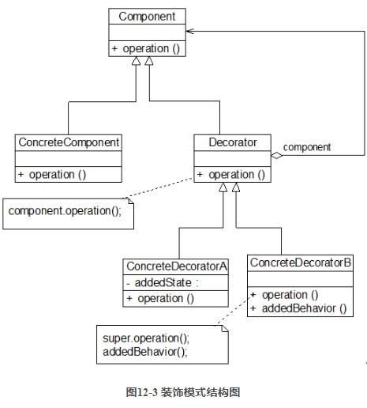
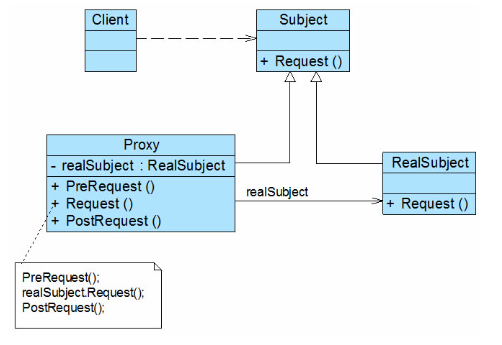

# 创建型模式

### 简单工厂模式

##### 说明

- 构造工厂类，在调用生产方法时 **传入不同参数来得到不同的产品类对象**
- 依赖于多态

##### 优缺点

- 优点

  - 实现了产品类 **对象创建和使用的分离**

    > 在工厂的生产方法中构造，在调用方法处使用

  - 要获取某个类的对象，只需要知道对应的参数即可

- 缺点

  - 需要引入工厂类

  - 如果要支持 **新的产品类**，需要 **修改生产方法**

    > 因为在生产方法中需要判断到底生成哪个产品类的对象

  - **生产方法为静态方法**，导致工厂类无法继承别的类

##### 示例

- 工厂类

  ```c#
  namespace DesignMethod
  {
      // 增加新产品，需要添加枚举值
      enum ProductIndex
      {
          Computer,
          Phone
      };
  
  
      /// <summary>
      /// 工厂类
      /// </summary>
      public class Factory
      {
          /// <summary>
          /// 生产方法：
          /// </summary>
          /// <returns>Product的子类对象</returns>
          public static Product GetProduct(int index)
          {
              Product ret = null;
              // 增加新产品，需要添加新的case判断
              switch(index)
              {
                  case (int)ProductIndex.Computer:
                      ret = new Computer();
                      break;
                  case (int)ProductIndex.Phone:
                      ret = new Phone();
                      break;
                  default:
                      Console.WriteLine("产品不存在");
                      break;
              }
  
              return ret;
          }
      }
  
  }
  ```

- 产品类
  ```c#
  namespace DesignMethod
  {
      /// <summary>
      /// 此文件保存产品类的定义
      /// </summary>
  
  
      /// <summary>
      /// 产品类抽象
      /// </summary>
      public abstract class Product
      {
          /// <summary>
          /// 产品名称
          /// </summary>
          /// <value>string</value>
          public abstract string Name{get;}
  
  
          /// <summary>
          /// 展示产品信息（）可重写
          /// </summary>
          public virtual void ShowInfo()
          {
              Console.WriteLine("被生产的产品名称：{0}",this.Name);
          }
      }
  
  
      /// <summary>
      /// 产品：电脑
      /// </summary>
      public class Computer : Product
      {
          public override string Name {get {return "Computer";}}
  
          public Computer()
          {
              ShowInfo();
          }
      }
  
  
      /// <summary>
      /// 产品：手机
      /// </summary>
      public class Phone : Product
      {
          public override string Name {get {return "Phone";}}
  
          public Phone()
          {
              ShowInfo();
          }
      }
  }
  ```

- 使用
  ```c#
  class Program
  {
      static void Main(string[] args)
      {
          testFactory();
  
      }
  
      public static void testFactory()
      {
          // 通过传入参数指定生产的产品类型
          Product product = Factory.GetProduct(1);
         	// 被生产的产品名称：Phone
      }
  }
  ```
  
  

### 工厂方法模式*

##### 说明

- 定义一个 **工厂接口**，让各个工厂类生产不同的产品
- 使用xml配置文件指定到底是哪个工厂类的对象进行生产

##### 优缺点

- 优点

  - 工厂方法用来创建客户所需要的产品，同时还向客户**隐藏了哪种具体产品类将被实例化这一细节**，用户**只需要关心所需产品对应的工厂**
  - 所有的具体工厂类都具有同一抽象父类，不同产品由不同工厂类负责生产，**分担了原先单独工厂类的复杂度**
  - 添加新产品时，**无需修改现有工厂的生产方法**，只需添加新的产品类和对应的工厂类

- 缺点

  -  在添加新产品时，**需要编写新的具体产品类和与之对应的具体工厂类**，系统中类的个数将成对增加
  - 增加了系统的抽象性和理解难度，且在实现时可能需要用到DOM、反射等技术，增加了系统的实现难度

- 示例

  - Xml
    ```xml
    <?xml version="1.0" encoding="UTF-8"?>
    
    <!-- 通过xml文件指定生产的产品类型 -->
    
    <ProductList>
        <Product type="Phone">6888</Product>
        <Product type="Phone"></Product>
        <Product type="Computer">10000</Product>
        <Product type="Phone"></Product>
        <Product type="Computer"></Product>
    </ProductList>
    ```

  - 使用
    ```c#
    // 读取xml，根据配置生产对应产品
    Console.WriteLine("\n工厂方法：读配置生产");
    XmlDocument document = new XmlDocument();
    document.Load("/Users/dsh/Documents/C.Net/C#_onMac/designMethod/factory/Product.xml");
    
    
    XmlNode productListNode = document.SelectSingleNode("ProductList");
    // 读取子元素，创建对象
    Product[] products = new Product[productListNode.ChildNodes.Count];
    for(int i=0;i<products.Length;i++)
    {
        // 获取创建对象所需参数
        XmlElement productInfo = (XmlElement)productListNode.ChildNodes[i];
        string typeName = productInfo.GetAttribute("type");     // 产品类型名称
        string price = productInfo.InnerText;                   // 产品价格
        if(price.Length<1) price = "1";
        
        // 通过反射创建对象
        Type type = Type.GetType("DesignMethod."+typeName);
        ConstructorInfo ctor = type.GetConstructor(new Type[]{typeof(float)});
        products[i] = (Product)ctor?.Invoke(new object[]{int.Parse(price)});
    }
    ```
    
    

### 抽象工厂模式*

##### 说明

- **产品等级结构**：产品类的继承结构

  > 例如：笔记本电脑 --> 拯救者、暗影精灵……

- **产品族**：**由同一工厂生产** 的，位于不同产品等级结构中的一组产品

  > 最好是不同产品等级结构同一级的产品
  >
  > 例如：
  >
  > - 联想笔记本产品族：拯救者（性能本产品等级结构）+ ThinkPad（商务本产品等级结构）
  > - 惠普笔记本产品族：暗影精灵 + 光影精灵

- 抽象工厂模式：提供一个创建一系列相关或相互依赖对象的接口，而无须指定它们具体的类

  > 一个公司一个工厂，各个公司工厂可以包含多个生产方法

##### 优缺点

- 优点
  - 增加新的产品族很方便，只需要创建新的产品族工厂
  - 系统中有多于一个的产品族，而每次只使用其中某一产品族。可以通过配置文件等方式来使得用户可以动态改变产品族
  -  当一个产品族中的多个对象被设计成一起工作时，它能够保证客户端始终只使用同一个产品族中的对象
- 缺点
  - 增加新的产品等级结构很难，需要修改工厂接口，并逐个修改各个具体的产品族工厂类


##### 示例

> 工厂应能够生产Button、TextField和ComboBox
>
> Spring工厂生产Spring的3种产品，Summer的工厂生产Summer的3种产品


### 单例模式*

##### 说明

- 确保 **某一个类只有一个实例**
- 在获取实例时，**若实例不存在，能够自动创建**

##### 设计

- 问题：多线程请求实例时可能会导致实例不唯一

- 改进

  - 定义实例变量时直接创建：`private static readonly SingleInstance instance = new SingleInstance();`

    > 添加 `final`或 `readonly` 关键字
    >
    > 调用速度快，但是系统加载时间会变长

  - 添加线程锁定

    > 需要判断线程锁定，性能降低

  - **IoDH** 技术

    > **Initialization Demand Holder** 
    >
    > 在单例类内部定义一个static类，用于保存实例
    >
    > 依赖于语言特性来保证其线程安全

##### 优缺点

- 优点
  - 单例模式提供了 **对唯一/有限数量实例的受控访问** 。因为单例类封装了它的唯一实例，所以它可以严格控制客户怎样以及何时访问它。
  -  由于在系统内存中只存在一个对象，因此可以**节约系统资源**
- 缺点
  - 无抽象层，不利于扩展
  - 单例类职责过重
  - 现在很多面向对象语言（如Java、C#）的运行环境都提供了 **自动垃圾回收的技术**，因此，**如果实例化的共享对象长时间不被利用，系统会认为它是垃圾**，会自动销毁并回收资源，下次利用时又将重新实例化，这将导致共享的单例对象状态的丢失


##### 示例

```c#
public class SingleInstance
{
    private static class Holder
    {
        public static readonly SingleInstance instance = new SingleInstance();
    }
    public int count = 0;

    private SingleInstance()
    {
        Console.WriteLine("单例创建");
    }

    /// <summary>
    /// 实例获取方法
    /// </summary>
    /// <returns></returns>
    public static SingleInstance GetInstance()
    {
        // if(instance==null) instance = new SingleInstance();
        Holder.instance.count++;
        return Holder.instance;
    }
}
```


### 原型模式

> 字节流实现深拷贝引用对象

##### 说明

- 使用原型实例指定创建对象的种类，并且通过 **拷贝这些原型创建新的对象**

- 组成

  - 原型抽象类
  - 具体原型类：实现原型抽象类中声明的克隆方法

- 实现方法

  - 通用实现方法：创建一个新的对象，并将自己的成员变量值复制给新对象

  - 实现 `ICloneable`

    > 注意：实现该接口后，调用克隆方法实现的是浅拷贝，**只会复制字段**，不会递归复制引用类型的成员

    ```c#
    public class Prototype : ICloneable
    {
        public int id;
        string text;
        public string Text { get => text; set => text = value; }
        public DataClass data;
    
        public Prototype(int id,string text)
        {
            this.id = id;
            Text = text;
        }
    
        public object Clone()
        {
            // 浅拷贝
            return this.MemberwiseClone();
        }
    
        public override string ToString()
        {
            return id.ToString() + "\t" + text;
        }
    }
    ```

  - 序列化 `Serializable`：在克隆时通过序列化克隆对象


##### 优缺点

- 优点
  - 可以用克隆替代创建，**简化对象的创建过程**
  - 可以针对抽象原型类进行编程，而将具体原型类写在配置文件中，增加或减少产品类对原有系统都没有任何影响
  - 可以使用深克隆的方式保存对象的状态，使用原型模式将对象复制一份并将其状态保存起来，以便在需要的时候使用（如恢复到某一历史状态），可辅助实现撤销操作
- 缺点
  - 需要为每一个类配备一个克隆方法，**对已有类进行改动需要同时改变克隆方法**
  - 在实现深克隆时需要编写较为复杂的代码（嵌套类除叶子层都需要实现深拷贝）


##### 示例

> 通常还会创建一个原型管理类，来存储各种原型

- 原型
  ```c#
  /// <summary>
  /// 数据类
  /// </summary>
  [Serializable]
  public class DataClass
  {
      public dynamic data;
  
      public DataClass(dynamic x)
      {
          data = x;
      }
  
      public override string ToString()
      {
          return data!=null ? data.ToString() : "数据未初始化";
      }
  }
  
  
  [Serializable]
  public class Prototype : ICloneable
  {
      public int id;
      string text;
      public string Text { get => text; set => text = value; }
      public DataClass data;
  
      public Prototype(int id,string text)
      {
          this.id = id;
          Text = text;
          data = new DataClass(null);
      }
  
      public object Clone()
      {
          // return this.MemberwiseClone();
  
          // 写入字节流
          BinaryFormatter formatter = new BinaryFormatter();
          MemoryStream stream = new MemoryStream();
          formatter.Serialize(stream,this);
  
          // 读取并存储为新对象
          byte[] bt = stream.ToArray();
          stream = new MemoryStream(bt);
          return formatter.Deserialize(stream) as Prototype;
      }
  
      public override string ToString()
      {
          return id.ToString() + "\t" + text + "\t" + data.ToString();
      }
  }
  ```

  

### 建造者模式

> 一个建造方法 --> 一种参数组合 --> 一种功能的类对象

##### 说明


- 将一个 **复杂对象** 的 **构建与表示分离**，使得同样的构建过程可以创建不同的表示

  > 常用于 **需要配置很多成员变量值** 的类对象的创建
  >
  > 属性项相同、属性值不同的对象用于不同工作

- 复杂对象：含有从多个成员对象的类对象

- 组成

  - 抽象建造者：指定抽象接口，包括部件添加和产品生成

  - 具体建造者：一个具体建造者对应产品的一种属性组合

  - 产品

  - 指挥者：负责安排复杂对象的建造次序

    > 用户调用指挥者的方法，指挥者按次序调用建造者的建造方法并获取产品


##### 优缺点

- 优点
  - 在建造者模式中，客户端不必知道产品内部组成的细节，**将产品本身与产品的创建过程解耦**，使得**相同的创建过程可以创建不同的产品对象**
  - 每一个具体建造者都相对独立，而与其他的具体建造者无关，因此可以每一个具体建造者都相对独立，而与其他的具体建造者无关，因此可以很方便地替换具体建造者或增加新的具体建造者
  - 将复杂产品的创建步骤分解在不同的方法中，使得创建过程更加清晰，方便修改
- 缺点
  - 如果产品之间的差异性很大（成员变量组成不同），例如很多组成部分都不相同，不适合使用建造者模式


------


# 结构型模式

### 适配器模式*

##### 说明

- 用于解决某功能的 **调用接口与实现方法调用方式不同** 的问题

- 组成

  > 适配者Adaptee提供实现功能的接口，目标Target提供外部调用的接口，二者名称、参数可能不同

  - 目标 Target：定义客户所需接口

  - 适配者 Adaptee：被适配的部分，可能没有相关源代码，并没有客户需要的接口

  - 适配器 Adapter：通过继承 Target 并关联一个 Adaptee 使二者产生联系

    > 例如：
    >
    > - 用户想通过a方法调用工具类的某个功能
    > - 工具类提供了b方法实现该功能
    > - 适配器中定义名为a的接口，调用b方法

- 分类

  - 对象适配器：适配器与适配者之间是关联关系

    > 适配器引用一个适配者对象，从而调用所需的方法

  - 类适配器：适配器与适配者之间是继承（或实现）关系

    > 若Target不是接口，可能需要支持多重继承的语言才能实现

  - 缺省适配器：针对适配者中只有部分方法需要进行适配

    > 是 **类适配器的变种**
    >
    > 通常目标不需要适配者的所有功能
    >
    > 可使用一个中间类实现适配者接口，并用空方法实现，这样子类不必再实现无用接口


##### 优缺点

- 优点
  - **将目标类和适配者类解耦**
  - 可将多个适配者用一个适配器进行适配
- 缺点
  - 若不支持多重继承，则无法使用类适配器对多个适配者类进行适配，要适配多个适配者，适配者只能是接口
  - 在适配器中置换适配者类的某些方法比较麻烦


##### 示例

> 示例中，若调用适配器的 `Method2()`，实际上调用的是适配者的 `TestA()`

- 设计
  ```c#
  /// <summary>
  /// 假设的对外接口，声明了可供外部使用的方法
  /// </summary>
  public interface IAdapter
  {
      // 提供两个对外方法
      void Method1();
      void Method2();
  }
  
  /// <summary>
  /// 适配器：使对外方法能够调用目标功能方法
  /// </summary>
  public class Adapter : IAdapter
  {
      Adaptee adaptee;
  
      public Adapter()
      {
          adaptee = new Adaptee();
      }
  
  
      public void Method1()
      {
          Console.WriteLine("适配器对外接口：Method1");
          adaptee.Test1();
      }
      public void Method2()
      {
          Console.WriteLine("适配器对外接口：Method2");
          adaptee.TestA();
      }
  }
  
  
  public class Adaptee
  {
      public void Test1()
      {
          Console.WriteLine("适配者实现方法名：Test1");
      }
  
      public void Test2()
      {
          Console.WriteLine("适配者实现方法名：Test2");
      }
  
      public void TestA()
      {
          Console.WriteLine("适配者方法：TestA");
      }
  }
  ```

- 使用
  ```c#
  /// <summary>
  /// 设计模式：结构型模式-适配器
  /// </summary>
  public static void testAdapter()
  {
      Console.WriteLine("适配器");
      Adapter adapter = new Adapter();
      adapter.Method2();
      // 适配器对外接口：Method2
  	// 实际调用的方法名：TestA
  }
  ```


### 桥接模式

> 3x3=9？3+3=6！

##### 说明


- 将抽象部分与它的实现部分分离，用一种巧妙的方式**处理多层继承存在的问题**

  > 用抽象关联取代了传统的多层继承，将类之间的静态继承关系转换为动态的对象组合关系，使得系统更加灵活
  >
  > 利用了面向对象中 **可以用接口变量接收实现了接口的类对象** 这一特点

- 组成

  - 实现/桥接接口：声明需要不同具体实现的业务方法

    > 一般此业务方法与具体类的属性相关度较小

  - 桥接对象：实现桥接接口声明的方法的类

  - 抽象类：规范业务对象的大部分不需要改动的功能，并 **提供设定桥接对象的方法**

  - 具体类：继承抽象类，并根据各自功能以各自的方式使用桥接接口声明的方法


##### 优缺点

- 优点
  - **分离抽象接口及其实现部分**，通过让业务类持有一个桥接接口对象，使得桥接接口声明的方法可以随意扩展改动而无需对业务类进行修改，**增强扩展性**
  - 可以取代多层继承方案，减少复杂度
- 缺点
  - 桥接模式的使用会 **增加系统的理解与设计难度**，由于关联关系建立在抽象层，要求开发者一开始就针对抽象层进行设计与编程
  - 桥接模式 **要求正确识别出系统中两个独立变化的维度**，因此其使用范围具有一定的局限性，如何正确识别两个独立维度也需要一定的经验积累


##### 示例

- 设计：元素法师

  - 元素
    ```c#
    /// <summary>
    /// 魔法元素接口
    /// 各元素都有各自的元素爆发效果
    /// </summary>
    public interface IMagicElement
    {
        string GetElementName();        // 获取元素名称
        void ElementBoost(int n);       // 元素爆发
    }
    
    
    // 具体魔法元素：火、风、土……
    public class Fire : IMagicElement
    {
        public void ElementBoost(int n)
        {
            Console.WriteLine("\t混沌陨石\t伤害倍率：{0}",n);
        }
    
        public string GetElementName() => "火";
    }
    
    public class Wind : IMagicElement
    {
        public void ElementBoost(int n)
        {
            Console.WriteLine("\t强袭飓风\t伤害倍率：{0}",n);
        }
    
        public string GetElementName() => "风";
    }
    
    public class Earth : IMagicElement
    {
        public void ElementBoost(int n)
        {
            Console.WriteLine("\t撕裂大地\t伤害倍率：{0}",n);
        }
    
        public string GetElementName() => "土";
    }
    ```

  - 法师

    > 法师有两个主要变化属性：级别、元素属性
    >
    > 如果不使用桥接，则需要定义9个法师子类（普通风火土、大师风火土、传奇风火土）
    >
    > 使用桥接，则只需要定义3个法师子类和3个元素类，各个法师对象持有不同的元素接口对象即可

    ```c#
    /// <summary>
    /// 抽象类：法师
    /// 法师分为普通、大师、传奇3个级别，每个法师都有自己的元素属性
    /// 法师可释放终极技能，根据自身级别和元素产生不同效果
    /// </summary>
    public abstract class Magician
    {
        // 法师名称
        public string name;
        // 法师级别
        public abstract int Level {get;}
        protected IMagicElement magicElement=null;
        // 设定该法师的元素
        public IMagicElement MagicElement {set {magicElement = value;} }
    
        public virtual void UltimateSkill()
        {
            if(magicElement==null)
            {
                Console.WriteLine("尚未获得元素");
                return;
            }
            Console.Write("释放元素爆发：");
            magicElement.ElementBoost(Level);
        }
    
        public Magician(string name)
        {
            this.name = name;
        }
    }
    
    
    public class MagicianNormal : Magician
    {
        public override int Level => 1;
        public override void UltimateSkill()
        {
            Console.Write("普通法师 ");
            base.UltimateSkill();
        }
        public MagicianNormal(string name) : base(name)
        {
        }
    }
    
    public class MagicianMaster : Magician
    {
        public override int Level => 2;
        public override void UltimateSkill()
        {
            Console.Write("大师法师 ");
            base.UltimateSkill();
        }
        public MagicianMaster(string name) : base(name)
        {
        }
    }
    
    public class MagicianLegend : Magician
    {
        public override int Level => 3;
        public override void UltimateSkill()
        {
            Console.Write("传奇法师 ");
            base.UltimateSkill();
        }
        public MagicianLegend(string name) : base(name)
        {
        }
    }
    ```

- 使用
  ```c#
  /// <summary>
  /// 设计模式：结构型模式-桥接
  /// </summary>
  public static void testBridge()
  {
      Console.WriteLine(Type.GetType("StructPattern.Fire").FullName);
      Console.WriteLine("法师的名称、等级等基本属性由法师类实现，而元素相关的功能由外部桥接的接口对象实现\n\n");
      // 读取xml
      XmlDocument document = new XmlDocument();
      document.Load("/Users/dsh/Documents/C.Net/C#_onMac/structPattern/bridgePattern/Magician.xml");
      XmlNode parent = document.SelectSingleNode("config");
  
      Magician[] team = new Magician[parent.ChildNodes.Count];
      // 遍历子标签，通过反射创建对象
      for(int i=0;i<team.Length;i++)
      {
          XmlElement element = parent.ChildNodes[i] as XmlElement;
          Console.WriteLine("当前信息：{0} {1} {2}\n",element.Name,element.GetAttribute("name"),element.InnerText);
          // 创建法师对象
          Type type = Type.GetType("StructPattern.Magician"+element.Name);
          ConstructorInfo ctor = type.GetConstructor(new Type[]{typeof(string)});
          team[i] = (Magician)ctor?.Invoke(new object[]{element.GetAttribute("name")});
          // 设定元素
          type = Type.GetType(element.InnerText);
          if(type==null) 
          {
              Console.WriteLine("元素不存在");
              string name = "StructPattern."+"Wind";
              type = Type.GetType(name);
          }
          Console.WriteLine("元素：{0}",type.Name);
          ctor = type.GetConstructor(new Type[0]);
          team[i].MagicElement = (IMagicElement)ctor?.Invoke(null);
      }
  
      // 施法
      foreach(Magician magician in team) magician.UltimateSkill();
      // 普通法师 释放元素爆发： 强袭飓风        伤害倍率：1
      // 传奇法师 释放元素爆发： 混沌陨石        伤害倍率：3
      // 大师法师 释放元素爆发： 撕裂大地        伤害倍率：2
      // 普通法师 释放元素爆发： 强袭飓风        伤害倍率：1
  }
  ```


### 组合模式*

> 同种类的 **递归结构**

##### 说明

- 为 **处理树形结构** 提供了一种较为完美的解决方案，它描述了如何 **将容器类和叶子类进行递归组合**，使得用户在使用时无须对它们进行区分，可以一致地对待容器和叶子

- 关键：定义一个组件抽象类，既可以扩展成容器，也可以扩展成叶子

  > 编程时 **针对组件抽象类编程** ，而无需关注到底是容器还是叶子
  >
  > 例如：Cocos的CCNode 和 Unity的GameObject

- 组成

  - 抽象组件 Component
  - 容器组件 Composite
  - 叶子组件 Leaf

- 分类

  > 如何处理叶子类不具有容器类的部分功能的问题

  - 透明组合模式：抽象组件中规定全部相关方法，但叶子类不对容器方法做实际处理
  - 安全组合模式：抽象组件只规定叶子和容器的通用方法，容器独有方法在容器类中单独实现

##### 优缺点

- 优点
  - 可以清楚地定义分层次的复杂对象，表示对象的全部或部分层次，它让客户端 **忽略了层次的差异**，方便对整个层次结构进行控制
  - 可以 **一致地使用一个组合结构或其中单个对象**，不必关心处理的是单个对象还是整个组合结构，简化了客户端代码
  - 增加新的容器构件和叶子构件都很方便，无须对现有类库进行任何修改
- 缺点
  - 在增加新构件时很 **难对容器中的构件类型进行限制**

##### 示例

- 定义
  ```c#
  /// <summary>
  /// 抽象类：文件节点
  /// </summary>
  public abstract class FileNode
  {
      public string name;
  
      public abstract void add(FileNode node);
      public abstract void remove(int i);
      public abstract FileNode GetChild(int i);
  
      protected void NotSupport()
      {
          Console.WriteLine("不支持此功能！");
      }
  
      /// <summary>
      /// 显示节点信息(递归显示子节点)
      /// </summary>
      public abstract void ShowInfo(string tab="");
  
      public FileNode(string name)
      {
          this.name = name;
      }
  }
  
  
  /// <summary>
  /// 文件
  /// </summary>
  public class File : FileNode
  {
      public File(string name) : base(name)
      {
      }
  
      // 文件不支持增删子文件、获取子文件
      public override void add(FileNode node)
      {
          NotSupport();
      }
      public override void remove(int i)
      {
          NotSupport();
      }
      public override FileNode GetChild(int i)
      {
          NotSupport();
          return null;
      }
  
      public override void ShowInfo(string tab="")
      {
          Console.WriteLine("{0}文件 {1}",tab,name);
      }
  }
  
  
  /// <summary>
  /// 文件夹
  /// </summary>
  public class Folder : FileNode
  {
      protected List<FileNode> children;
  
      public Folder(string name) : base(name)
      {
          children = new List<FileNode>();
      }
  
      public override void add(FileNode node)
      {
          children.Add(node);
      }
  
      public override FileNode GetChild(int i)
      {
          if(i<children.Count) return children[i];
          else return null;
      }
  
      public override void remove(int i)
      {
          if(i<children.Count) children.RemoveAt(i);
      }
  
      public override void ShowInfo(string tab="")
      {
          Console.WriteLine("{0}<文件夹 {1}>",tab,name);
          for(int i=0;i<children.Count;i++)
              children[i].ShowInfo(tab+"\t");
      }
  }
  ```

- 使用
  ```c#
  /// <summary>
  /// 设计模式：结构型模式-组合模式
  /// </summary>
  public static void testComposition()
  {
      Console.WriteLine("组合模式");
      Folder a = new Folder("小说");
      a.add(new File("目录"));
      a.add(new Folder("第一卷"));
      a.add(new Folder("第二卷"));
      a.add(new Folder("第三卷"));
      a.GetChild(1).add(new File("2-1"));
      a.GetChild(1).add(new File("2-2"));
      a.ShowInfo();
  }
  
  // 组合模式
  // <文件夹 小说>
  //         文件 目录
  //         <文件夹 第一卷>
  //                 文件 2-1
  //                 文件 2-2
  //         <文件夹 第二卷>
  //         <文件夹 第三卷>
  ```

  

### 装饰模式

> 用套壳拓展替代继承

##### 说明



- **动态地给一个对象增加一些额外的职责**，就增加对象功能来说，装饰模式比生成子类实现更为灵活

  > 拥有共同根源接口/抽象类的桥接？
  >
  > 具体装饰类又符合组合模式
  >
  > 将可能的 **继承关系转化为引用关系**，变种的多重继承？

- 组成

  - 抽象组件：具体组件和抽象装饰类共同的父类/接口

  - 具体组件：定义具体组件

  - 抽象装饰类：持有一个组件引用，并规定扩展方法

    > 由于需要持有一个组件引用，因此需要是抽象类

  - 具体装饰类：实现具体的扩展方法
  
- 设计：解决系统可能无法统一处理装饰前后的对象的问题

  - 透明装饰模式：完全针对抽象编程，对具体组件对象和具体装饰对象 **统一处理**

    > 可简单理解为对外方法以抽象组件/组件接口中定义的为主，**装饰类尽量不再添加对外方法**

  - 半透明装饰模式：编程时区别具体组件对象和装饰后的组件对象

    > 方便调用装饰后的新方法，但不便于实现多次装饰 


##### 优缺点

- 优点

  - 对于 **扩展一个对象的功能**，装饰模式比继承更加灵活性，**不会导致类的个数急剧增加**

  - 可以通过一种动态的方式来扩展一个对象的功能，**通过配置文件选择不同的具体装饰类**，从而实现不同的行为

  - **可以对一个对象进行多次装饰**，通过使用不同的具体装饰类以及这些装饰类的排列组合，可以创造出很多不同行为的组合，得到功能更为强大的对象

  - 具体构件类与具体装饰类可以独立变化

    > 与桥接模式的特点相似

- 缺点

  - 使用装饰模式进行系统设计时将 **产生很多小对象**，这些对象的区别在于它们之间**相互连接的方式有所不同**，而不是它们的类或者属性值有所不同，在一定程序上影响程序的性能
  - 比继承更加易于出错，**排错也很困难**，对于多次装饰的对象，可能需要逐级排查，较为繁琐


##### 示例

- 定义

  > 将桥接模式中的元素接口作为抽象组件接口，普通元素类作为具体组件

  ```c#
  /// <summary>
  /// 抽象装饰类：超级元素（强化元素爆发效果）
  /// </summary>
  public abstract class SuperMagicElement : IMagicElement
  {
      // 被强化的元素
      IMagicElement element;
      // 强化效果名称
      public abstract string EffectName {get;}
      /// <summary>
      /// 强化效果
      /// </summary>
      public abstract void SuperEffect();
  
      public void ElementBoost(int n=1)
      {
          element.ElementBoost(n);
          SuperEffect();
      }
      public string GetElementName()
      {
          return element.GetElementName();
      }
  
  
      public SuperMagicElement(IMagicElement element)
      {
          this.element = element;
      }
  }
  
  
  /// <summary>
  /// Debuff效果强化元素
  /// </summary>
  public class DebuffElement : SuperMagicElement
  {
      public DebuffElement(IMagicElement element) : base(element)
      {
      }
  
      public override string EffectName => "使元素爆发增加Debuff效果";
  
      public override void SuperEffect()
      {
          Console.WriteLine("对 敌人 施加：Debuff");
      }
  }
  
  
  /// <summary>
  /// Buff效果强化元素
  /// </summary>
  public class BuffElement : SuperMagicElement
  {
      public BuffElement(IMagicElement element) : base(element)
      {
      }
  
      public override string EffectName => "使元素爆发增加Buff效果";
  
      public override void SuperEffect()
      {
          Console.WriteLine("对 友军 施加：Buff");
      }
  }
  ```

- 使用
  ```c#
  /// <summary>
  /// 设计模式：结构型模式-装饰模式
  /// </summary>
  public void testExpand()
  {
      Console.WriteLine("装饰模式");
      Wind wind = new Wind();
      Console.WriteLine("强化前的风元素：");
      wind.ElementBoost();
      Console.WriteLine("强化后的风元素：");
      BuffElement buffWind = new BuffElement(wind);
      buffWind.ElementBoost();
      DebuffElement debuffWind = new DebuffElement(wind);
      debuffWind.ElementBoost();
  }
  
  // 装饰模式
  // 强化前的风元素：
  //         强袭飓风        伤害倍率：1
  // 强化后的风元素：
  //         强袭飓风        伤害倍率：1
  // 对 友军 施加：Buff
  //         强袭飓风        伤害倍率：1
  // 对 敌人 施加：Debuff
  ```

  

### 外观模式*

> 主系统模式

##### 说明

- 外观模式为子系统中的一组接口提供一个统一的入口，这个接口使得这一子系统更加容易使用

  > 解决多个主体类和多个子系统之间 **互动复杂** 的问题
  >
  > 例如外部某功能需要调用多个子系统的多个方法，可以将这些方法在服务类的一个方法中统一调用

- 组成

  - 子系统角色：每一个子系统可以不是一个单独的类，而是一个类的集合，它实现子系统的功能

  - 对外服务角色：外部对象通过此角色调用子系统的功能

    > 可以根据需要考虑单例模式
    >
    > 可以通过定义对外接口并针对接口编程，这样如果需要改变对外服务类关联的子系统，**只需要定义新的对外类即可，而不必修改已有代码**


##### 优缺点

- 优点
  - 对外屏蔽了子系统，简化交互
  - 实现了子系统和外部的松耦合关系
  - 子系统的修改不会影响其他系统，子系统的内部变化也不会影响对外类

- 缺点
  - 不能很好地限制客户端直接使用子系统类
  - 频繁增加子系统不方便


##### 示例

- 设计
  ```c#
  public class MainSystem
  {
      // 单例实现
      public static class Holder{
          public static readonly MainSystem instance = new MainSystem();
      }
      public static MainSystem GetInstance() => Holder.instance;
  
      // 子系统
      AttackSystem attackSystem;
      DefendSystem defendSystem;
  
  
      public MainSystem()
      {
          attackSystem = new AttackSystem();
          defendSystem = new DefendSystem();
      }
  
      void Start(string name) => Console.Write("{0}：",name);
      void End() => Console.WriteLine();
  
      /// <summary>
      /// 对外行为：每个对外行为会调用多个子系统方法
      /// </summary>
      public void DoubleAttack()
      {
          Start("二连击");
          attackSystem.NormalAttack();
          attackSystem.CriticalAttack();
          End();
      }
      public void Bounce()
      {
          Start("弹反");
          defendSystem.NormalDefend();
          attackSystem.CriticalAttack();
          End();
      }
      public void QuickAttack()
      {
          Start("快速一击");
          defendSystem.DodgeDefend();
          attackSystem.NormalAttack();
          End();
      }
  }
  
  
  public class AttackSystem
  {
      public void NormalAttack()
      {
          Console.Write(" 轻攻击");
      }
  
      public void CriticalAttack()
      {
          Console.Write(" 暴击");
      }
  }
  
  
  public class DefendSystem
  {
      public void NormalDefend()
      {
          Console.Write(" 防御");
      }
  
      public void DodgeDefend()
      {
          Console.Write(" 闪避");
      }
  }
  ```

- 示例
  ```c#
  public void testMainSystem()
  {
      Console.WriteLine("外观模式（主系统模式）");
      MainSystem mainSystem = MainSystem.GetInstance();
      mainSystem.Bounce();
      mainSystem.DoubleAttack();
      mainSystem.QuickAttack();
  }
  // 外观模式（主系统模式）
  // 弹反： 防御 暴击
  // 二连击： 轻攻击 暴击
  // 快速一击： 闪避 轻攻击
  ```

  


### 享元模式

> 带仓库的工厂？对象池？

##### 说明

- 系统只使用少量的相似对象，运用共享技术有效地 **支持相似对象的大量复用**

- 组成

  - 内部状态：存储在享元对象内部并且 **不会随环境改变** 而改变的状态

    > 可共享

  - 外部状态：**随环境改变**的状态，可选部分

    > 不可共享

  - 抽象享元类：规定 **内部状态获取方法** 和 **外部状态设定方法**

  - 具体享元类：存储内部状态，当外部状态比较简单且无需保存时，可使用单例模式以保证每个具体享元类提供唯一的享元对象

    > **使用单例模式时**，外部状态会被反复修改，**无法保存**

  - 非共享具体享元类

  - 享元工厂类：享元池管理

    - 享元池：将具有不同内部状态的对象作为不同享元对象，存储在享元池中

      > 通常使用哈希表实现

    - 获取享元对象的方法

- 分类

  - 单纯享元模式
  - 复合享元模式：部分享元类使用组合模式引用其他内部状态不同的享元类


##### 优缺点

- 优点
  - **减少内存中的对象数量**
  - 内外状态互不影响，方便在不同环境引用

- 缺点
  - 内外状态使逻辑复杂化
  - 读取外部状态会使效率降低


##### 示例

- 设计：黑白棋子，单例模式享元
  ```c#
  /// <summary>
  /// 抽象享元类：棋子
  /// </summary>
  public abstract class Chess
  {
      // 内部状态：棋子颜色
      public abstract string Color {get;}
  
      // 外部状态：棋子位置
      protected int x;
      protected int y;
      public void SetPosition(int x,int y)
      {
          this.x = x;
          this.y = y;
          ShowInfo();
      }
  
      public Chess()
      {
          x = 0;
          y = 0;
      }
  
      public void ShowInfo()
      {
          Console.WriteLine("{0} 放置于 ({1},{2})",Color,x,y);
      }
  }
  
  
  public class WhiteChess : Chess
  {
      public WhiteChess()
      {
      }
      public override string Color => "白棋";
  }
  
  
  public class BlackChess : Chess
  {
      public BlackChess()
      {
      }
      public override string Color => "黑棋";
  }
  
  
  /// <summary>
  /// 棋子工厂
  /// </summary>
  public class ChessBox
  {
      static class Holder{
          public static readonly ChessBox instance = new ChessBox();
      }
      public static ChessBox GetInstance() => Holder.instance;
      Dictionary<int,Chess> box;      // 棋盒
  
      public ChessBox()
      {
          box = new Dictionary<int, Chess>();
      }
  
      /// <summary>
      /// 工厂方法：创建棋子
      /// </summary>
      /// <returns></returns>
      Chess CreateChess(int color)
      {
          Chess ret;
          if(color==0) ret = new WhiteChess();
          else ret = new BlackChess();
          return ret;
      }
  
      /// <summary>
      /// 设定享元对象外部状态：放置棋子
      /// </summary>
      public Chess PutChessAt(int color,int x,int y)
      {
          // 获取享元对象
          box.TryGetValue(color,out Chess ret);
          if(ret==null)
          {
              ret = CreateChess(color);
              box.Add(color,ret);
          }
          // 放置棋子
          ret.SetPosition(x,y);
          return ret;
      }
  }
  ```

- 使用
  ```c#
  public void testFlyWeight()
  {
      Console.WriteLine("享元模式");
      ChessBox chessBox = ChessBox.GetInstance();
      Chess w1,b1,w2,b2;
      w1 = chessBox.PutChessAt(0,1,0);
      w2 = chessBox.PutChessAt(0,2,2);
      b1 = chessBox.PutChessAt(1,7,0);
      b2 = chessBox.PutChessAt(1,3,5);
      Console.WriteLine("棋子是否相同：{0} {1}",w1.Equals(w2),b1.Equals(b2));
  }
  // 享元模式
  // 白棋 放置于 (1,0)
  // 白棋 放置于 (2,2)
  // 黑棋 放置于 (7,0)
  // 黑棋 放置于 (3,5)
  // 棋子是否相同：True True
  ```

  

### 代理模式*

> 类似于装饰模式+适配器模式，通过代理对业务类进行装饰、限制，适配客户端操作

##### 说明



- 功能：给某一个对象提供一个代理或占位符，并 **由代理对象来控制对原对象的访问**

- 组成

  - 抽象主题角色 Subject：声明真实主题和代理主题的共同接口

    > 通常面向抽象主题编程，以一致性地处理代理主题和真实主题 

  - 真实主题角色 RealSubject：实现真实业务操作，客户端可通过代理主题角色间接调用其中操作

  - 代理主题角色 Proxy：**包含了对真实主题的引用** 以操作真实主题，还可以创建、删除真实主题，或是对真实主题的使用加以限制，或扩展真实主题接口调用前后的操作

- 分类

  - 远程代理：为一个 **位于不同的地址空间的对象** 提供一个 **本地的代理对象**，这个不同的地址空间可以是在同一台主机中，也可是在另一台主机中

    > 用于实现本地对远程主机中业务对象的间接访问

  - 虚拟代理：如果需要创建一个 **资源消耗较大的对象**，先创建一个消耗相对较小的对象来表示，**真实对象只在需要时才会被真正创建保护代理**

    > 常与多线程技术结合使用，在创建代理对象的同时处理真实对象

  - 保护代理：通过代理控制用户对真实主题角色的访问权限

  - 缓冲代理：为目标操作的结果提供临时存储空间，方便多个客户端共享结果

  - 智能引用代理：当对象被引用时进行额外操作，例如计数


##### 优缺点

- 优点
  - 协调调用者和被调用者，在一定程度上降低了系统的耦合度
  - 远程代理：为位于两个不同地址空间对象的访问提供了一种实现机制，可以将一些消耗资源较多的对象和操作移至性能更好的计算机上
  - 虚拟代理：通过一个消耗资源较少的对象来代表一个消耗资源较多的对象，可以在一定程度上节省系统的运行开
  - 缓冲代理：为某一个操作的结果提供临时的缓存存储空间，以便在后续使用中能够共享这些结果，优化系统性能
  - 保护代理：可以控制对一个对象的访问权限，为不同用户提供不同级别的使用权限

- 缺点
  - 增加了代理对象，因此有些类型的代理模式可能会造成请求的处理速度变慢
  - 实现代理模式需要额外的工作，而且有些代理模式的实现过程较为复杂

- 适用场景
  - 当客户端对象需要访问远程主机中的对象时可以使用远程代理
  - 当需要用一个消耗资源较少的对象来代表一个消耗资源较多的对象，从而降低系统开销、缩短运行时间时可以使用虚拟代理，例如一个对象需要很长时间才能完成加载时
  - 当需要为某一个被频繁访问的操作结果提供一个临时存储空间，以供多个客户端共享访问这些结果时可以使用缓冲代理。通过使用缓冲代理，系统无须在客户端每一次访问时都重新执行操作，只需直接从临时缓冲区获取操作结果即可
  - 当需要控制对一个对象的访问，为不同用户提供不同级别的访问权限时可以使用保护代理
  - 当需要为一个对象的访问（引用）提供一些额外的操作时可以使用智能引用代理


------


# 行为模式

### 职责链模式

> 类组合模式，分级处理请求

##### 说明

- **避免请求发送者与接收者耦合在一起**，让多个对象都有可能接收请求，**将这些对象连接成一条链**，并且沿着这条链传递请求，直到有对象处理它为止

- 职责链的创建交由其他部分完成

- 组成

  - 抽象处理者：定义处理请求方法，引用下一级请求对象

  - 具体处理者：如果有权限处理请求则自行处理，否则传递给下一级

    > 处理请求、转发请求

- 分类

  - 纯职责链：处理后不再向下传递
  - 不纯职责链：处理后可向下传递（穿透）


##### 优缺点

- 优点
  - 无须知道是其他哪一个对象处理其请求，对象仅需知道该请求会被处理即可，**降低了系统耦合度**
  - 仅需维持一个指向其后继者的引用，而**不需要维持它对所有的候选处理者的引用**，可简化对象的相互连接
  - 可以通过在运行时对该链进行动态的增加或修改来增加或改变处理一个请求的职责
  - 增加一个新的具体请求处理者时无须修改原有的处理代码，只需要在客户端重新建链即可

- 缺点
  - 不能保证请求一定被处理
  - 职责链较长时，易影响性能
  - 职责链的不当构建可能导致死循环


##### 示例

- 设计
  ```c#
  /// <summary>
  /// 抽象职责链元素
  /// </summary>
  public abstract class ChainElement
  {
      protected ChainElement superior;      // 上级
      protected string name;                // 本级名称
  
      public ChainElement(string name) => this.name=name;
  
      /// <summary>
      /// 设置职责链中的上级对象
      /// </summary>
      /// <param name="next"></param>
      public void SetSuperior(ChainElement next) => superior = next;
  
      /// <summary>
      /// 处理请求：请假
      /// </summary>
      public abstract void HandleHolidayRequest(int num);
  }
  
  
  public class TeamLeader : ChainElement
  {
      public TeamLeader(string name): base("组长·"+name)
      {
  
      }
  
      public override void HandleHolidayRequest(int num)
      {
          if(num<=5) Console.WriteLine("\t{0}  已批准假期：{1} 天",name,num);
          else
          {
              Console.WriteLine("{0}  无审批权限，交由上级处理",name);
              superior?.HandleHolidayRequest(num);
          }
      }
  }
  
  
  public class Administration : ChainElement
  {
      public Administration(string name): base("行政·"+name)
      {
  
      }
  
      public override void HandleHolidayRequest(int num)
      {
          if(num<=10) Console.WriteLine("\t{0}  已批准假期：{1} 天",name,num);
          else
          {
              Console.WriteLine("{0}  无审批权限，交由上级处理",name);
              superior?.HandleHolidayRequest(num);
          }
      }
  }
  
  
  public class Manager : ChainElement
  {
      public Manager(string name): base("经理"+name)
      {
  
      }
  
      public override void HandleHolidayRequest(int num)
      {
          Console.WriteLine("\t{0}  已批准假期：{1} 天",name,num);
      }
  }
  ```

- 使用
  ```c#
  public void testResponsibilityChain()
  {
      Console.WriteLine("职责链");
  
      // 创建职责链
      ChainElement leader,admin, manager;
      leader = new TeamLeader("htm");
      admin = new Administration("zdd");
      manager = new Manager("dsh");
      leader.SetSuperior(admin);
      admin.SetSuperior(manager);
  
      // 使用职责链
      leader.HandleHolidayRequest(3);
      leader.HandleHolidayRequest(7);
      leader.HandleHolidayRequest(15);
      // 职责链
      //         组长·htm  已批准假期：3 天
      // 组长·htm  无审批权限，交由上级处理
      //         行政·zdd  已批准假期：7 天
      // 组长·htm  无审批权限，交由上级处理
      // 行政·zdd  无审批权限，交由上级处理
      //         经理dsh  已批准假期：15 天
  }
  ```

  


### 命令模式*

> 注册监听、转发请求，间接调用，类适配器
>
> 例如 QFramework 的 ICommand

##### 说明

- **将一个请求封装为一个对象**，从而让我们可用不同的请求对客户进行参数化；对请求排队或者记录请求日志，以及支持可撤销的操作

- 核心：引入 **命令类**

- 本质：对命令请求进行封装，**将发出命令和执行命令分离**，**用对象承载操作**

- 组成

  - 抽象命令类：声明 **执行方法execute**

  - **具体命令类**：实现执行方法，引用一个执行者，在执行方法中调用执行者的目标功能

    > 添加新功能，只需要添加新的具体命令类并绑定新执行者即可

  - 执行者：实现具体的功能

  - 调用者：命令发送者，持有抽象命令类对象，针对抽象命令类编程，并提供**设定绑定命令的方法**

    > 例如各种能点击、触发的UI控件，按下、按住时调用不同的命令

- 改进设计

  - 命令队列：新增命令队列类，持有一个命令队列，调用者针对命令队列类编程，执行时按顺序执行队列里的命令
  - 撤销命令（逆向操作）：在命令类中提供一个撤销方法，实现 **执行方法的逆向操作**
  - **请求日志**：将命令对象通过 **序列化** 进行保存
  - 宏命令


##### 优缺点

- 优点
  - 降低系统耦合度，方便加入新的命令
  - 可实现撤销、恢复操作

- 缺点
  - 无法解决类个数增加的问题


##### 示例 

- 调用者：button控件
- 命令：绑定的按下回调
- 执行者：服务器请求方法


### 解释器模式

##### 说明

- 

##### 优缺点

- 优点
- 缺点
  - 


##### 示例


### 迭代器模式*

##### 说明

- 

##### 优缺点

- 优点
- 缺点

##### 示例


### 中介者模式

##### 说明

- 

##### 优缺点

- 优点
- 缺点

##### 示例


### 备忘录模式

##### 说明

- 

##### 优缺点

- 优点
- 缺点

##### 示例


### 观察者模式*

##### 说明

- 

##### 优缺点

- 优点
- 缺点

##### 示例


### 状态模式

##### 说明

- 

##### 优缺点

- 优点
- 缺点

##### 示例


### 策略模式*

##### 说明

- 

##### 优缺点

- 优点
- 缺点

##### 示例


### 模板方法模式

##### 说明

- 

##### 优缺点

- 优点
- 缺点

##### 示例


### 访问者模式

##### 说明

- 

##### 优缺点

- 优点
- 缺点

##### 示例