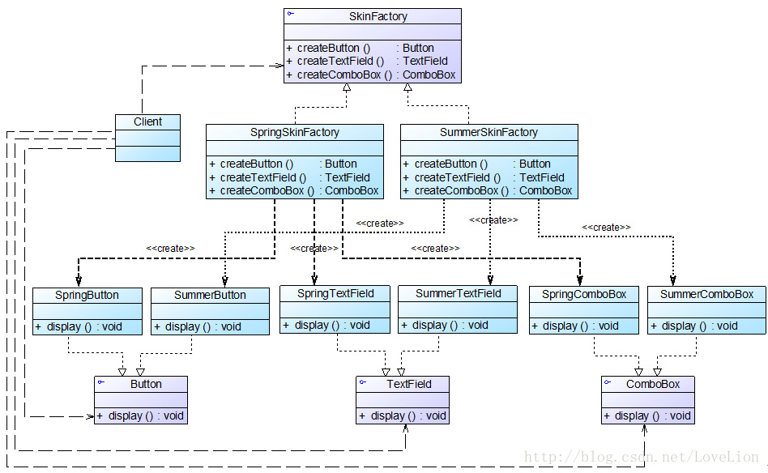

# 创建型模式

### 简单工厂模式

##### 说明

- 构造工厂类，在调用生产方法时 **传入不同参数来得到不同的产品类对象**
- 依赖于多态

##### 优缺点

- 优点

  - 实现了产品类 **对象创建和使用的分离**

    > 在工厂的生产方法中构造，在调用方法处使用

  - 要获取某个类的对象，只需要知道对应的参数即可

- 缺点

  - 需要引入工厂类

  - 如果要支持 **新的产品类**，需要 **修改生产方法**

    > 因为在生产方法中需要判断到底生成哪个产品类的对象

  - **生产方法为静态方法**，导致工厂类无法继承别的类

##### 示例

- 工厂类

  ```c#
  namespace DesignMethod
  {
      // 增加新产品，需要添加枚举值
      enum ProductIndex
      {
          Computer,
          Phone
      };
  
  
      /// <summary>
      /// 工厂类
      /// </summary>
      public class Factory
      {
          /// <summary>
          /// 生产方法：
          /// </summary>
          /// <returns>Product的子类对象</returns>
          public static Product GetProduct(int index)
          {
              Product ret = null;
              // 增加新产品，需要添加新的case判断
              switch(index)
              {
                  case (int)ProductIndex.Computer:
                      ret = new Computer();
                      break;
                  case (int)ProductIndex.Phone:
                      ret = new Phone();
                      break;
                  default:
                      Console.WriteLine("产品不存在");
                      break;
              }
  
              return ret;
          }
      }
  
  }
  ```

- 产品类
  ```c#
  namespace DesignMethod
  {
      /// <summary>
      /// 此文件保存产品类的定义
      /// </summary>
  
  
      /// <summary>
      /// 产品类抽象
      /// </summary>
      public abstract class Product
      {
          /// <summary>
          /// 产品名称
          /// </summary>
          /// <value>string</value>
          public abstract string Name{get;}
  
  
          /// <summary>
          /// 展示产品信息（）可重写
          /// </summary>
          public virtual void ShowInfo()
          {
              Console.WriteLine("被生产的产品名称：{0}",this.Name);
          }
      }
  
  
      /// <summary>
      /// 产品：电脑
      /// </summary>
      public class Computer : Product
      {
          public override string Name {get {return "Computer";}}
  
          public Computer()
          {
              ShowInfo();
          }
      }
  
  
      /// <summary>
      /// 产品：手机
      /// </summary>
      public class Phone : Product
      {
          public override string Name {get {return "Phone";}}
  
          public Phone()
          {
              ShowInfo();
          }
      }
  }
  ```

- 使用
  ```c#
  class Program
  {
      static void Main(string[] args)
      {
          testFactory();
  
      }
  
      public static void testFactory()
      {
          // 通过传入参数指定生产的产品类型
          Product product = Factory.GetProduct(1);
         	// 被生产的产品名称：Phone
      }
  }
  ```
  
  

### 工厂方法模式

##### 说明

- 定义一个 **工厂接口**，让各个工厂类生产不同的产品
- 使用xml配置文件指定到底是哪个工厂类的对象进行生产

##### 优缺点

- 优点

  - 工厂方法用来创建客户所需要的产品，同时还向客户**隐藏了哪种具体产品类将被实例化这一细节**，用户**只需要关心所需产品对应的工厂**
  - 所有的具体工厂类都具有同一抽象父类，不同产品由不同工厂类负责生产，**分担了原先单独工厂类的复杂度**
  - 添加新产品时，**无需修改现有工厂的生产方法**，只需添加新的产品类和对应的工厂类

- 缺点

  -  在添加新产品时，**需要编写新的具体产品类和与之对应的具体工厂类**，系统中类的个数将成对增加
  - 增加了系统的抽象性和理解难度，且在实现时可能需要用到DOM、反射等技术，增加了系统的实现难度

- 示例

  - Xml
    ```xml
    <?xml version="1.0" encoding="UTF-8"?>
    
    <!-- 通过xml文件指定生产的产品类型 -->
    
    <ProductList>
        <Product type="Phone">6888</Product>
        <Product type="Phone"></Product>
        <Product type="Computer">10000</Product>
        <Product type="Phone"></Product>
        <Product type="Computer"></Product>
    </ProductList>
    ```

  - 使用
    ```c#
    // 读取xml，根据配置生产对应产品
    Console.WriteLine("\n工厂方法：读配置生产");
    XmlDocument document = new XmlDocument();
    document.Load("/Users/dsh/Documents/C.Net/C#_onMac/designMethod/factory/Product.xml");
    
    
    XmlNode productListNode = document.SelectSingleNode("ProductList");
    // 读取子元素，创建对象
    Product[] products = new Product[productListNode.ChildNodes.Count];
    for(int i=0;i<products.Length;i++)
    {
        // 获取创建对象所需参数
        XmlElement productInfo = (XmlElement)productListNode.ChildNodes[i];
        string typeName = productInfo.GetAttribute("type");     // 产品类型名称
        string price = productInfo.InnerText;                   // 产品价格
        if(price.Length<1) price = "1";
        
        // 通过反射创建对象
        Type type = Type.GetType("DesignMethod."+typeName);
        ConstructorInfo ctor = type.GetConstructor(new Type[]{typeof(float)});
        products[i] = (Product)ctor?.Invoke(new object[]{int.Parse(price)});
    }
    ```
    
    

### 抽象工厂模式

##### 说明

- **产品等级结构**：产品类的继承结构

  > 例如：笔记本电脑 --> 拯救者、暗影精灵……

- **产品族**：**由同一工厂生产** 的，位于不同产品等级结构中的一组产品

  > 最好是不同产品等级结构同一级的产品
  >
  > 例如：
  >
  > - 联想笔记本产品族：拯救者（性能本产品等级结构）+ ThinkPad（商务本产品等级结构）
  > - 惠普笔记本产品族：暗影精灵 + 光影精灵

- 抽象工厂模式：提供一个创建一系列相关或相互依赖对象的接口，而无须指定它们具体的类

  > 一个公司一个工厂，各个公司工厂可以包含多个生产方法

##### 优缺点

- 优点
  - 增加新的产品族很方便，只需要创建新的产品族工厂
  - 系统中有多于一个的产品族，而每次只使用其中某一产品族。可以通过配置文件等方式来使得用户可以动态改变产品族
  -  当一个产品族中的多个对象被设计成一起工作时，它能够保证客户端始终只使用同一个产品族中的对象
- 缺点
  - 增加新的产品等级结构很难，需要修改工厂接口，并逐个修改各个具体的产品族工厂类


##### 示例

> 工厂应能够生产Button、TextField和ComboBox
>
> Spring工厂生产Spring的3种产品，Summer的工厂生产Summer的3种产品




### 单例模式

##### 说明

- 确保 **某一个类只有一个实例**
- 在获取实例时，**若实例不存在，能够自动创建**

##### 设计

- 问题：多线程请求实例时可能会导致实例不唯一

- 改进

  - 定义实例变量时直接创建：`private static readonly SingleInstance instance = new SingleInstance();`

    > 添加 `final`或 `readonly` 关键字
    >
    > 调用速度快，但是系统加载时间会变长

  - 添加线程锁定

    > 需要判断线程锁定，性能降低

  - **IoDH** 技术

    > **Initialization Demand Holder** 
    >
    > 在单例类内部定义一个static类，用于保存实例
    >
    > 依赖于语言特性来保证其线程安全

##### 优缺点

- 优点
  - 单例模式提供了 **对唯一/有限数量实例的受控访问** 。因为单例类封装了它的唯一实例，所以它可以严格控制客户怎样以及何时访问它。
  -  由于在系统内存中只存在一个对象，因此可以**节约系统资源**
- 缺点
  - 无抽象层，不利于扩展
  - 单例类职责过重
  - 现在很多面向对象语言（如Java、C#）的运行环境都提供了 **自动垃圾回收的技术**，因此，**如果实例化的共享对象长时间不被利用，系统会认为它是垃圾**，会自动销毁并回收资源，下次利用时又将重新实例化，这将导致共享的单例对象状态的丢失


##### 示例

```c#
public class SingleInstance
{
    private static class Holder
    {
        public static readonly SingleInstance instance = new SingleInstance();
    }
    public int count = 0;

    private SingleInstance()
    {
        Console.WriteLine("单例创建");
    }

    /// <summary>
    /// 实例获取方法
    /// </summary>
    /// <returns></returns>
    public static SingleInstance GetInstance()
    {
        // if(instance==null) instance = new SingleInstance();
        Holder.instance.count++;
        return Holder.instance;
    }
}
```


### 原型模式

##### 说明

- 使用原型实例指定创建对象的种类，并且通过 **拷贝这些原型创建新的对象**

- 组成

  - 原型抽象类
  - 具体原型类：实现原型抽象类中声明的克隆方法

- 实现方法

  - 通用实现方法：创建一个新的对象，并将自己的成员变量值复制给新对象

  - 实现 `ICloneable`

    > 注意：实现该接口后，调用克隆方法实现的是浅拷贝，**只会复制字段**，不会递归复制引用类型的成员

    ```c#
    public class Prototype : ICloneable
    {
        public int id;
        string text;
        public string Text { get => text; set => text = value; }
        public DataClass data;
    
        public Prototype(int id,string text)
        {
            this.id = id;
            Text = text;
        }
    
        public object Clone()
        {
            // 浅拷贝
            return this.MemberwiseClone();
        }
    
        public override string ToString()
        {
            return id.ToString() + "\t" + text;
        }
    }
    ```

  - 序列化 `Serializable`：在克隆时通过序列化克隆对象


##### 优缺点

- 优点
  - 可以用克隆替代创建，**简化对象的创建过程**
  - 可以针对抽象原型类进行编程，而将具体原型类写在配置文件中，增加或减少产品类对原有系统都没有任何影响
  - 可以使用深克隆的方式保存对象的状态，使用原型模式将对象复制一份并将其状态保存起来，以便在需要的时候使用（如恢复到某一历史状态），可辅助实现撤销操作
- 缺点
  - 需要为每一个类配备一个克隆方法，**对已有类进行改动需要同时改变克隆方法**
  - 在实现深克隆时需要编写较为复杂的代码（嵌套类除叶子层都需要实现深拷贝）


##### 示例

> 通常还会创建一个原型管理类，来存储各种原型

- 原型
  ```c#
  /// <summary>
  /// 数据类
  /// </summary>
  [Serializable]
  public class DataClass
  {
      public dynamic data;
  
      public DataClass(dynamic x)
      {
          data = x;
      }
  
      public override string ToString()
      {
          return data!=null ? data.ToString() : "数据未初始化";
      }
  }
  
  
  [Serializable]
  public class Prototype : ICloneable
  {
      public int id;
      string text;
      public string Text { get => text; set => text = value; }
      public DataClass data;
  
      public Prototype(int id,string text)
      {
          this.id = id;
          Text = text;
          data = new DataClass(null);
      }
  
      public object Clone()
      {
          // return this.MemberwiseClone();
  
          // 写入字节流
          BinaryFormatter formatter = new BinaryFormatter();
          MemoryStream stream = new MemoryStream();
          formatter.Serialize(stream,this);
  
          // 读取并存储为新对象
          byte[] bt = stream.ToArray();
          stream = new MemoryStream(bt);
          return formatter.Deserialize(stream) as Prototype;
      }
  
      public override string ToString()
      {
          return id.ToString() + "\t" + text + "\t" + data.ToString();
      }
  }
  ```

  

### 建造者模式

##### 说明


- 将一个 **复杂对象** 的 **构建与表示分离**，使得同样的构建过程可以创建不同的表示

  > 常用于 **需要配置很多成员变量值** 的类对象的创建
  >
  > 属性项相同、属性值不同的对象用于不同工作

- 复杂对象：含有从多个成员对象的类对象

- 组成

  - 抽象建造者：指定抽象接口，包括部件添加和产品生成

  - 具体建造者：一个具体建造者对应产品的一种属性组合

  - 产品

  - 指挥者：负责安排复杂对象的建造次序

    > 用户调用指挥者的方法，指挥者按次序调用建造者的建造方法并获取产品


##### 优缺点

- 优点
  - 在建造者模式中，客户端不必知道产品内部组成的细节，**将产品本身与产品的创建过程解耦**，使得**相同的创建过程可以创建不同的产品对象**
  - 每一个具体建造者都相对独立，而与其他的具体建造者无关，因此可以每一个具体建造者都相对独立，而与其他的具体建造者无关，因此可以很方便地替换具体建造者或增加新的具体建造者
  - 将复杂产品的创建步骤分解在不同的方法中，使得创建过程更加清晰，方便修改
- 缺点
  - 如果产品之间的差异性很大（成员变量组成不同），例如很多组成部分都不相同，不适合使用建造者模式


------


# 结构型模式

### 适配器模式

##### 说明

- 用于解决某功能的调用接口与实现方法不同的问题

- 组成

  > 适配者Adaptee提供实现功能的接口，目标Target提供外部调用的接口，二者名称、参数可能不同

  - 目标 Target：定义客户所需接口

  - 适配者 Adaptee：被适配的部分，可能没有相关源代码，并没有客户需要的接口

  - 适配器 Adapter：通过继承 Target 并关联一个 Adaptee 使二者产生联系

    > 例如：
    >
    > - 用户想通过a方法调用工具类的某个功能
    > - 工具类提供了b方法实现该功能
    > - 适配器中定义名为a的接口，调用b方法

- 分类

  - 对象适配器：适配器与适配者之间是关联关系

    > 适配器引用一个适配者对象，从而调用所需的方法

  - 类适配器：适配器与适配者之间是继承（或实现）关系

    > 若Target不是接口，可能需要支持多重继承的语言才能实现

  - 缺省适配器：针对适配者中只有部分方法需要进行适配

    > 是 **类适配器的变种**
    >
    > 通常目标不需要适配者的所有功能
    >
    > 可使用一个中间类实现适配者接口，并用空方法实现，这样子类不必再实现无用接口


##### 优缺点

- 优点
  - **将目标类和适配者类解耦**
  - 可将多个适配者用一个适配器进行适配
- 缺点
  - 若不支持多重继承，则无法使用类适配器对多个适配者类进行适配，要适配多个适配者，适配者只能是接口
  - 在适配器中置换适配者类的某些方法比较麻烦


##### 示例

> 示例中，若调用适配器的 `Method2()`，实际上调用的是适配者的 `TestA()`

```c#
/// <summary>
/// 假设的对外接口，声明了可供外部使用的方法
/// </summary>
public interface IAdapter
{
    // 提供两个对外方法
    void Method1();
    void Method2();
}

/// <summary>
/// 适配器：使对外方法能够调用目标功能方法
/// </summary>
public class Adapter : IAdapter
{
    Adaptee adaptee;

    public Adapter()
    {
        adaptee = new Adaptee();
    }


    public void Method1()
    {
        Console.WriteLine("适配器对外接口：Method1");
        adaptee.Test1();
    }
    public void Method2()
    {
        Console.WriteLine("适配器对外接口：Method2");
        adaptee.TestA();
    }
}


public class Adaptee
{
    public void Test1()
    {
        Console.WriteLine("适配者实现方法名：Test1");
    }

    public void Test2()
    {
        Console.WriteLine("适配者实现方法名：Test2");
    }

    public void TestA()
    {
        Console.WriteLine("适配者方法：TestA");
    }
}
```


### 桥接模式

##### 说明


- 将抽象部分与它的实现部分分离，用一种巧妙的方式**处理多层继承存在的问题**

  > 用抽象关联取代了传统的多层继承，将类之间的静态继承关系转换为动态的对象组合关系，使得系统更加灵活
  >
  > 利用了面向对象中 **可以用接口变量接收实现了接口的类对象** 这一特点

- 组成

  - 实现接口


##### 优缺点

- 优点
  - 
- 缺点

##### 示例


### 组合模式


### 装饰模式


### 外观模式


### 享元模式


### 代理模式

------


# 行为模式

### 职责链模式


### 命令模式


### 解释器模式


### 迭代器模式


### 中介者模式


### 备忘录模式


### 观察者模式


### 状态模式


### 策略模式


### 模板方法模式


### 访问者模式